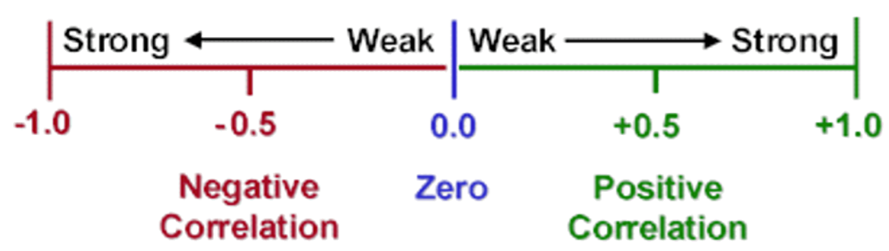
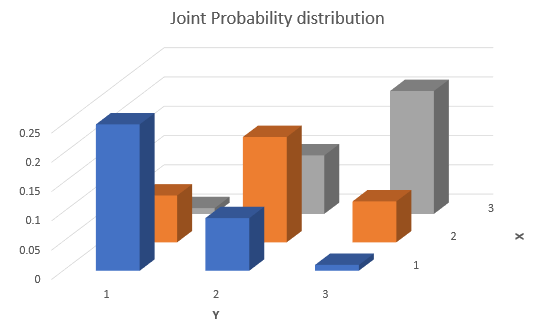
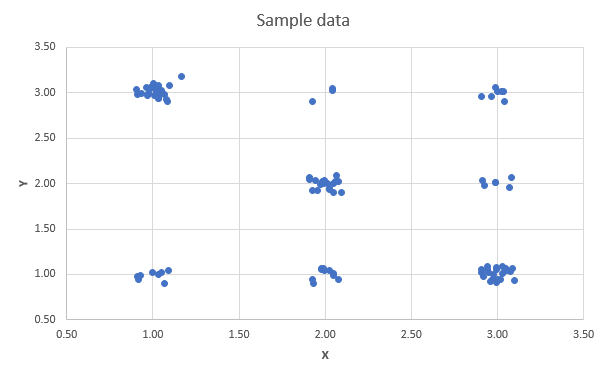
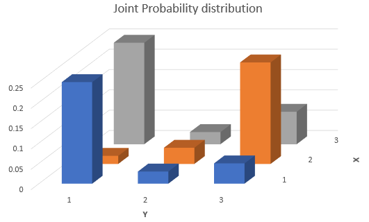
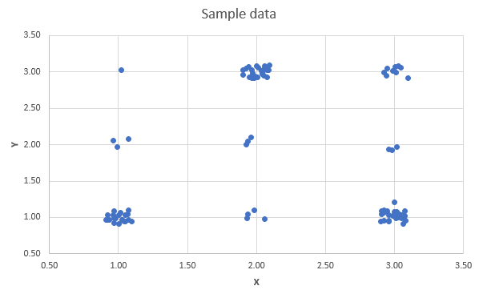

# Combination of Random Variables

```{r setup, include = FALSE}
knitr::opts_chunk$set(echo = FALSE)

library(webexercises)
```

## Introduction

A short introduction to the importance of this section is provided in this video (YouTube, 2min).



We have, thus far, developed the concept of probability distributions for single continuous or discrete random variables. As we have seen, these distributions assign probabilities to various numerical values of the random variable under consideration. Further, for the distributions most commonly used in practice, mathematical expressions can be obtained for the mean and variance of this random variable in terms of the parameters of the distribution. For example, if $X$ is the number of successes in $n$ independent experiments in which the probability of success is $\pi$ (that is, $X$ follows a Binomial distribution with parameters $n$ and $\pi)$, then it was stated that $E[X]=n \pi$ and $Var(X)=n \pi(1-\pi)$. 

A binomial random variable is actually a special case of a combination of random variables. For this case we have already learned how to calculate its mean and variance.

In this section we will learn how to derive and calculate the expected value and variance of any combination of random variables. This is extremely important as in practice we are often interested in the outcomes of a combination of random variables. In order to build up to these results we will firstly learn about transformations of individual random variables and how they affect their properties. You will then learn how ot derive some properties of linear combinations of multiple random variables. Finally you will learn about the special case of linear combinations of normally distributed random variables.


## Linear Transformations

Before extending the ideas, recall the definitions of mean and variance as expected values.

### Means and variances: a recap

Recall that the mean, or the expected value of a random variable $X$, is commonly denoted as either $E[X]$ or $\mu$. For a discrete random variable, the mean is defined as

\begin{equation*}
	E[X]=\mu=\sum_{x} x p(x) .
\end{equation*}

If the variable is continuous, the analogous definition is

\begin{equation*}
E[X]=\mu=\int_{-\infty}^{\infty} x f(x) dx 
\end{equation*}

The variance of a random variable, which provides a measure of the spread of the possible outcomes around the mean, is also defined as an expected value, namely:

\begin{eqnarray*}
	\operatorname{var}[X] &=&E\left[(X-\mu)^{2}\right] \\
	&=&\sum_{x}(x-\mu)^{2} p(x) \text{ discrete } \\
	&=&\int_{-\infty}^{\infty}(x-\mu)^{2} f(x) dx  \text{ continuous }
\end{eqnarray*}

However, for the distributions which were introduced (e.g. the binomial distribution or the normal distribution) we also learned how the mean and variance were related to the parameters that described these distributions.


## Linear transformations of random variables

Often, information is available about a random variable in one form, but we require this to be converted into another form via a linear transformation. Changing units of measurement provides an important example of this: prices may be expressed in UKP and converted to Euros at a specific exchange rate, or temperatures can be expressed in fahrenheit or celsius.

In fact we already encountered a linear transformation. That from a normally distributed random variable $X$ (where $X \sim N(\mu, \sigma^2)$)  to a standard normal distribution $Z$ (where $Z \sim N(0, 1)$). The way we did transform this was according to 

\begin{equation*}
	Z = \frac{X-\mu}{\sigma} = \frac{1}{\sigma}X-\frac{\mu}{\sigma}
\end{equation*}

the last term illustrating that the transformation is a linear one with a multiplicative factor $\frac{1}{\sigma}$ (like a slope coefficient)and a shift factor $-\frac{\mu}{\sigma}$ (like a constant). Let's learn from that example how the properties of a linear transformation of a random variable (rv) are related to those of the original rv. 

Let's consider the following linear transformation

\begin{equation*}
	Z = c + bX
\end{equation*}

where $X$ is a random variable with $E[X]=\mu$ and $Var[X] = \sigma^2$. $c$ and $b$ are constants. $Z$ is what we call a linear transformation of $X$.

We have the following results:

\begin{enumerate}
	\item $E[Z]=E[b X+c]=b E[X]+c$
	\item $Var[Z]=Var[b X+c]=b^{2} Var[X]$
\end{enumerate}  

For the discrete random variable case the algebra of the proof is very straightforward:

\begin{eqnarray*}
	E[b X+c] &=&\sum_{x}(b x+c) p(x) \\
	&=&\sum_{x}(b x p(x)+c p(x)) \\
	&=&b \sum_{x} x p(x)+c \sum_{x} p(x) \\
	&=&b E[X]+c,
\end{eqnarray*}

since $\sum_{x} p(x)=1$ (i.e. all probabilities sum to 1) and $\sum_{x} x p(x)=E[X]$, by definition of the expected value for a discrete random variable.

We learn that any multiplicative constant, like $b$ here, can be moved outside of the expectations operator, $E[]$ . This applies also to continuous variables, because corresponding operations carry over when integrals replace the summations above.

To calculate the variance of a linearly transformed rv we can ignore any level shift (the addition of $c$) and we can draw the multiplicative constant ($b$) outside of the variance operator, $Var[]$, but need to square it. Here we will not present any proof for that result. It can be derived using similar, but more involved arguments, as for the expected value.

These relationships between the original rv $X$ and its linear transform $Z$ are generally valid, regardless of how the variable $X$ is distributed.


::: {.callout-important}

#### Confirming the above result

Let us confirm that these relationships hold when we transform any normally distributed rv $X$ (where $X \sim N(\mu, \sigma^2)$)  to a standard normal distribution $Z$ (where $Z \sim N(0, 1)$). As discussed above, the linear transform used is
	
\begin{equation*}
	Z = \frac{X-\mu}{\sigma} = \frac{1}{\sigma}X-\frac{\mu}{\sigma}
\end{equation*}

So, here $c=-\frac{\mu}{\sigma}$ and $b= \frac{1}{\sigma}$. Let us apply the formulae established above:
	
\begin{eqnarray*}
		E[Z]&=&E[b X+c]\\
		&=& b E[X]+c\\
		&=& \frac{1}{\sigma} E[X] + (-\frac{\mu}{\sigma})\\
		&=& \frac{1}{\sigma} \mu + (-\frac{\mu}{\sigma})\\
		&=& \frac{\mu}{\sigma}  - \frac{\mu}{\sigma}= 0
\end{eqnarray*}

So indeed the expected value is $E[Z]=0$. 

\begin{eqnarray*}
		Var[Z]&=&Var[b X+c]\\
		&=& b^2 Var[X]\\
		&=& \left(\frac{1}{\sigma}\right)^2 Var[X] \\
		&=& \left(\frac{1}{\sigma}\right)^2 \sigma^2 \\
		&=& \frac{\sigma^2}{\sigma^2} = 1
\end{eqnarray*}

we have therefore established that $Var[Z]=1$, confirming the result we had previously just stated.

:::


There is also another element to complement the above result: namely, if $X$ has the form of a normal random variable, then so has $Z$. Indeed, this is a very powerful result concerning linear transformations of normal variables, which we simply state.

::: {.callout-important}

## Linear transormations of normal rvs are normal again

If $X \sim N(\mu, \sigma^2)$ then $Y=bX+c \sim N(b\mu+c,b^2\sigma^2)$ for constants $b$ and $c$.


This result that the form of the distribution does not change is specific to the normal distribution: for example, a linear transformation of a Binomial variable is not itself (generally) Binomial.

:::


::: {.callout-info}

#### Example

Playing a game by rolling fair die. If it costs 10p to play, and the player receives (in pence) double the number thrown, then expected winnings per game (measured in p) are `r fitb(-3)`p.

`r hide("Solution")`

\begin{equation*}
		E[2 X-10]=2 \times(3.5)-10=-3 .
\end{equation*}
	
Recognising that the expected value of rolling a fair dice is ‌E[X]=3.5. Hence a player is expected to lose ‌3p every time they play this game.

`r unhide()`

:::

::: {.callout-note icon=false}

#### Exercise

You flip a fair coin three times and the random variable ‌X records how many times the coin shows HEAD. You convince your friend that he should play a game with the following payoff. Every round (equivalent to three coin flips) will cost UKP1. He will receive UKP 0.5 for every coin showing HEAD.

What type of random variable is $X$? 

`r mcq(c("normally distributed",answer = "binomially distributed","poisson distributed","uniformly distributed"))`
	
What are the expected value and variance of X?

$E[X] =$ `r fitb(1.5)`

$Var[X] =$ `r fitb(0.75)` 

`r hide("Solution")`
$E[X]= 3 \times 0.5 = 1.5$

$Var[X]= 3 \times 0.5 \times (1-0.5) = 0.75$
`r unhide()`

What is the expected value and the variance of the random variable $Y=0.5 \cdot X−1$?

$E[X] =$ `r fitb(-0.25)`

$Var[X] =$ `r fitb(0.1875)` 


`r hide("Solution")`
$E[Y]=0.5 \cdot E[X] - 1 = 0.5 \cdot 1.5 - 1 = -0.25$

$Var[Y]=0.5^2 \cdot Var[X] = 0.25 \cdot 0.75 = 0.1875$
`r unhide()`


:::

## Joint Probability Distributions

You would have already learned about correlations as a descriptive statistics. We discussed how to use correlation and regression to summarise the extent and nature of any linear relationship between two variables. Examples of variables we used in that earlier section were: Covid case rates and health expenditure for countries; height and weight of people; maths and stats grades for students.

Let's take that last example of students' grades in Advanced Mathematics and Statistics. You can think about this as two random variables, $M$ and $S$ for the maths and stats grade respectively.

The objective of much of statistics is to learn about population characteristics. An experiment is then any process which generates data. Just imagine we go into a second year class and we ask all students what grades they received in Maths and Stats in Year 1. These two pieces of information, generated by the experiment, are considered to be the values of two random variables ($M$ and $S$) defined on the sample space of an experiment (see the intro to probability section), then the discussion of random variables and probability distributions needs to be extended to the multivariate case. In the first instance to that of two variables, but eventually also to higher dimensions.

Let $X$ and $Y$ be the two random variables: for simplicity, they are considered to be discrete random variables. The outcome of the experiment is a pair of values $\left( x,y\right)$. The probability of this outcome is a joint probability which can be denoted

\begin{equation*}
	\Pr \left( X=x\cap Y=y\right) ,
\end{equation*}

emphasising the analogy with the probability of a joint event $\Pr \left( A\cap B\right)$, or, more commonly, by

\begin{equation*}
	\Pr \left( X=x,Y=y\right) .
\end{equation*}

The collection of these probabilities, for all possible combinations of $x$ and $y$, is the **joint probability distribution** of $X$ and $Y$, denoted

\begin{equation*}
	p\left( x,y\right) =\Pr \left( X=x,Y=y\right).
\end{equation*}

The **Axioms of Probability** discussed in the Introduction to Probability Section carry over to imply

* any possible event has a non-negative probability (but not larger than 1)  
	\begin{equation*}
		0\leqslant p\left( x,y\right) \leqslant 1,
	\end{equation*}
* The sum of all mutually exclusive $\left( x,y\right)$ combinations is calculated as the sum of the individual probabilities  
	\begin{equation*}
		\sum_{x}\sum_{y}p\left( x,y\right) =1,
	\end{equation*}  
	and delivers a probability of 1. This implies that it is certain that one of the possible outcomes does occur.


::: {.callout-info}

#### Example

Let $H$ and $W$ be the random variables representing the population of weekly incomes of two partners living in a household together, in some country. $H$ represents the income of the older partner and  $W$ the income of the younger partner. There are only three possible weekly incomes, UKP 0, UKP 100 or UKP 200. The joint probability distribution of $H$ and $W$ is represented as a table:


|                |                | $H$    |          |        |
|----------------|----------------|--------|----------|--------|
| Probabilities  |                | UKP 0  | UKP 100  | UKP 200 |
| Values of $W:$ | UKP 0          | $0.05$ | $0.15$   | $0.10$ |
|                | UKP 100        | $0.10$ | $0.10$   | $0.30$ |
|                | UKP 200        | $0.05$ | $0.05$   | $0.10$ |

Then we can read off, for example, that

\begin{equation*}
	\Pr \left( H=0,W=0\right) =0.05,
\end{equation*}

or that in this population, $5\%$ of households have zero weekly income for both partners.

In this example, the nature of the experiment underlying the population data is not explicitly stated, meaning that all we know are these empirical probabilities. Sometimes we say that we do not know the data generating process.

:::


::: {.callout-note icon=false}

#### Exercise

What are the following probabilities? (where we now, for simplicity, represent UKP 100 by 1).

* $Pr\left( H=1,W=0\right) =0.15$
* $Pr\left( H=2,W=1\right) =0.30$
* $Pr\left( H=2,W=2\right) =0.10$

The probability that $H=1$ is $Pr(H=1) =$ `r fitb(0.3)`.

`r hide("Solution")`
$Pr(H=1) = Pr(H=1, W=0) + Pr(H=1, W=0) +Pr(H=1, W=0) = 0.30$
`r unhide()`

:::


::: {.callout-info}

#### Example

Consider the following simple version of a lottery. Players in the lottery randomly choose one of 100 tickets which show numbers between $1$ and $5$, whilst a machine selects the lottery winners by randomly selecting one of five balls (numbered $1$ to $5$). Any player whose drawn number on a ticket coincides with the number on the ball is a winner. The machine selects one ball at random (so that each ball has an 0.2 chance of selection). The 100 tickets from which the players draw contain the numbers 1 to 5 with the following probabilities:

| Number chosen by player | Probability of being chosen |
|-------------------------|-----------------------------|
| $1$                     | $0.40$                      |
| $2$                     | $0.20$                      |
| $3$                     | $0.05$                      |
| $4$                     | $0.10$                      |
| $5$                     | $0.25$                      |
| **Total**               | $1.0$                       |

Let $X$ denote the number on the player's chosen and $Y$ the number chosen by the machine. If they are assumed to be independent events, then for each possible value of $X$ and $Y$, we will have

\begin{equation*}
	\Pr \left( X\cap Y\right) =\Pr \left( X\right) \Pr \left( Y\right) .
\end{equation*}

The table above gives the probabilities for $X$, and $\Pr \left( Y = y\right) =0.2$ for all $y=1,...,5$, so that a table can be drawn up displaying the joint distribution $p\left( x,y\right)$. \\For example $p(3,4)=Pr(X=3) \cdot Pr(Y=4) =0.05 \cdot 0.20 = 0.01$.

| Probabilities |  machine ($Y$) |       |      |      |      |              |
|---------------|----------------|-------|------|------|------|--------------|
| player ($X$)  | $1$            | $2$   | $3$  | $4$  | $5$  | Row Total    |
| 1             | `r fitb(0.08)` | `r fitb(0.08)`  | `r fitb(0.08)` | 0.08 | `r fitb(0.08)` | $\textcolor{orange}{0.40}$ |
| 2             | 0.04           | 0.04  | 0.04 | 0.04 | `r fitb(0.04)` | $\textcolor{orange}{0.20}$ |
| 3             | 0.01           | `r fitb(0.01)`  | 0.01 | 0.01 | `r fitb(0.01)` | `r fitb(0.05)` |
| 4             | 0.02           | `r fitb(0.02)`  | 0.02 | 0.02 | `r fitb(0.02)` | `r fitb(0.10)` |
| 5             | 0.05           | 0.05  | 0.05 | 0.05 | `r fitb(0.05)` | `r fitb(0.25)`|
| Column Total  | `r fitb(0.20)` | `r fitb(0.20)` | `r fitb(0.20)` | `r fitb(0.20)` | $\textcolor{blue}{0.20}$ | 1.00                  |

`r hide("Hint")`

Use the knowledge about marginal probabilities to complete the table. 
`r unhide()`

You may think that making the probabilities of the numbers on the tickets uneven was somewhat strange. That does mimic a very real issue. When people choose numbers (e.g. for lottery tickets or for passwords) they do not choose random numbers, they choose "lucky" numbers. Lucky numbers are often dates (birthdays, wedding days, etc.). That implies that people choose numbers from 1 - 12 and again numbers from 1 - 31 more often than numbers that are larger than 31. If you do choose such "lucky" numbers you are not less likely to win, but if you win you will have to share the prize with more people!

Make sure you understand how the joint probabilities are calculated, using your knowledge that $X$ and $Y$ are independent?
	
* $p\left( 2,1\right) = Pr(X=2) \cdot Pr(Y=1) = 0.20 \cdot 0.20 = 0.04$
* $p\left( 4,3\right) =$ `r fitb(0.02)`
* $p\left( 5,5\right) =$ `r fitb(0.05)`

:::


In the above example we assumed that the random variables $X$ and $Y$ were independent. That allowed us to calculate the joint probabilities according to

\begin{equation*}
	\Pr \left( X\cap Y\right) =\Pr \left( X\right) \Pr \left( Y\right) .
\end{equation*}

A typical problem we may later want to investigate is whether two random variables are in fact independent. This will be discussed later in the section.


### Marginal Probabilities

Let us replicate the earlier table with joint probabilities


| Probabilities |  machine ($Y$) |       |      |      |      |              |
|---------------|----------------|-------|------|------|------|--------------|
| player ($X$)  | $1$            | $2$   | $3$  | $4$  | $5$  | Row Total    |
| 1             | 0.08           | 0.08  | 0.08 | 0.08 | 0.08 | $\textcolor{orange}{0.40}$ |
| 2             | 0.04           | 0.04  | 0.04 | 0.04 | 0.04 | $\textcolor{orange}{0.20}$ |
| 3             | 0.01           | 0.01  | 0.01 | 0.01 | 0.01 | $\textcolor{orange}{0.05}$ |
| 4             | 0.02           | 0.02  | 0.02 | 0.02 | 0.02 | $\textcolor{orange}{0.50}$ |
| 5             | 0.05           | 0.05  | 0.05 | 0.05 | 0.05 | $\textcolor{orange}{0.25}$|
| Column Total  | $\textcolor{blue}{0.20}$ | $\textcolor{blue}{0.20}$  | $\textcolor{blue}{0.20}$ | $\textcolor{blue}{0.20}$  | $\textcolor{blue}{0.20}$ | 1.00                   |

Given a joint probability distribution

\begin{equation*}
	p\left( x,y\right) =\Pr \left( X=x,Y=y\right)
\end{equation*}

for the random variables $X$ and $Y$, a probability of the form $\Pr \left(X=x\right)$ or $\Pr \left(Y=y\right)$ is called a marginal probability. You can remember the term marginal probabilities as in the above joint probability table these probabilities appeared in the margin of the table. The collection of these probabilities for all values of $X$ is the marginal probability distribution for $X$ (in the above table illustrated by the orange coloured numbers),

\begin{equation*}
	p_{X}\left( x\right) =\Pr \left( X=x\right) .
\end{equation*}

If it is clear from the context, write $p_{X}\left( x\right)$ as $p\left(x\right)$. 

\begin{eqnarray*}
	\Pr \left( X=x\right) &=&\Pr \left( X=x,Y=1\right) +\Pr \left( X=x,Y=2\right)+\Pr \left( X=x,Y=3\right) +\\
	&&\Pr \left( X=x,Y=4\right)+\Pr \left( X=x,Y=5\right)
\end{eqnarray*}

the sum of all the joint probabilities contributing to $X=x$. So, marginal probability distributions are found by summing joint probabilities over all the values of the other variable:

\begin{equation*}
	p_{X}\left( x\right) =\sum_{y}p\left( x,y\right) ,\;\;\;\;\;p_{Y}\left(y\right) =\sum_{x}p\left( x,y\right) .
\end{equation*}

Confirm for yourself that orange marginal probabilities are the sum of the respective row of joint probabilities.

Notice that a marginal probability distribution has to satisfy the usual properties expected of a probability distribution (for a discrete random variable):

\begin{eqnarray*}
	0 &\leq &p_{X}\left( x\right) \leq 1,\;\;\;\;\;\sum_{x}p_{X}\left( x\right)=1, \\
	0 &\leq &p_{Y}\left( y\right) \leq 1,\;\;\;\;\;\sum_{y}p_{Y}\left( y\right)=1.
\end{eqnarray*}

In the above table we can also see the marginal probability for the random variable $Y$, $p_{Y}\left( y\right)$, this is the probability distribution coloured in blue. Each of these probabilities equal the sum of the respective column of joint probabilities.

The joint probability distribution contains all the information there is about these two random variables. That means we can infer, from that information, the expected values, variances and the correlation between the variables. We will see later how to derive the correlation from the joint probability distribution. Here we will use these marginal probabilities to calculate expected values and variances of the two random variables:


::: {.callout-info}

#### Example
	
By calculation, we can find the expected value and variance of $X$, using the formula established in the discrete random variable section:
	
\begin{eqnarray*}
		E\left[ X\right] &=& \sum_{X=1}^{5} p_X(x) x = 0.4 \cdot 1 + 0.2 \cdot 2 +0.05 \cdot 3+ 0.10 \cdot 4 + 0.25 \cdot 5 = 2.60\\
		Var\left[ X\right] &=& E[X^2]-E[X]^2=  (0.4 \cdot 1^2 + 0.2 \cdot 2^2 +0.05 \cdot 3^2+ 0.10 \cdot 4^2 + 0.25 \cdot 5^2)-2.6^2=2.74.
\end{eqnarray*}


:::

::: {.callout-note icon=false}

#### Exercise

Find the expected value and variance of $Y$, 

$E[Y] =$ `r fitb(3.00)`

$Var[Y] =$ `r fitb(2.00)`

`r hide("Solution")`

\begin{eqnarray*}
	E\left[ Y\right] &=& \sum_{y=1}^{5} p_Y(y) y = 0.2 \cdot 1 + 0.2 \cdot 2 +0.2 \cdot 3+ 0.2 \cdot 4 + 0.2 \cdot 5 = 3.00\\
	Var\left[ Y\right] &=& E[Y^2]-E[Y]^2=  (0.2 \cdot 1^2 + 0.2 \cdot 2^2 +0.2 \cdot 3^2+ 0.2 \cdot 4^2 + 0.2 \cdot 5^2)-3^2=2.00.
\end{eqnarray*}

`r unhide()`
	

:::


## Independence, Covariance and Correlation

Joint probability distributions have interesting characteristics that are irrelevant (or better not defined) when we look at one random variable only. These characteristics describe how the two individual random variables relate to each other. The relevant concepts are independence, covariance and correlation and will be discussed in turn.

### Independence

Let's first define the following joint probability

\begin{equation*}
	p\left( x,y\right) =\Pr \left( X=x,Y=y\right) ,
\end{equation*}

which represents the probability that simultaneously $X=x$ and $Y=y$. Also $p\left( x\right)$ and $p\left(y\right)$ are defined as the respective marginal probabilities.

Before discussing the definition of independence it is worth recalling a result of the Bayes' Theorem, that was discussed earlier in the Conditional Probability Section. That Theorem established that a conditional probability was to be calculated according to

\begin{equation*}
	p\left( x|y\right) = \frac{p\left( x,y\right)}{p(y)}.
\end{equation*}

From this it follows that the joint probability can be derived from

\begin{equation*}
	p\left( x,y\right) = p\left(y\right) p\left( x|y\right).
\end{equation*}

The remarkable feature of this result is that it is always valid regardless of how the two random variables $X$ and $Y$ relate to each other. There is one special case of relation between the two random variables, that special case is called **independence**. 

Let's think of our little toy example of incomes of two partners in a household, say a husband and  wife. Each of these have marginal distributions. So if you just picked a husband in any household, the marginal distribution $p(h)$ tells you all there is to know about the possible incomes for that husband. If the random variables $H$ and $W$ were not independent (i.e. dependent) then knowing what the household's wife's income is would change that probability. For instance it could be that knowing that the wife's income is high (UKP 200) makes it more likely that the husband's income is also high. In that case $p(h|w=200) \neq p(h)$. If the two random variables were independent then knowing what the wife's income is does not change the probability distribution of the husband's income, $p(h|w=200) = p(h)$.

The statistical definition of **independence** of the random variables $X$ and $Y$ is that for all values of $x$ and $y$ the following relationship holds:

\begin{equation*}
	p\left( x,y\right) =p\left( x\right) p\left( y\right) .
\end{equation*}

If this relationship indeed holds for all values of  $x$ and $y$, the random variables$X$ and $Y$ are said to be **independent**:

* Independence means that $\Pr \left( Y=y\right)$ would not be affected by knowing that $X=x$: knowing the value taken on by one random variable does not affect the probabilities of the outcomes of the other random variable. This is also expressed by the following relationship that **is only valid if X and Y are independent**:  

	\begin{equation*}
		p\left( x,y\right) =p\left( x\right) p\left( y\right) .
	\end{equation*}

Each joint probability is the product of the corresponding marginal probabilities.

* A corollary of this is that if two random variables $X$ and $Y$ are independent, then there can be no relationship of any kind, linear or non-linear, between them.


In this video we go through an example of two categorical random variables (Study effort and Exam result) which we examine for independence (YouTube, 14min). 




::: {.callout-info}

#### Example

	The joint probabilities and marginal probabilities (taken from the household incomes example) are
	
|                                      |                | $H:$         |                |                | Row Sums                |
|--------------------------------------|----------------|--------------|----------------|----------------|-------------------------|
| Probabilities                        |                | UKP $0$ | UKP $100$ | UKP $200$ | $p_{W}\left( w\right) $ |
| Values of $W:$                       | UKP $0$   | $0.05$       | $0.15$         | $0.10$         | $0.30$                  |
|                                      | UKP $100$ | $0.10$       | $0.10$         | $0.30$         | $0.50$                  |
|                                      | UKP $200$ | $0.05$       | $0.05$         | $0.10$         | $0.20$                  |
| Column Sums: $p_{H}\left( h\right) $ |                | $0.20$       | $0.30$         | $0.50$         | $1.00$                  |

If the two variables were independent we should be able to reconstruct the joint probabilities using the formula that is only valid in the case of independence: $p\left( h,w\right) =p(h) p(w)$. Let's try that for the outcome $(H=0, W=0)$ for which the table shows $p\left( 0,0\right) =0.05$. If $H$ and $W$ were independent this should be
	
\begin{equation*}
	p(0,0)= p(h=0) p(w=0)=0.2 \cdot 0.3 = 0.06
\end{equation*} 
	
The result is not identical and hence this potentially provides evidence that the variables $H$ and $W$ in the above joint distribution are not independent. 
	
For $H$ and $W$ to be independent, $p\left( h,w\right) =p_{H}\left( h\right) p_{W}\left( w\right)$ has to hold for all $h,w$. Finding one pair of values $h,w$ for which this fails is sufficient to conclude that $H$ and $W$ are not independent. 
	
However, the two values are very close. If the joint probabilities in the above table come from sample information then we should expect some sample variation even if the two variables were independent. In a later section we will see how we would use sample information to test whether two variables are independent. Such a test will be based on comparing these two numbers.
		
:::


::: {.callout-note icon=false}

#### Exercise

Continuing with the above example, what would be the following joint probabilities if $H$ and $W$ were independent (where we now, for simplicity, represent UKP 100 by 1)?

* $p(0,2)=$ `r fitb(0.25)`
* $p(2,1)=$ `r fitb(0.25)`
* $p(1,2)=$ `r fitb(0.06)`

`r hide("Solution")`

* $p(0,2)= p(h=0) p(w=2)=0.2 \cdot 0.2 = 0.04$
* $p(2,1)= p(h=0) p(w=2)=0.5 \cdot 0.5 = 0.25$
* $p(1,2)= p(h=0) p(w=2)=0.3 \cdot 0.2 = 0.06$

`r unhide()`

Is any of these probabilities (calculated under the assumption of independence) equal to the respective joint probability? `r mcq(c(answer = "No", "Yes"))`

:::


## Covariance and Correlation

We previously discussed how the sample covariance and in particular the sample correlation coefficient could be used to establish whether sample data for two variables display a linear relationship. When we know the joint probability distribution we can calculate the population equivalent of these two measures. Recall that the (population) correlation coefficient is really only a measure of strength of any linear relationship between the random variables.

### Covariance

The first step is to define the (population) covariance as a characteristic of the joint probability distribution of $X$ and $Y$. Let

\begin{equation*}
	E\left[ X\right] =\mu _{X},\;\;\;\;\;E\left[ Y\right] =\mu _{Y}.
\end{equation*}

The (population) covariance is defined as
	
\begin{eqnarray*}
	cov\left[ X,Y\right] &=&E\left[ \left( X-\mu _{X}\right) \left(Y-\mu _{Y}\right) \right] \\
		&=&\sigma _{XY}.
\end{eqnarray*}
	
Notice that $cov\left[ X,Y\right] =cov\left[ Y,X\right] $. $cov\left[ X,Y\right] >0$ represents a positive relationship between $X$ and $Y$, $cov\left[ X,Y\right] <0$ means a negative relationship.
	
There are a number of alternative expressions for the covariance. Let us note that $\left( X-\mu _{X}\right) \left( Y-\mu _{Y}\right)$ can be seen as a function of $X$ and $Y$,  $g(X,Y)=\left( X-\mu _{X}\right) \left( Y-\mu _{Y}\right)$. We can think of $cov\left[ X,Y\right] =E[g(X,Y)]$ and then apply the general formula for the expectation of this function of the random variables.
	
\begin{equation*}
		cov\left[ X,Y\right] =\sum_{x}\sum_{y}\left( x-\mu _{X}\right)\left( y-\mu _{Y}\right) p\left( x,y\right)
\end{equation*}
	
We can see from this expression that if enough $\left( x,y\right)$ pairs have $x-\mu _{X}$ and $y-\mu _{Y}$ values with the same sign, $cov\left[ X,Y\right] >0$, so that large (small) values of $x-\mu _{X}$ tend to occur with large (small) values of $y-\mu _{Y}$. Similarly, if enough $\left( x,y\right)$  pairs have $x-\mu _{X}$ and $y-\mu _{Y}$ values with different signs, $cov\left[ X,Y\right] <0$. Here, large (small) values of $x-\mu _{X}$ tend to occur with small (large) values of $y-\mu _{Y}$.
	
There is a shorthand calculation for covariance, analogous to that given for the variance in the discrete random variable section:

\begin{eqnarray*}
		cov\left[ X,Y\right] &=&E\left[ \left( X-\mu _{X}\right) \left(Y-\mu _{Y}\right) \right] \\
		&=&E\left[ XY-X\mu _{Y}-\mu _{X}Y+\mu _{X}\mu _{Y}\right] \\
		&=&E\left[ XY\right] -E\left[ X\right] \mu _{Y}-\mu _{X}E\left[ Y\right]+\mu _{X}\mu _{Y} \\
		&=&E\left[ XY\right] -\mu _{X}\mu _{Y}-\mu _{X}\mu _{Y}+\mu _{X}\mu _{Y} \\
		&=&E\left[ XY\right] -\mu _{X}\mu _{Y}.
\end{eqnarray*}
	
As in the earlier section on linear transformations of random variables, the expected value of a sum of terms is equal to the sum of the expected values. Also, constants, like $\mu_{X}$ and $\mu_{Y}$ can be drawn outside the expectations operator, such that $E\left[ X\mu _{Y}\right] =E\left[ X\right] \mu _{Y}$.

Even with this shorthand method, the calculation of the covariance is rather tedious. To calculate $cov\left[ W,H\right]$ in the income example, the best approach is to imitate the way in which $E\left[ T\right]$ was calculated above. Rather than display the values of $T$ (total income), here we display the values of $w\times h$ as we need to calculate $E\left[ WH\right]$ as part of the variance calculation using the shorthand formula:

|     |              | $h$                      |                              |                             |
|-----|--------------|--------------------------|------------------------------|-----------------------------|
|     | $(w	imes h)$ | $0$                      | $100$                        | $200$                       |
| $w$ | $0$          | $\left( 0\right) \;0.05$ | $\left( 0\right) \;0.15$     | $\left(0\right) \;0.10$     |
|     | $100$        | $\left( 0\right) \;0.10$ | $\left( 10000\right) \;0.10$ | $\left(20000\right) \;0.30$ |
|     | $200$        | $\left( 0\right) \;0.05$ | $\left( 20000\right) \;0.05$ | $\left(40000\right) \;0.10$ |


Therefore, using the same strategy of multiplication within cells, and adding up along each row in turn, we find the following

\begin{eqnarray*}
	E\left[ WH\right] &=&\left( 0\right) \times 0.05+\left( 0\right) \times 0.15+\left( 0\right) \times 0.10 \\
	&&+\left( 0\right) \times 0.10+\left( 10000\right) \times 0.10+\left(20000\right) \times 0.30 \\
	&&+\left( 0\right) \times 0.05+\left( 20000\right) \times 0.05+\left(40000\right) \times 0.10 \\
	&=&1000+6000+1000+4000 \\
	&=&12000.
\end{eqnarray*}

Previously we found that $E\left[ W\right] =90$ and $E\left[ H\right] =130$, so that

\begin{eqnarray*}
	Cov\left[ W,H\right] &=&E\left[ WH\right] -E\left[ W\right] E\left[H\right] \\
	&=&12000-\left( 90\right) \left( 130\right) \\
	&=&300.
\end{eqnarray*}


::: {.callout-note icon=false}

#### Exercise

Consider the following joint probability distribution for random variables  $R$ and $Q$ both of which can take values of ether 0 or 1 (this is what we call a binary random variable). Complete the table by calculating the respective marginal probabilities.

| $p(q,r)$    | $q=0$   | $q=1$    | $Pr(r)$  |
|-------------|---------|----------|----------|
| $r=0$       | 0.05    | 0.25     | `r fitb(0.30)` |
| $r=1$       | 0.15    | 0.55     | `r fitb(0.70)` |
| $Pr(q)$     | `r fitb(0.20)` | `r fitb(0.80)` | 1.00 |

Calculate:

$E[Q]=$ `r fitb(0.8)`

$E[R]=$ `r fitb(0.7)`

Complete the following table of  $q \cdot r$ values to facilitate the calculation of  $Cov[R,Q]$.

| $q \cdot r$ | $q=0$   | $q=1$    | 
|-------------|---------|----------|
| $r=0$       | `r fitb(0)` | `r fitb(0)` | 
| $r=1$       | `r fitb(0)` | `r fitb(1)` |

Calculate:

$E[RQ]=$ `r fitb(0.55)`

$Cov[R,Q]=$ `r fitb(-0.01)`

`r hide("Solution")`

\begin{eqnarray*}
	Cov\left[ R,Q\right] &=&E\left[ RQ\right] -E\left[ R\right] E\left[Q\right] \\
	&=&0.55- (0.8 \cdot 0.7) \\
	&=&-0.01
\end{eqnarray*}

`r unhide()`

:::


For an individual random variable $X$ we previously learned how expectations and variances of linear transformation of that random variable relates to the characteristics of $X$ itself. In particular you learned that

\begin{enumerate}
	\item $E[Z]=E[b X+c]=b E[X]+c$
	\item $Var[Z]=Var[b X+c]=b^{2} Var[X]$
\end{enumerate}  

We can ask the same question about the covariance of two linearly transformed random variables $X$ and $Y$, e.g. $Q=b X+c$ and $Z = d Y+e$ . Here is the result

\begin{enumerate}
	\item $Cov[Q,Z]=Cov[(b X+c),(d Y+e)]=Cov[(b X),(d Y)]=bdCov[X,Y]$
\end{enumerate}  

The additive terms are irrelevant for the covariance (as they are for the variance) and the two factors are drawn outside of the covariance operator.

::: {.callout-info}

#### Example

You have two random variables $X$ and $Y$ with the following properties: $E[X] = 3, Var[X]=2, E[Y] = -4, Var[Y] = 3$ and $Cov[X,Y] = 1.22$.

Consider the two linear transformations, $Q=2+8X$ and $Z=-6-4Y$. What are the following?

* $E[Q] =$ `r fitb(26)`
* $Var[Q] =$ `r fitb(128)` 
* $E[Z] =$ `r fitb(10)`
* $Var[Z] =$ `r fitb(48)`
* $Cov[Q,Z] =$ `r fitb(-39.04)` 

`r hide("Solution")`

* $E[Q] = 2+8 E[X] = 26$
* $Var[Q] = 8^2 Var[X] = 64 \cdot 2 = 128$
* $E[Z] = -6-4 E[Y] = -6-4 \cdot (-4) = -6+16=10$
* $Var[Z] = (-4)^2 Var[Y] = 16 \cdot 3 = 48$
* $Cov[Q,Z] = 8 \cdot (-4) Cov[X,Y]= -32 \cdot 1.22 = -39.04$ 


`r unhide()`


:::


### Additional Resources

* The link between covariance and regressions from the [Khan Academy](https://www.khanacademy.org/math/probability/regression/regression-correlation/v/covariance-and-the-regression-line}{Khan Academy).


## Strength of Association and Units of Measurement

How does covariance measure the **strength** of a relationship between two random variables? Not well is the answer, because the value of the covariance is dependent on the units of measurement. Take the above example in which both random variables $W$ and $H$ captured the income in UKP. When we calculated $cov\left[ W,H\right]$ we needed to calculate terms like $100 \times 100$ and hence the units of measurement of the covariance is UKP$^2$ which is difficult to interpret.

Perhaps even more worrying, if we had calculated the covariance with 1 and 2 instead of 100 and 200 (and hence measuring income in 100s of pounds rather than pounds) we would have obtained a value of 0.03 (check this yourself by repeating the above calculation). Of course, we just changed the unit of measurement and nothing really has changed in the relationship between the two variables.

In the section on Correlation and Regression as a descriptive statistic we only briefly mentioned covariance for exactly these reasons. There we introduced the correlation statistic as the preferred measure of (linear) association. As discussed there, the correlation statistics is actually based on the covariance statistic, but it does avoid the weaknesses just discussed.

## Correlation

What is required is a measure of the strength of association which is invariant to changes in units of measurement. Recall that the (population) **correlation coefficient** between $X$ and $Y$ is defined by

\begin{equation*}
	\rho _{XY}=\dfrac{cov\left[ X,Y\right] }{\sqrt{var\left[
			X\right] var\left[ Y\right] }}.
\end{equation*}

This is also the correlation between $\alpha X$ and $\beta Y$ as we can see when we apply the rules for linear transformations discussed earlier:

\begin{eqnarray*}
	\rho _{\alpha X,\beta Y} &=&\dfrac{cov\left[ \alpha X,\beta Y\right] }{\sqrt{var\left[ \alpha X\right] var\left[\beta Y\right] }} \\
	&=&\dfrac{\alpha \beta cov\left[ X,Y\right] }{\sqrt{\alpha^{2}\beta ^{2}var\left[ X\right] var\left[ Y\right] }} \\
	&=&\rho _{XY},
\end{eqnarray*}

The correlation coefficient does not depend on the units of measurement.

You got to be careful with the above formula. You will note that, to get to the last line we had to rely on the term

\begin{equation*}
\frac{\alpha~\beta}{\sqrt{\alpha^2~\beta^2}}=\frac{\alpha~\beta}{|\alpha|~|\beta|}=1
\end{equation*}	

cancelling out. And this will indeed happen if both $\alpha$ and $\beta$ have the same sign. However, if the two coefficients have opposite signs, say, $\alpha <0$ and $\beta>0$, then the result will actually be

\begin{equation*}
	\frac{\alpha~\beta}{\sqrt{\alpha^2~\beta^2}}=\frac{\alpha~\beta}{|\alpha|~|\beta|}=(-1)
\end{equation*}
	
This means that in such a case $\rho _{\alpha X,\beta Y}=-\rho _{X,Y}$, meaning that the strength of the correlation remains the same but the sign changes.

For the income example we calculated the covariance statistic to be 300. If we calculate the variances, $var[H]$ and $var[W]$ we will get $var[H]=6100$ and $var[W]=4900$ respectively when using the UKP as the unit of measurement. We then get

\begin{eqnarray*}
	\rho _{WH} &=&\dfrac{300}{\sqrt{\left( 4900\right) \left( 6100\right) }} \\
	&=&0.0549.
\end{eqnarray*}

Is this indicative of a strong relationship? Just like the sample correlation coefficient of the Regression and Correlation Section, it can be shown that

* the correlation coefficient $\rho _{XY}$ always satisfies $-1\leqslant \rho _{XY}\leqslant 1$.
* The closer $\rho $ is to $1$ or $-1$, the stronger the relationship.



So, $\rho_{WH}=0.0549$ is indicative of a very weak relationship.

It can shown that if $X$ and $Y$ are exactly linearly related by

\begin{equation*}
	Y=a+bX \quad \text{with\ \ \ }b>0
\end{equation*}

then $\rho _{XY}=1$ - that is, $X$ and $Y$ are perfectly correlated. $X$ and $Y$ are also perfectly correlated if they are exactly linearly related by

\begin{equation*}
	Y=a+bX \quad \text{with\ \ \ }b<0,
\end{equation*}

but $\rho _{XY}=-1$. Thus correlation measures the strength of a linear relationship between $X$ and $Y$. It is important to remember that correlation does not imply causation.

Other notations for the correlation coefficient are

\begin{eqnarray*}
	\rho _{XY}&=&\dfrac{\sigma _{XY}}{\sigma _{X}\sigma _{Y}}\\
	\rho _{XY}&=&\dfrac{E\left[ \left( X-\mu _{X}\right) \left( Y-\mu _{Y}\right) \right] }{\sqrt{E\left[ \left( X-\mu _{X}\right) ^{2}\right] E\left[ \left(Y-\mu _{Y}\right) ^{2}\right] }}.
\end{eqnarray*}

which uses covariance and standard deviation notation, and recognises the definitions of covariances and variances.

::: {.callout-info}

#### Example

You have two random variables $X$ and $Y$ with the following properties: $E[X] = 3, Var[X]=2, E[Y] = -4, Var[Y] = 3$ and $Cov[X,Y] = 1.22$.

Consider the two linear transformations, $Q=2+8X$ and $Z=-6-4Y$. What are the following?
	
* $E[Q] =$ `r hide(26)`
* $Var[Q] =$ `r hide(128)`
* $E[Z] =$ `r hide(10)`
* $Var[Z] =$ `r hide(48)`
* $Cov[Q,Z] =$ `r hide(39.04)` 
* $Corr[X,Y] =$ `r hide(0.4981)`
* $Corr[Q,Z] =$ `r hide(0.4981)`

`r hide("Solution")`

* $E[Q] = 2+8 E[X] = 26$
* $Var[Q] = 8^2 Var[X] = 64 \cdot 2 = 128 $
* $E[Z] = -6-4 E[Y] = -6-4 \cdot (-4) = -6+16=10$
* $Var[Z] = (-4)^2 Var[Y] = 16 \cdot 3 = 48 $
* $Cov[Q,Z] = 8 \cdot (-4) Cov[X,Y]= -32 \cdot 1.22= 39.04$ 
* $Corr[X,Y] = \frac{Cov[X,Y]}{\sqrt{Var[X]Var[Y]}}=\frac{1.22}{\sqrt{2\cdot3}}= 0.4981$
* $Corr[Q,Z] = \frac{Cov[Q,Z]}{\sqrt{Var[Q]Var[Z]}}= \frac{39.04}{\sqrt{128\cdot48}}= 0.4981$

`r unhide()`


:::


## The relation between Correlation, Covariance and Independence

Non-zero correlation and covariance between random variables $X$ and $Y$ indicate some linear association between them, whilst independence of $X$ and $Y$ implies no relationship or association of any kind between them. So, it is not surprising that

* **independence** of $X$ and $Y$ implies **zero covariance**: $Cov\left[ X,Y\right] =0$;
* **independence** of $X$ and $Y$ implies **zero correlation**:	$\rho _{XY}=0$.

The converse is not true, in general:

* **zero covariance or correlation** does not imply independence.

The reason is that there may be a relationship between $X$ and $Y$ which is not linear.

::: {.callout-info}

#### Example

Here is an example of a joint probability distribution.
	
|     |            | $y$    |        |        |
|-----|------------|--------|--------|--------|
|     | $p(x,y)$   | $1$    | $2$    | $3$    |
| $x$ | $1$        | $0.1$  | $0.02$ | $0.2$  |
|     | $2$        | $0.08$ | $0.2$  | $0.05$ |
|     | $3$        | $0.25$ | $0.05$ | $0.05$ |


Can you use the information, without going through a full correlation calculation to see whether, here, $X$ and $Y$ are independent or not and whether there is correlation between the two random variables?
	
The answer is, they are not independent and there is a negative correlation. To illustrate that it may be useful to think graphically about this distribution. Let us firstly graphically display the joint probability distribution.
	


From here you can see that the highest probability is for values where either $X$ is high and $Y$ is low or vice versa. So that indicates that there is a negative correlation. This would be even easier to see if you could see a sample of data randomly drawn from that distribution. In the following scatter diagram you can see just that. 100 observations were drawn from the above distribution. Each point is slightly randomly offset, such that you can see see which combinations have been generated more frequently.



You can see that a line of best fit would show a negative slope.

:::

::: {.callout-info}

#### Example

Here is another example of a joint probability distribution.
	
|     |          | $y$    |        |        |
|-----|----------|--------|--------|--------|
|     | $p(x,y)$ | $1$    | $2$    | $3$    |
| $x$ | $1$      | $0.25$ | $0.03$ | $0.05$ |
|     | $2$      | $0.02$ | $0.04$ | $0.25$ |
|     | $3$      | $0.25$ | $0.03$ | $0.08$ |

	
Can you use the information, without going through a full correlation calculation to see whether, here, $X$ and $Y$ are independent or not and whether there is correlation between the two random variables?
	
Let us firstly graphically display the joint probability distribution.




The answer is, they are not independent. When $X=2$ then it is very likely that $Y=3$, whereas for values for $X$ of 1 and 2, a value of $Y=1$ becomes much more likely. This can also be seen from a scatter plot of 100 randomly drawn pairs of observations (each point is slightly randomly offset, such that you can see see which combinations have been generated more frequently).
	


You can see that a line of best fit would likely show a zero slope. Let us actually calculate the covariance and calculation. We do this in this following video (YouTube, 14min).


	

:::

::: {.callout-note icon=false}

#### Exercise

Here are three joint probability distributions. What are these distributions' properties.

| **D1**    |            | $y$    |        |        |
|-----------|------------|--------|--------|--------|
|           | $p(x,y)$   | $1$    | $2$    | $3$    |
| $x$       | $1$        | $0.10$ | $0.06$ | $0.04$ |
|           | $2$        | $0.25$ | $0.15$ | $0.10$ |
|           | $3$        | $0.15$ | $0.09$ | $0.06$ |


In this distribution $X$ and $Y$ are independent random variables. `r torf(TRUE)` 

`r hide("Hint")`

The joint probabilities can be replicated from the marginal probabilities, hence the two variables are independent

`r unhide()`

In distribution **D1** $X$ and $Y$ are `r mcq(c(answer = "not correlated","positively correlated","positively correlated"))`

`r hide("Hint")`

As the two random variables are independent, the correlation is 0.

`r unhide()`


| **D2**    |          | $y$    |        |        |
|-----------|----------|--------|--------|--------|
|           | $p(x,y)$ | $1$    | $2$    | $3$    |
| $x$       | $1$      | $0.25$ | $0.03$ | $0.28$ |
|           | $2$      | $0.04$ | $0.04$ | $0.05$ |
|           | $3$      | $0.03$ | $0.26$ | $0.02$ |


In this distribution (**D2**) $X$ and $Y$ are independent random variables. `r torf(FALSE)`

`r hide("Hint")`

The joint probabilities can not be replicated from the marginal probabilities, hence the two variables are dependent

`r unhide()`

In distribution **D2** $X$ and $Y$ are `r mcq(c(answer = "not correlated","positively correlated","positively correlated"))`

`r hide("Hint")`

While the two variables are not independent (they are dependent), there is no correlation as the relationship is not a linear one. For low values of $X$ very high and very low values of $Y$ are more likely. You can think of this as a nonlinear (quadratic) relationship.

`r unhide()`

	
| **D3**    |          | $y$    |        |        |
|-----------|----------|--------|--------|--------|
|           | $p(x,y)$ | $1$    | $2$    | $3$    |
| $x$       | $1$      | $0.25$ | $0.09$ | $0.01$ |
|           | $2$      | $0.08$ | $0.18$ | $0.07$ |
|           | $3$      | $0.01$ | $0.10$ | $0.21$ |

In this distribution (**D3**) $X$ and $Y$ are independent random variables. `r torf(FALSE)`

`r hide("Hint")`

The Probabilities on the diagonal are higher. This is a sign of two dependent random variables.

`r unhide()`

In distribution **D3** $X$ and $Y$ are `r mcq(c("not correlated",answer = "positively correlated","positively correlated"))`

`r hide("Hint")`

If $X$ is low (high) lower (higher) values of $Y$ are more likely. This is the sign of a positive linear relationship.

`r unhide()`
	

:::


## Linear Combinations of Several Random Variables

Reconsider the previous example on the incomes of two partners in a household, where the random variables $H$ and $W$ represent the respective salaries. The joint probability distribution of $H$ and $W$ is given here, displaying $p(h,w)$:

|                |              | $H$        |              |        |
|----------------|--------------|------------|--------------|--------|
| Probabilities  |              | UKP 0 | UKP 100 | UKP 200 |
| Values of $W:$ | UKP  0    | $0.05$     | $0.15$       | $0.10$ |
|                |  UKP 100 | $0.10$     | $0.10$       | $0.30$ |
|                |  UKP 200 | $0.05$     | $0.05$       | $0.10$ |


You may now be interested in the total household income, $T$:

\begin{equation*}
	T=g(H,W)=H+W.
\end{equation*}

This new random variable is a function of $H$ and $W$, and we can deduce the probability distribution of $T$ from the joint distribution of $H$ and $W$. You can directly calculate the new variable's expected value and variance from the joint probability distribution $p\left( h,w\right):$ the expected value of $T$ is

\begin{eqnarray*}
	E\left[ T\right] &=&E\left[ g\left( H,W\right) \right] \\
	&=& \sum_h \sum_w g\left( h,w\right) p\left( h,w\right) \\
	&=& 0 \cdot 0.05 + 100 \cdot  0.15 +200 \cdot 0.10 + \\
	&& 100 \cdot 0.10 + 200 \cdot 0.10 +300 \cdot  0.3 +\\
	&& 200 \cdot 0.05 + 300 \cdot 0.05 +400 \cdot 0.10\\
	&=&220
\end{eqnarray*}

We sum up the product of all joint probabilities and their associated outcome for $T$.

This is what one may call a pedestrian way of getting the expected value for a function of two (or more) random variables. This will actually work for any type of function of the two random variables, even if that function is a nonlinear one. 

If the function $g(X,Y)$ of the two random variables $X$ and $Y$ is a linear one, like the generic 

\begin{equation*}
	V=a X+b Y+c
\end{equation*}

then things simplify significantly. In what follows we shall demonstrate how to get the expected value and the variance of a linear combination of random variables directly if we know what $E[X]$, $E[Y]$, $Var[X]$, $Var[Y]$ and $Cov[X,Y]$ are.


### A preliminary result

Let's start with the simplest of all cases and consider

\begin{equation*}
	V=g(X, Y)=X
\end{equation*}

We should find that the properties of $V$ are exactly the same as the properties of $X$. Applying the generic formula for the expectation of a discrete random variable used in the above example

\begin{equation*}
	E[V]=\sum_{x} \sum_{y} =g(x, y) p(x, y) =\sum_{x} \sum_{y} x p(x, y)
\end{equation*}

For any given $x$ the probabilities for all the possible outcomes for $Y$ can be collected, so that

\begin{equation*}
	E[V]=\sum_{x} x\left[\sum_{y} p(x, y)\right] 
\end{equation*}

By the definition of the marginal distribution of $y$, the summation in brackets is the marginal probability $p_{X}(x)$ such that 

\begin{equation*}
	E[V]=\sum_{x} x p_{X}(x) =E[X]
\end{equation*}

This shows that the expected value of $X$ is the same whether calculated from the joint probability distribution of $X$ and $Y$, or from the marginal distribution of $X$. The same, obviously, applies for $E[Y]$. This is just another way of saying that the joint distribution contains all the information regarding the marginal distributions.

### Expected value of a Linear Combination

The result we need for the expected value of a linear combination is easy to remember: it amounts to saying that

* the expected value of a linear combination is the linear combination of the expected values, or
* more simply, the expected value of a sum is equal to the sum of expected values.

If $V=a X+b Y+c$, where $a, b, c$ are constants, then

\begin{equation*}
	E[V]=E[a X+b Y+c]=a E[X]+b E[Y]+c 
\end{equation*}

This result is a natural generalisation of the linear transformation result that $E[b X+c]=b E[X]+c$.

Proof: (discrete random variables case). Consider

\begin{eqnarray*}
	E[V] &=&E[a X+b Y+c] \\
	&=&\sum_{x} \sum_{y}(a x+b y+c) \times p(x, y) \\
	&=&\sum_{x} \sum_{y}a x\times p(x, y)+ \sum_{x} \sum_{y}b y\times p(x, y)+\sum_{x} \sum_{y}c\times p(x, y)  
\end{eqnarray*}


Examine each of the three terms on the right hand side:


\begin{eqnarray*}
	\sum_{x} \sum_{y} a x p(x, y) &=&a \sum_{x} \sum_{y} x p(x, y)=a \sum_{x} x \sum_{y} p(x, y)=a E[X] \\
	\sum_{x} \sum_{y} b y p(x, y) &=&b \sum_{y} \sum_{x} y p(x, y)=b \sum_{y} y \sum_{x} p(x, y)=b E[Y] \\
	\sum_{x} \sum_{y} c p(x, y) &=&c \sum_{x} \sum_{y} p(x, y)=c \times 1 .
\end{eqnarray*}

The result that the probabilities in a joint probability distribution must sum to 1 over all $x$ and $y$ combinations is used in the line immediately above. Summing the three terms then gives the earlier result

\begin{eqnarray*}
	E[V] &=&E[a X+b Y+c] \\
	&=&a E[X]+b E[Y]+c
\end{eqnarray*}

This video walks you through these arguments (YouTube, 16min)



Notice that nothing need be known about the joint probability distribution $p(x, y)$ of $X$ and $Y$ to prove the result: it applies, for example, irrespective of whether the variables are independent or not. The result is also valid for continuous random variables.

::: {.callout-info}

#### Example
For the joint income of husbands and wives example, we defined $T=W+H$, where $E[W]=130$, $E[H]=90$. Therefore, using the expected value of the linear combination gives

	\begin{equation}
		E[T] =E[W]+E[H] =220
	\end{equation}

confirming the result obtained earlier.

:::

::: {.callout-info}

#### Example

Suppose that random variables $X$ and $Y$ have $E[X]=0.5$ and $E[Y]=3.5$, and let $V=5 X-Y$. Then,	
	
	\begin{eqnarray*}
		E[V] &=&5 E[X]-E[Y] \\
		&=&5 \times 0.5-3.5 \\
		&=&-1 
	\end{eqnarray*}	


:::


Let $X_{1}, \ldots, X_{n}$ be random variables with $a_{1}, \ldots ., a_{n}, c$ being constants, and define the random variable $W$ by

\begin{eqnarray*}
	W &=&c+a_{1} X_{1}+\ldots+a_{n} X_{n} \\
	&=&c+\sum_{i=1}^{n} a_{i} X_{i}
\end{eqnarray*}

Then,

\begin{equation*} 
	E[W]=c+\sum_{i=1}^{n} a_{i} E\left[X_{i}\right] 
\end{equation*}

This can be proved by repeatedly using the linear combination result for two variables.

::: {.callout-info}

#### Example

Let's consider the case where we combine $n=3$ random variables with $E\left[X_{1}\right]=2, E\left[X_{2}\right]=-1, E\left[X_{3}\right]=3, W=2 X_{1}+5 X_{2}-3 X_{3}+4$. What is $E[W]$?
	
\begin{eqnarray*}
		E[W] &=&E\left[2 X_{1}+5 X_{2}-3 X_{3}+4\right] \\
		&=&2 E\left[X_{1}\right]+5 E\left[X_{2}\right]-3 E\left[X_{3}\right]+4 \\
		&=&2 \times 2+5 \times(-1)-3 \times 3+4 \\
		&=&-6 
\end{eqnarray*}
	
:::


### Variance of a Linear Combination

The result for the mean (or expected value) of a linear combination is fairly intuitive. That for a variance, however, is less so. We start with the two variable case.

#### Two variables
Let $V$ be the random variable $V=a X+b Y+c$. To find $Var[V]$ we start from the alternative form for the variance calculation:

\begin{eqnarray*}
	Var[V] &=& E[V^2] - E[V]^2\\
			&=& E[(a X+b Y+c)^2] - E[a X+b Y+c]^2
\end{eqnarray*}

Now we will just apply the above rule for the expectation of a linear combination and multiply out the squared terms. It is a little tedious algebra, but if you do it carefully you should be able to account for all terms.

\begin{eqnarray*}
	Var[V] &=& Var[a X+b Y+c]\\
	&=& E[(a X+b Y+c)^2] - E[a X+b Y+c]^2\\
	&=& E[(a X+b Y+c)(a X+b Y+c)] - (a E[X]+b E[Y]+c)^2\\
	&=& E[(a X+b Y+c)(a X+b Y+c)] - (a E[X]+b E[Y]+c)(a E[X]+b E[Y]+c)\\
	&=& E[a^2X^2+abXY+acX + abXY + b^2Y^2 + bcY + acX + bcY +c^2]\\
	&& - a^2E[x]^2 - abE[X]E[Y] - acE[X] - abE[X]E[Y] - b^2E[Y]^2 - bcE[Y] - acE[X] - bcE[Y] - c^2 
\end{eqnarray*}

The next step is to apply again the result for the expected value of a linear combination and then rearrange terms in a useful manner, remembering that $Var[X] = E[X^2]-E[X]^2$ and $Cov[X,Y]=E[XY]-E[X]E[Y]$:

\begin{eqnarray*}
	Var[V]&=& a^2E[X^2]+abE[XY]+acE[X] + abE[XY] + b^2E[Y^2] + bcE[Y] + acE[X] + bcE[Y] +c^2\\
	&& - a^2E[x]^2 - abE[X]E[Y] - acE[X] - abE[X]E[Y] - b^2E[Y]^2 - bcE[Y] - acE[X] - bcE[Y] - c^2 \\
	&=& a^2(\underbrace{E[X^2]-E[X]^2}_{Var[X]}) + b^2(\underbrace{E[Y^2]-E[Y]^2}_{Var[Y]}) \\
	&& -2ab(\underbrace{E[XY]-E[X]E[Y]}_{Cov[X,Y]}) \\
	&& +2acE[X]+2bcE[Y] +c^2 - 2acE[X]-2bcE[Y] -c^2
\end{eqnarray*}

Now you can note that all the terms in the last line cancel out, which leaves us with the following very important result:

\begin{equation*}
	Var[V] = Var[a X+b Y+c] = a^2Var[x] + b^2Var[Y]+2abCov[X,Y]
\end{equation*}

Summarising, for $V=a X+b Y+c$, the following holds:

* $Var[V]=a^{2} Var[X]+2 a b Cov[X, Y]+b^{2} Var[Y]$
* If $X$ and $Y$ are independent, then $Cov[X, Y]=0$ and  
		\begin{equation*}
			Var[V]=a^{2} Var[X]+b^{2} Var[Y]
		\end{equation*}
* If $X$ and $Y$ are dependent, but linearly uncorrelated such that $Cov[X, Y]=0$, then the same result holds.

It was worth going through the details of this calculation as it lies at the heart of modern finance theory (in particular portfolio theory). It is this formula which justifies the benefits of portfolio diversification, the idea that it is better to hold several risky assets rather than just one as long as they are not perfectly correlated. This is true for investors but also for companies which may want to invest in several products rather than just one. 

Let's use the following example to illustrate this


::: {.callout-info}

#### Example

Assume you have two assets you can invest in, asset A which has random annual returns with $E[R_A] = 0.05$ and variance $Var[R_A] = 0.2$. Asset B has $E[R_B] = 0.05$ and variance $Var[R_B] = 0.25$. The correlation between the returns is $Corr[R_A,R_B]=0.3$, so they are mildly positively correlated.

The variance in asset returns gives you a measure of the risk you carry with that investment. So Asset B has a higher risk at the same expected return. Most of us would, everything else being equal, prefer lower risk. Which asset would you invest in if you had to invest all your money into either asset A or asset B? In that case you would choose asset A as it gives you the same expected return but at a lower risk.
	
Let's say you form a portfolio where you invest 50\% of your money into asset A and 50\% into asset B. What would be the expected return and the variance of your portfolio? You need to consider a new random variable $P=0.5R_A+0.5R_B$. This is a linear combination of two random variables and we can apply the results we learned above:
	
\begin{eqnarray*}
		E[P]&=&0.5~E[R_A]+0.5~E[R_B]\\
		Var[P] &=& Var[0.5~R_A+0.5~R_B] = 0.5^2Var[R_A] + 0.5^2Var[R_B]+2\cdot0.5\cdot0.5~Cov[R_A,R_B]
\end{eqnarray*}
	
This means that we need $Cov[R_A,R_B]$ which we have not been provided with. However, we know the correlation and the variances, such that we can use the following relationship
	
\begin{eqnarray*}
		Corr[R_A,R_B]&=&\frac{Cov[R_A,R_B]}{\sqrt{Var[R_A]\cdot Var[R_B]}}\\
		Cov[R_A,R_B]&=&Corr[R_A,R_B] \cdot \sqrt{Var[R_A]\cdot Var[R_B]}\\
		&=& 0.3 \cdot \sqrt{0.2\cdot0.25} = 0.06708
\end{eqnarray*}

Now we can calculate the portfolio characteristics:
	
\begin{eqnarray*}
		E[P]&=&0.5~E[R_A]+0.5~E[R_B] = 0.5 \cdot 0.05 + 0.5 \cdot 0.05 = 0.05\\
		Var[P] &=& Var[0.5~R_A+0.5~R_B] = 0.5^2Var[R_A] + 0.5^2Var[R_B]+2\cdot0.5\cdot0.5~Cov[R_A,R_B]\\
		&=&  0.5^2\cdot0.2 + 0.5^2\cdot0.25+2\cdot0.5\cdot0.5\cdot 0.06708 =0.14604
\end{eqnarray*}

And this is the wonder of diversification. Your portfolio, consisting of 50\% asset A and 50\% of asset B has the same expected return, but its variance (risk) is smaller than the individual assets'.
	
Financial portfolio theory then thinks about what the best possible way of mixing assets A and B would be, i.e. how can you minimise $Var[P]$ and also how the above relationship generalises to the case where you have more than two assets.

:::


::: {.callout-note icon=false}

#### Exercise

Suppose that $X$ and $Y$ are random variables with $Var[X]=0.25, Var[Y]=2.5$ and $Cov[X,Y]= 0.5$. Calculate $Var[V]$ if $V = 2X+0.5Y$. 

$Var[V] =$ `r fitb(2.625)`

`r hide("Solution")`

\begin{eqnarray*}
	Var[V] &=& Var[a~X+b~Y] = a^2Var[X] + b^2Var[Y]+2\cdot a\cdot b~Cov[X,Y]\\
	&=&  2^2\cdot0.25 + 0.5^2\cdot2.5+2\cdot2\cdot0.5\cdot 0.5 =2.625
\end{eqnarray*}

`r unhide()`


What is the variance of $W=2X-0.5Y$

$Var[W] =$ `r fitb(0.625)`

`r hide("Solution")`

\begin{eqnarray*}
	Var[W] &=& Var[a~X+b~Y] = a^2Var[X] + b^2Var[Y]+2\cdot a\cdot b~Cov[X,Y]\\
	&=&  2^2\cdot0.25 + 0.5^2\cdot2.5+2\cdot2\cdot(-0.5)\cdot 0.5 =0.625
\end{eqnarray*}

When you have a negative contribution in the linear combination you got to be careful with the signs. The variance still contributes positively but the covariance term now has a negative sign.

`r unhide()`

:::


### Variance of linear combinations of many uncorrelated variables

Extend the earlier result to the case of a linear combination of $n$ random variables $X_{1}, \ldots, X_{n}$ is messy because of the large number of covariance terms involved. But that is exactly what is required to develop portfolio theory. We leave that to finance courses. However, in the special case when $X_{1}, \ldots, X_{n}$ are uncorrelated random variables then all covariances are equal to zero: $Cov\left[X_{i}, X_{j}\right]=0, i \neq j$. And therefore, for $X_{1}, \ldots, X_{n}$ uncorrelated,

\begin{equation*}
	Var\left[\sum_{i=1}^{n} a_{i} X_{i}\right]=\sum_{i=1}^{n} a_{i}^{2} Var\left[X_{i}\right]
\end{equation*}

This also applies when $X_{1}, \ldots, X_{n}$ are independent random variables as they are, by definition, uncorrelated.

Be careful to remember, however, that this result only applies if the variables are uncorrelated. If they are correlated, then the covariance terms are nonzero and these will enter the computation of the variance of a linear combination.

There is no short-cut to computing the standard deviation of a linear combination. You will have to calculate the variance of the linear combination and then take the square root to get the standard deviation.


## Normal Random Variables

The results so far on linear combinations relate to characteristics of the probability distribution of a linear combination like

\begin{equation*}
	V=a X+b Y+c
\end{equation*}

not to the probability distribution itself. In particular, we have considered the mean and variance. Indeed, part of the attraction of these results is that they can be obtained without having to find the probability distribution of $V$. In fact it is, in general, not easily possible to find the probability distribution of $V$ itself, which is why it is so nice that at least we can easily get the mean and the variance. Also note that we did not have to make any assumption about how the random variables $X$ and $Y$ were distributed. These results hold for random variables of any distribution.

However, if we know that $X$ and $Y$ have normal distributions then it follows that $V$ itself is normally distributed. This is an extension of the result for the linear transformation of a single normally distributed random variable. The linear combination result is, however, much more powerful. It is EXTREMELY IMPORTANT! It is also rather unusual: there are not many distributions for which this type of result holds.


If $X \sim N\left(\mu_{X}, \sigma_{X}^{2}\right)$ and $Y \sim N\left(\mu_{Y}, \sigma_{Y}^{2}\right)$, with $V=a X+b Y+c$ for constants $a, b, c$ then

\begin{equation*}
	V \sim N\left(\mu_{V}, \sigma_{V}^{2}\right)
\end{equation*}

for which
\begin{eqnarray*}
	\mu_{V}&=& a \mu_{X}+b \mu_{Y}+c \\
	\sigma_{V}^{2}&=&a^{2} \sigma_{X}^{2}+2 a b \sigma_{X Y}+b^{2} \sigma_{Y}^{2}
\end{eqnarray*}

In the above we merely applied the generic earlier results on $E[V]=\mu_V$ and $Var[V]=\sigma^2_V$. Note that independence of $X$ and $Y$ has not been assumed and is irrelevant to the general result. - If $X_{1}, \ldots X_{n}$ are uncorrelated random variables with $X_{i} \sim N\left(\mu_{i}, \sigma_{i}^{2}\right)$ and $W=\sum_{i=1}^{n} a_{i} X_{i}$, where $a_{1}, \ldots, a_{n}$ are constants, then

\begin{equation*}
	W \sim N\left(\sum_{i=1}^{n} a_{i} \mu_{i}, \sum_{i=1}^{n} a_{i}^{2} \sigma_{i}^{2}\right) .
\end{equation*}

In this case, the assumption that the variables are uncorrelated plays a role only in specifying the variance of the linear combination. If the variables were to be correlated, the normal distribution also applies to the linear combination with the mean being $\sum_{i} a_{i} \mu_{i}$, but the variance of the sum will change (to include terms involving the covariances - but we did not discuss this case here unless $n=2$).

Of course, standard normal distribution tables can be used in the usual way to compute probabilities of events involving linear combinations like $V$ and $W$. This is illustrated in the following.

::: {.callout-info}

#### Example

If $X$ and $Y$ are independent, $X \sim N(20,5), Y \sim N(30,11)$, while $D=X-Y$, then	$D \sim N(-10,16)$ as
	
\begin{eqnarray*}
		E[D] &=& 1\cdot E[X] + (-1) \cdot E[Y] = 1\cdot 20 + (-1) \cdot 30 = -10\\
		Var[D] &=& 1^2\cdot Var[X] + (-1)^2 \cdot Var[Y] = 1\cdot 5 + 1 \cdot 11 = 16. 
\end{eqnarray*}
	
What is the probability that $D>0$? As $D$ is normally, but not standard normally distributed we shall standardise it to a $Z \sim N(0,1)$ variable and then apply the standard normal probability table.
	
\begin{eqnarray*}
		Pr(D>0) &=&Pr\left(Z>\frac{0-(-10)}{4}\right) \\
		&=&Pr(Z>2.5) \\
		&=&0.00621.
\end{eqnarray*}
	
Therefore, there is a 0.621\% probability that the random variable $D$ takes a value of larger than 0.
	
This video provides a walkthrough of this example (YouTube, 10min).


	

:::

::: {.callout-note icon=false}

#### Exercise

Suppose that $X$ and $Y$ are normally distributed random variables  $X \sim N(2,3), Y \sim N(-3,10)$ with correlation $Corr[X,Y] = -0.5$. Calculate $Pr(V>0)$ if $V = 2X+0.5Y$. 

$Pr(V>0) =$ `r fitb(0.7967)`
	
`r hide("Solution")`

Start by calculating the properties of $V$.

\begin{eqnarray*}
	Cov[X,Y] &=& Corr[X,Y] \cdot \sqrt{Var[X]Var[Y]} = (-0.5) \cdot \sqrt{3 \cdot 10} = -2.7386\\ 
	E[V] &=& 2\cdot E[X] + 0.5 \cdot E[Y] = 2\cdot 2 + 0.5 \cdot (-3) = 2.5\\
	Var[V] &=& 2^2\cdot Var[X] + 0.5^2 \cdot Var[Y] +2\cdot 2 \cdot 0.5 \cdot Cov[X,Y]  \\
	&=& 4\cdot 3 + \frac{1}{4} \cdot 10 + 2 \cdot (-2.7386) = 9.0228. 
\end{eqnarray*}

What is the probability that $V>0$? 

\begin{eqnarray*}
	Pr(V>0) &=&Pr\left(Z>\frac{0-2.5}{\sqrt{9.0228}}\right) \\
		&=&Pr(Z>-0.83) = 1 - Pr(Z\leq-0.83)\\
		&=&1- 0.2033= 0.7967.
\end{eqnarray*}


Therefore, there is a 79.67\% probability that the random variable $V$ takes a value larger than 0.

`r unhide()`

:::


## Summary
In this section you learned how to think about two random variables. The joint distribution of two random variables gives you all the information you need to establish whether the two random variables are correlated or not and whether they are independent or not.

Further it was discussed how to calculate expected values of linear combinations of random variables. You learned that you can always calculate the expected value and variance of such linear combinations, but that, in general, you cannot say anything about the distribution of the resulting random variable. An exception to this was where the random variables being combined are normally distributed random variables. In that case, the resulting linear combination is also normally distributed. This, however, is clearly a special case.

Through the discussion of linear combinations you also learned the statistics behind one of the most fundamental insights of finance theory, the value of diversification. This insight is important for all financial but also more generally all business investment. Further, knowing how to deal with multiple random variables and their combinations is crucial when it comes to learning more statistics and econometrics.


