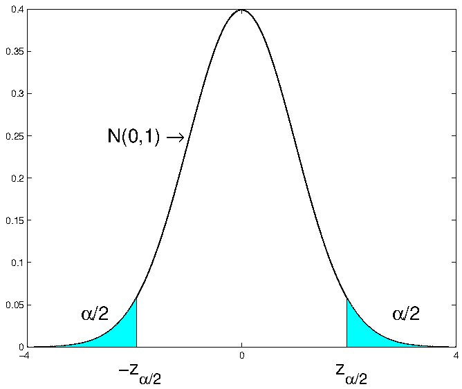
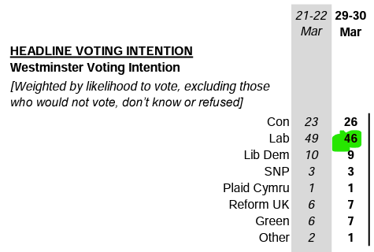
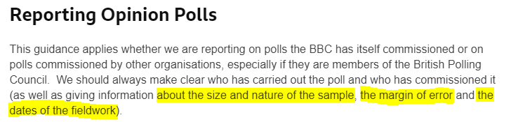
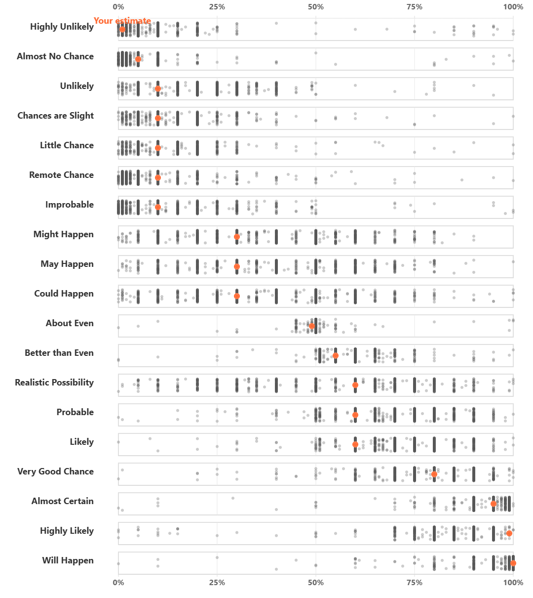

# Confidence Intervals

```{r setup, include = FALSE}
knitr::opts_chunk$set(echo = FALSE)

library(webexercises)
```


## Introduction to Point and Interval Estimation

In the section on sampling distribution we established the link between population parameters and their sample estimators, in particular the link between the population mean and its sample average. In the Section on Hypothesis Testing we then established a particular technique (hypothesis testing) we can use when we want to learn from a (known) sample something about the unknown population parameter. Of course, different samples will yield different estimates of the population parameter: this is the idea of **sampling variability**. It is because of this sampling variability that hypothesis testing could only make probabilistic statements.

In this section we will learn about an alternative (yet linked) way to express the uncertainty arising from sampling variability. Confidence intervals are a popular tool to communicate this uncertainty, one which, in some respects, may deliver a more intuitive way of presenting the uncertainty we are facing (YouTube, 2min)




### Sampling Variability

Let's recall the link between population parameter (here population mean $\mu$) and sample statistic (here sample mean $\bar{X}$). Consider the simplest case of sampling from a normal distribution, $X\sim N\left( \mu ,\sigma ^{2}\right) $ with the intention of estimating $\mu $. The obvious estimator is the sample mean, $\bar{X}$, with sampling distribution $\bar{X}\thicksim N\left( \mu ,\sigma^{2}/n\right)$. Here, $\mu$ is unknown but for now we assume that $\sigma ^{2}$ is known. 

The variance of the distribution of $\bar{X}$ measures the dispersion of this distribution, and thus gives some idea of the range of values of $\bar{X}$ that might be obtained in drawing different samples of size $n$. This measure, $\sigma^2_{\bar{X}}=\sigma^2/n$, is therefore a measure of sampling variability and can be combined with the actual sample estimate, $\bar{x}$, in the following way: 

\begin{equation*}
	\bar{x}\pm k \sigma_{\bar{X}} ,
\end{equation*}

with the value $k$ chosen suitably (we will get to that later). What we get from this is an interval that is centred around the sample mean $\bar{x}$. The actual (unknown) population mean will or will not be contained in this interval, we just don't know.  

So how could such an interval be useful? Before we get to this, let's calculate a **related but different** interval we were able to calculate following our understanding of sampling distributions.

Assume that $X \sim N(7,9)$ and that you draw a sample of size $n=20$. Then we can calculate the probability that $\Pr(5.685 \leq \bar{X} \leq 8.314)$. To calculate this we use our knowledge that $\bar{X} \sim N(7,9/20)$ which then allows us to calculate the value of that probability to be

\begin{eqnarray*}
	\Pr(5.685 \leq \bar{X} \leq 8.314) &=& \Pr\left(\frac{5.685-7}{\sqrt{9/20}} \leq Z \leq \frac{8.314-7}{\sqrt{9/20}}\right)\\
	&=& \Pr\left(\frac{5.685-7}{\sqrt{9/20}} \leq Z \leq \frac{8.314-7}{\sqrt{9/20}}\right)\\
	&=& \Pr\left(-1.96 \leq Z \leq 1.96\right) = 0.95
\end{eqnarray*}

where you can get the probability from the normal probability table. So, if we knew that the population mean was 7, then we would expect that with a 95\% probability we would get a sample mean between 5.685 and 8.314. Where did these two values actually come from? They were calculated from 

\begin{equation*}
	\mu \pm k \sigma_{\bar{X}} 
\end{equation*}

where we used $\sigma^2_{\bar{X}}=9/20$ and $k=1.96$ value as that is the value in the standard normal distribution that cuts off 2.5\% in each tail. This is the interval into which, with a 95\% probability we should expect the sample mean to fall, **if we knew** the population mean ($\mu=7$).

Of course we do not know the population mean in most interesting applications and all we have is a sample mean $\bar{x}$. Can we just replace the unknown population mean $\mu$ with $\bar{x}$? Yes we can, that is how we get to

\begin{equation*}
	\bar{x}\pm k \sigma_{\bar{X}} ,
\end{equation*}

If we again chose the $k=1.96$ we call this the 95\% confidence interval for the population mean. Continuing with the example we now learn that we obtained a sample mean of 7.931. This now allows us to calculate a 95\% confidence interval

\begin{equation*}
	7.931 \pm 1.96 \cdot \sqrt{9/20} \Rightarrow [6.2031,9.6589]
\end{equation*}

What interpretation can we give this confidence interval with lower limit/bound $c_L = 6.2031$ and upper limit/bound $c_U=9.6589$? An intuitive interpretation would be "There is a 95\% probability that the population mean is inside this interval." Unfortunately that is an incorrect interpretation. This interpretation treats the unknown population mean as if it was a random variable, but it is not. It is assumed to be fixed but unknown. What is random is the outcome of the sample mean $\bar{x}$ and therefore the confidence interval (as the lower and upper limits, $c_L$ and $c_U$, of that interval are centred around the particular outcome $\bar{x}=7.931$ of the random variable $\bar{X}$ these limits are also random variables, $C_L$ and $C_U$). Recall, capital letters represent the random variable (like $C_L$) and small letters represent sample draws of that random variable (e.g. $c_L$). 

Therefore, the correct interpretation is the following. If you did take 100 samples, then 95\% of the associated confidence intervals should contain the population mean, $\mu$.

::: {.callout-note}

#### Example

Suppose that a random sample of size $50$ is drawn from the distribution of household incomes, where the latter is supposed to be $N\left( \mu ,5\right)$, and that the mean of the sample is $\bar{x}=18$. If we choose k=1.96, the 95\% confidence interval is 

\begin{equation*}
	18 \pm 1.96 \cdot \sqrt{5/50} \Rightarrow [17.3802,18.6198]
\end{equation*}

If you were to calculate the 99\% confidence interval, the interval would

`r mcq(c("stay unchanged", answer = "become wider", "become narrower"))`


If you increased the sample size, the interval would

`r mcq(c("stay unchanged", "become wider", answer = "become narrower"))`

:::

### Interpreting Confidence Intervals

This interval is defined by the sample values of $C_{L}$ and $C_{U}$: these are the lower and upper confidence bounds and they have sample realisations:

\begin{equation*}
	c_{L}=\bar{x}-1.96SE\left( \bar{X}\right) ,\;\;\;c_{U}=\bar{x}+1.96 SE\left( \bar{X}\right) .
\end{equation*}

The interval estimate

\begin{equation*}
	\bar{x}\pm 1.96SE\left( \bar{X}\right)
\end{equation*}

contains the measure of sampling variability ($SE\left( \bar{X}\right)=\sigma_{\bar{X}}$). 

The choice of $k$ as $k=1.96$ is now determined by the desired confidence level. Why choose the latter to be 0.95 or 95%? This is really a matter of convention and you will often also see 90% or 99% confidence intervals.

It is a common abuse of language to call the interval

\begin{equation*}
	\bar{x}\pm 1.96SE\left( \bar{X}\right)
\end{equation*}%

**the** confidence interval - indeed it is so common that this abuse will be allowed. Strictly, this is **an** interval estimate, which is now seen to be a combination of a point estimate, $\bar{x}$, of $\mu$, and a measure of sampling variability determined by the constant $k$, which sets the confidence coefficient or level, in this case, 0.95.

There is a common misinterpretation of a confidence interval, based on this abuse of language, which says that **the confidence interval**

\begin{equation*}
	\bar{x}\pm 1.96SE\left( \bar{X}\right)
\end{equation*}

**$\mu$  \emph{with} 95\% confidence**. Why is this a misinterpretation? For the following reasons:

* $\mu$ is unknown but not random
* so this "confidence interval" does or does not contain $\mu$;
* since $\mu$ is unknown, we will **never** know  whether a particular conficence interval does or does not contain $\mu$;

A better interpretation is based on the relative frequency interpretation of probability. If samples are repeatedly drawn from the population, say $X\thicksim N\left( \mu ,\sigma ^{2}\right)$, and the interval estimates ("confidence interval") for a 95\% confidence level calculated for each sample, about 95\% of them will contain $\mu$. 

This video illustrates this interpretation using a simple Excel simulation (YouTube, 11 min)



You can get the spreadsheet used from [here](data/Simulatedconfidenceintervals.xlsx)

The image illustrates thirty 90% confidence intervals from a population with mean 7. Of these two confidence intervals do not include the true population mean (they are highlighted in red).


However, this doesn't help when only a single sample is drawn. You just don't know whether that particular confidence interval does, or does not contain the true population mean. The way you should really interpret a particular confidence interval is that it shows a point estimate ($\bar{x}$) of what you wish to estimate and displays the amount of sampling uncertainty.

::: {.callout-note}

#### Example

Suppose that a random sample of size 50 is drawn from the distribution of household incomes, where the latter is supposed to be $N\left( \mu ,5\right)$. Notice that $\sigma ^{2}$ here is supposed to be **known** to equal 5. Suppose that the mean of the sample is $\bar{x}=18$. Then, the 95% confidence interval for $\mu$ is (allowing the abuse of language)
	
\begin{eqnarray*}
	\bar{x}\pm 1.96SE\left( \bar{X}\right) &=&18\pm 1.96\sqrt{\dfrac{5}{50}} \\
	&=&18\pm 0.62 \\
	&=&\left[ 17.38,18.62\right] .
\end{eqnarray*}
	
Here the measure of sampling variability around $\bar{x}=18$ is $\pm 0.62$. One might reasonably conclude that since this measure of sampling variability is small compared to $\bar{x}$, $\bar{x}=18$ is a relatively precise estimate of $\mu$. To refer to **precision** here is fair, since we are utilising the variance of the sampling distribution of $\bar{X}$.

:::

::: {.callout-note}

#### Example

A random sample of size 20 is drawn from the distribution of household savings (measured in 1000s of UKP, negative numbers mean that a household is in debt), where the latter is supposed to be $N\left( \mu ,9\right)$. Notice that $\sigma ^{2}$ here is supposed to be **known** to equal 9. Your sample mean is $\bar{x}=-12$. Then, the 95\% confidence interval for $\mu$ is

\begin{eqnarray*}
	\bar{x}\pm 1.96~SE\left( \bar{X}\right) &=&-12\pm 1.96\sqrt{\dfrac{9}{20}} \\
	&=&-12\pm 1.2003 \\
	&=&\left[ -13.2002,-10.7998\right] .
\end{eqnarray*}
	
How big should your sample be such that the measure of sampling variability ($1.96~SE\left( \bar{X}\right)$) is smaller than 1?

$n$ should be at least `r fitb(35)`

`r hide("Solution")`
$1.96~SE\left( \bar{X}\right)=1.96 \cdot \sqrt{\frac{\sigma^2}{n}}<1$. Either try in Excel which value does reduce this value below 1, or solve the inequality to get $n>1.96^2 \cdot \sigma^2$ which here delivers that the smalles $n$ that achieves that is 35.

This video goes through the workings required in the above example (YouTube, 10min).



`r unhide()`

:::


### Other Confidence Levels

Instead of choosing $k$ so that

\begin{equation*}
	\Pr \left( -k\leqslant \dfrac{\bar{X}-\mu }{SE\left( \bar{X}\right) }\leqslant k\right) =0.95,
\end{equation*}

we can choose $k$ such as to deliver any desired probability, usually expressed as $1-\alpha$:

\begin{equation*}
	\Pr \left( -k\leqslant \dfrac{\bar{X}-\mu }{SE\left( \bar{X}\right) }\leqslant k\right) =1-\alpha
\end{equation*}

Since

\begin{equation*}
	Z=\dfrac{\bar{X}-\mu }{SE\left( \bar{X}\right) }\thicksim N\left(0,1\right) ,
\end{equation*}

we can find from the table of the standard normal distribution the value (percentage point) $z_{\alpha /2}$ such that

\begin{equation*}
	\Pr \left( Z>z_{\alpha /2}\right) =\dfrac{\alpha }{2}.
\end{equation*}

This implies that

\begin{equation*}
	\Pr \left( -z_{\alpha /2}\leqslant Z\leqslant z_{\alpha /2}\right) =1-\alpha.
\end{equation*}

This is clear from the familiar picture in the Figure below.



This delivers the following, commonly used values, to calculate confidence intervals assuming that the sample mean follows a normal distribution (as it does when the population is normal and the population variance is known):

| $\alpha$ | $k=z_{\alpha/2}$ |
|----------|------------------|
| 0.20     | 1.28             |
| 0.10     | 1.65             |
| 0.05     | 1.96             |
| 0.01     | 2.58             |

If we were to chose $\alpha = 0.01$ the confidence interval's lower and upper confidence bounds for the earlier example (population normally distributed with $\sigma^2=5$, sample size $n=50$ and sample mean $\bar{x}= 18$ ) would be calculated as:

\begin{eqnarray*}
	\left[ c_{L},c_{U}\right] &=&\bar{x}\pm z_{\alpha /2}SE\left( \bar{X}\right) \\
	&=&18\pm 2.58\sqrt{\dfrac{5}{50}} \\
	&=&18\pm 0.82 \\
	&=&\left[ 17.18,18.82\right] .
\end{eqnarray*}

Notice that the measure of sampling variability has increased from 0.62 for a 95% confidence interval to 0.82 for a 99% confidence interval. This illustrates the general proposition that the confidence interval gets wider as the confidence coefficient ($1-\alpha$) is increased. There has been no change in the precision of estimation here.

Why the use of $1-\alpha$ in the probability statement underlying the confidence interval? The random variables $C_L$ and $C_U$ are designed here to make

\begin{equation*}
	\Pr \left( \mu \in \left[ C_{L},C_{U}\right] \right) =1-\alpha
\end{equation*}

and therefore

\begin{equation*}
	\Pr \left( \mu \notin \left[ C_{L},C_{U}\right] \right) =\alpha .
\end{equation*}

Recall that in this probability statement it is the lower and upper bounds which are random variables, and not the population mean $\mu$. 

::: {.callout-note}

#### Example

A random sample of size 20 is drawn from the distribution of household incomes, where the latter is supposed to be $N\left( \mu ,9\right)$. Notice that $\sigma ^{2}$ here is **known** to be equa to 9. Your sample mean is $\bar{x}=-12$. Then, the 90\% confidence interval for $\mu$ is
	
\begin{eqnarray*}
	\bar{x}\pm 1.645~SE\left( \bar{X}\right) &=&-12\pm 1.645\sqrt{\dfrac{9}{20}} \\
	&=&-12\pm 1.1035 \\
	&=&\left[ -13.1035,-10.8965\right] .
\end{eqnarray*}
	
How big should your sample be such that the measure of sampling variability ($1.645~SE\left( \bar{X}\right)$) is smaller than 1?
	
$n$ should be at least `r fitb(25)`.

`r hide("Solution")`
$1.645~SE\left( \bar{X}\right)=1.645 \cdot \sqrt{\frac{\sigma^2}{n}}<1$. Either try in Excel which value does reduce this value below 1, or solve the inequality to get $n>1.645^2 \cdot \sigma^2$. This leads to $n$ having to be at least 25.
`r unhide()`

:::


### Which distribution to use?

We started the argument with a calculation we were familiar with from the discussion of sampling distributions. We asked a question like "What is $\Pr(c_L \leq \bar{X} \leq c_U)$?" and then based our calculation on what we knew about the sampling distribution of $\bar{X}$. In the case we discussed $\bar{X} \sim N(\mu,\frac{\sigma^2}{n})$ as the population was assumed to be normally distributed with known $\sigma^2=5$.

The assumption, amongst these, which seemed the most problematic was that of a known population variance ($sigma^2$). In a situation where we wish to estimate an unknown population mean ($\mu$) it is unlikely that we know the population variance $\sigma^2$. In the section on hypothesis testing we discussed how the sample mean $\bar{X}$ is distributed when $\sigma^2$ has to be estimated by the sample variance $s^2$. The following table represents what we know about the sampling distribution of the standardised sample mean $\bar{X}$, $t=\frac{\bar{X}-\mu}{\sqrt{s^2/n}}$ in this situation:

|             | Sample Size ($n$) |                 |
|-------------|-------------------|-----------------|
| Dist of $X$ | small             | large           |
| Normal      | $t \sim t_{n-1}$  | $t \sim N(0,1)$ |
| not Normal  | $t \sim ?$        | $t \sim N(0,1)$ |

This will lead us to adjust the way in which we calculate confidence intervals. In the situation where we could assume that $\bar{X}$ was normally distributed the lower and upper confidence bounds were calculated as follows:

\begin{equation*}
	\left[ c_{L},c_{U}\right] =\bar{x}\pm z_{\alpha /2}SE\left( \bar{X}\right) = \bar{x}\pm z_{\alpha /2} \sqrt{\frac{\sigma^2}{n}}  
\end{equation*}

Now, we shall adjust this, acknowledging that we usually have to estimate the population variance from the sample, using $s^2$:

\begin{equation*}
	\left[ c_{L},c_{U}\right] =\bar{x}\pm t_{n-1,\alpha /2}SE\left( \bar{X}\right) = \bar{x}\pm t_{n-1,\alpha /2} \sqrt{\frac{s^2}{n}}  
\end{equation*}

The interpretation stays exactly the same as earlier and you should note that the only difference is that we use the sample estmate $s^2$ and we use the t-distribution to obtain our estimate of the sampling variation $ t_{n-1,\alpha /2} \sqrt{\frac{s^2}{n}}$. You understand that, for large sample sizes the t-distribution tends towards the standard normal distribution.

This video walks you through the different cases (YouTube, 10min).




::: {.callout-note}

#### Example

This is the same as the previous example, but now assuming that the population variance $\sigma^{2}$ is unknown. Household income in 1000s of UKP is $X\thicksim N\left( \mu ,\sigma ^{2}\right) $, where **both** $\mu$ and $\sigma ^{2}$ are unknown. A random sample of size $n=5$ (previously 50) yields $\bar{x}=18$ (as before) and $s^{2}=4.5$. Here,

\begin{equation*}
	T=\dfrac{\bar{X}-\mu }{\sqrt{\dfrac{S^{2}}{n}}}\thicksim t_{4}.
\end{equation*}

For a 95\% confidence interval for $\mu$, we need the percentage point $t_{4,0.025}$ such that

\begin{equation*}
	\Pr \left( T\leqslant t_{4,0.025}\right) =0.975.
\end{equation*}

Note that we need to find the values in the t-distribution that cut off $\alpha/2$ of the probability in the tail. From the the t-distribution this is found to be

\begin{equation*}
	t_{4,0.025}=2.776.
\end{equation*}

The confidence interval for $\mu$ is then

\begin{eqnarray*}
	\bar{x}\pm t_{n-1,\alpha /2}\sqrt{\dfrac{s^{2}}{n}} &=&18\pm \left(2.776\right) \sqrt{\dfrac{4.5}{5}} \\
	&=&18\pm 2.634 \\
	&=&\left[ 15.366,20.634\right] .
\end{eqnarray*}

For comparison with the original example, if we had used $\sigma ^{2}=5$ with a sample of size 5 the resulting normal-based confidence interval would be

\begin{eqnarray*}
	\bar{x}\pm z_{\alpha /2}\sqrt{\dfrac{\sigma ^{2}}{n}} &=&18\pm \left(1.96\right) \sqrt{\dfrac{5}{5}} \\
	&=&18\pm 1.96 \\
	&=&\left[ 16.04,19.96\right] .
\end{eqnarray*}%

This normal-based confidence interval is narrower than the $t$ based one: this is the consequence of the extra dispersion of the $t$ distribution compared with the $N\left( 0,1\right)$ distribution. The underlying reason for the increased dispersion is, of course, the fact that we do not know the value of $\sigma^2$. Although we have a sample estimate $s^2$ we need to acknowledge that there is sampling variation with respect to this estimate on top of the sampling variation we have for $\bar{x}$.

:::


::: {.callout-note icon=false}

#### Exercise

A random sample of size 10 is drawn from the distribution of household incomes, where the latter is known to be $N\left( \mu ,\sigma^2\right)$. Notice that $\sigma ^{2}$ has to be estimated with the sample variance, here $s^2 = 8.2$. Your sample mean is $\bar{x}=-12$. Then, the 90\% confidence interval for $\mu$ is

$\left[$ `r fitb(-13.6599, tol = 0.001)` , `r fitb(-10.3401, tol = 0.001)` $\right]$


`r hide("Solution")`

Calculations are exactly as in the previous example. Note that you need to use the t-table.

\begin{eqnarray*}
	\bar{x}\pm t_{10-1,0.10/2}~SE\left( \bar{X}\right) &=&-12\pm 1.833\sqrt{\dfrac{8.2}{10}} \\
	&=&-12\pm 1.6599 \\
	&=&\left[ -13.6599,-10.3401\right] .
\end{eqnarray*}

Note that this confidence interval is centered around the sample mean of $-12$.

`r unhide()`

:::

From the earlier table you will see that the t-distribution is only the right distribution to use if you know that the population distribution is actually a normal distribution. But as when we discussed hypothesis testing, the central limit theorem will ensure that a sample mean is normally distributed if the sample size is sufficiently large. In that case we will construct a $100\left( 1-\alpha \right)$ confidence interval from 

\begin{equation*}
	\bar{x}\pm z_{\alpha /2}\sqrt{\dfrac{s^{2}}{n}}.
\end{equation*}

Consider the earlier example (using $n=50$), but now not assuming that sampling takes place from a normal distribution. We assume that the sample information is $n=50$, $\bar{x}=18$ and $s^{2}=4.5$. Then, an approximate $95\%$ confidence interval is (assuming that the sample size is sufficiently large for the CLT to do its magic) is calculated as follows:

\begin{eqnarray*}
	\bar{x}\pm z_{\alpha /2}\sqrt{\dfrac{s^{2}}{n}} &=&18\pm 1.96\sqrt{\dfrac{4.5}{50}} \\
	&=&18\pm 0.588 \\
	&=&\left[ 17.412,18.588\right] .
\end{eqnarray*}

In general, how this compares with the exact confidence interval based on knowledge of $\sigma ^{2}$ depends on how good $s^{2}$ is as an estimate of $\sigma ^{2}$. Nothing can be said about this usually.


::: {.callout-note icon=false}

#### Exercise

A random sample of size 70 is drawn from the distribution of household incomes. You recognise that you should not assume that these incomes are normally distributed. Notice that $\sigma ^{2}$ has to be estimated with the sample variance, here $s^2 = 8.2$. Your sample mean is $\bar{x}=-12$. Then, the 90\% confidence interval for $\mu$ is:

$\left[$ `r fitb(-12.5647, tol = 0.001)` , `r fitb(-11.4353, tol = 0.001)` $\right]$


`r hide("Solution")`

Note that we are now using the normal distribution.

\begin{eqnarray*}
	\bar{x}\pm z_{0.10/2}~SE\left( \bar{X}\right) &=&-12\pm 1.65\sqrt{\dfrac{8.2}{70}} \\
	&=&-12\pm 0.5647 \\
	&=&\left[ -12.5647,-11.4353\right] .
\end{eqnarray*}

`r unhide()`	
:::

### Additional Resources

* [Salman Khan on such a confidence interval](https://www.khanacademy.org/math/statistics-probability/confidence-intervals-one-sample/old-confidence-interval-videos/v/small-sample-size-confidence-intervals).

## Confidence intervals for population proportions

As for hypothesis testing you will learn that we can perform inference on many unknown parameters. Here we will merely introduce one extra such confidence interval, a confidence interval for a population proportion $\pi$. We assumed that a random sample is obtained from the distribution of a Bernoulli random variable, a random variable $X$ taking on values 0 and 1 with probabilities $1-\pi$ and $\pi$ respectively. The sample mean $\bar{X}$ here is the random variable representing the sample proportion of $1^{\prime }s$, and so is usually denoted $P$ or $\hat{P}$, "the" sample proportion. (Note, here we use $\hat{P}$ to denote the sample estimator of the proportion and $\hat{p}$ as the actual sample proportion. In some books and websites you will see $P$ and $p$ only representing these two objects. As the population proportion is usually labelled $\pi$ this would be sufficient.)

When you learned about descriptive statistics you learnt that proportions can be seen as means of a variable which only takes values of 0 and 1. It is therefore not a surprise that the CLT works on sample proportions ($\hat{P}$) as well and makes them, for sufficiently large samples, normally distributed random variables.  

Since

\begin{equation*}
	E\left[ \hat{P}\right] =\pi ,\;\;\;\;var\left[ \hat{P}\right] =\dfrac{\pi \left( 1-\pi \right) }{n},
\end{equation*}

\begin{equation*}
	\dfrac{\hat{P}-\pi }{\sqrt{var\left[\hat{P}\right] }}\thicksim N\left(0,1\right) \;\;\;\;\;\text{approximately.}
\end{equation*}

So, one could hope to use this to provide an approximate confidence interval for $\pi$. There is a minor complication here in that $var\left[ \hat{P}\right] $ depends on the unknown parameter $\pi$ , but, there is an obvious estimator ($\hat{P}$) available which could used to provide an estimator of $var\left[ \hat{P}\right] $.

Following the previous reasoning, we argue that

\begin{equation*}
	\dfrac{\hat{P}-\pi }{\sqrt{\dfrac{\hat{P}\left( 1-\hat{P}\right) }{n}}}\thicksim N\left(0,1\right) \;\;\;\;\;\text{approximately.}
\end{equation*}

This knowledge can then be used to construct a sample confidence interval from 

\begin{equation*}
	\hat{p}\pm z_{\alpha /2}\sqrt{\dfrac{\hat{p}\left( 1-\hat{p}\right) }{n}}.
\end{equation*}

Note that this differed from the approach taken when we required the variance of $\hat{P}$ when hypothesis testing. In that case we did not use the sample proportion $\hat{p}$ but rather the hypothesised (under $H_0$) population proportion to calculate $Var[\hat{P}]$.

::: {.callout-note}

#### Example

A random sample of 300 households is obtained, with 28% of the sample owning a tablet computer. An approximate 95% confidence interval for the population proportion of households owning a tablet computer is

\begin{eqnarray*}
	\hat{p}\pm z_{\alpha /2}\sqrt{\dfrac{\hat{p}\left( 1-\hat{p}\right) }{n}} &=&0.28\pm \left(1.96\right) \sqrt{\dfrac{0.28\left( 1-0.28\right) }{300}} \\
	&=&0.28\pm 0.0508 \\
	&=&\left[ 0.229,0.331\right] .
\end{eqnarray*}

For such an apparently large sample size, this is quite a wide confidence interval. Better precision of estimation would require a larger sample size.

:::

::: {.callout-note icon=false}

#### Exercise

A random sample of 1021 randomly selected students is asked whether they intend to vote at the next election (in whichever country they are registered to vote). In the sample 780 students indicate that they intend to vote at the next general election in their country. Calculate a 99% confidence interval for the population proportion of students intending to vote

$\left[$ `r fitb(0.7297, tol = 0.001)` , `r fitb(0.7982, tol = 0.001)` $\right]$

`r hide("Solution")`

Note that we are now using the normal distribution.


	
\begin{eqnarray*}
		\hat{p}\pm z_{\alpha /2}\sqrt{\dfrac{\hat{p}\left( 1-\hat{p}\right) }{n}} &=&0.7640\pm \left(2.58\right) \sqrt{\dfrac{0.7640\left( 1-0.7640\right) }{1021}} \\
		&=&0.7640\pm 0.0343 \\
		&=&\left[ 0.7297,0.7982\right] .
\end{eqnarray*}

`r unhide()`

:::

### Additional resources

* This is the Khan Academy example of a [confidence interval for a proportion](https://www.khanacademy.org/math/probability/statistics-inferential/confidence-intervals/v/confidence-interval-example). The standard error of $\hat{P}$ is calculated in a different way but with the same result.

### Opinion polling reality

Estimating proportions is a very common task. Market research companies will often do this on behalf of clients. One of the companies which is busy in this sphere is [YouGov](https://yougov.co.uk/). Visit their website to see the wide variety of research they undertake. One of the regular pieces of research undertaken is an investigation of voting intentions. Here is a link to the [voting intentions page](https://yougov.com/en-gb/trackers/voting-intention). You will remember from earlier discussions that, when sampling, we would normally assume that we have taken a random sample from the population of interest. One interesting aspect of such work is that organisations like YouGov will often reweigh the observations. This means that not all observations will get the same weights. We dealt with this in the descriptive statistics section. The reason why this is done is to ensure that the investigated sample has demographic properties that the population of interest is assumed to have. 

In this \href{https://docs.cdn.yougov.com/8iqsfg1dct/TheTimes_VI_230330_W.pdf}{document} we can get survey details for the 31 March 2023 YouGov voting intention survey. In there you can see (on the bottom of page 4) that YouGov targets (amongst others) the following characteristics

| Brexit Vote                 | Target percentage | Actual obs | Actual percentage | Weighted obs |
|-----------------------------|-------------------|------------|-------------------|--------------|
| Remain                      | 35.2\%            | 801        | 40.0\%            | 705          |
| Leave                       | 37.2\%            | 768        | 38.4\%            | 745          |
| Did not vote / Did not know | 27.5\%            | 433        | 21.6\%            | 551          |

There were 2002 responses and for instance there were 801 respondents that voted remain in the Brexit vote. That is an actual percentage of 40% which is more than the 35.2% targeted. Therefore, the weights of these observations are down-weighted such that they effectively represent only 705 observations (approximately the target percentage). Equally, there were too few respondents who did not vote and therefore these observations receive a larger weight.

Below you can see a snippet from the resulting voting intention. The numbers in the table represent percentages.



As you can see YouGov estimates that 46% of votes will go to the Labour party. When performing a hypothesis test or calculating a confidence interval you will need the standard error for the sample proportion $\hat{P}$. When performing hypothesis tests we use the hypothesised proportion in the calculation of $\sigma^2_{\hat{P}}$. When calculating a confidence interval we use, as in the previous example:

\begin{equation*}
	\sigma^2_{\hat{P}}=\dfrac{\hat{p}\left( 1-\hat{p}\right) }{n}
\end{equation*}

Unfortunately, when using weighted observations as in the YouGov example, this formula is not correct, as it does not take into account that some observations had a higher weight than others. How to calculate the standard error for a weighted sample proportion is beyond the scope of this document. For the example below use $\sigma^2_{\hat{P}}$ as introduced above, it will continue to be in the right ballpark.

::: {.callout-note icon=false}

#### Exercise
 
Calculate the 90% confidence interval for the proportion of Labour votes.

$[$ `r fitb(0.4416, tol = 0.001)` , `r fitb(0.4784, tol = 0.001)` $]$

`r hide("Solution")`

\begin{eqnarray*}
	p\pm z_{\alpha /2}\sqrt{\dfrac{p\left( 1-p\right) }{n}} &=&0.46\pm \left(1.65\right) \sqrt{\dfrac{0.46\left( 1-0.46\right) }{2002}} \\
	&=&0.46\pm 0.0184 \\
	&=&\left[ 0.4416,0.4784\right] .
\end{eqnarray*}
	

`r unhide()`

:::


## Summary and Outlook

::: {.callout-note icon=false}

#### Summary Questions

Suppose that a random sample of size 60 is drawn from the distribution of household incomes, where the latter is supposed to be $N(\mu,8)$, and that the mean of the sample is  $\bar{x}=22$.

The following 95% confidence interval has been correctly calculated:

95% CI: $[21.2843, 22.7156]$

Answer the following questions:

We are 95% confident that the average household income in this sample is between 21.2843 and 22.7156. `r torf(FALSE)`


`r hide("Feedback")`

False, the CI contains the sample mean 100% of times as it is cenrtered around it.

`r unhide()`


95% of the household incomes are between 21.2843 and 22.7156. `r torf(FALSE)`

`r hide("Feedback")`

False, the CI is for covering the population mean ($\mu$) not a proportion of the original population.

`r unhide()`

There is 0.95 probability that the true mean household income falls in 21.2843 and 22.7156. `r torf(FALSE)`

`r hide("Feedback")`

False, the population mean $\mu$ is not a random variable, the CI itself is. For a particular CI like the one calculated here $\mu$ is in the CI or it is not, we just don't know which of the two it is.

`r unhide()`

The lower and upper limits of the confidence interval are random variables. `r torf(TRUE)`

`r hide("Feedback")`

True, they are based on the sample mean and the sample mean is a random variable itself. Therefore the limits of the CI are also random variables.

`r unhide()`
:::

In this section we discussed confidence intervals. They are a very powerful and popular way to communicate that any estimate for a population quantity (say the mean or proportion) is merely an estimate and that really we are not certain. As the p-value in hypothesis testing, the confidence interval has a slightly "stilted" interpretation. However, confidence intervals are a very intuitive way to communicate the uncertainty or margin of error.

Having said that, often the communication of opinion poll results (say in TV, TikTok or newspapers) does not acknowledge such uncertainty. Here is an example of typical reporting on opinion polls. An institution (here Quinnipac University, well known for their polling operation) [conducted some opinion polls](https://poll.qu.edu/poll-release?releaseid=3863) and presents a write-up of the results. At the bottom of that report you do get a clear statement about the margins of error (typically calculated as 95% confidence intervals). Then some other organisation picks up on these poll results and does not mention any margin of error (here the respectable [Brookings Institute](https://www.brookings.edu/blog/fixgov/2023/01/06/polls-show-americans-are-divided-on-the-significance-of-january-6/). This is a very typical pattern which you can confirm by checking how another [Quinnipac poll on the conservative US Supreme Court judge Thomas](https://poll.qu.edu/poll-release?releaseid=3842) was reported on by [CNN](https://edition.cnn.com/2022/04/06/politics/justice-clarence-thomas-wife-ginni-poll-recusal/index.html).

In the UK, the BBC actually does have [guidance on how opinion polls are to be reported](https://www.bbc.com/editorialguidelines/guidance/surveys#reportingopinionpolls):



But that does not ensure that this guidance is always adhered to as reading through [this BBC news story confirms](https://www.bbc.com/news/world-us-canada-44324545).

What should you take away from this? Reporting on statistical uncertainty is not easily done correctly (recall the awkward interpretations of p-values and confidence intervals). It is therefore perhaps not surprising that many news organisations shy away from such communication. It is therefore some of your skill, after having studies on this course, to properly understand such uncertainty and contribute to communicating it properly.

Here are two additional pieces of interesting reading in this area.

* [This is an interesting report by the UK Parliament on the way Media report on polling results](https://publications.parliament.uk/pa/ld201719/ldselect/ldppdm/106/10606.htm).
* [This is an interesting post by Adam Kucharski on the probabilities the public associate with terms like "very likely" or "almost impossible".](https://probability.kucharski.io). If you complete the short survey you will get a result like the below which shows you whether your interpretations coincide with those of others.  



:::
 


