# Continuous Random Variables and Probability Distributions

```{r setup, include = FALSE}
knitr::opts_chunk$set(echo = FALSE)

library(webexercises)
```


## Introduction

Why do economists have to think about continuous random variables and their distributions? (YouTube, 4min) 



In the Discrete random variables Section, we introduced the notion of a random variable and, in particular a discrete random variable. It was then discussed how to use mathematical functions in order to assign probabilities to the various possible numerical values of such a random variable. A probability distribution is a method by which such probabilities can be assigned and in the discrete case this can be achieved via a probability mass function (pmf). We then discussed how a cumulative distribution function (cdf) calculates probabilities for all outcomes smaller than a particular value. Last we discussed several important examples of discrete probability distributions, including the Bernoulli distribution, the Binomial distribution, the Geometric distribution and the Poisson distribution.

The distributions discussed in the previous section are useful for random variables that have a discrete number of possible outcomes. However, some random variables can take outcomes on a continuous scale and statisticians have derived several important continuous distributions to be able to model such random variables. 

We will soon see a more formal definition and example of distributions for continuous random variables. Before we see them, an understandings of continuous random variables is required. This is what we turn to now.

## Continuous random variables

Recall that a random variable is a function applied on a sample space, by which we mean that physical attributes of a sample space are mapped (by this function) into a number. When a \textit{continuous random variable} is applied on a sample space, this implies that the function can be applied to a continuous range of possible numbers (not just discrete numbers as with a discrete random variable). In Figure 1 you can see two random variables. The number of dogs a family owns, which can take values 0, 1, 2, 3 etc. (and hence it is a discrete variable, you cannot own 2.5 dogs). The other would be the weight of a person which can take values on a continuous scale, and not only discrete values.

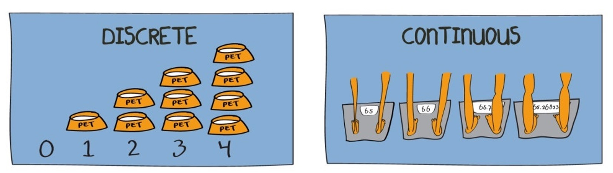

As a further example, let $X=$ "the contents of a reservoir", where the appropriate sample space under consideration allows for the reservoir being just about empty, just about full or somewhere in between. Here we might usefully define the range of possible values for $X$  as $0 < X < 1$, with 0 signifying ‘empty’ and 1 signifying ‘full’. When talking about the characteristics of continuous variables, we can not list all possible outcomes for $X$; any value in the interval is possible. The sample space is defined by an interval. That interval could be a closed interval, such as $[0,1]$ or an open interval such as $(-\infty,\infty)$ or $[0,\infty)$. Make sure you understand on which interval the random variable is defined.

When we talk about probability distributions for continuous random variable we will also have two representations of the same information. The cumulative distribution function (cdf) which has exactly the same meaning as for discrete random variables, and the probability density function (pdf) which does for continuous random variables what the probability mass function (pmf) does for discrete random variables.

### Probability density function (pdf)

In the discrete random variable section, we showed that the probability distribution of a discrete random variable can be represented by a histogram, being a graphical representation of the probability mass function (pmf). The equivalent representation for a continuous random variable is a probability density function (pdf).

The following figure gives you (on the left hand side) a representation of a typical pmf and on the right hand side a representation of a typical pdf.

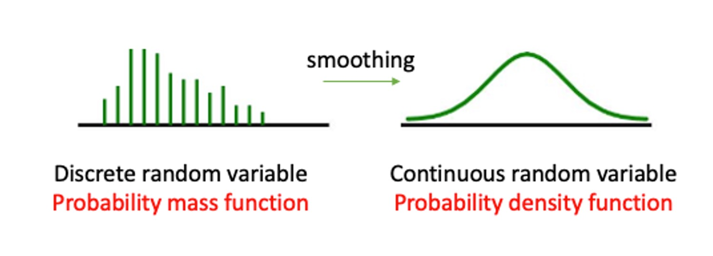#fig-pmftopdf

Given that the sample space of a continuous random variable is not just discrete numbers, how do we distribute probability for such a continuous random variable? The probability must be distributed over the range of possible values for $X$; which, in the reservoir example, is over the unit interval $\left(0,1\right)$. As shown by @fig-pmftopdf, unlike the discrete case where a specific **mass** of probability is dropped on each of the discrete outcomes, for continuous random variables probability is distributed smoothly over the **whole interval** of defined possible outcomes. This is what we call a probability density function (pdf).

In a histogram (representing a pmf) the height of the bars represented the probability of that particular outcome. When summing up all such probabilities you would get the value one. The probability density function (pdf) for a **CONTINUOUS** random variable is a curve, $f(x)$, that shows the probability of a range of values as the area under the curve. 

This is illustrated in @fig-pdf_example. The area underneath the pdf between $a$ and $b$ represents the probability that the random variable $X$ will take a value between  $a$ and $b$, $Pr(a < X \leq b)$. Any such value will be smaller or equal to 1 and the area underneath the entire pdf will be equal to one. 

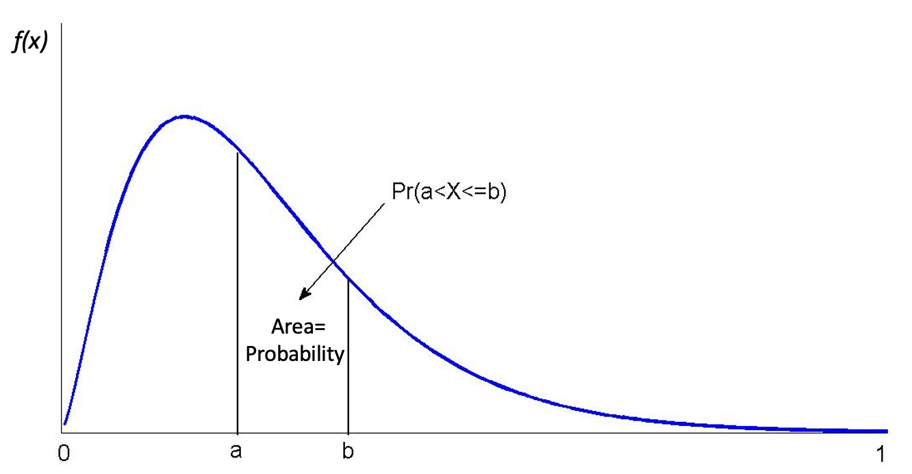#fig-pdf_example

Some thought should convince you that for a **continuous** random variable, $X$, it must be the case that $Pr(X=a)=0$ for all real numbers $a$ contained in the range of possible outcomes of $X$. If this were not the case, then the axioms of probability would be violated. However, there should be a positive probability of $X$ being close, or in the neighbourhood, of $a$. (A neighbourhood of $a$ might be $a\pm0.01$, say.) For example, although the probability that the reservoir is **exactly** 90\% full must be **zero** there will be a positive probability that the reservoir has a level between 89.99\% and 90.01\%.

This can be difficult to grasp. When we are talking about the reservoir being exactly 90\% full, given this is a continuous variable, we are really thinking about 90.00000000000\%. It would be impossible to assign a positive probability to every exact outcome. If we did assign a positive probability to an infinite number of possible outcomes then these probabilities would sum to more than one! This emphasizes that we cannot think of probability being assigned at specific outcomes, rather probability is **distributed** over intervals of outcomes.

We therefore must confine our attention to assigning probabilities of the form $Pr(a< X \le b)$ , for some real numbers $a<b$ ; i.e., what is the probability that $X$ takes on values between $a$ and $b$? It is the area under the probability density function between $a$ and $b$ which provides that probability, not the probability density function itself. Thus, by the axioms of probability, if $a$ and $b$ are in the range of possible values for the continuous random variable, $X$, then $Pr(a< X \le b)$ must always return a positive number, lying between 0 and 1, no matter how close $b$ is to $a$ (provided only that $b>a$).

A short video summary of these points is available from here (YouTube, 8min)



::: {.callout-info}

#### Example


Below is a pdf for a random variable which is defined on the interval between 150 and 190 (formally $(150,190]$). This means the random variable cannot take any values outside this interval.

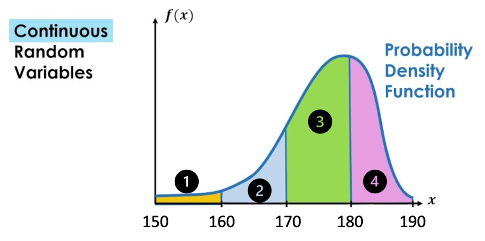
 
1. Match the area

For example, $Pr(150 < X \leq 160) = $ Area 1 

$Pr(160 < X \leq 170) =$ Area `r fitb(2)`

$Pr(180 < X \leq 190) =$ Area `r fitb(4)`

$Pr(160 < X \leq 180) =$ Area `r mcq(c("2","3",answer="2+3"))`

2. TRUE or FALSE

$Pr( X = 170)>0$  `r torf(FALSE)`

$Pr( 150 < X \leq 190)=1$ `r torf(TRUE)`

$Pr( 160 < X \leq 170)=Pr( 160 \leq X \leq 170)$  `r torf(TRUE)`

:::

Let's summarise what we know about continuous random variables:

* $Pr(X=x)=0$.
* The probability that $X$ has a value between $a$ and $b$ is written $Pr(a < X \leq b)$.
* Area below the pdf curve as a measure of probability

Recall that random variables are functions which assign probabilities to outcomes. What sorts of mathematical functions can usefully serve as probability density functions? To develop the answer to this question, we begin by considering another question: what mathematical functions would be appropriate as cumulative distribution functions (cdf)?


### Cumulative distribution function (cdf)

For a **CONTINUOUS** random variable, $X$, defined on $(-\infty,\infty)$, the \textit{cdf} is a **smooth** continuous function defined as 

\begin{equation*}
	F(x)=Pr(X \leq x)
\end{equation*}

for **all** real numbers $x$; e.g., $F(0.75)=Pr(X \leq 0.75)$. 

Therefore, the type of probabilities we are looking at now are a special case of the interval probabilities we discussed previously, as $F(0.75)=Pr(X \leq 0.75)=Pr(-\infty <X \leq x)$. 

But looking at this special case will make our job somewhat easier for starters. The following should be observed:

* such a function is defined for all real numbers $x$, not just those which are possible realisations of the random variable $X$;
* we use $F(.)$, rather than $P(.)$, to distinguish the cases of continuous and discrete random variables, respectively.

Let us now establish the **mathematical properties** of such a function. We can do this quite simply by making $F(.)$ adhere to the axioms of probability. Firstly, since $F(x)$ is to be used to return probabilities, it must be that $0 \leq F(X) \leq 1$, for all $x$.

Secondly, it must be a smooth, increasing function of $x$ (over intervals where possible values of $X$ can occur). To see this, we will have to think carefully. Take two arbitrary numbers $a$ and $b$, satisfying $-\infty<a<b<\infty$. Notice that $a<b$; $b$ can be as close as you like to $a$, but it must always be strictly greater than $a$. Therefore, the axioms of probability imply that $Pr(a<X \leq b)>0$, since the event ‘$a<X \leq b$’ is possible. Now divide the real line interval $X = \left(-\infty,b \right]$ into two mutually exclusive intervals, $X = \left(-\infty,a \right]$ and $X = \left(a,b \right]$. Then we can write the event ‘$X \leq b$’ as

\begin{equation*}
	(X \leq b)=(X \leq a) \cup (a < X \leq b)
\end{equation*}

Assigning probabilities on the left and right, and using the axiom of probability concerning the allocation of probability to mutually exclusive events, yields

\begin{equation*}
	Pr(X \leq b)= Pr(X \leq a) + Pr(a < X \leq b)
\end{equation*}

or

\begin{equation*}
	Pr(X \leq b)-Pr(X \leq a)= Pr(a < X \leq b)
\end{equation*}


Now, since $F(b)=Pr(X \leq b)$ and $F(a)=Pr(X \leq a)$, we can write

\begin{equation*}
	F(b)-F(a)=Pr(a < X \leq b)>0
\end{equation*}

Thus $F(b)-F(a)>0$, for all real numbers $a$ and $b$ such that $b>a$, no matter how close. You should note that we have now reconstructed the interval probability which we discussed in the previous Section, $Pr(a<X \leq b)$, as a function of what we now call a cumulative density function. We also previously discussed that $Pr(a<X \leq b)>0$ on the range on which $X$ is defined (i.e. between $-\infty$ and $\infty$ in the generic example) and therefore we know that $F(x)$ must be an increasing function. A little more delicate mathematics shows that it must be a **smoothly** increasing function 

`r hide("Why smoothly")`

This is due to the fact that $Pr(X=b)=0$, which implies that we are not getting any discrete changes from $F(b-\epsilon)$ to $F(b)$. 

`r unhide()`


All in all then, $F(x)$ appears to be smoothly increasing from 0 to 1 over the range of possible values for $X$. 

More generally, we now formally state the properties of a **cdf**.


### Properties of the cdf

A cumulative distribution function is a mathematical function, $F(x)$, satisfying the following properties:

* $0\leq F(x)\leq1$.	
* If $b>a$ then $F(b)\geq F(a)$; i.e., $F$ is increasing. In addition, over all intervals of possible outcomes for a continuous random variable, $F(x)$ is smoothly increasing; i.e., it has no sudden jumps.
* $F(x)\to 0$ as $x \to -\infty$; $F(x) \to 1$ as $x \to \infty$; i.e., $F(x)$ decreases to 0 as $x$ falls, and increases to 1 as $x$ rises.

For complete generality, $F(x)$ must be defined over the whole real line even though in any given application the random variable under consideration may only be defined on an interval of that real line. Such an example would be if we were to look at the water level in a reservoir which is defined on the interval 0 (empty) to 1 (100\% full).

Any function satisfying the above may be considered suitable for modelling cumulative probabilities, $Pr(X \leq x)$, for a continuous random variable. Careful consideration of these properties reveals that $F(x)$ can be **flat** (i.e., non-increasing) over some regions. This is perfectly acceptable since the regions over which $F(x)$ is flat correspond to those where values of $X$ cannot occur and therefore, zero probability is distributed over such regions. In the reservoir example, $F(x)=0$, for all $x\leq 0$, and $F(x)=1$, for all $x\geq1$; it is therefore flat over these two regions of the real line. This particular example also demonstrates that the last of the three properties can be viewed as completely general; for example, the fact that $F(x)=0$, in this case, for all $x \leq 0$ can be thought of as simply a special case of the requirement that $F(x)\to 0$ as $x \to -\infty$.

Some possible examples of \textit{cdfs}, in other situations, are depicted in the following Figure 5.

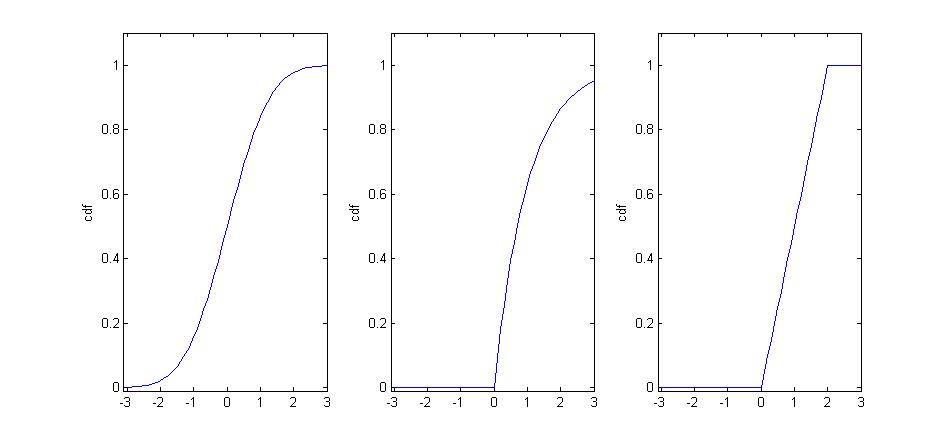#fig-var_cdfs

* The first of these is strictly increasing over the whole real line, indicating possible values of $X$ can fall anywhere.
* The second is increasing, but only strictly over the interval $x>0$; this indicates that the range of possible values for the random variable is $x>0$ with the implication that $Pr(X\leq 0)=0$. 
* The third is only strictly increasing over the interval $0<x<2$, which gives the range of possible values for $X$ in this case; here $Pr(X\leq0)=0$, whilst $Pr(X\geq2)=0$.

In practice we will often be interested in interval probabilities of the type $Pr(a<X\leq b)$. Therefore, let us end this discussion by re-iterating how probabilities and the **cdf** are related to each other:

* $Pr(a<X \leq b)=F(b)-F(a)$, for any real numbers $a$ and $b \geq a$;
* $Pr(X>a)=1-F(a)$, since $F(a)=Pr(X \leq a)$ and $Pr(X \leq a)+Pr(X>a)=1$, for any real number $a$;
* $Pr(X<a)=Pr(X \leq a)$, since $Pr(X=a)=0$.	

After the following exercise we will investigate the mathematical relationship between \textit{pdf} and \textit{cdf}.


::: {.callout-note icon=false}

#### Exercise

Consider the following cdf:

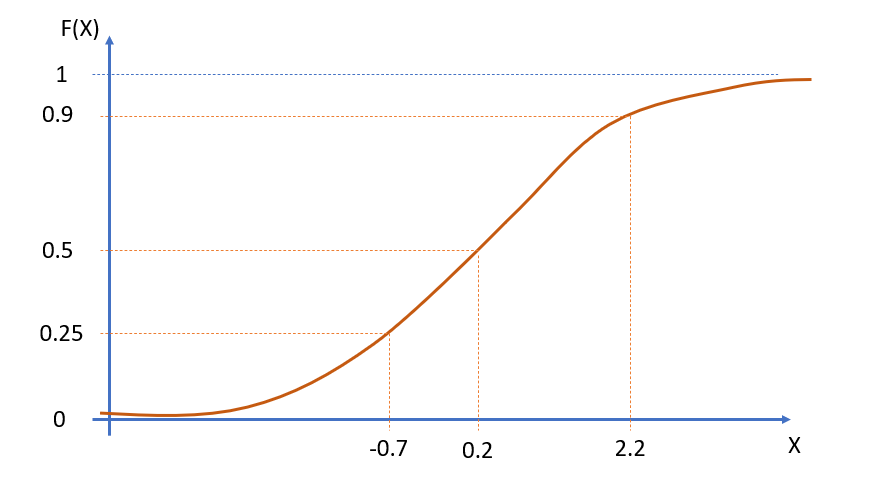

What are the following probabilities?

* $F(-0.7) = 0.25$
* $Pr(x \leq -0.7) =$ `r fitb(0.25)`
* $Pr(x \leq 0.2) =$ `r fitb(0.5)`
* $Pr(x \leq 2.2) =$ `r fitb(0.9)`
* $F(0.2) =$ `r fitb(0.5)`
* $F(0.9) =$ `r fitb(0.9)`
* $Pr(x > 0.2) =$ `r fitb(0.5)`
* $Pr(x > 2.2) =$ `r fitb(0.1)`
* $Pr(-0.7<X \leq 0.2) = F(0.2)-F(-0.7) =0.5-0.25 =0.25$
* $Pr(-0.7<X \leq 2.2) = F(2.2)-F(-0.7)=0.9-0.25=0.65$
*	$Pr(0.2<X \leq 2.2)=F(2.2)-F(0.2) =$ `r fitb(0.4)`

Which expressions are correct (multiple correct answers are possible)? 

* $F(0.9)= Pr(X \geq 0.9)$ `r torf(FALSE)`
* $F(0.2) = Pr(X \leq 0.2)$ `r torf(TRUE)`
* $Pr(X>0.5)=F(0.5)-1$ `r torf(FALSE)`
* $Pr(X>0.3)=1-F(0.3)$ `r torf(TRUE)`
* $Pr(X<0.66)=Pr(X \leq 0.66)$ `r torf(TRUE)`
* $Pr(0.3<X \leq 0.6)=F(0.3)-F(0.6)$ `r torf(FALSE)`
* $Pr(0.23<X \leq 0.68)=F(0.68)-F(0.23)$ `r torf(TRUE)`

:::


### Relations between pdf and cdf

A brief discussion of how the pdf and the cdf are related (YouTube, 8min). 



As discussed above, there is a smooth, increasing, function $F(x)$, the **cdf**, which provides $Pr(X \leq x)$. We further argued that

\begin{equation*}
	Pr(a<X \leq b)=F(b)-F(a)
\end{equation*}

for real numbers $b>a$. Also, since $F(x)$ is smoothly continuous and differentiable over the range of possible values for $X$ (see the above @fig-var_cdfs with different **cdfs**), then there must exist a function $f(x)=dF(x)/dx$, the derivative of $F(x)$. Note that $f(x)$ must be positive over ranges where $F(x)$ is increasing; i.e., over ranges of possible values for $X$. On the other hand, $f(x)=0$, over ranges where $F(x)$ is flat; i.e., over ranges where values of $X$ cannot occur.

Moreover, the **Fundamental Theorem of Calculus** (which simply states that differentiation is the opposite of integration) implies that if $f(x)=dF(x)/dx$, then

\begin{equation*}
	F(b)-F(a)=\int_{a}^{b} f(x)\,dx
\end{equation*}

We therefore have constructed a function $f(x)=dF(x)/dx$, such that the area under it yields probability (recall that the integral of a function between two specified limits gives the area under that function). Such a function, $f(x)$, is the **robability density function**.

In general, $lim_{a\to-\infty} F(a)=0 $, so by letting $a \to -\infty$ in the above we can define the fundamental relationship between the cdf and pdf as:

\begin{equation*}
	F(x)=Pr(X \leq x) =\int_{-\infty}^{x} f(t)\,dt
\end{equation*}

\begin{equation*}
	f(x)=dF(x)/dx
\end{equation*}


i.e., $F(x)$ is the area under the curve $f(t)$ up to the point $t=x$. Now, letting $x \to \infty$, and remembering that $lim_{x\to \infty} F(x)=1 $, we find that

\begin{equation*}
     \int_{-\infty}^{\infty} f(x)\,dx =1
\end{equation*}

i.e., \textit{total area under $f(x)$ must equal} 1 (rather like the total area of the sample space as depicted by a Venn Diagram).

These definitions are all quite general so as to accommodate a variety of situations; however, as noted before, implicit in all of the above is that $f(x)=0$ over intervals where no probability is distributed; i.e., where $F(x)$ is flat. 

Let's return to the previously mentioned reservoir example. Here we have that the random variable is limited to take values between 0 (empty) and 1 (full):

\begin{equation*}
    F(x)=\int_{0}^{x} f(t)dt,~0<x<1
\end{equation*}

for some suitable function $f(.)$, since $f(t)=0$ for all $t \leq 0$, and all $t \geq 1$. For example, suppose the contents of the reservoir can be modeled by the continuous random variable which has probability density function

\begin{equation*}
  f(x) =
    \begin{cases}
      3 (1-x)^2, & 0 \leq x \leq 1\\
      0, & \text{otherwise}
    \end{cases}       
\end{equation*}

We can then calculate the probability that the reservoir will be over 75\% full as:

\begin{equation*}
    Pr(X>0.75)=\int_{0.75}^{1} 3 (1-x)^2\,dx
    =-[(1-x)^3]_{0.75}^{1}=(1/4)^3=1/64
\end{equation*}

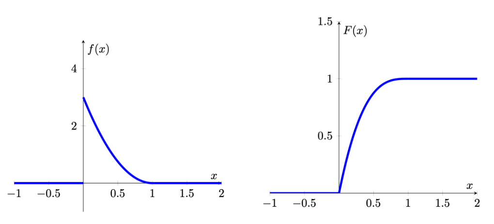


When looking at the cdf and pdf you can see that they are related. Where the pdf is high, here at low levels close 0, the cdf increases steeply. Where the pdf has low values, here close to 1, the cdf increases, but very slowly. This is not surprising as we now understand that the pdf is the derivative of the cdf.

A video workthrough for that example is available from here (YouTube, 11min).



Now we will move on to another example. The following Figure gives another simple example of how the cdf and pdf are related to each other. Here probability is distributed uniformly over a finite interval (in this case, it is the unit interval $[0,1])$. Such a distribution is therefore said to be uniform and

\begin{equation*}
  F(x) =
    \begin{cases}
      0, & x <0\\
      x, & 0 \leq x \le 1\\
      1, & x>1
    \end{cases}       
\end{equation*}

\begin{equation*}
  f(x) =
    \begin{cases}
      0, & x <0\\
      1, & 0 \leq x \le 1\\
      0, & x>1
    \end{cases}       
\end{equation*}

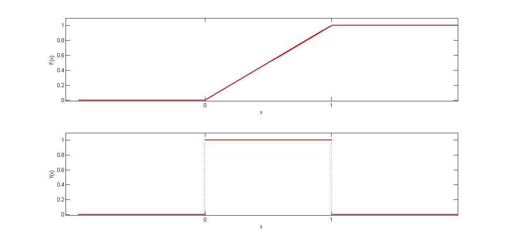

For example,

$Pr(0.25<X \leq 0.5)=F(0.5)-F(0.25)=\frac{1}{2}-\frac{1}{4}=\frac{1}{4}$.

Alternatively, using the \textit{pdf},

$Pr(0.25<X \leq 0.5)= \int_{0.25}^{0.5} f(x)dx=0.25$.

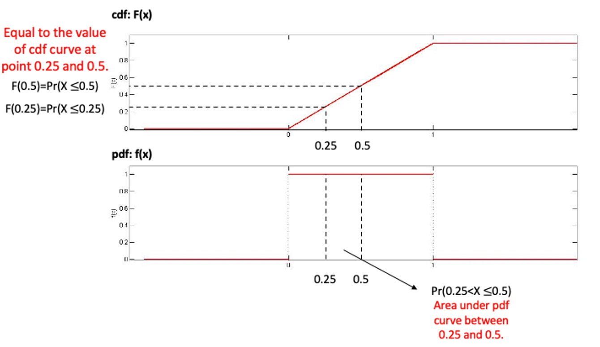

Also note that the total area under $f(x)$, over the unit interval, is clearly equal to 1.

From the two examples we looked at we can conclude that for relationship between cdf and pdf the following properties follow:

* $f(x)\geq 0$.	
* $\int_{-\infty}^{\infty} f(x)dx=1$
* $f(x)=dF(x)/dx$
* $F(x)=\int_{-\infty}^{x} f(t)dt$
* Probabilities can be calculated as: $Pr(a<X \leq b) = \int_{a}^{b} f(x)dx$ i.e., it is the area under the pdf which gives probability


::: {.callout-info}

#### Example

Let the random variable $T$ denote the time a person waits for an elevator to arrive. Suppose the longest one would need to wait for the elevator is 2 minutes, so that the possible values of $T$ (in minutes) are given by the interval  [0,2] . A possible pdf for $T$ is given by

\begin{equation*}
  f(t) =
    \begin{cases}
      t, & 0 \leq t \le 1\\
      2-t, & 1 < t \le 2\\
      0, & otherwise
    \end{cases}       
\end{equation*}

This is what we call a piecewise definition of a pdf as the pdf is expressed in different functions for different intervals. 

The graph of $f(x)$ is given below

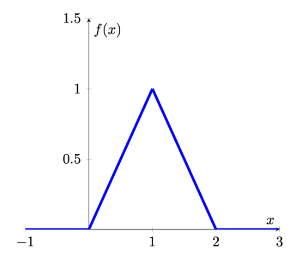

Calculate the probability that a person waits less than 30 seconds (or 0.5 minutes) for the elevator to arrive. $Pr(0 \leq t \leq 0.5) =$ `r fitb(0.125)`

`r hide("Answer")`
$Pr(0 \leq t \leq 0.5)= \int_{0}^{0.5} f(t)dt=\int_{0}^{0.5} tdt=\frac{t^2}{2}_{0}^{0.5}=0.125$
`r unhide()`


Find the corresponding cdf.

First, let's find the cdf at two possible values of $T$,  $t=0.5$  and $t=1.5$ 

\begin{eqnarray*}
  F(0.5)&=& \int_{-\infty}^{0.5} f(t)dt=\int_{0}^{0.5} tdt=\frac{t^2}{2}_{0}^{0.5}=0.125\\
  F(1.5)&=& \int_{-\infty}^{1.5} f(t)dt=\int_{0}^{1} tdt+\int_{1}^{1.5}(2-t)dt\\
  &=&\frac{t^2}{2}_{0}^{1}+(2t-\frac{t^2}{2})_{1}^{1.5}=0.5+(1.875-1.5)=0.875
\end{eqnarray*}

Note that we had to use different integrals for the $[0,1]$ and the $(1,1.5]$ interval.

Now we find $F(t)$ more generally, working over the intervals for which $f(x)$ has different definitions:

for $t<0$: $F(t)= \int_{-\infty}^{t} 0dt=0$

for $0 \leq t \leq 1$: $F(t)= \int_{0}^{t} tdt=\frac{t^2}{2}_{0}^{x}=\frac{t^2}{2}$

for $1 < t \leq 2$: $F(t)= \int_{0}^{1} tdt + \int_{1}^{t} (2-t)dt=\frac{t^2}{2}_{0}^{1}+(2t-\frac{t^2}{2})_{1}^{t}=0.5+(2x-\frac{t^2}{2})-(2-0.5)=2t-\frac{t^2}{2}-1$

for $t>2$: $F(t)= \int_{-\infty}^{t} f(t)dt=1$

Putting this altogether, we write $F$ as a piecewise function and the graph of $F(x)$ is given below:

\begin{equation*}
  F(t) =
    \begin{cases}
      0, & t <0\\
      \frac{t^2}{2}, & 0 \leq t \le 1\\
      2x-\frac{t^2}{2}-1, & 1 < t \leq 2\\
      1, & t>2
    \end{cases}       
\end{equation*}

A video walkthrough of this example is available from here (YouTube, 17min)



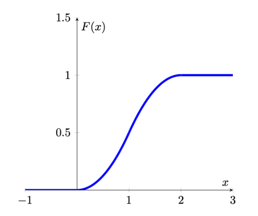

:::


::: {.callout-note icon=false}

#### Exercise

Consider the following pdf for a random variable defined on the interval $[0,1]$:

	\begin{equation*}
		f(x) = -\left(x-\frac{1}{4}\right)^2+\frac{55}{48}
	\end{equation*}

on the interval $[0,1]$ and 0 otherwise.

The pdf and cdf look as follows.

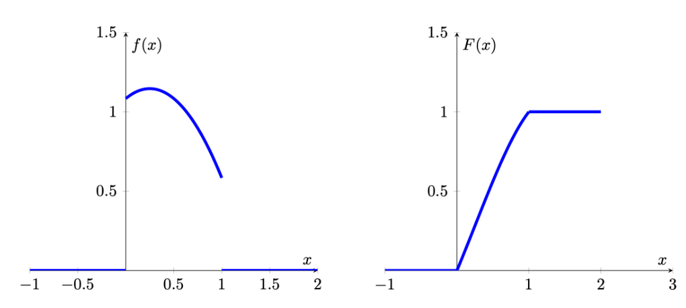
	
What is the cdf $F(x)$?

`r hide("Solution")`

	\begin{equation*}
		F(x) =  \begin{cases}
			0, & x <0\\
			-\frac{1}{3}(x-\frac{1}{4})^3+\frac{55}{48}x-\frac{1}{192}, & 0 < x \leq 1\\
			1, & x>1
		\end{cases} 
	\end{equation*}
	
Hint: You need to find the integral of $f(x)$ from 0 to $x$: $\int_0^{x} f(x) dx$.
	
\begin{eqnarray*}
  f(x)&=&\int_0^{x} \left( -\left(x-\frac{1}{4}\right)^2+\frac{55}{48}\right)dx \\
  &=& \left[-\frac{1}{3}(x-\frac{1}{4})^3+\frac{55}{48}x \right]_0^x\\
  &=& -\frac{1}{3}(x-\frac{1}{4})^3+\frac{55}{48}x - \frac{1}{192}
\end{eqnarray*}

`r unhide()`


:::


::: {.callout-note icon=false}

#### Exercise

Which of the following pdfs (left column) match with which cdfs (right column)?

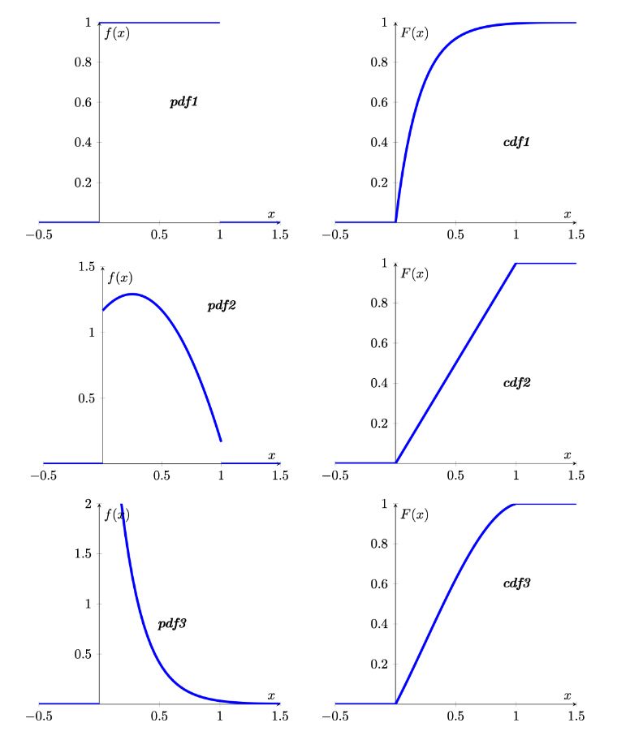

pdf1 matches with `r mcq(c("cdf1", answer = "cdf2", "cdf3"))`

pdf2 matches with `r mcq(c("cdf1", "cdf2", answer = "cdf3"))`

pdf3 matches with `r mcq(c(answer = "cdf1", "cdf2", "cdf3"))`


`r hide("Hint")`
cdf1 and cdf3 look quite similar. How can you tell which pdf belongs to each? pdf2 and pdf3 look actually quite different. The most important difference being that pdf2 is increasing at the left hand side of the domain. This implies that the corresponding cdf will have to have increasing slope at the left hand side of the domain. The cdf to pdf3 however should become flatter right from the start. cdf1 is therefore the cdf that fits to pdf3.
`r unhide()`

:::


## Mean and variance of a continuous random variable

The pdf of a continuous random variable also contains all the information required to calculate the expected value ($E[X]$ or $\mu$) and the variance ($Var[X]$ or $\sigma^2$) of a random variable.

For a continuous random variable, the mean is defined as

\begin{equation*}
	E[X]=\mu=\int_{-\infty}^{\infty} x f(x) dx 
\end{equation*}

The variance of a random variable, which provides a measure of the spread of the possible outcomes around the mean, is also defined as an expected value, namely, the expected value of the squared deviation from the mean:

\begin{eqnarray*}
	\operatorname{var}[X] &=&E\left[(X-\mu)^{2}\right] \\
	&=&\int_{-\infty}^{\infty}(x-\mu)^{2} f(x) dx 
\end{eqnarray*}

Fortunately, in the remainder of this section we will introduce particular types of continuous random variables for which the calculation of the mean and the variance of a distribution does not require the calculation of integrals. These distributions (for example the exponential or normal distribution - yet to be introduced) are described by sets of parameters and if we know these parameters then we can use these (with easy formulae) to calculate the mean and expected values of these distributions. But the above formulae describe how you could derive these by first principles.


## Example Distributions

With the theory out of the way, let’s think of examples for continuous distributions. In fact we are spoiled for choice. Check out this [list](https://en.wikipedia.org/wiki/Category:Continuous_distributions) of different continuous distributions from Wikipedia. We need this large range of different distributions as any random variable will have different properties and we will, in all cases, have to try and find that distribution that has properties that best represent that of the random variable we are interested in. 
As it turns out there are more than 100 continuous distribution, we therefore only discuss the most important ones in this section.


### Uniform distribution

Let us start by introducing the simplest continuous probability distribution -- the uniform distribution. This probability distribution provides a model for continuous random variables that are evenly (but randomly) distributed over a certain interval.

It should be noted though that there is not only one uniform distribution, there is an infinite number of uniform distributions depending on which interval $\left[a,b\right]$ we define the random variable on.  In the context of distributions we call the $a$ and $b$ parameters. For different distributions parameters have different meanings. Here they are the minimum and maximum values. Almost all distributions do have parameters changing them will have different effects.

Often you will see the uniform distribution defined on $\left[0,1\right]$ discussed. That is the standard uniform distribution. Changing the minimum and maximum would not change the main properties of the uniform distribution, but it would change the actual probabilities, e.g. $Pr(0.25<X \leq 0.5)$.

#### pdf of uniform distribution

For any uniform random variable defined over the range from $a$ to $b$, the probability density function is as follows:

\begin{equation*}
  f(x) =
    \begin{cases}
      \frac{1}{b-a}, & a \leq x \leq b\\
      0, & \text{otherwise}
    \end{cases}       
\end{equation*}

The probability density function can be used to find the probability that the random variable falls within a specific range. Graphically, the shape under the density function forms a rectangle, as shown in Figure 10. The rectangle’s area is equal to 1. @fig-uniform shows a density function for a set of values between $a$ and $b$. Each density is a horizontal line segment with constant height $\frac{1}{b-a}$ over the interval from $a$ and $b$.  Outside the interval, $f(X) = 0$. This means that for a uniformly distributed random variable $X$, values below $a$ and values above $b$ are impossible.

As the distance between $a$ and $b$ increases, the density at any particular value within the distribution boundaries decreases. Since the probability density function integrates to 1, the height of the probability density function decreases as the base length increases. 

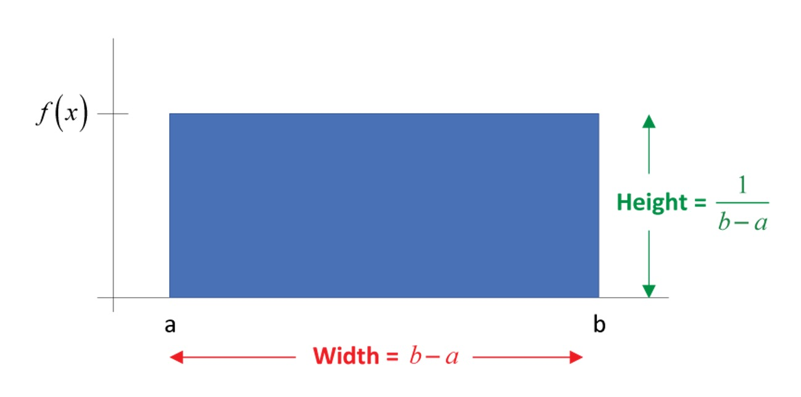#fig-uniform

#### cdf of uniform distribution

From the introduction of cdf above, we know that the probability that $X$ will fall below a point is provided by the area under the density curve and to the left of that point. 
In other words, the cumulative probability distribution function, $P(X\leq x)=\frac{(x-a)}{(b-a)}$, is represented by this area. The cumulative function for values of $X$ between $a$ and $b$  is the area of the rectangle, which, again, is found by multiplying the height, $\frac{1}{b-a}$, times the base, $x-a$. To the left of $a$, the cumulative probabilities must be zero, whereas the probability that $X$ lies “below points beyond $b$” must be 1. As such, the cumulative distribution function can be written as follow:

\begin{equation*}
	F(x) =
	\begin{cases}
		0, & x <a\\
		\frac{x-a}{b-a}, & a \leq x \le b\\
		1, & x>b
	\end{cases}       
\end{equation*}


#### Distributional properties

We said above that in the case of the uniform distribution the parameters $a$ and $b$ determine the min and max possible values of the uniform distribution. The properties of a random variable we usually are interested in are the mean and the variance (and perhaps other higher order moments like skewness). These properties are related to the parameters of the distribution. How they are linked very much depends on the type of distribution we are looking at. For the uniform distribution they are linked as follows.

The uniform distribution has parameters $a$ and $b$. The mean and variance of the uniform distribution are determined by these two parameters as follows:

\begin{eqnarray*}
	E[X]&=&\frac{a+b}{2}\\
	Var[X] &=& \frac{(b-a)^2}{12}
\end{eqnarray*}


::: {.callout-info}

#### Example

**Flight time of an airplane traveling from Chicago to New York**

Suppose the flight time can be any value in the interval from 120 minutes to 140 minutes. 
	
\begin{equation*}
		f(x) =
		\begin{cases}
			\frac{1}{20}, & 120 \leq x \leq 140\\
			0, & \text{otherwise}
		\end{cases}       
\end{equation*}
	
where: $x$ = Flight time of an airplane traveling from Chicago to New York
	
What is the probability of a flight time between 120 and 130 minutes?

$P(120 \leq x \leq 130) =$ `r fitb(0.5)`
	
`r hide("Hint")`	
	Hint: 
	\begin{figure}[H]
		\centering
		\includegraphics[width=0.8\textwidth]{newyorkflight.jpg} 
		\caption{Uniform distribution}
	\end{figure}
	
	$P(120 \leq x \leq 130) = F(130)-F(120)=1/20 \times 130-1/20 \times120 = 1/20 \times (130-120)= 0.5$
`r unhide()`

**An application of the uniform distribution in quality control.**

A quality control inspector for Gonsalves Company, which manufactures aluminum water pipes, believes that the product has varying lengths. Suppose the pipes turned out by one of the production lines of Gonsalves Company can be modeled by a uniform probability distribution over the interval 29.50 - 30.05 ft. 
	
Calculate the mean and variance. (answer to 4dp)

Mean = `r fitb(29.775)`
	
Variance = `r fitb(0.0252)`

`r hide("Solution")`
The mean and variance of $X$, the length of the aluminum water pipe, can be calculated as follows.
	
	\begin{eqnarray*}
		E[X]&=&\frac{a+b}{2}=\frac{29.50+30.05}{2}=29.775 ft\\
		Var[X] &=& \frac{(30.05-29.50)^2}{12}=0.0252
	\end{eqnarray*}

`r unhide()`

This information can be used to create a control chart to determine whether the quality of the water pipes is acceptable.


:::

	
### Applications

We do know many examples of uniform distributions. The outcome of a dice is equally/uniformly distributed from 1 to 6. Whether you get heads or tails on a coin is uniformly distributed between the two possible outcomes. Whether you get, on a roulette wheel any of the outcomes 0 to 36 is uniformly distributed. However, these are all discrete and not continuous distributions.
 
Clearly the continuous uniform distribution is a very special type of distribution. It actually has important uses in statistical theory, but it is not so easy to find real life examples for a continuous-valued uniform distribution. Take the above example for the flight time between Chicago and New York. It is clearly problematic to assume that the flight time could not exceed 140 minutes.

So, a uniform distribution appears inadequate. We shall introduce two more examples of continuous distributions (remember there are 100+): the **exponential** distribution and the **normal** distribution. The latter is so important that we shall have a special lesson on it.


::: {.callout-info}

#### Example

For which of the following does uniform random variable appear most appropriate?

```{r}
#| echo: false

opts_p <- c(
   "The number of cars passing Old Trafford between 8 and 9am on a Monday morning",
   answer = "The day of the year (from 1 to 365) someone has their birthday.",
   "The age of people in a random sample asked outside University Place.","The income of people in a random sample asked outside University Place."
)
```


`r longmcq(opts_p)`

`r hide("Why this answer?")`

The birthday would be the closest, but even that is not uniformly distributed. See [this website](https://www.ons.gov.uk/peoplepopulationandcommunity/birthsdeathsandmarriages/livebirths/articles/howpopularisyourbirthday/2015-12-18) by the Office for National Statistics (ONS).


`r unhide()`

:::


### Additional resources

Khan Academy:

* This is a clip to give an introduction of continuous probability distribution using uniform distribution as an example. Here is the [link to the clip](https://www.youtube.com/watch?v=j8XLYFzTJzE&ab_channel=KhanAcademy).


### Exponential distribution

We now introduce a continuous distribution, the **exponential distribution**, which is useful in describing the time it takes to complete a task.

An exponential random variables can be used to describe

* Time between successive cars passing a junction on a particular road
* Time between vehicle arrivals at a toll booth
* Time required to complete a questionnaire
* In waiting line applications, the exponential distribution is often used for service times.


#### pdf of exponential distribution

Let the continuous random variable, denoted $X$, monitor the elapsed time, measured in minutes, between successive cars passing a junction on a particular road. Traffic along this road in general flows freely, so that vehicles can travel independently of one another, not restricted by the car in front. Occasionally, there are quite long intervals between successive vehicles, while more often there are smaller intervals. To accommodate this, the following pdf for $X$ is defined:


\begin{equation*}
	f(x) =
	\begin{cases}
		\frac{1}{\theta} \exp(-\frac{x}{\theta}), & x>0,\\
		0, & x \leq 0.
	\end{cases}       
\end{equation*}

In this case we have one **parameter**, $\theta$. For this initial discussion we shall set that parameter to $\theta=1$, but you should keep in mind that it could be any other positive value.

The pdf of $f(x)$, with $\theta=1$, looks as follows:

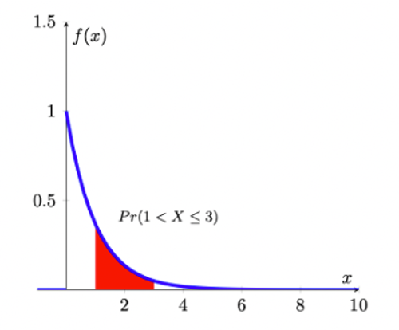

As you can see, the exponential distribution is defined for positive real numbers.


::: {.callout-info}

#### Example

Verify that $\int_{0}^{\infty} \exp(-x)dx=1$ and therefore this distribution meets one of the axioms of probability. This is the exponential distribution with parameter $\theta = 1$.

\begin{eqnarray*}
  \int_0^{\infty} f(x) dx &=& \int_0^{\infty} exp(-x) dx\\
  &=& \left[-exp(-x)\right]_0^{\infty} \\
  &=& -exp(-\infty)-(-exp(-0))= -0-(-1)=1
\end{eqnarray*}


:::


From the picture of the pdf it is clear that

$Pr(a<X \leq a+1)>Pr(a+1<X \leq a+2)$,

for any number $a>0$. By setting $a=1$, say, this implies that an elapsed time of between 1 and 2 minutes has greater probability than an elapsed time of between 2 and 3 minutes; and, in turn, this has a greater probability than an elapsed time of between 3 and 4 minutes, etc; i.e., smaller intervals between successive vehicles will occur more frequently than longer ones. 

Suppose we are interested in the probability that $1<X \leq 3$, i.e., the probability that the elapsed time between successive cars passing is somewhere between 1 and 3 minutes. To find this, we need

\begin{equation*}
	Pr(1<X \leq 3)=	\int_{1}^{3}\exp(-x)dx = [-\exp(-x)]_{1}^{3}=-exp(-3)-(-\exp(-1))=0.318
\end{equation*}


One might interprets this as meaning that about 32\% of the time, successive vehicles will be between 1 and 3 minutes apart.

::: {.callout-info}

#### Example

Imagine yo are an aspiring YouTuber and you want to model your viewers' behaviour. In particular you are interested in how long any viewer sticks with your video clip. (Or how long does it take for a viewer to click away).

It is well known that for most videos the majority of viewers leave a video very quickly.

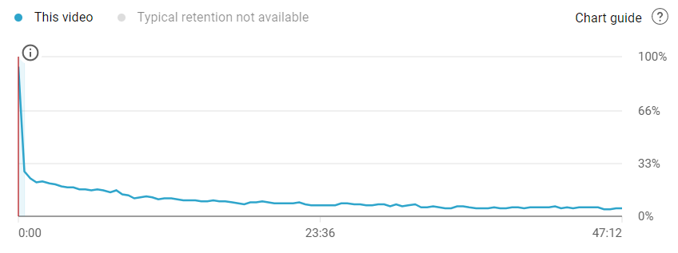

The image above illustrates that the distribution of watching times for a video roughly looks like an exponential distribution. The video is 47min long but many viewers leave early.

:::


The exponential distribution we looked at previously is known as the **unit exponential distribution** (as we chose $\theta=1$). In general, we say that the continuous random variable $X$ has an exponential distribution if it has probability density function given by

\begin{equation*}
	f(x)=\frac{1}{\theta} \exp(-\frac{x}{\theta}), x>0; \theta>0
\end{equation*}

where $\theta$ is called the parameter of the distribution (sometimes this is also called the mean of the distribution for reasons which will become apparent very soon). Note that when $\theta=1$, we get back to the special case of the unit exponential distribution. Notice that the random variable, here, can only assume positive values and confirm that the pdf integrates to a value of 1 (as any pdf should):

\begin{eqnarray*}
	\int_{0}^{\infty}f(x)dx &=& \int_{0}^{\infty}\frac{1}{\theta} \exp(-\frac{x}{\theta})dx \\
	&=& [-\exp(-\frac{x}{\theta})]_{0}^{\infty}\\
	&=& 1
\end{eqnarray*}


#### cdf of exponential distribution

As we discussed earlier, the fundamental relationship between the cdf and pdf as:

\begin{equation*}
	F(x)=Pr(X \leq x) =\int_{-\infty}^{x} f(t)\,dt
\end{equation*}

Then we make use of the pdf of the exponential distribution, and noting that the lower limit of such a random variable always is 0, and derive the cdf as

\begin{eqnarray*}
	F(x)=Pr(X \leq x) &=&\int_{0}^{x}\frac{1}{\theta} \exp(-\frac{t}{\theta})dt=[-\exp(-\frac{t}{\theta})]_{0}^{x}\\
	&=& -\exp(-\frac{x}{\theta})-[-\exp(-\frac{0}{\theta})]\\
	&=& 1-\exp(-\frac{x}{\theta})
\end{eqnarray*}

The cumulative distribution function of the exponential distribution is as follow

\begin{equation*}
	F(x) =
	\begin{cases}
		1-\exp(-\frac{x}{\theta}), & x>0,\\
		0, & x \leq 0.
	\end{cases}       
\end{equation*}

where $\theta>0$.


In this way, we could make use of cdf to calculate the probablity as well. Following above example. Suppose we are interested in the probability that $1<X \leq 3$, i.e., the probability that the elapsed time between successive cars passing is somewhere between 1 and 3 minutes (recall, for this example $\theta = 1$). To find this, we need

\begin{equation*}
	Pr(1<X \leq 3)=	\int_{1}^{3}\exp(-x)dx = [-\exp(-x)]_{1}^{3}=exp(-1)-exp(-3)=0.318
\end{equation*}

Alternatively, we could use the cdf

\begin{equation*}
	Pr(1<X \leq 3)=	F(3)-F(1)=(1-exp(-3))-(1-exp(-1))=exp(-1)-exp(-3)=0.318
\end{equation*}

::: {.callout-tip}
#### EXCEL-Tip

In Excel you can calculate exponential probabilities of the type $Pr(X \leq 3)$ with the following function "=EXPON.DIST(3,Lambda,TRUE)". But note that the parameter "Lambda" is defined as $1/\theta$. So, if your $\theta=4$, you should use "=EXPON.DIST(3,0.25,TRUE)".

:::

::: {.callout-info}

#### Example

**Service time at the library information desk.**

Service times (in minutes) for customers at a library information desk can be modeled by an exponential distribution with a mean service time of 5 minutes ($\theta = 5$). What is the probability that a customer service time will take longer than 10 minutes?

Let x denote the service time in minutes. The mean service time is 5 minutes so $\theta=5$.

Using cdf, the required probability can be calculated as follows:

\begin{equation*}
	Pr(X > 10)=1-Pr(X \leq 10)=1-F(10)=1-(1-exp(-\frac{10}{5}))=exp(-2)=0.1353
\end{equation*}
	
Thus, the probability that a service time exceeds 10 minutes is 0.1353.

:::

#### Distributional properties

The exponential distribution has a parameter $\theta$ (theta), which represents the mean of exponential distribution. The mean and variance of the exponential distribution are determined by $\theta$ as follows:

\begin{eqnarray*}
	E[X]&=&\theta\\
	Var[X] &=& \theta^2
\end{eqnarray*}

In addition, when working with the exponential distribution it is essential to remember rules of calculation with the exponential function. Let $y=exp(x)=e^x$, then

* $y$ is a strictly positive and strictly increasing function of $x$
* $\frac{dy}{dx}=e^x$ and $\frac{d^2y}{dx^2}=e^x$
* $\ln y=x$
* When $x=0$, $y=1$, and $y>1$ when $x>0$, $y<1$ when $x<0$
* By the chain rule of differentiation, if $y=e^{-x}$ then $\frac{dy}{dx}=-e^{-x}$. 


#### Poisson and exponential distribution

The exponential distribution is related to the Poisson distribution.

The Poisson distribution is the distribution of the number of occurrences of an event in a given time interval of length $t$. The single parameter of the Poisson distribution is $\lambda$, the intensity of the process. 

Think of the number $X$ as the average occurrence of the event being counted. For example, say, the average arrival rate of customers at the Brownell Bank is 5 per 100s. And let's say that variable is a Poisson random variable then this variable has a parameter of $\lambda = 5$. 

Suppose that instead of the number of occurrences in a given time period, we are interested in the amount of time until the next customer arrives at the bank (call it random variable $Y$). This is a problem to be solved by the exponential distribution, but it is clearly related to the Poisson distribution. In fact, if $X$ follows a Poisson distribution with $\lambda = 5$ then the $Y$ follows an exponential distribution with parameter $\theta = 1/\lambda = 1/5=0.2$.

Here we will not describe the Poisson distribution in any more detail (as it was discussed in the Section on Discrete random variables), but it is useful to understand that the exponential and Poisson distribution deliver two perspectives of the same problem. 

The following table illustrates this relationship.

| Exponential                                | Poisson                                            |
|--------------------------------------------|----------------------------------------------------|
| time from one accident to another          | number of traffic accidents in an interval of time |
| time between incoming telephone calls      | number of calls in an interval                     |
| length of time someone must wait for a cab | number of cabs in a certain interval               |


::: {.callout-tip}
#### EXCEL-Tip

The function in Excel to calculate either the pdf or cdf of an exponential distribution is \code{=EXPON.DIST(x,lambda,TRUE or FALSE)}. the last option indicates whether you wish to calculate a pdf (\code{FALSE}) or a cdf (\code{TRUE}). The first input (\code{x}) is the $x$ value in $f(x)$ or $F(x)$. Of course you need to tell Excel what the parameter is that fully describes the exponential distribution. However, Excel is asking not for $\theta$ but for $\lambda$ which is defined as $\lambda = 1/\theta$. So if $\theta = 4$, and you wish to calculate $F(7)$ you should enter \code{=EXPON.DIST(7,0.25,TRUE)}

:::

::: {.callout-note icon=false}

#### Exercise

**Time between accidents in typical British industrial plants (measured in weeks).**

An industrial plant in Britain with 2000 employees has a mean time between accidents of 2.5 weeks. What is the probability that the time between accidents ($X$ measured in weeks) is less than 2 weeks?

$Pr(X < 2) =$ `r fitb(0.5507)` (answer to 4dp)

`r hide("Hint")`	

Let x denote the time between accidents. The mean time between accidents is 2.5 weeks so $\theta=2.5$. 

Poisson distribution provides an appropriate description of the number of occurrences per interval, while the exponential distribution provides an appropriate description of the length of the interval between occurrences.

In this case, we are asking the the probability that the time between accidents, which is exponentialy distribution. 

`r hide("Solution")`
The required probability can be calculated as follows:

\begin{equation*}
	Pr(X < 2)=F(2)=1-exp\left(-\frac{2}{2.5}\right)=1-exp(-0.8)=1-0.4493=0.5507
\end{equation*}

Thus, the probability of less than 2 weeks between accidents is about 55\%.

`r unhide()`

`r unhide()`

**What are the expected value and variance of $X$?**

$E(X) =$ `r fitb(2.5)`

$Var(X) =$ `r fitb(6.25)`


**How are the exponential and Poisson distribution related to each other?**

The number of accidents in a week ($Y$, and still for the same example) follows a Poisson distribution. What is the expected value for $Y$?

$E(X) =$ `r fitb(0.4)`

:::


#### Additional resources

* Wikipedia: [Exponential Distribution](https://en.wikipedia.org/wiki/Exponential_distribution), but note that they use slightly different notation in terms of the parameter of the exponential distribution. They use $\lambda$ which is related to our $\theta$ in the following way,  $\lambda=\frac{1}{\theta}$
* Wolfram MathWorld: [Exponential Distribution](https://mathworld.wolfram.com/ExponentialDistribution.html), but note that they use slightly different notation in terms of the parameter of the exponential distribution. They use $\lambda$ which is related to our $\theta$ in the following way, $\lambda=\frac{1}{\theta}$.
* How to use EXCEL to calculate probabilities from an exponential distribution. Here is the link to the [first clip](https://www.youtube.com/watch?v=7SixLei1L_8&ab_channel=RalfBecker).


