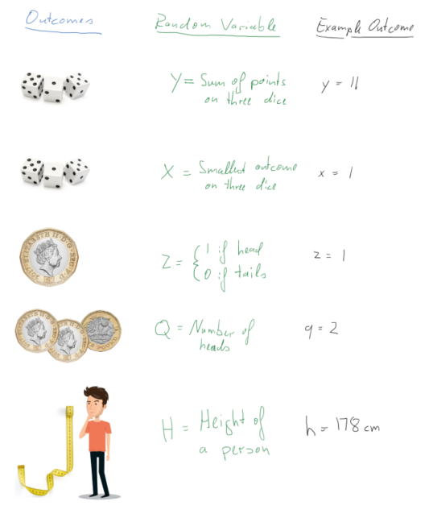
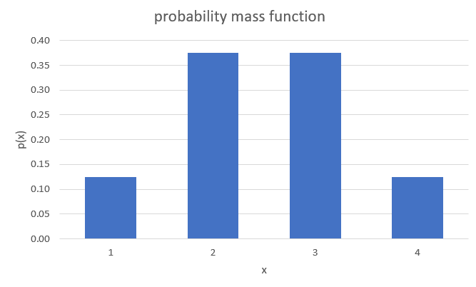
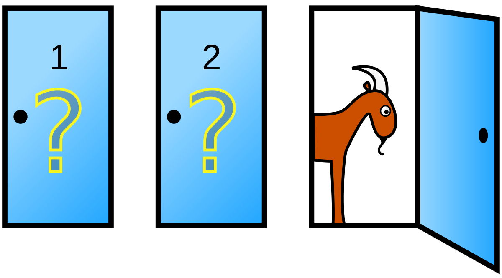
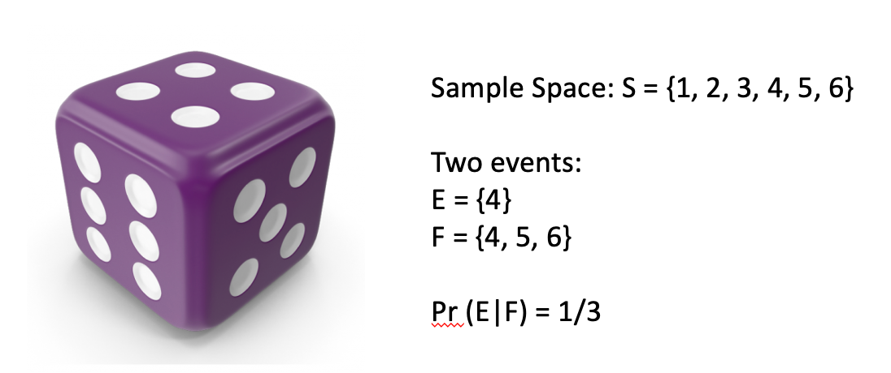
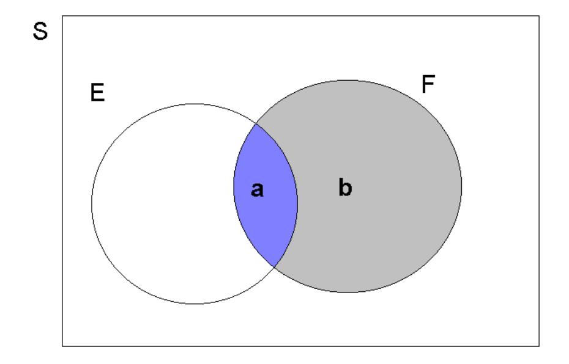
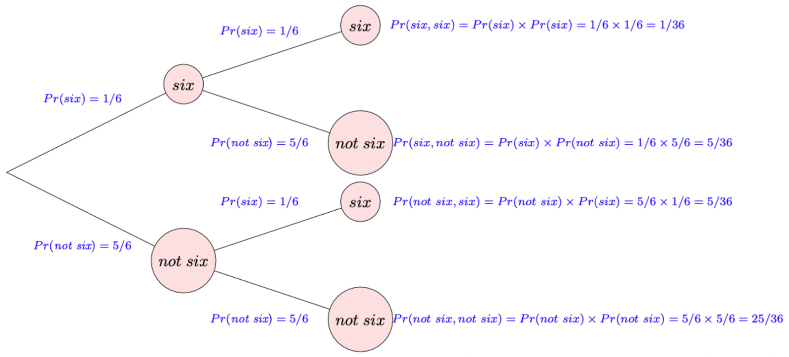
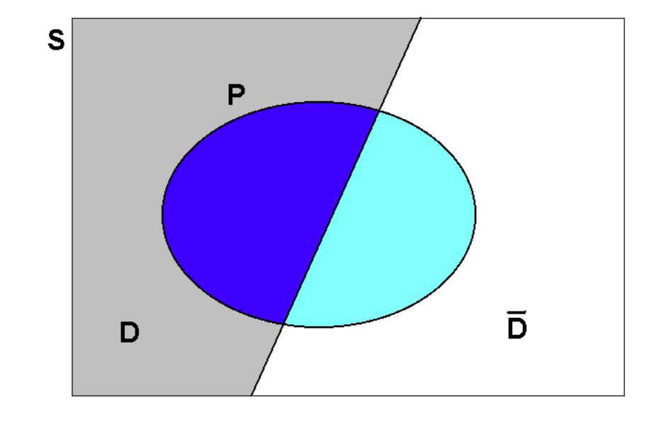
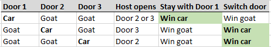

# Continuous Random Variables and Probability Distributions

```{r setup, include = FALSE}
knitr::opts_chunk$set(echo = FALSE)

library(webexercises)
```


## Introduction

Why do economists have to think about continuous random variables and their distributions? (YouTube, 4min) 



In the Discrete random variables Section, we introduced the notion of a random variable and, in particular a discrete random variable. It was then discussed how to use mathematical functions in order to assign probabilities to the various possible numerical values of such a random variable. A probability distribution is a method by which such probabilities can be assigned and in the discrete case this can be achieved via a probability mass function (pmf). We then discussed how a cumulative distribution function (cdf) calculates probabilities for all outcomes smaller than a particular value. Last we discussed several important examples of discrete probability distributions, including the Bernoulli distribution, the Binomial distribution, the Geometric distribution and the Poisson distribution.

The distributions discussed in the previous section are useful for random variables that have a discrete number of possible outcomes. However, some random variables can take outcomes on a continuous scale and statisticians have derived several important continuous distributions to be able to model such random variables. 

We will soon see a more formal definition and example of distributions for continuous random variables. Before we see them, an understandings of continuous random variables is required. This is what we turn to now.

## Continuous random variables

Recall that a random variable is a function applied on a sample space, by which we mean that physical attributes of a sample space are mapped (by this function) into a number. When a \textit{continuous random variable} is applied on a sample space, this implies that the function can be applied to a continuous range of possible numbers (not just discrete numbers as with a discrete random variable). In Figure 1 you can see two random variables. The number of dogs a family owns, which can take values 0, 1, 2, 3 etc. (and hence it is a discrete variable, you cannot own 2.5 dogs). The other would be the weight of a person which can take values on a continuous scale, and not only discrete values.


As a further example, let $X=$ "the contents of a reservoir", where the appropriate sample space under consideration allows for the reservoir being just about empty, just about full or somewhere in between. Here we might usefully define the range of possible values for $X$  as $0 < X < 1$, with 0 signifying ‘empty’ and 1 signifying ‘full’. When talking about the characteristics of continuous variables, we can not list all possible outcomes for $X$; any value in the interval is possible. The sample space is defined by an interval. That interval could be a closed interval, such as $[0,1]$ or an open interval such as $(-\infty,\infty)$ or $[0,\infty)$. Make sure you understand on which interval the random variable is defined.

When we talk about probability distributions for continuous random variable we will also have two representations of the same information. The cumulative distribution function (cdf) which has exactly the same meaning as for discrete random variables, and the probability density function (pdf) which does for continuous random variables what the probability mass function (pmf) does for discrete random variables.

### Probability density function (pdf)

In the discrete random variable section, we showed that the probability distribution of a discrete random variable can be represented by a histogram, being a graphical representation of the probability mass function (pmf). The equivalent representation for a continuous random variable is a probability density function (pdf).

The following figure gives you (on the left hand side) a representation of a typical pmf and on the right hand side a representation of a typical pdf.

#fig-pmftopdf

Given that the sample space of a continuous random variable is not just discrete numbers, how do we distribute probability for such a continuous random variable? The probability must be distributed over the range of possible values for $X$; which, in the reservoir example, is over the unit interval $\left(0,1\right)$. As shown by @fig-pmftopdf, unlike the discrete case where a specific **mass** of probability is dropped on each of the discrete outcomes, for continuous random variables probability is distributed smoothly over the **whole interval** of defined possible outcomes. This is what we call a probability density function (pdf).

In a histogram (representing a pmf) the height of the bars represented the probability of that particular outcome. When summing up all such probabilities you would get the value one. The probability density function (pdf) for a **CONTINUOUS** random variable is a curve, $f(x)$, that shows the probability of a range of values as the area under the curve. 

This is illustrated in @fig-pdf_example. The area underneath the pdf between $a$ and $b$ represents the probability that the random variable $X$ will take a value between  $a$ and $b$, $Pr(a < X \leq b)$. Any such value will be smaller or equal to 1 and the area underneath the entire pdf will be equal to one. 

#fig-pdf_example

Some thought should convince you that for a **continuous** random variable, $X$, it must be the case that $Pr(X=a)=0$ for all real numbers $a$ contained in the range of possible outcomes of $X$. If this were not the case, then the axioms of probability would be violated. However, there should be a positive probability of $X$ being close, or in the neighbourhood, of $a$. (A neighbourhood of $a$ might be $a\pm0.01$, say.) For example, although the probability that the reservoir is **exactly** 90\% full must be **zero** there will be a positive probability that the reservoir has a level between 89.99\% and 90.01\%.

This can be difficult to grasp. When we are talking about the reservoir being exactly 90\% full, given this is a continuous variable, we are really thinking about 90.00000000000\%. It would be impossible to assign a positive probability to every exact outcome. If we did assign a positive probability to an infinite number of possible outcomes then these probabilities would sum to more than one! This emphasizes that we cannot think of probability being assigned at specific outcomes, rather probability is **distributed** over intervals of outcomes.

We therefore must confine our attention to assigning probabilities of the form $Pr(a< X \le b)$ , for some real numbers $a<b$ ; i.e., what is the probability that $X$ takes on values between $a$ and $b$? It is the area under the probability density function between $a$ and $b$ which provides that probability, not the probability density function itself. Thus, by the axioms of probability, if $a$ and $b$ are in the range of possible values for the continuous random variable, $X$, then $Pr(a< X \le b)$ must always return a positive number, lying between 0 and 1, no matter how close $b$ is to $a$ (provided only that $b>a$).

A short video summary of these points is available from here (YouTube, 8min)



::: {.callout-info}

#### Example


Below is a pdf for a random variable which is defined on the interval between 150 and 190 (formally $(150,190]$). This means the random variable cannot take any values outside this interval.


 
1. Match the area

For example, $Pr(150 < X \leq 160) = $ Area 1 

$Pr(160 < X \leq 170) =$ Area `r fitb(2)`

$Pr(180 < X \leq 190) =$ Area `r fitb(4)`

$Pr(160 < X \leq 180) =$ Area `r mcq(c("2","3",answer("2+3")))`

2. TRUE or FALSE

$Pr( X = 170)>0$  `r torf(FALSE)`

$Pr( 150 < X \leq 190)=1$ `r torf(TRUE)`

$Pr( 160 < X \leq 170)=Pr( 160 \leq X \leq 170)$  `r torf(TRUE)`

:::

Let's summarise what we know about continuous random variables:

* $Pr(X=x)=0$.
* The probability that $X$ has a value between $a$ and $b$ is written $Pr(a < X \leq b)$.
* Area below the pdf curve as a measure of probability

Recall that random variables are functions which assign probabilities to outcomes. What sorts of mathematical functions can usefully serve as probability density functions? To develop the answer to this question, we begin by considering another question: what mathematical functions would be appropriate as cumulative distribution functions (cdf)?


### Cumulative distribution function (cdf)

For a **CONTINUOUS** random variable, $X$, defined on $(-\infty,\infty)$, the \textit{cdf} is a **smooth** continuous function defined as 

\begin{equation*}
	F(x)=Pr(X \leq x)
\end{equation*}

for **all** real numbers $x$; e.g., $F(0.75)=Pr(X \leq 0.75)$. 

Therefore, the type of probabilities we are looking at now are a special case of the interval probabilities we discussed previously, as $F(0.75)=Pr(X \leq 0.75)=Pr(-\infty <X \leq x)$. 

But looking at this special case will make our job somewhat easier for starters. The following should be observed:

* such a function is defined for all real numbers $x$, not just those which are possible realisations of the random variable $X$;
* we use $F(.)$, rather than $P(.)$, to distinguish the cases of continuous and discrete random variables, respectively.

Let us now establish the **mathematical properties** of such a function. We can do this quite simply by making $F(.)$ adhere to the axioms of probability. Firstly, since $F(x)$ is to be used to return probabilities, it must be that $0 \leq F(X) \leq 1$, for all $x$.

Secondly, it must be a smooth, increasing function of $x$ (over intervals where possible values of $X$ can occur). To see this, we will have to think carefully. Take two arbitrary numbers $a$ and $b$, satisfying $-\infty<a<b<\infty$. Notice that $a<b$; $b$ can be as close as you like to $a$, but it must always be strictly greater than $a$. Therefore, the axioms of probability imply that $Pr(a<X \leq b)>0$, since the event ‘$a<X \leq b$’ is possible. Now divide the real line interval $X = \left(-\infty,b \right]$ into two mutually exclusive intervals, $X = \left(-\infty,a \right]$ and $X = \left(a,b \right]$. Then we can write the event ‘$X \leq b$’ as

\begin{equation*}
	(X \leq b)=(X \leq a) \cup (a < X \leq b)
\end{equation*}

Assigning probabilities on the left and right, and using the axiom of probability concerning the allocation of probability to mutually exclusive events, yields

\begin{equation*}
	Pr(X \leq b)= Pr(X \leq a) + Pr(a < X \leq b)
\end{equation*}

or

\begin{equation*}
	Pr(X \leq b)-Pr(X \leq a)= Pr(a < X \leq b)
\end{equation*}


Now, since $F(b)=Pr(X \leq b)$ and $F(a)=Pr(X \leq a)$, we can write

\begin{equation*}
	F(b)-F(a)=Pr(a < X \leq b)>0
\end{equation*}

Thus $F(b)-F(a)>0$, for all real numbers $a$ and $b$ such that $b>a$, no matter how close. You should note that we have now reconstructed the interval probability which we discussed in the previous Section, $Pr(a<X \leq b)$, as a function of what we now call a cumulative density function. We also previously discussed that $Pr(a<X \leq b)>0$ on the range on which $X$ is defined (i.e. between $-\infty$ and $\infty$ in the generic example) and therefore we know that $F(x)$ must be an increasing function. A little more delicate mathematics shows that it must be a **smoothly** increasing function 

`r hide("Why smoothly")`

This is due to the fact that $Pr(X=b)=0$, which implies that we are not getting any discrete changes from $F(b-\epsilon)$ to $F(b)$. 

`r unhide()`


All in all then, $F(x)$ appears to be smoothly increasing from 0 to 1 over the range of possible values for $X$. 

More generally, we now formally state the properties of a **cdf**.


### Properties of the cdf

A cumulative distribution function is a mathematical function, $F(x)$, satisfying the following properties:

* $0\leq F(x)\leq1$.	
* If $b>a$ then $F(b)\geq F(a)$; i.e., $F$ is increasing. In addition, over all intervals of possible outcomes for a continuous random variable, $F(x)$ is smoothly increasing; i.e., it has no sudden jumps.
* $F(x)\to 0$ as $x \to -\infty$; $F(x) \to 1$ as $x \to \infty$; i.e., $F(x)$ decreases to 0 as $x$ falls, and increases to 1 as $x$ rises.
\end{enumerate}

For complete generality, $F(x)$ must be defined over the whole real line even though in any given application the random variable under consideration may only be defined on an interval of that real line. Such an example would be if we were to look at the water level in a reservoir which is defined on the interval 0 (empty) to 1 (100\% full).


Any function satisfying the above may be considered suitable for modelling cumulative probabilities, $Pr(X \leq x)$, for a continuous random variable. Careful consideration of these properties reveals that $F(x)$ can be \textit{flat} (i.e., non-increasing) over some regions. This is perfectly acceptable since the regions over which $F(x)$ is flat correspond to those where values of $X$ cannot occur and therefore, zero probability is distributed over such regions. In the reservoir example, $F(x)=0$, for all $x\leq 0$, and $F(x)=1$, for all $x\geq1$; it is therefore flat over these two regions of the real line. This particular example also demonstrates that the last of the three properties can be viewed as completely general; for example, the fact that $F(x)=0$, in this case, for all $x \leq 0$ can be thought of as simply a special case of the requirement that $F(x)\to 0$ as $x \to -\infty$.

Some possible examples of \textit{cdfs}, in other situations, are depicted in the following Figure 5.


\begin{figure}[H]
    \centering
	\includegraphics[width=1.0\textwidth]{ProbDistCont_density2.jpeg} 
	\caption{Cumulative distribution function}
\end{figure}

\begin{itemize}
	\item The first of these is strictly increasing over the whole real line, indicating possible values of $X$ can fall anywhere.
	\item The second is increasing, but only strictly over the interval $x>0$; this indicates that the range of possible values for the random variable is $x>0$ with the implication that $Pr(X\leq 0)=0$. 
	\item The third is only strictly increasing over the interval $0<x<2$, which gives the range of possible values for $X$ in this case; here $Pr(X\leq0)=0$, whilst $Pr(X\geq2)=0$.
\end{itemize}

 
In practice we will often be interested in interval probabilities of the type $Pr(a<X\leq b)$. Therefore, let us end this discussion by re-iterating how probabilities and the \textit{cdf} are related to each other:

\begin{itemize}
	\item $Pr(a<X \leq b)=F(b)-F(a)$, for any real numbers $a$ and $b$;
	\item $Pr(X>a)=1-F(a)$, since $F(a)=Pr(X \leq a)$ and $Pr(X \leq a)+Pr(X>a)=1$, for any real number $a$;
	\item $Pr(X<a)=Pr(X \leq a)$, since $Pr(X=a)=0$.	
\end{itemize}

After the following exercise we will investigate the mathematical relationship between \textit{pdf} and \textit{cdf}.


# DELETE


## Introduction

This is a brief video introduction to discrete random variables (YouTube, 4min) 



Previously we have learned how to calculate with probabilities in order to make sensible statements concerning uncertain events, such as the probability of rolling a fair dice and getting three "6" in a row. This has assumed that we already know the probabilities with which certain events occur, here that the probability of rolling a "6" in any particular roll of the dice is $1/6$. Then we learned how to calculate probabilities for related events (unions, intersections and complements). The question we shall begin to address in the this section (discrete random variables) and the next (continuous random variables) is how we might construct **models** which assign probabilities in the first instance.

When we build models we will usually deal with numbers which describe outcomes even if the original outcomes (of a random process) may not immediately be a number. A random variable assigns a number to the outcome of an experiment. These outcomes depend on the random outcome of a experiment. In the following picture you can see five examples of such random variables (labelled by upper case letters) and a particular example outcome (labelled by lower case letters).



We will soon see a more formal definition of what a random variable is, but if you keep these examples in the back of your mind that formal definition will make more sense.

The outcome of the original experiment (rolling dice, flipping coins, choosing a person) is assumed to be random, which implies that the experiment can take different outcomes. This is where the "random" in "random variable" comes from. Understanding what the set of experiment outcomes, and therefore outcomes of the random variable can be is the first step in understanding random variables and their characteristics. In particular, understanding the possible outcomes will allow us to differentiate between discrete random variables (such as the coin flip examples, or indeed the dice examples, where you have a finite number of outcomes) and continuous random variables (such as the height of the person, assuming that you can measure the height to arbitrary precision).

The second element in fully characterising a random variable is to understand with which probabilities certain outcomes can occur. This is done by the probability distributions of a random variable. To fix ideas, and before we will become more formal, let's actually  state one such probability distribution, the probability distribution for the random variable $Z$:

\begin{equation*}
	p(z)=
	\begin{cases}
		p(Z=0) = 0.5\\
		p(Z=1) = 0.5
	\end{cases}
\end{equation*}

Recall that $Z=0$ represents the experimental outcome of "tails" and $Z=1$ of "heads". So what this means is that the probability of both a heads and a tail is 50\% as it should be for a fair coin. In other words, the probability distribution tells us how likely the different experimental outcomes are.

In this section we will talk about random variables and probability distributions in general and a set of discrete random variables and their distributions in particular.


## Random Variable

Hopefully you have already understood that a random variable assigns numerical values to experimental outcomes. For our purposes, we can think of a **random variable** as having **two** components:

* a label/description which defines the variable of interest
* the definition of a procedure which assigns numerical values to events on the appropriate sample space.

Note that:

* often, but not always, how the numerical values are assigned will be implicitly defined by the chosen label
* A random variable is **neither** RANDOM nor a VARIABLE! Rather, it is device which describes how to assign numbers to physical events of interest or formally "a random variable is a real valued function defined on a sample space".
* A random variable is indicated by an upper case letter ($X$, $Y$, $Z$, $T$, etc). The strict mathematical implication is that since $X$ is a function, when it is applied on a sample space (of physical attributes) it yields a number

Just in case you didn't realise yet, the above is somewhat abstract. Don't forget that this, for the example of random variable $Z$, merely implies that there is a function which maps "heads" to the value 1 and "tails" to the value 0. You may remember that functions are mappings which map from one space (the sample space) to the real line. Different experimental outcomes can have the same value for the random variable (for example, both a TTHT and a HTTT coin toss sequence both have an outcome of 1 as they both have one heads outcome).

### Examples of random variables

Let us list a few more examples of random variables

* Let $X=$ "the number of HEADs obtained when a fair coin is flipped 3 times". This definition of $X$ implies a function on the physical sample space which generates particular numerical values. Thus $X$ is a random variable and the values it can assume are:  
\begin{eqnarray*}
		X(H,H,H)&=&3;~X(T,H,H)=2;~(H,T,H)=2;~X(H,H,T)=2;\\
		X(H,T,T)&=&1;~X(T,H,T)=1;~X(T,T,H)=1;~X(T,T,T)=0.
\end{eqnarray*}  
This is an example (as mentioned above) where two different outcomes in the sample space (e.g. ${T,H,H}$ and ${H,T,H}$) are mapped into the same number, here 2.
* Let the random variable $Y$ indicate whether or not a household has suffered some sort of property crime in the last 12 months, with $Y(yes)=1$ and $Y(no)=0$. Note that we could have chosen the numerical values of 1 or 2 for "yes" and "no" respectively. However, the mathematical treatment is simplified if we adopt the **binary** responses of 1 and 0.
* Let the random variable $T$ describe the length of time, measured in weeks, that an unemployed job-seeker waits before securing permanent employment. So here, for example,  
\begin{equation*}
		T(15~\textit{weeks unemployed})=15, \quad T(31~\textit{weeks unemployed}$)=31,~etc.
\end{equation*}
	
Once an experiment is carried out, and the random variable ($X$) is applied to the outcome, a number is observed, or realised; i.e., the value of the function at that point in the sample space. This is called a realisation, or possible outcome, of $X$ and is denoted by a lower case letter, $x$.

In the above examples, the possible realisations of the random variable $X$ (i.e., possible values of the function defined by $X$) are $x=0,1,2$ or $3$. For $Y$, the possible realisations are $y=0,1$; and for $T$ they are $t=1,2,3,...$.

The examples of $X$, $Y$ and $T$ given here all are applications of **discrete random variables** (the outcomes, or values of the function, are all integers). Technically speaking, the functions $X$, $Y$ and $T$ are not continuous.

### Additional Resources

Khan Academy:

* A short introduction to the [nature of random variables](https://www.khanacademy.org/math/probability/random-variables-topic/random_variables_prob_dist/v/random-variables)


## Discrete random variables

In general, a **discrete random variable** can only assume discrete realisations which are easily listed prior to experimentation. Having defined a discrete random variable, probabilities are assigned by means of a **probability distribution**. A probability distribution is essentially a function which maps from $x$ (the real line) to the interval $\left[ 0,1\right]$; thereby generating probabilities.

Probability distributions come in two forms (each carrying the same information), the probability mass function (pmf) and the cumulative distribution function (cdf). When we talk about probability distributions for continuous random variable we will also have two representations of the same information, but instead of a pmf we will then talk about a probability density function (pdf). 

#### Additional Resources

Khan Academy:

* Differentiate between [discrete and continuous random variables](https://www.khanacademy.org/math/probability/random-variables-topic/random_variables_prob_dist/v/discrete-and-continuous-random-variables). The difference can indeed be subtle!


### Probability mass function (pmf)

The probability mass function (pmf) is defined for a **DISCRETE** random variable, $X$, only and is the function:

\begin{equation*}
	p(x)=Pr(X=x),\quad \text{for all }x.
\end{equation*}

Note that:

* We use $p(x)$ here to emphasize that probabilities are being generated for the outcome $x$; e.g., $p(1)=Pr(X=1)$.
* Note that $p(r)=0$, if the number $r$ is NOT a possible realisation of $X$. Thus, for the property crime random variable $Y$, with $p(y)=Pr(Y=y)$, it must be that $p(0.5)=0$ since a realisation of $0.5$ is impossible for the random variable.
* If $p(x)$ is to be useful, then it follows from the axioms of probability that,  

\begin{equation*}
	p(x)\geq 0\quad and\quad \sum_{x}p(x)=1
\end{equation*}  

where the sum is taken over all possible values that $X$ can assume.
* It follows from the previous point that $0 \leq p(x) \leq 1$. 

The last two points are only correct for discrete random variables and will have to be modified for continuous random variables.

For example, when $X=$ "the number of HEADs obtained when a fair coin is flipped $3$ times", we can write that $\sum_{j=0}^{3}p(j)=p(0)+p(1)+p(2)+p(3)=1$ since the number of heads possible is either $0,1,2,$ or $3$. Be clear about the notation that is being used here. $p(j)$ is the probability that $j$ heads are obtained in $3$ flips; i.e., $p(j)=Pr\left( X=j\right)$ , for values of $j$ equal to $0,1,2,3$. This type of random variable is what will soon be introduced as a Bernoulli random variable. But to complete the example here, we can already discuss the pmf here.

The only way in which we can get $0$ HEADs is if the coin flips to TAIL all three times. The probability of this is $p(0)=0.5^3=1/8$. Don't worry if that is not super obvious, it will soon be explained. The only way in which we can get three HEADSs if it flips to HEAD three times in a row, the probability of which is $p(3) = 0.5^3=1/8$. We are left with the case of 1 or two HEADS. The probability for both of these is $p(1)=p(2)=3\cdot0.5^3 = 3/8$. This delivers the following **pmf**:

\begin{equation*}
	p(x)=
	\begin{cases}
		p(0)=p(X=0) = 1/8\\
		p(1)=p(X=1) = 3/8\\
		p(2)=p(X=2) = 3/8\\
		p(3)=p(X=3) = 1/8
	\end{cases}
\end{equation*}

Please confirm that this pmf meets all the four conditions above. For discrete probability distributions the interpretation of these is straightforward. $p(2)=3/8$ indicates that there is a 37.5\% probability that three fair coin flips end up with two HEADs. When we move to continuous random variables we loose this straightforward interpretation.

The pmf tells us how probabilities are distributed across all possible outcomes of a discrete random variable $X$; it therefore generates a **probability distribution**. A probability distribution tells you how the probabilities distribute across all possible outcomes. We will encounter many examples of this soon.

We will often encounter graphical representations of the pmf. The above example can be graphically represented in a way which very much resembles a histogram, but note that these are not empirical frequencies, but the probabilities coming from a known probability distribution of a random variable. 



You can see in that image that there are four distinct values of $X$ for which there is a positive probability mass. You being able to see the distinct possible outcomes is a feature of a discrete random variable. Especially when the random variable has many possible outcomes a graphical representation of the pmf is very useful.

::: {.callout-note icon=false}

#### Exercise

Consider the experiment of tossing a fair coin four times. The random variable $Q$ counts the number of heads. 
	
What are possible outcomes of this experiment?

`r mcq(c("1,2,3,4",answer = "0,1,2,3,4", "0,1,2,3", "1,4", "HHHH"))`

You know the following probabilities: $p(0) = p(4) = 1/16$ and $p(1) = p(3) = 4/16$.
	
What is $p(2)$? $p(2)=$ `r fitb(0.375)` (decimal and 4dp)

`r hide("Hint")`
The sum of the probabilities for all possible outcomes has to be 1. The probabilities for the four outcomes 0,1, 3 and 4 sum to $10/16$. 
`r unhide()`

What is  $p(6)$? $p(6)=$ `r fitb(0)`

`r hide("Hint")`
The outcome $Q=6$ is not possible and therefore has a zero probability. 
`r unhide()`

:::


### Cumulative distribution function (cdf)

In the **DISCRETE** case the cumulative distribution function (**cdf**) is a function which cumulates (adds up) values of $p(x)$, the **pmf**. In general, it is defined as the function:

\begin{equation*}
	P(x)=P (X\leq x);
\end{equation*}

e.g., $P(1)=P(X\leq 1)$. Note the use of an upper case letter, $P\left(.\right)$, for the cdf, as opposed to the lower case letter, $p\left( .\right)$, for the pmf. In the context of cdfs it is conventional to use $P$ and nor $Pr$ and therefore we shall from now on use $P$.

Suppose the discrete random variable, $X$, can take on possible values $x=a_{1},a_{2},a_{3},...,$ etc, where the $a_{j}$ are an increasing sequence of numbers $\left( a_{1}<a_{2}<\ldots \right)$. Then, for example, we can construct the following (cumulative) probability:

\begin{equation*}
	P \left( X\leq a_{4}\right)
	=P(a_{4})=p(a_{1})+p(a_{2})+p(a_{3})+p(a_{4})=\sum_{j=1}^{4}p(a_{j}),
\end{equation*}

i.e., we take all the probabilities assigned to possible values of $X$, up to the value under consideration (in this case $a_{4}$ ), and then add them up. It follows from the axioms of probability that, if we sum over all possible outcomes, that $\sum_{j}p(a_{j})=1$, all the probabilities assigned must sum to unity, as noted before. Therefore,

\begin{eqnarray*}
	P \left( X\geq a_{4}\right) &=&p\left( a_{4}\right) +p\left( a_{5}\right)+p\left( a_{6}\right) +\ldots \\
	&=&\left\{ \sum_{j}p(a_{j})\right\} -\left\{ p\left( a_{1}\right) +p\left(a_{2}\right) +p\left( a_{3}\right) \right\} \\
	&=&1-P \left( X\leq a_{3}\right) ,
\end{eqnarray*}

and, similarly,

\begin{equation*}
	P \left( X>a_{4}\right) =1-P \left( X\leq a_{4}\right)
\end{equation*}

which is always useful to remember.


::: {.callout-info}

#### Example

Let us return to the example pmf we used before:
	
\begin{equation*}
	p(x)=
	\begin{cases}
		p(0)=p(X=0) = 1/8\\
		p(1)=p(X=1) = 3/8\\
		p(2)=p(X=2) = 3/8\\
		p(3)=p(X=3) = 1/8
	\end{cases}
\end{equation*}
	
What is the cdf of $X$? (to 4 d.p.)
	
\begin{equation*}
	P(x)=
	\begin{cases}
		P(0)=P(X\leq0) = 1/8=0.125\\
		P(1)=P(X\leq1) = 4/8=0.5\\
		P(2)=P(X\leq2) = 7/8=0.875\\
		P(3)=P(X\leq3) = 8/8=1
	\end{cases}
\end{equation*}
	
For instance $P(1)=P(X\leq1)=p(0)+p(1)=1/8+3/8=4/8=0.5$.
	
What is $P(X\geq2)$? $P(X\geq2)= 1 - P(1)=1-0.5=0.5$

Here we use the earlier relationship that $P(X\geq2)= 1- P(X < 2)= 1 - P(1)=1-0.5=0.5$.

:::

Cumulative distribution functions (cdf) are also often represented graphically. The video below walks you through the process of producing a graphical representation of a cdf for a discrete random variable (YouTube, 6:55min).




## Example Distributions

There is an infinite amount of possible discrete probability distributions. As it turns out a large number of interesting experiments resulting in discrete random variables turn out to follow a small number of types of distributions. We therefore introduce the most important ones of these here.

All of these distributions depend on parameters (in this case either one or two) and the distributional characteristics, as described by their expected values and variances, depend on these parameters. In the following discussion we will make that link obvious. 

### A Bernoulli random variable

Let us start by describing a number of examples of random variables which can be described as a Bernoulli random variable. 

* Whether or not a household has suffered some sort of property crime in the last 12 months, with $Y(yes)=1$ and $Y(no)=0$
* Whether or not a person thinks that Brexit has improved their daily life, with $Y(yes)=1$ and $Y(no)=0$
* Whether you pass the Advanced Statistics exam, with $Y(yes)=1$ and $Y(no)=0$
* Whether a person is Covid vaccinated, with $Y(yes)=1$ and $Y(no)=0$

A **Bernoulli** random variable is a particularly simple (but very useful) discrete random variable. All the above are examples of Bernoulli random variables. A Bernoulli random variable can only assume one of two possible values: $y=0$ or $y=1$; with probabilities $\left( 1-\pi \right) $ and $\pi$, respectively. Often, the value $1$ might be referred to as a success and the value $0$ a failure. Here, $\pi$ is any number satisfying $0\leq\pi \leq1$, since it is a probability, and it is called a **parameter** for this random variable. All distributions we will be talking about have at least one parameter. If you know the type of a distribution and the values for its parameters then you know everything there is to know about that random variable. For instance, as of Sept 2022 around 93\% of the UK population aged 12 or over has been covid vaccinated at least once ([Source: UK Government](https://coronavirus.data.gov.uk/details/vaccinations)). This implies that here $\pi=0.93$. 

The value of this parameter will differ for every random variable. 


::: {.callout-note icon=false}

#### Exercise

Consider the random variable indicating whether or not a person thinks that Brexit has improved their daily life, with $Y(yes)=1$ and $Y(no)=0$. What do you think is, approximately, the value of the parameter $\pi$ thinking about the UK population?
	
What is $\pi$? Don't just guess but attempt to find a source of information that supports your answer.
	
$\pi=$ `r fitb(0.21)`

`r hide("Hint")`
There are surely different ways to ask this question and hence the above answer is not an authorative one. One possible source is this: [Ipsos Mori](https://www.ipsos.com/en-uk/uk-opinion-polls#brexitimpact), but you may have found different ones, such as this [Statista poll](https://www.statista.com/statistics/987347/brexit-opinion-poll/).
`r unhide()`
  
:::

Clearly, different choices for $\pi$ generate different probabilities for the outcomes of interest; it is an example of a very simple statistical model and the (pmf) can be written compactly as:

\begin{equation*}
	p(y)=\pi ^{y}\left( 1-\pi \right) ^{1-y},\quad 0\leq \pi \leq 1,\quad y=0,1.
\end{equation*}

For the vaccination example this implies (recall $Y=1$ indicating a vaccinated person and $\pi = 0.93$):

\begin{equation*}
	p(x)=
	\begin{cases}
		p(0)= 0.93 ^{0}\left( 1-0.93 \right) ^{1-0} = 0.07\\
		p(1)= 0.93 ^{1}\left( 1-0.93 \right) ^{1-1} = 0.93
	\end{cases}
\end{equation*}

For a variable with two discrete outcomes only, as this one, the cdf is not very interesting. But we shall, in any case, state it

\begin{equation*}
	P(y)=
	\begin{cases}
		P(0)= P(y \leq 0)= (1-\pi)\\
		P(1)= 	P(y \leq 1)= 1\\
	\end{cases}
\end{equation*}

or in the vaccination example

\begin{equation*}
	P(x)=
	\begin{cases}
		P(0)= P(y \leq 0)= 0.07\\
		P(1)= 	P(y \leq 1)= 1\\
	\end{cases}
\end{equation*}

### Distributional properties

This is really the simplest of discrete distributions, one with only two possible outcomes, 0 and 1. In some sense you know everything about this distribution if you know the probability of success $\pi$. Keeping in mind other distributions (with many more possible outcomes) we will make it a habit to describe distributions by their moments. In particular we will look at a distributions first (expected value/mean) and the second moment (variance). The third moment is the skewness. If you can find out why moments of the distribution are called moments, please let me know.

We calculate the expected value of a discrete random variable as follows (summing over all possible outcomes - here two)

\begin{eqnarray*}
	E[Y] &=& \sum_{y=0}^1 y~p(y)\\
			&=& 0 \cdot p(0) + 1 \cdot p(1) = 0 \cdot (1-\pi) + 1 \cdot \pi = \pi
\end{eqnarray*}

So the expected value is $\pi$. On average we would expect an outcome of $\pi$, the probability of success. Of course, unless $\pi$ is equal to 0 or 1 there is no possible outcome of $\pi$.

The variance of this discrete random variable is calculated as follows:

\begin{eqnarray*}
	Var[Y] = E[Y^2] - E[Y]^2 &=& \sum_{y=0}^1 y^2~p(y) - E[Y]^2\\
		&=& (0^2 \cdot p(0) + 1^2 \cdot p(1)) - \pi^2= (0 \cdot (1-\pi) + 1 \cdot \pi) - \pi^2\\
		 &=& \pi - \pi^2 = \pi(1-\pi)
\end{eqnarray*}

::: {.callout-note icon=false}

#### Exercise

The variance of a Bernoulli random variable increases with $\pi$ TRUE or FALSE?	`r torf(FALSE)`

`r hide("Hint")`
The variance is largest for $\pi=0.5$. So the statement is false as the variance decreases as, for instance, $\pi$ increases from 0.5 to 0.6.  This represents the situation in which there is most uncertainty about the outcome. As the probability of success gets closer to 0 or 1 there is more certainty about the outcome and hence the variance is smaller.
`r unhide()`
    
:::


### The Binomial random variable

Now we introduce a different, but related, random variable, a binomial random variable. The example you you will find in most textbooks is the following. Define the random variable $X$ as the number of HEADS when you toss a fair coin three times (or any number of times, there is nothing special about the number three). As we already discussed earlier, the possible outcomes for this random variable are 0, 1, 2 or 3. Note that any individual coin toss is a Bernoulli random variable with $\pi = 0.5$ (if the coin is a fair coin).

Let's list a few more examples of binomial random variables:

* The number of households (out of 1000 randomly selected) who have suffered some sort of property crime in the last 12 months.
* The number of respondents who think that Brexit has improved their daily life, out of 1010 randomly selected people.
* The number of students out of 900 who pass the Advanced Statistics exam.
* The number of people (out of 300 randomly selected) who are Covid vaccinated, with $Y(yes)=1$ and $Y(no)=0$

You can see that these all relate to repeated Bernoulli random variables (see the examples of Bernoulli random variables we used earlier). 

Let us return to the coin toss example ($X=$ the number of HEADs obtained from three flips of a fair coin) for which we actually stated the probability distribution earlier. Now we discuss how these probabilities were calculated. The four possible values of $X$ are 0, 1, 2 or 3. Furthermore, assuming independence between the coin tosses, we can write that

\begin{itemize}
	\item $p(0)=P (X=0)=P (T,T,T)=P \left( \text{T}\right) \times P\left( \text{T}\right) \times P \left( \text{T}\right) =(1/2)^{3}=1/8$
	
	\item $p(1)=P (X=1)=P (H,T,T)+P (T,H,T)+P (T,T,H)$\\
	$=(1/2)^{3}+(1/2)^{3}+(1/2)^{3}=1/8+1/8+1/8=3/8$
	
	\item $p(2)=P (X=2)=P (H,H,T)+P (H,T,H)+P (T,H,H)$\\
	$=(1/2)^{3}+(1/2)^{3}+(1/2)^{3}=1/8+1/8+1/8=3/8$
	
	\item $p(3)=P (X=3)=P (H,H,H)=(1/2)^{3}=1/8$
\end{itemize}

With this information we can also state the cdf:

\begin{equation*}
	P(x)=
	\begin{cases}
		P(0)= p(0)= 1/8 = 0.125\\
		P(1)= p(0) + p(1)= 1/8 + 3/8 = 0.5\\
		P(2)= p(0) + p(1) + p(2)= 1/8 + 3/8 + 3/8 = 7/8 = 0.875\\
		P(3)= p(0) + p(1) + p(2) + p(3) = 1
	\end{cases}
\end{equation*}

This video goes through the above workings (\href{https://www.youtube.com/watch?v=bvfwuGbARmw}{YouTube, 14min}).


\noindent\rule{16cm}{0.4pt}
\begin{example}
What is $P(X<2)$?\\
$P(X<2)=p(0) + p(1) = 0.5$

What is $P(X>0)$?\\
$P(X>0)=1-P(X\leq 0) = 1- 0.125 = 0.875$

What is $P(X>2)$?\\
$P(X>2)=1-P(X\leq 2) = 1- 0.875 = 0.125$

What is $P(2.5)$?\\
$P(2.5)=P(X \leq 2.5)=P(X\leq 2) =  0.125$

\end{example}

\noindent\rule{16cm}{0.4pt}


## DELETE

In this short video I argue that understanding conditional probabilities are crucial to social scientists and not only to understand the Monty Hall problem (YouTube, 3min).



You are on a game show, being asked to choose between three doors. Behind one door is a car and behind the others are goats. You choose a door, say Door 1. The host, Monty Hall, picks one of the other doors, which he knows has a goat behind it, and opens it, showing you the goat. (You know, by the rules of the game, that Monty will always reveal a goat.) Monty then asks whether you would like to switch your choice of door to the other remaining door. 

**The big question**: assuming you prefer having a car more than having a goat, do you choose to switch or not to switch?




The solution is that switching will let you win **twice** as often as sticking with the original choice, a result that seems counter-intuitive to many. In the following, we will introduce conditional probability and Bayes' Theorem, which give us a way to explain this result.

## Conditional Probability

An important consideration in the development of probability is that of **conditional probability**. This refers to the calculation of updating probabilities in the light of revealed information. For example, insurance companies nearly always set their home contents insurance premiums on the basis of the postcode in which the home is located. That is to say, insurance companies believe the risk depends upon the location; i.e., the probability of property crime is assessed conditional upon the location of the property. (A similar calculation is made to set car insurance premiums.) As a result, the premiums for two identical households located in different parts of the country can differ substantially.

* In general, the probability of an event, $E$, occurring **given** that an event, $F$, has occurred is called the **conditional probability** of $E$ given $F$ and is denoted $\Pr (E|F)$.

Let's consider all young people of the same age, say 23 years old. That will be approximately your age after graduating from University. Apart from the intellectual challenge and pleasure you get from studying, many of you would be studying in order to improve your job market prospect.  Let us define the event $F=$ "a person has a University degree". Then we could think of different types of events to describe job market success. Say that you have a job, or that you have annual earnings above £30,000 or that you have a job that excites you. For now, let's stick with the event definition $E=$ "a person is in employment". You as a student are certainly hoping that $\Pr(E|F)>\Pr (E|\bar{F})$.

As a preliminary to the main development, consider the simple experiment of rolling a fair die and observing the number of dots on the upturned face. Then, the sample space is $S=\left\{ 1,2,3,4,5,6\right\}$ and define events, $E=\left\{4\right\}$ and $F=\left\{ 4,5,6\right\}$; we are interested in $\Pr \left(E|F\right)$. To work this out we take $F$ as known. Given this knowledge the sample space becomes restricted to simply $\left\{ 4,5,6\right\}$ and, given no other information, each of these three outcome remains equally likely. So the required event, $4$, is just one of three equally likely outcomes. It therefore seems reasonable that $\Pr (E|F)=\frac{1}{3}$.



We shall now develop this idea more fully, using Venn Diagrams with the implied notion of area giving probability. Consider an abstract sample space, denoted by $S$, with events $E\subset S$ and $F\subset S$. This is illustrated in the following Figure. Eventually we will want to construct the conditional probability, $\Pr \left( E|F\right)$. Sticking with the above example that could be the probability that "you are employed at the age of 23", given that "you have a university degree". Two important areas used in the construction of this conditional probability are highlighted as $\mathbf{a}$ and $\mathbf{b}$:



In general, it is useful to think of $\Pr (E)$ as $\frac{area\left( E\right)}{area\left( S\right)}$; and similarly for $\Pr (F)$. The $\Pr (E\cap F)$ could equally be thought of as $\frac{area\left( a\right)}{area\left( S\right) }$. With this in mind, consider what happens if we are now told that $F$ has occurred. Incorporating this information implies that the effective sample space becomes restricted to $S^{*}=F$, since $F$ now defines what can happen. This now covers the sample area $a+b$. On this new, restricted, sample space an outcome in $E$ can only be observed if that outcome also belongs to $F$, the restricted sample space $S^*$. And this only occurs in area $a$ which corresponds to the event $E\cap F$. Thus the event of interest now is $E^{*}=E\cap F$, as defined on the restricted sample space of $S^{*}=F$.

In order to proceed with the construction of the conditional probability, $\Pr \left( E|F\right)$, let $area(S)=z$. Then, since the ratio of the area of the event of interest to that of the sample space gives probability, we have (on this restricted sample space):

\begin{eqnarray*}
\Pr (E|F) &=&\frac{area\left( E\cap F\right) }{area\left( F\right) } \\
&=&\frac{a}{a+b} \\
&=&\frac{a/z}{\left( a+b\right) /z} \\
&=&\frac{\Pr \left( E\cap F\right) }{\Pr \left( F\right) },
\end{eqnarray*}

We have shown, for this example how a conditional probability can be expressed as a function of the joint probability $\Pr \left( E\cap F\right)$ and the probability $\Pr \left( F\right)$. We call the probability $\Pr \left( F\right)$, which is neither a joint probability nor a conditional probability, a **marginal probability**. This is a profound result and should be formulated in more general terms:

::: {.callout-important}

#### Definition - Conditional Probability

The probability that $E$ occurs, given that $F$ is known to have occurred, gives the **conditional probability** of $E$ given $F$. This is denoted $Pr(E|F)$ and is calculated as

\begin{equation*}
  \Pr (E|F)=\frac{\Pr (E\cap F)}{\Pr (F)}
\end{equation*}

and from the axioms of probability will generate a number lying between 0 and 1, since $\Pr (F)\geq \Pr (E\cap F)\geq 0$.

:::


::: {.callout-info}

#### Example

A Manufacturer of electrical components knows that the probability is 0.8 that an order will be ready for shipment on time and it is 0.6 that it will also be delivered on time. What is the probability that such an order will be delivered on time given that it was ready for shipment on time?
	
Let $R=$ "READY", $D=$ "DELIVERED ON TIME". $Pr(R)=0.8,Pr(R\cap D)=0.6$. From this we need to calculate $Pr(D|R)$, using the above formula. This gives, $Pr(D|R)=Pr(R\cap D)/Pr(R)=6/8$, or, $75\%$.

:::


### Multiplication rule of probability

If we re-arrange the above formula for conditional probability, we obtain the so-called **multiplication rule of probability** for **intersections** of events. The multiplication rule of probability can be stated as follows:

\begin{equation}
  \Pr (E\cap F)=\Pr (E|F)\times \Pr (F)
\end{equation}

It is equally true that 

\begin{equation}
	\Pr (E\cap F)=\Pr (F|E)\times \Pr (E)
\end{equation}

Note that for any two events, $E$ and $F$, $(E\cap F)$ and $(\bar{E}\cap F)$ are mutually exclusive; they were areas $a$ and $b$ respectively in the above Venn diagram. Also, $F=(E\cap F)\cup (\bar{E}\cap F)$; this has been seen before. So the **addition rule** and **multiplication rule** of probability together give:

\begin{eqnarray*}
\Pr (F) &=&\Pr (E\cap F)+\Pr (\bar{E}\cap F) \\
&=&\Pr (F|E)\times \Pr (E)+\Pr (F|\bar{E})\times \Pr (\bar{E}).
\end{eqnarray*}

This is an extremely important and useful result, in practice, and it is also related to Bayes Theorem as you will see shortly.

The following examples refers to a jar with different coloured marbles. So what you should be picturing is something like the following: 


::: {.callout-note icon=false}

#### Exercise

A jar contains 6 red marbles and 4 blue marbles. Two marbles are drawn from the bag, without replacement. What is the probability that both marbles are blue?

The probability is (answer in decimals to 4dp) `r fitb(0.1333)`.

`r hide("Solutions")`

Here are the steps:

Step 1: Label your events A and B. Let A be the event that "marble 1 is blue" and let B be the event that "marble 2 is blue". You want to calculate $\Pr (B\cap A)=\Pr (B|A)\times \Pr (A)$

Step 2: Figure out the probability of A. There are ten marbles in the bag, so the probability of drawing a blue marble is $\Pr (A)=4/10$.

Step 3: Figure out the probability of B given the first marble was blue, $\Pr (B|A)$. There are nine marbles left in the bag, and if the first marble was blue then there are only three left which are blue. So the probability of choosing a blue marble $Pr(B|A)$ is $3/9 = 1/3$.

Step 4: Multiply Step 2 and 3 together: $(4/10)*(1/3) = 2/15$.

This video is a walk-through the above calculations (YouTube, 7min). 



`r unhide()`


:::


::: {.callout-note icon=false}

#### Exercise

A jar contains 4 red marbles, 4 green marbles, and 5 blue marbles. If we choose a marble, then another marble without putting the first one back in the jar, what is the probability that the first marble will be blue and the second will be green?

The probability is (in decimals and to 4dp) `r fitb(0.1282)`.	


`r hide("Solutions")`

Step 1: The probability of event A happening, then event B, is the probability of event A happening times the probability of event B happening given that event A already happened, $\Pr(B\cap A)=\Pr (B|A)\times \Pr(A)$.	In this case, event A is "picking a blue marble on the first draw" and (importantly) not putting it back. Event B is "picking a green marble in the second draw".

Step 2: Let's take the events one at at time. What is the probability that the first marble chosen will be blue?

Step 3: There are 5 blue marbles, and 13 total, so the probability we will pick a blue marble is $\Pr (A)=5/13$.

Step 4: After we take out the first marble, we don't put it back in, so there are only 12 marbles left.

Step 5: Since the first marble was blue, there are still 4 green marbles left.

Step 6: So, the probability of picking a green marble after taking out a blue marble is $Pr(B|A)=4/12$.

Step 7: Therefore, the probability of picking a blue marble, then a green marble is $(5/13)(4/12) = 5/39$.
	
`r unhide()`

:::

Note that in the above calculations the outcome of second event ($B$ or $F$) changed depending on the outcome of the first event ($A$ or $E$). This complicated the calculations, but it is important to acknowledge when probabilities of events change depending on other events. We say that such events are dependent on each other.


### Additional resources

Khan Academy:

* Another application of this [multiplication rule](https://www.khanacademy.org/math/probability/independent-dependent-probability/dependent_probability/v/dependent-probability-example-1)


## Statistical Independence

If the knowledge that $F$ has occurred **does NOT alter** our probability assessment of $E$, then $E$ and $F$ are said to be (statistically) **independent**. In this sense, $F$ carries no information about $E$.


::: {.callout-important}

#### Definition - Independence

Formally, $E$ and $F$ are **independent** events if and only if
	
\begin{equation*}
	Pr(E|F)=Pr(E)
\end{equation*}
	
which, in turn is true **if and only if**

\begin{equation*}
	Pr(E\cap F)=Pr(E)\times Pr(F).
\end{equation*}

:::

As you can see, the multiplication rule of probabilities, in the case of independent events, is $Pr(E\cap F)=Pr(E)\times Pr(F)$ whereas in general it is $Pr(E\cap F)=Pr(E)\times Pr(F|E)$ or $Pr(E\cap F)=Pr(F)\times Pr(E|F)$. 

This concept of independence is of enormous importance in practice. Consider the case of lung cancer and its connection to smoking (apologies to all smokers for being picked upon here). The first connection between smoking and lung cancer was made in the 1920s. However, for many decades, with the tobacco industry spending a lot of money and effort to convince people that there was no connection between the two, there was no certainty about a causal connection. In other words, the tobacco industry claimed that the two events are **independent**, or $Pr(Cancer|Smoking)=Pr(Cancer|\bar{Smoking})=Pr(Cancer)$. It was then the task of epidemiologists to show otherwise. This was famously and comprehensively achieved by the [British Doctors Study](http://en.wikipedia.org/wiki/British_Doctors_Study).

In the smoking - lung cancer example the question is really whether smoking **causes** lung cancer. It has now been established that this is indeed the case. That however, is not the same as the two events being dependent. There can be statistical dependence between two events without there being such a causal relationship. For instance, the number of umbrellas being sold in a year could well be positively related to the size of the grain harvest in a country. So, statistically these two variables are likely to be dependent. But that does not imply that people buying more umbrellas increases the grain harvest or vice versa. The reason the two are related to each other is that they are both dependent on a common third variable, the weather. Questions of causality are super important in economics and the sub-field of econometrics thinks very carefully about methods that can be used to establish causal relationships (which are a sub-group of correlation relationships). In other words: not all correlations do correspond to causal relationships. 


::: {.callout-info}

#### Example


Two fair dice are rolled. Use a probability tree diagram to determine the probability of obtaining:

(a) two sixes,

(b) no sixes,

(c) exactly one six.

Before you start calculating, think about whether the first and the second roll of the dice are independent.




(a) two sixes: $P(six,six)= 1/36$ 

(b) no sixes: $P(not\hspace{0.1cm}six,not\hspace{0.1cm}six) = 25/36$

(c) exactly one six: $P(six,not\hspace{0.1cm}six)+P(not\hspace{0.1cm}six,six)= 5/36 + 5/36 = 10/36$ 


You would have possibly solved the above example without having been aware of the concept of independence. But once you understand independence we can reformulate the above. Let $D1_6$ be the event for the first dice roll showing a 6 and $D2_6$ for the second dice roll showing a 6. After recognising that the outcome of the second dice roll will be independent of the outcome of the first dice roll, the probability for two sixes can now be calculated using the multiplication rule specialised for independent events:

\begin{equation*}
	P(D1_6 \cap D2_6) = P(D1_6) \times P(D2_6) = (1/6) \times (1/6) = 1/36
\end{equation*}

Equally, you can calculate the probability to not have any sixes:

\begin{equation*}
	P(D1_{1-5} \cap D2_{1-5}) = P(D1_{1-5}) \times P(D2_{1-5}) = (5/6) \times (5/6) = 25/36
\end{equation*}

For the probability to get exactly one six we will, as in the example above have to combine the two ways in which this can happen ($D1_6$ and then $D2_{1-5}$ or $D1_{1-5}$ and then $D2_{6}$).

\begin{eqnarray*}
	P(D1_{6} \cap D2_{1-5}) + P(D1_{1-5} \cap D2_{6})  &=& P(D1_{6}) \times P(D2_{1-5}) +  P(D1_{1-5}) \times P(D2_{6})\\
	 &=& (1/6)(5/6) + (5/6)(1/6) = 10/36
\end{eqnarray*}

:::

::: {.callout-note icon=false}

#### Exercise

On a Roulette Table you have numbers 0 to 36. 

Of the numbers 1 to 36 18 numbers are red and another 18 are black. The number 0 is white. You can assume that consecutive spins ($S$) of the roulette wheel produce independent outcomes. Calculate the probabilities for the following events:
	
1. One red and one black number in two spins, the order not being important.
2. Three black numbers in a row.
3. The first spin producing a 0, followed by a red and then a black number.
4. The first spin producing a 0, followed by one red and black where the order is not important.

`r hide("Solutions")`

1. $P(rb)=(P(S1_{b}) \times P(S2_{r}))+(P(S1_{r}) \times P(S2_{b}))=(18/37)(18/37)+(18/37)(18/37)=0.4733$
2. $P(S1_{b} \cap S2_{b} \cap S3_{b}) = P(S1_{b}) \times P(S2\_{b}) \times P(S3\_{b}) = (18/37)(18/37)(18/37) = 0.1151$
3. $P(S1_{0} \cap S2_{r} \cap S3_{r}) = P(S1_{0}) \times P(S2\_{r}) \times P(S3\_{r}) = (1/37)(18/37)(18/37) = 0.0064$
4. $P(S1_{0} \cap rb) = P(S1_{0}) \times P(rb)  = (1/37) \times 0.4733 = 0.0128$

`r unhide()`

:::


### Bayes' Theorem

There are many areas where conditional probability is extremely important. Let's think about examples for a business, a charity and a government. Consider a business that is considering whether changing the colour scheme of its sales website from one based mainly on yellow to one that is mainly based on blue has a positive impact on the amount of sales. If so, $\Pr(Sales|Colour) \neq \Pr(Sales)$. Or think about a charity which is wondering whether informing potential donors about the average amount donated by other people in their city increase the amount someone will donate to their cause. If so $\Pr(Donations|Info) \neq \Pr(Donations)$. Or finally a government which is wondering whether devising legislation that places health warnings on cigarette packages reduces the amount people smoke. If so $\Pr(Smoking|HealthWarning) \neq \Pr(Smoking)$.

Another area is that of clinical trials - testing the power of a diagnostic test to detect the presence of a particular disease or infection. Suppose, then, that a new test is being developed and let $P=$ "test positive" and $D=$ "presence of disease", but where the results from applying the diagnostic test can never be wholly reliable. From the point of view of our previous discussion on conditional probability, we would of course require $\Pr \left( P|D\right)$ to be large; i.e., the test should be effective at detecting the disease. However, if you think about it, this is not necessarily the probability that we might be interested in from a diagnosis point of view. Rather, we should be more interested in $\Pr \left( D|P\right)$, the probability of the positive test indeed indicating the presence of the disease. We want this to be large and $\Pr (D|\bar{P})$ to be small. 

The situation is depicted in the @fig-diagnostic, in which there are two possible states in the population: $D$ (depicted by the lightly shaded area covering the left portion of the sample space) and $\bar{D}$. It must be that $D\cup \bar{D}=S$, since any individual in the population either has the disease or does not. The event of an observed positive test result is denoted by the closed loop, $P$. (Notice that the shading in the diagram is relatively darker where $P$ intersects with $D$.)

Here, what we are trying to attach a probability to is a possible cause. The observed outcome is a positive test result ($P$), but the presence or non-presence of the disease is what is of interest and this is uncertain. $\Pr (D|P)$ asks the question "What is the probability that it is the presence of the disease which caused the positive test result? Firstly, is $\Pr \left( D|P\right)$ high or low? Secondly, might there being something else ($F$) which could offer a "better" explanation, such that $\Pr \left( F|P\right) | \Pr \left( D|F\right) $ ?

Note that in this section we are using $Pr(A)$ to denote the probability that event $A$ occurs, where in previous sections we used $P(A)$. Both notations are commonly found and you need to be familiar with either. The reason why we switch on this occasion is as we are using an event we define as $P$ and hence we use $Pr$ to represent the probability to avoid confusion.

{#fig-diagnostic}

How might we construct the required probability, $\Pr \left(D|P\right)$? We start from the multiplication rule, $\Pr \left( D\cap P\right) =\Pr \left( D|P\right)\Pr (P)$, and rearranging it as follows:

\begin{eqnarray*}
	\Pr \left( D|P\right) &=&\frac{\Pr \left( D\cap P\right) }{\Pr (P)} \\
	&=&\frac{\Pr (D\cap P)}{\Pr (P\cap D)+\Pr (P\cap \bar{D})},
\end{eqnarray*}

since $P=(P\cap D)\cup (P\cap \bar{D})$, and these are mutually exclusive. From the multiplication rule of probability, $\Pr \left( P\cap D\right) =\Pr(P|D)\times \Pr (D)$, and similarly for $\Pr \left( P\cap \bar{D}\right)$. Thus

\begin{equation*}
	\Pr \left( D|P\right) =\frac{\Pr \left( P|D\right) \times \Pr \left(D\right) }{\Pr \left( P|D\right) \times \Pr \left( D\right) +\Pr (P|\bar{D})\times \Pr \left( \bar{D}\right) },
\end{equation*}

which is convenient to work with since $\Pr \left( P|D\right)$ and $\Pr\left( P|\bar{D}\right)$ can be estimated from clinical trials and $\Pr\left( D\right)$ estimated from recent historical survey data. We sometimes call probabilities like $Pr(D)$ \textbf{prior probabilities} and probabilities like $\Pr \left( D|P\right) $ \textbf{posterior probabilities}. You can think of the \textbf{prior} and \textbf{posterior} representing before and after the revealing of the information $P$.

This is all pretty abstract,so let's work through an example.

::: {.callout-info}

#### Example

Let's assume that you are worried about having contracted Covid. You know that at the time around 10\% of the population have Covid. This number comes from a regular survey undertaken by the Office for National Statistics. We also call this the prevalence of the disease, $P(D)=0.1$. You want to take a test. You did your research about the test and found that, from clinical tests, it is known that the test has an accuracy of 95\%. In this context this implies that, if you do have the disease, then there is a 95\% probability that the test will tell yo that you are positive. Also, if you do not have the disease the test will also tell you, with probability of 95\% that you are not positive (or in 5\% of cases it would tell a non-infected person that they are positive). These two probabilities do not need to be identical (see example below). In statistical language we know that $\Pr \left( P|D\right)=0.95$ and $\Pr \left( P|\bar{D}\right)= 1-0.95 = 0.05$.
	
After doing all this research you actually get to take the test. The test tells you that you are positive. Given all this information, what is the probability that you do have Covid? 100\%? 95\%? Neither of these, the probability is significantly lower. There are two ways how you could have ended up testing positive. Either you have Covid and, correctly tested positive, or you do not have Covid and the test erroneously showed a positive result. So, given you did test positive, what is actually the probability that you have Covid, $Pr(D|P)$. Just to benchmark this. If you just had not tested, the probability would be 10\%, the population prevalence.
	
This is where the previous result comes in useful, as we actually do have all the terms required:
	
\begin{eqnarray*}
		\Pr \left( D|P\right) &=& \frac{Pr(P \cap D)}{Pr(P)}\\
		&=&\frac{\Pr \left( P|D\right) \times \Pr \left(D\right) }{\Pr \left( P|D\right) \times \Pr \left( D\right) +\Pr (P|\bar{D})\times \Pr \left( \bar{D}\right) }\\
		&=&\frac{0.95 \times 0.1}{0.95 \times 0.1 +0.05\times 0.9 } = \frac{0.095}{0.095+0.045} = \frac{0.095}{0.14} =  0.6786
\end{eqnarray*}

So, this is certainly much less than certainty. But you should also note that after the positive test the probability that you have Covid increased substantially from 10\% (before the test, prior probability) to almost 68\% (posterior probability).
	
This is a workthrough of the above example (YouTube, 15min). 


	
:::

::: {.callout-note icon=false}

#### Exercise

The context if this exercise is the same as in the above example. But now the probabilities are:

* The disease prevalence is 5\%.
* If you have the disease, the probability of the test showing as positive is 90\%.
* If you do not have the disease, the probability of the test showing as positive is 15\%.

What are $Pr(D|P)$ and $Pr(D|\bar{P})$?

$Pr(D|P) =$ `r fitb(0.24)` 

$Pr(D|\bar{P}) =$ `r fitb(0.0062)`
	
`r hide("Solutions")`

\begin{eqnarray*}
		\Pr \left( D|P\right) &=&\frac{\Pr \left( P|D\right) \times \Pr \left(D\right) }{\Pr \left( P|D\right) \times \Pr \left( D\right) +\Pr (P|\bar{D})\times \Pr \left( \bar{D}\right) }\\
		&=&\frac{0.90 \times 0.05}{0.90 \times 0.05 +0.15\times 0.95 } = 0.2400
\end{eqnarray*}

\begin{eqnarray*}
		\Pr \left( D|\bar{P}\right) &=&\frac{\Pr \left( \bar{P}|D\right) \times \Pr \left(D\right) }{\Pr \left( \bar{P}|D\right) \times \Pr \left( D\right) +\Pr (\bar{P}|\bar{D})\times \Pr \left( \bar{D}\right) }\\
		&=&\frac{0.10 \times 0.05}{0.10 \times 0.05 +0.85\times 0.95 } = 0.0062
\end{eqnarray*}
`r unhide()`

	
:::

The two probabilities you calculated in this last example are very useful to understand how the test result updates your information. Before you test you start out with the the population prevalence of 5\% as the probability that you have the disease. Once you receive the test result that probability increases if the test result is positive, $P(D|P)>P(D)$, or decreases if the test result is negative, $P(D|\bar{P})<P(D)$. But such a test does not provide certainty.

This sort of calculation is an example of **Bayes' Theorem**. Of course, we may have to consider more than two possible causes, and the construction of the appropriate probabilities is as follows.

1. Consider a sample space, $S$, where $E\subset S$ and $A,B,C$ are three mutually exclusive events (possible causes), defined on $S$, such that $S=A\cup B\cup C$. In such a situation, $A,B$ and $C$ are said to form a **partition** of $S$.

**Bayes' Theorem** then states that:  
\begin{eqnarray*}
		\Pr (A|E) &=& \frac{Pr(A \cap E)}{Pr(E)}\\
		&=&\frac{\Pr (E|A)\times \Pr (A)}{\left\{ \Pr (E|A)\times \Pr(A)\right\} +\left\{ \Pr (E|B)\times \Pr (B)\right\} +\left\{ \Pr(E|C)\times \Pr (C)\right\} }.
\end{eqnarray*}
2. And, more generally, consider a sample space, $S$, where $E\subset S$ and $F_{1},F_{2},...,F_{k}$ are $k$ mutually exclusive events (possible causes), which form a partition of $S:S=\bigcup_{j=1}^{k}F_{j}$. **Bayes' Theorem** then states that:  
\begin{equation*}
  Pr(F_{j}|E)=\frac{\Pr (F_{j} \cap E)}{Pr(E)}=\frac{\Pr (E|F_{j})\times \Pr (F_{j})}{\sum_{s=1}^{k}\left\{\Pr (E|F_{s})\times \Pr (F_{s})\right\} }.
\end{equation*}

From the above formula, you should be able to satisfy yourself that $\sum_{j=1}^{k}\Pr \left( F_{j}|E\right) =1$. If this is not at first clear, consider case (1.) and show that $\Pr \left( A|E\right) +\Pr \left(B|E\right) +\Pr \left( C|E\right) =1$. The reason for this is that since $A,B$ and $C$ form a partition of $S$, they must also form a partition of any event $E\subset S$. In the above conditional probabilities, we are regarding $E$ as the restricted sample space and therefore the probabilities assigned the mutually exclusive events $\left( A,B,C\right) $ which \emph{cover} this (restricted) sample space, $E$, must sum to 1.


::: {.callout-info}

#### Example

Box A contains 2 red balls. Box B contains 1 red and 1 white ball. Other than which balls they contain, Box A and Box B are identical. If a box is selected at random and one ball is withdrawn from it, what is the probability that the selected box was A if the ball withdrawn from it turns out to be red?
	
Let $A$ be the event of selecting Box A and $R$ the event of drawing a red ball. Calculate $Pr(A|R)$.

$Pr(A|R)=Pr(A\cap R)/Pr(R)$;

$Pr(A\cap R)=Pr(A)Pr(R|A)=(1/2)\times 1=1/2$.

And,

\begin{eqnarray*}
	Pr(R) &=&Pr(A\cap R)+Pr(\bar{A}\cap R) \\
	&=&\Pr (A)\times \Pr (R|A)\,\,\,\,+\,\,\,\,\Pr (\bar{A})\times \Pr (R|\bar{A}%
	) \\
	&=&(1/2)\,\,\,\,+\,\,\,\,(1/2)\times (1/2) \\
	&=&3/4.
\end{eqnarray*}

Therefore, $\Pr (A|R)=(1/2)/(3/4)=2/3$.

:::


Now we come back to the Monty Hall problem which has been introduced at the beginning. 


Recall where we ended up in the show. You had selected one door, Door 1, hoping that you would win a car if that was hidden behind that door. The show's host opened one of the other doors revealing a goat (here Door 3). Being an avid viewer of the show you know that the host, at that stage, would never actually open the door with the car or the door which you chose. Should you switch from Door 1 to 2, or does it not matter for your chances of winning a car?

As indicated at the beginning, switching will let you win twice as often as sticking with the original choice. We now have the statistical tools to investigate why this is the case. We could use a table to explicitly list out all the possible outcomes, and count how often you get the car if you stay versus switch. Without loss of generality, suppose your selection was door 1 (This is a fancy way of saying that you can repeat the analysis assuming that you initially chose Door 2. You would find the same result; switching doubles your probability of winning). Then the possible outcomes can be seen in this table:



In two out of three cases, you win the car by changing your selection after one of the doors is revealed. This is because there is a greater probability that you choose a door with a goat behind it in the first go, and then Monty is guaranteed to reveal that one of the other doors has a goat behind it. Hence, by changing your option, you double your probability of winning.

It is, admittedly, not straightforward to follow this logic and therefore we will appreciate the formal argument using **Bayes' theorem**. The version you see below is only one of several other ways in which you could see the problem through the Bayes' Theorem lens. But all different perspectives will lead you to the same outcome. We argued earlier that Bayes' theorem allows us to think how new information allows us to update probabilities using the new evidence. When you chose Door 1 initially you knew that the probability of the car being behind Door 1 was 1/3, $Pr(D1)=1/3$, and also $Pr(D2)=Pr(D3)=1/3$.

Now we describe how you can update the probability $Pr(D1)$ with the new information obtained after the quizmaster opened Door 3, event = $OD3$. The following assumes that you have chosen Door 1. Equivalent considerations would apply if you had chosen doors 2 or 3. The Bayes formula adjusted to the new event names looks as follows:

\begin{eqnarray*}
	\Pr \left( D1|OD3\right)&=&\frac{\Pr \left( D1 \cap OD3\right)}{Pr(OD3)}\\
	 &=&\frac{\Pr \left( OD3|D1\right) \times \Pr \left(D1\right) }{\Pr \left( OD3|D1\right) \times \Pr \left( D1\right) +\Pr (OD3|D2)\times \Pr \left( D2\right) +\Pr (OD3|D3)\times \Pr \left( D3\right)}
\end{eqnarray*}

We already know $Pr(D1)=Pr(D2)=Pr(D3)=1/3$. Further we need:


* $\Pr(OD3|D1)$ is the probability that Monty shows Door 3, given ($D1$), i.e. that the car is behind Door 1. That probability would 1/2 as Monty has the choice between Doors 2 and 3 as both hide a goat.
* $\Pr(OD3|D2)$ is the probability that Monty shows Door 3, given that there is a car behind Door 2. As you have chosen Door 1 Monty cannot open Door 1 and he also cannot open Door 2 as that is where the car is. Therefore he is certain to open Door 3, $Pr(OD3|D2)=1$.
* $\Pr(OD3|D3)$ is the probability that Monty shows Door 3, given that the car is behind Door 3. Monty would never do this, as he does not want the game to end at this stage. Therefore $Pr(OD3|D3)=0$.


Combining all of this information gives

\begin{equation*}
	\Pr \left( D1|OD3\right) =\frac{(1/2) \times (1/3) }{(1/2) \times (1/3) +1 \times (1/3) +0 \times (1/3)}=1/3
\end{equation*}

So the probability that the car is behind Door 1 has not changed at all through Monty's act of revealing a goat behind Door 3. At this stage you know that the car is not behind Door 3 and therefore the only other possibility is that the car is behind Door 2. Logically the probability, at this stage, that the car is behind Door 2 ought to be $Pr(D2|OD3)=2/3$. This is what can be somewhat unintuitive, but let's update the initial $Pr(D2)=1/3$ with the information provided by the opening of Door 3, again using Bayes's Theorem:

\begin{eqnarray*}
	\Pr \left( D2|OD3\right) &=& \frac{\Pr \left( D2 \cap OD3\right)}{Pr(OD3)}\\
	&=&\frac{\Pr \left( OD3|D2\right) \times \Pr \left(D2\right) }{\Pr \left( OD3|D1\right) \times \Pr \left( D1\right) +\Pr (OD3|D2)\times \Pr \left( D2\right) +\Pr (OD3|D3)\times \Pr \left( D3\right)}\\
	&=&\frac{1 \times (1/3) }{(1/2) \times (1/3) +1 \times (1/3) +0 \times (1/3)}=2/3
\end{eqnarray*}

Opening Door 3 has doubled the probability that the car is behind Door 2!!! Therefore, switching to Door 2 is twice as likely to get you the car as is staying with Door 1. You can repeat this argument for any other initial choice of Door. You will always find that switching increases the probability of you winning the car.

In this Section you learned that conditional probabilities are important to describe important relationships in society, such as the probabilities of contracting Covid conditional on being vaccinated, the probabilities of cars being stolen depending on where they are parked and the probabilities of having an interesting job, depending on what type of education you have. In addition you learned that, using the incredibly important Bayes' Theorem, you can solve rather complicated probabilistic problems. 


### Additional resources

Khan Academy:


* A different example that intuitively leads to [Bayes Formula](https://www.khanacademy.org/math/probability/independent-dependent-probability/dependent_probability/v/introduction-to-dependent-probability)
* Should you switch the door? [A classic problem](https://www.khanacademy.org/math/probability/independent-dependent-probability/dependent_probability/v/monty-hall-problem).

    