# Hypothesis Testing

```{r setup, include = FALSE}
knitr::opts_chunk$set(echo = FALSE)

library(webexercises)
```

## Introduction

A short introductory video on hypothesis testing (YouTube, 2min).



Parameters in a population of interest are usually unknown. Say the average house price in Greater Manchester 2021, or the median, or the 90th percentile, or the variance of house prices, or the proportion of property transactions that happened at a price larger than UKP 1million. All of these are population parameters which typically are unknown.

You have learned that we can use the information in a sample, for instance the sample mean, to estimate such unknown population parameters. So we now know how to estimate population means, variances and proportions. In the section on sampling you learned that sample means $\bar{X}$ are random variables which have a distribution. In particular you learned from the CLT that the sample mean is, for a big enough sample, normally distributed.

While we talked about the sample mean $\bar{X}$ as an estimate for the population mean ($\mu$), there are different population parameters we may be interested in and their sample estimators.


| Population Parameter       | Estimator                                                                                           | Estimate                                                                                            |
|----------------------------|-----------------------------------------------------------------------------------------------------|-----------------------------------------------------------------------------------------------------|
| mean: $\mu$               | $\bar{X}=\dfrac{1}{n}\sum\limits_{i=1}^{n}X_{i}$                                                   | $\bar{x}=\dfrac{1}{n}\sum\limits_{i=1}^{n}x_{i}$                                                    |
| variance: $\sigma ^{2}$    | $S^{2}=\dfrac{1}{n-1}\sum\limits_{i=1}^{n}\left( X_{i}-\bar{X}\right) ^{2}$                         | $s^{2}=\dfrac{1}{n-1}\sum\limits_{i=1}^{n}\left( x_{i}-\bar{x}\right) ^{2}$                         |
| covariance: $\sigma _{XY}$ | $S_{XY}=\dfrac{1}{n-1}\sum\limits_{i=1}^{n}\left( X_{i}-\bar{X}\right) \left( Y_{i}-\bar{Y}\right)$ | $s_{XY}=\dfrac{1}{n-1}\sum\limits_{i=1}^{n}\left( x_{i}-\bar{x}\right) \left( y_{i}-\bar{y}\right)$ |
| correlation: $\rho$        | $R=\dfrac{S_{XY}}{S_{X}S_{Y}}$                                                                     | $r=\dfrac{s_{XY}}{s_{X}s_{Y}}$                                                                      |
| proportion: $\pi$          | $P$                                                                                                 | $p$                                                                                                 |


You will recognise all of these statistics from the descriptive statistics section. The estimators (in the middle column) are expressed as functions of random variables (random draws from the population, $X_i$). The estimates are the actual values you calculate once you have a sample (formulated on the basis of sample values $x_i$). 

In this and the next section we will demonstrate how you can use a sample estimate (i.e. the realisation of a sample mean, $\bar{x}$) to learn something about an unknown population mean ($\mu$). In particular you will learn about two commonly used techniques, the hypothesis test (in this section) and the confidence interval (next section). Both inference techniques are only possible if you know what distribution your sample estimator follows. This is why the CLT is so crucial!

## Hypothesis Testing

Hypothesis testing is a widely used concept. In fact it is a very subtle concept and often applications (or communications of applications) do not pay significant tribute to the subtleness.

We start by reviewing what we were able to do following the introduction of the CLT.

::: {.callout-note}

#### Example

Consider a random variable $M$ which is known to be normally distributed $M \sim N(3,25)$. 

What is the probability that an individual draw of $M$ delivers a value which is smaller than 0?

$Pr(M<0) = Pr\left(Z<\frac{0-3}{5}\right) = Pr\left(Z<-0.6\right)=0.2743$

What is the distribution of $\bar{M}$ if $\bar{M}$ is the sample average calculated for a sample of size $n=16$?

$\bar{M} \sim N\left(3,\frac{25}{16}\right)$

Calculate the probability that a particular sample mean (of a sample of size $n=16$) is smaller than 0.

$Pr(\bar{M}<0) = Pr\left(Z<\frac{0-3}{\sqrt{25/16}}\right) = Pr\left(Z<-2.4\right)=0.0082$
	
:::

What you learned from this example is, that, if you know the distribution of the original random variable to be normal and if you know the population parameters, then you can calculate probabilities for certain outcomes of the sample mean random variable, here $\bar{M}$.

Let's look at another example.

::: {.callout-note}

#### Example
	
Consider a random variable $R$. which you know to have expected value $E[R] = 10$ and population variance $Var[R]=16$. While you do not know how $R$ is distributed, you do have a sample of size $n=100$ which you are confident to be large enough to apply the CLT. 
	
With that information you can derive that 
	
\begin{equation*}
	\bar{R} \sim N\left(10,\frac{16}{100}\right)
\end{equation*}	
	
Calculate the probability that a particular sample mean (of a sample of size $n=100$) is larger than 11.2?
		
\begin{eqnarray*}
	Pr(\bar{R}>11.2) &=& Pr\left(Z>\frac{11.2-10}{\sqrt{16/100}}\right)\\
	 &=&Pr\left(Z>\frac{1.2}{0.4}\right)= Pr\left(Z>3.0\right)\\
	 &=& 1-  Pr\left(Z \leq 3.0\right)\\
	 &=&1- 0.9987=0.0013~\text{from the Normal distribution table}
\end{eqnarray*}
	
:::

Let's be clear about the interpretation. If we know that the population mean is 10 (and the population variance is 16) then the probability to draw a sample of size $n=100$ with a sample mean ($\bar{R}$) larger than 11.2 is 0.0013, or 0.13%. So that is rather unlikely. We knew things about the population and calculated a probability about a sample outcome. 

Now we turn the table. The reality of an applied researcher is that she has information about a sample but we need to find out something about the population. Here comes the trick in hypothesis testing. Let's say you do have a sample of size $n=100$ and in that sample the sample mean was $\bar{r}=11.2$ (note now the small $\bar{r}$ as we are now talking about an actual realisation, one particular sample with that sample mean.). As we turned the table (we know sample information but we do not know the population mean $\mu$) we now hypothesise that the population mean takes a certain value. 


::: {.callout-note}

#### Example
	
Lets hypothesise that the sample mean was 10. Do you think that having obtained the actual sample mean of $\bar{r}=11.2$ is consistent with that hypothesised population mean of $\mu=10$?
	

`r mcq(c("Yes", answer = "No"))`


`r hide("Solution")`

No, there is only a very small probability of getting a sample with such a mean (or larger) if the population mean indeed was 10, as the probability for that happening was previously calculated to be $Pr(\bar{r} \geq 11.2)=0.0013$.

`r unhide()`

Feedback: 

:::

So, we conclude that the obtained sample mean of 11.2 is not consistent with the hypothesised population mean of 10, as there is too small a probability to actually obtain such a sample mean (or larger) if the true population mean was actually 10. What we have done here is basically, what we call a hypothesis test. We stated a hypothesis, looked at the evidence in the light of this hypothesis and decided that the evidence is too unlikely to have occurred if the hypothesis was true. The probability we calculated earlier, $Pr(\bar{x} \geq 11.2)=0.0013$, now takes a very different interpretation: If the population mean was $\mu=10$, then the probability of obtaining a sample mean ($\bar{r}$) of 11.2 (or larger) is 0.13%. This is an incredibly important interpretation of the above probability. In fact it has its own name, it is called a **p-value**.

::: {.callout-tip}

#### Hypothesis testing in "real life"

Here is a "real life" equivalent of the above strategy. 

You return home from a long overseas holiday. You are jet-lagged and you sleep on the couch in your darkened flat for a long time. You wake up and just as you wonder whether the sun is shining (you hypothesise that the sun is shining) your flat mate enters the flat with soaking wet clothes (your flatmate is the sample information).

Is the evidence consistent with your hypothesis? No, it isn't. You judge that it is unlikely that your flatmate entered the flat with wet clothes if the sun was shining. YOu there conclude that your original hypothesis is not correct.

:::


There are some wrinkles in the work-out above. For instance we said that we did not know the population mean, and therefore had to hypothesise a value for $\mu$, but we happily relied on calculations which also did require a known value for the population variance. As it turns out, as we perform a formal hypothesis test, we will have to solve the following issues.

\begin{itemize}
	\item What is the hypothesis we should chose
	\item What is the sampling distribution of the sample statistic (as we need the distribution to calculate the p-value)? 
	\item How do we get the variance of the population (as we will need that to calculate the p-value)?
	\item When is the p-value low enough for us to reject our hypothesis?
\end{itemize}

## Hypotheses

From the above example it should be obvious that the value which we hypothesised the population mean $\mu$ to be was crucial. Had we changed it, to say 11, the calculation of the p-value would have changed.

::: {.callout-note}

#### Example
	
Following on from the above example, there is a random variable $R$ with a population variance of $Var[R]=16$. You have a sample ($n=100$) with sample mean of $\bar{r}=11.2$. You hypothesis that the population mean is $\mu=11$. What is the probability of obtaining a sample mean of 11.2 (or larger) if the population mean was $\mu=11$?

\begin{eqnarray*}
	Pr(\bar{R}>11.2) &=& Pr\left(Z>\frac{11.2-11}{\sqrt{16/100}}\right)\\
	&=&Pr\left(Z>\frac{0.2}{0.4}\right)= Pr\left(Z>0.5\right)\\
	&=& 1-  Pr\left(Z \leq 0.5\right)\\
	&=&1- 0.6915=0.3085~\text{from the Normal distribution table}
\end{eqnarray*}
	
:::

So clearly, how we set the hypothesis matters. If the population mean was hyothesised to be $\mu=11$ we would have a probability of around 30% of obtaining a sample mean of 11.2 or larger. That is a sizeable probability and we would not easily dismiss the hypothesis. It is apparent from this that the p-value is a property of the combination of the sample and the hypothesised population value. 

In fact, when we perform a hypothesis test we need to think about a null and an alternative hypothesis. 

## Null hypotheses

A null hypothesis is a claim about the value of some population parameter, for example $\mu =20,\pi=0.45$ or $\sigma ^{2}=1$. Recall that we have only used the population mean as an example but we could form hypotheses about other population parameters. For now we will stick with the population mean.

A null hypothesis can also be much more general than this, and refer to functions of population parameters. For example, we may obtain a random sample from a population with population mean $\mu_1$ ,and then a random sample from another population with mean $\mu_2$ and ask whether $\mu _{1}=\mu _{2}$ or equivalently $\mu _{1}-\mu _{2}=0$.  

The last example shows the link between the adjective "null" and the numerical value $0$. The earlier examples can also be rephrased to emphasise this as $\mu -20=0,\pi-0.45=0$ and $\sigma ^{2}-1=0$.

A null hypothesis expresses the preconception or expectation about the value of the population parameter. There is a standard, compact, notation for this:

\begin{equation*}
	H_{0}:\mu =\mu_{0}
\end{equation*}

expresses the null hypothesis that $\mu =\mu_{0}$ where $\mu_0$ represents a particular value like 20 above.

Deciding whether or not $\mu =\mu _{0}$ on the basis of sample information is usually called testing the hypothesis. 

As you saw from the earlier example we may end up in the situation where we wish to dismiss (or formally reject) the null hypothesis. In fact, it turns out that when we perform a hypothesis test we are basically making a binary decision, we either reject, or not reject the null hypothesis. 

It is important to note that even if we do not reject a null hypothesis, we are not saying that the null hypothesis is correct or the truth. For instance, in the earlier example, we possibly would not have rejected the null hypothesis that $\mu=11$. But equally we would have not rejected the null hypothesis that $\mu=11.4$. There would be many null hypotheses we would not want to reject. 


## Alternative hypotheses

What happens if we reject a null hypothesis, like the above hypothesis that $\mu=10$? The strategy when performing a hypothesis is to divide the space of possibilities into two areas, the area covered by the null hypothesis and the rest, which we then call the alternative hypothesis. If we reject the null hypothesis we "adopt" the alternative hypothesis. You will see below that the alternative hypothesis is always a range of possible values. It does not point to any specific value. So, in rejecting the null hypothesis, we are not deciding in favour of another specific value of $\mu$.

There are three different ways in which the alternative hypothesis can be set up (and the null hypothesis will be the complement). These are illustrated in the following image:

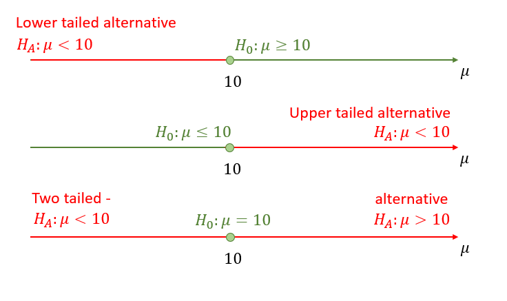

You should always think of the null and alternative hypothesis as pairs. The value $\mu_0$ is the value we "hypothesise".

\begin{eqnarray*}
		H_{0}:\mu \geq \mu _{0};	H_{A}:\mu <\mu _{0}\\
		H_{0}:\mu \leq \mu _{0};	H_{A}:\mu >\mu _{0}\\
		H_{0}:\mu = \mu _{0};	H_{A}:\mu \neq \mu _{0}\\
\end{eqnarray*}

Here, $H_{A}$ stands for the alternative hypothesis. In some textbooks, this is denoted $H_{1}$, but is still called the alternative hypothesis. Notice that the null and alternative hypotheses are expected to be mutually exclusive: it would make no sense to reject $H_{0}$ if it was also contained in $H_{A}$.

Note that for the one-sided tests, we sometimes state $H_{0}:\mu = \mu _{0}$ rather than 	$H_{0}:\mu \geq \mu _{0}$ or $H_{0}:\mu \leq \mu _{0}$. This makes no substantial difference as we will see later. The alternative hypothesis will always reveal what sort of set-up you are looking at.

::: {.callout-note}

#### Example

Which sort of alternative hypothesis should be chosen? This all depends on context and perspective. Suppose that a random sample of jars of jam coming off a packing line is obtained. The jars are supposed to weigh, on average, 454g. You have to decide, on the basis of the sample evidence, whether or not this is true. So, the null hypothesis here is

\begin{equation*}
	H_{0}:\mu =454.
\end{equation*}%

What should be the alternative hypothesis?

`r hide("Hint")`

As a jam manufacturer, you may be happy to get away with selling, on average, lighter jars, since this gives more profit, but be unhappy at selling, on average, overweight jars, owing to the loss of profit. So, the manufacturer might choose the alternative hypothesis

\begin{equation*}
	H_{A}:\mu >454.
\end{equation*}%

A consumer, or a trading standards conscious jam manufacturer, might be more concerned about underweight jars, so the alternative might be

\begin{equation*}
	H_{A}:\mu <454.
\end{equation*}%

A mechanic from the packing machine company might simply want evidence whether or not the machine is working to specification, and would choose

\begin{equation*}
	H_{A}:\mu \neq 454
\end{equation*}%

as the alternative.

`r unhide()`

:::

This short video explains the thinking behind building the null and alternative hypotheses (YouTube, 4min)



::: {.callout-note}

#### Example

You are working for a car manufacturer and you are testing whether the speedometers in your cars are working accurately. On your test track you are driving cars exactly at a speed of 110 km/h. You then take a sample of the speeds which are shown on the cars speedometers. 

Which of the following hypotheses should you be testing?

* A: $H_{0}:\mu \geq 110;	H_{A}:\mu <110$
* B: $H_{0}:\mu \leq 110;	H_{A}:\mu >110$
* C: $H_{0}:\mu = 110;	H_{A}:\mu \neq 110$

`r mcq(c(answer = "A","B","C"))`

`r hide("Hint")`

A good answer is $H_{0}:\mu \geq 110;	H_{A}:\mu <110$. You do not want the speed to show lower than it is. That would bring the drivers in your car into trouble with the police. 

If your speeds showed too high your customers may actually drive somewhat slower than they think. Everyone wins. Therefore speeds showing too high is not really a concern. Check out this [website](https://www.startrescue.co.uk/breakdown-cover/motoring-advice/safety-and-security/how-accurate-is-my-speedometer) which explains why this is by design.

`r unhide()`
:::

## Types of Error

After discussing the set-up of the hypotheses, we are now getting closer to understanding for what sort of p-values you should be rejecting the null hypothesis. As it turns out that is a crucial question and understanding this point will lead you to a very good understanding of what hypothesis testing does.

By setting the null and alternative hypothesis we basically divided all the possibilities for the population parameter into two categories. One called the null hypothesis and the other the alternative hypothesis. When we use a two-tailed (or two-sided) alternative, then the null hypothesis actually only consists of one particular value. 

The unknown truth will be in either of the two categories and we will eventually make a decision of either rejecting or not rejecting the null hypothesis. This means there are four possible outcomes as illustrated in the following table.

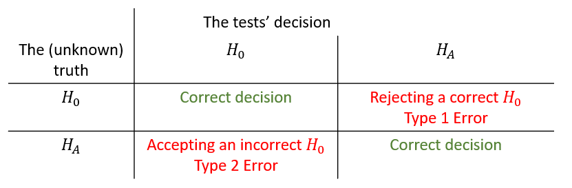

To explain this, let us return to the example of the jam manufacturer who investigates whether the filling machine works as it should. Let's say they do worry about jars being filled with less than the advertised 454g, wanting to avoid unfavourable consumer feedback. They therefore design the following hypotheses:

\begin{eqnarray*}
	H_0&:&\mu \geq 454\\
	H_A&:&\mu < 454
\end{eqnarray*}

If in truth, the population parameter is correctly described by the null hypotheses, i.e. the mean filling weight of the machine is 454g or higher, then performing a hypothesis test and coming to the conclusion that $H_0$ should not be rejected would be a correct decision. Equally, if in truth the filling machine had a mean filling weight of less than 454g and the hypothesis test made us conclude that we should reject $H_0$ would again be a correct decision.

However, if in truth the mean filling weight is larger or equal to 454g ($H_0$) and after looking at a sample and performing a hypothesis test we conclude that we should reject $H_0$ then we would have made a mistake. We call this type of mistake a Type 1 error. And if in truth the average filling weight is below 454g but after performing a hypothesis test using sample information we decide to not reject $H_0$ then we have again made an incorrect decision, a Type 2 error.

Of course, the problem is that we do not know the truth! All we know is what we decided after performing a hypothesis test on the basis of sample information. We have to accept that, when we make a decision then there will be a probability that we are right and another probability that we are wrong.

The objective in designing a procedure to test an $H_{0}$ against an $H_{A}$ - i.e. decide whether to accept $H_{0}$ or to reject $H_{0}$, is to ensure that a Type 1 error does not occur to often. More precisely, the objective is to design a procedure which fixes the probability of a Type 1 error occurring at a prespecified level, $\alpha$, which is small and therefore presumably tolerable. 


## p-values

At this stage it is worth thinking a little more carefully about p-values. 

::: {.callout-note}

#### Example

You measure the weight of the jam ($W$) in a random sample of 50 jam jars. You obtain a sample mean of $\bar{w}=453.78$. You know the standard deviation of the filling machine to be 10g and indeed you know that the distribution of the weight coming from the filling machine is a normal distribution.
	
What is the p-value when testing the following hypotheses?

\begin{eqnarray*}
	H_{0}&:&\mu \geq 454\\
	H_{A}&:&\mu <454
\end{eqnarray*}

The p-value is the probability to obtain a sample mean of $\bar{w}=453.78$ (or more extreme) if in truth the population mean was 454. There are two elements of implementation we need to explain. First, what does "or more extreme" mean in this context. We are thinking from the alternative hypothesis here. The evidence that would make us reject $H_0$ is very low sample means. So more extreme than the actual sample mean in this example would be sample means even lower than $\bar{w}$. Second, in order to calculate a p-value we need to fix a hypothesised population mean which comes from the null hypothesis. But $H_0$ is $\mu \geq 454$ which includes a range of potential population means. We shall always fix to the value at the margin, i.e. in this example $\mu = 454$.
	
With this in mind we now know that we need to calculate $Pr(\bar{W}<453.78)$.

\begin{equation*}
	Pr(\bar{W}<453.78) = Pr\left(Z<\frac{453.78-454}{\sqrt{100/50}}\right)\\
\end{equation*}

To calculate the probability we refer to the sampling distribution of $\bar{W}$. Graphically this is represented by the red area in the following picture:
	
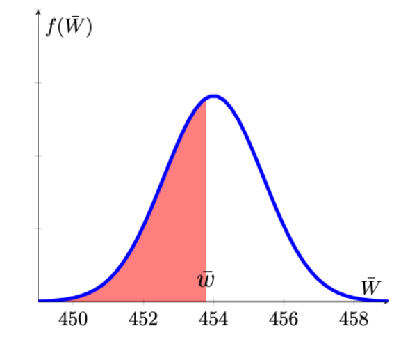

We can complete the calculation.
	
\begin{eqnarray*}
	Pr(\bar{W}<453.78) &=& Pr\left(Z<\frac{453.78-454}{\sqrt{100/50}}\right)\\
	&=&Pr\left(Z<-\frac{0.22}{1.4142}\right)= Pr\left(Z<-0.1556\right)\\
	&=&0.4364~\text{from the Normal distribution table}
\end{eqnarray*}
	
The probability to obtain a sample mean of $\bar{w}=453.78$ (or more extreme, i.e. lower) if in truth the population mean was 454 is 43.65\%.

:::

In the above example we calculated the p-value to be almost 44%. What do we conclude from here about $H_0$? Well, we would have to conclude that it is indeed quite likely to have obtained a sample mean of 453.78 or lower if the null hypothesis was true. This means that this sample did not deliver strong evidence against the null hypothesis. And this is indeed how you should think about p-values. The lower the p-value, the less likely it is that you should have obtained the sample you have if the null hypothesis was true.

In order to calculate this p-value we had to assume that the null hypothesis was true (here $\mu=454$). This is very important to remember as it means that the p-value is not the probability that $H_0$ is true. It would actually be nice if we could calculate that probability of the null hypothesis being true. Unfortunately, just on the basis of the sample information we cannot calculate that probability. 


::: {.callout-note}

#### Example
	
You measure the weight of the jam ($W$) in a random sample of 40 jam jars. You obtain a sample mean of $\bar{w}=456.12$. You know the standard deviation of the filling machine to be 10g and indeed you know that the distribution of the weight coming from the filling machine is a normal distribution.
	
What is the p-value when testing the following hypotheses?
\begin{eqnarray*}
	H_{0}&:&\mu \leq 454\\
	H_{A}&:&\mu > 454
\end{eqnarray*}
	
Which of the following pictures best reflects the situation you are confronted with (red areas representing p-values).
	
* Picture **A**
* Picture **B**
* Picture **C**
* Picture **D**

`r mcq(c("A",answer="B","C","D"))`
	
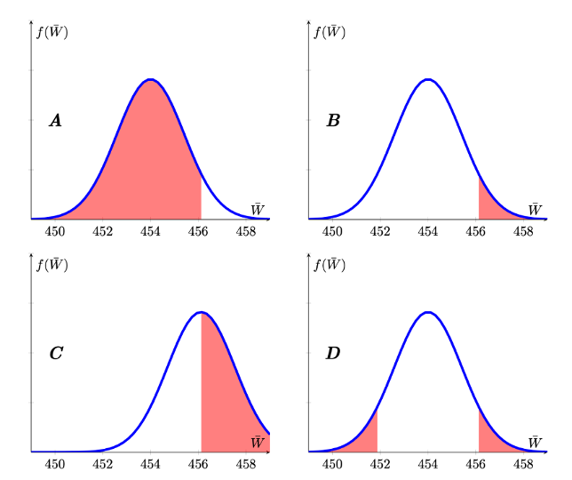	
	
`r hide("Explanation")`
The sampling distribution has to be centred around the hypothesised mean of 454 (so C is false). Extreme is defined by the alternative hypothesis which, here is $H_{A}:\mu > 454$, hence we are looking at a right-tailed test represented by Picture B.
`r unhide()`
	
What is the p-value?

`r fitb(0.0901, tol = .001)`

`r hide("Solution")`

\begin{eqnarray*}
	Pr(\bar{W}>456.12) &=& Pr\left(Z>\frac{456.12-454}{\sqrt{100/40}}\right)\\
	&=&Pr\left(Z>\frac{2.12}{1.5811}\right)= Pr\left(Z>1.3418\right)\\
	&=&1 - Pr\left(Z<1.3418\right)\\
	&=&1-0.9099 = 0.0901~\text{from the Normal distribution table}
\end{eqnarray*}

`r unhide()`


What is the correct interpretation of the p-value?
	
* (A) The p-value represents the probability that $H_0$ is correct.
* (B) The p-value represents the probability that $H_A$ is correct.
* (C) The p-value represents the probability that assuming $H_0$ is correct we should obtain a sample (or more extreme) as we did.
* (D) The p-value represents the probability that the sample mean is larger than 0.	

`r mcq(c("A","B",answer="C","D"))`


`r hide("Solution")`
Recall that, to calculate the p-value we need to assume that $H_0$ is correct. It then represents the probability, under that assumption, that we should obtain a sample with a sample mean at least as extreme as the one we observed.
`r unhide()`

:::


In this example you obtained a p-value of 9%. This means that, if the null hypothesis was true, there is a probability of 9% to get a sample as extreme (meaning as high or higher than the sample mean). What does that mean? Would you now reject the null hypothesis or not? Is this p-value low enough for you to reject $H_0$? All we can say at this stage is that, if the null hypothesis was true we should expect to see sample as extreme as this around 1 in 10 times.

In the previous two examples we explored how to calculate p-values for one-sided hypothesis tests. In the following example we explore how to calculate p-values for a two-sided alternative. We keep working with the same information as the previous example but change the hypothesis.


::: {.callout-note}

#### Example

You measure the weight of the jam ($W$) in a random sample of 40 jam jars. You obtain a sample mean of $\bar{w}=456.12$. You know the standard deviation of the filling machine to be 10g and indeed you know that the distribution of the weight coming from the filling machine is a normal distribution.
	
What is the p-value when testing the following hypotheses?

\begin{eqnarray*}
	H_{0}&:&\mu = 454\\
	H_{A}&:&\mu \neq 454
\end{eqnarray*}

Here the alternative is a two sided alternative. Evidence against the null hypothesis would now be collected from sample means which are either sufficiently smaller or larger than the hypothesised population mean ($\mu = 545$). Recall that the p-value looks for the probability to observe a sample with a sample mean at least as extreme as the one observed. Let's look at the image which illustrates this situation. The obtained sample mean is $\bar{w}=456.12$ and at least as extreme as that would immediately be associated with values larger or equal than that value (the probability indicated by the red area). But when the alternative is a two-sided one, then we would also consider sample mean values in the left-hand tail as potential evidence against the null hypothesis. We therefore also consider the equivalent probability in the left hand tail (the probability indicated by the orange area) when calculating the p-value.

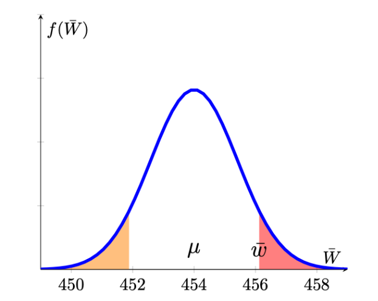

We therefore have to calculate the following probability to get the p-value of a two-sided test.
	
\begin{eqnarray*}
	\underbrace{Pr(\bar{W}<451.88)}_{orange} &+& \underbrace{Pr(\bar{W}>456.12)}_{red} \\
	&=& Pr\left(Z<\frac{451.88-454}{\sqrt{100/40}}\right)+Pr\left(Z>\frac{456.12-454}{\sqrt{100/40}}\right)\\
	&=&Pr\left(Z<-\frac{2.12}{1.5811}\right)+Pr\left(Z>\frac{2.12}{1.5811}\right)\\
	&=& Pr\left(Z<-1.3418\right)+Pr\left(Z>1.3418\right) \\
	&=& 2 \cdot Pr\left(Z<1.3418\right)~\text{by symmetry of N dist}\\
	&=& 2 \cdot 0.0901 = 0.1802~\text{from the Normal distribution table}
\end{eqnarray*}
	
We conclude that the probability of getting a sample outcome as extreme as the one we got, assuming that the null hypothesis is true, is 18%. This is a sizeable probability and we should expect a sample as extreme as the one we had (deviating from the hypothesised population mean as much as our sample) once in every five samples (as the p-value is approximately 20%).
	
:::


::: {.callout-note icon=false}

#### Exercise

Calculate p-values for the following examples. In all examples assume that the sampling distribution is a normal distribution. 

What is the p-value when testing the following hypotheses?

Random Variable: $X$: $\sigma_X = 4$ \\
Sample: $n=20, \bar{x} = 7.3$

\begin{eqnarray*}
	H_{0}&:&\mu \geq 8\\
	H_{A}&:&\mu < 8
\end{eqnarray*}

$p-value=$ `r fitb(0.2177,tol = 0.001)`

`r hide("Solution")`
\begin{eqnarray*}
	Pr(\bar{X}<7.3) &=& Pr\left(Z<\frac{7.3-8}{\sqrt{4^2/20}}\right)\\
	&=&Pr\left(Z<-\frac{0.7}{0.8944}\right)=Pr\left(Z<-0.7826\right)\\
	&=&0.2177~\text{from the Normal distribution table}
\end{eqnarray*}
`r unhide()`


Random Variable: $Z$: $\sigma_Z = 6$ \\
Sample: $n=40, \bar{x} = 11.9$

\begin{eqnarray*}
	H_{0}&:&\mu \leq 9\\
	H_{A}&:&\mu > 9
\end{eqnarray*}

$p-value=$ `r fitb(0.0011,tol = 0.001)`

`r hide("Solution")`
\begin{eqnarray*}
	Pr(\bar{Z}>11.9) &=& Pr\left(Z>\frac{11.9-9}{\sqrt{6^2/40}}\right)\\
	&=&Pr\left(Z>\frac{2.9}{0.9487}\right)=Pr\left(Z>3.0569\right)\\
	&=&1-Pr\left(Z<3.0569\right)\\
	&=&1-0.9989 = 0.0011~\text{from the Normal distribution table}
\end{eqnarray*}
`r unhide()`

Random Variable: $Q$: $\sigma_Q = 7$ \\
Sample: $n=100, \bar{x} = -0.372$

\begin{eqnarray*}
	H_{0}&:&\mu = 1\\
	H_{A}&:&\mu \neq 1
\end{eqnarray*}

$p-value=$ `r fitb(0.05,tol = 0.001)`

`r hide("Solution")`
\begin{eqnarray*}
	Pr(\bar{Q}<-0.372)+Pr(\bar{Q}>2.372) &=& Pr\left(Z<\frac{-0.372-1}{\sqrt{7^2/100}}\right)+Pr\left(Z>\frac{2.372-1}{\sqrt{7^2/100}}\right)\\
	&=&Pr\left(Z<\frac{-1.372}{0.7}\right)+Pr\left(Z>\frac{1.372}{0.7}\right)\\
	&=&2 \cdot Pr\left(Z<-1.96\right)\\
	&=&2 \cdot 0.025 = 0.05~\text{from the Normal distribution table}
\end{eqnarray*}
`r unhide()`

:::


So you calculated a range of different p-values. The smaller the p-value the stronger is the evidence from the sample against the null hypothesis. 

## Decision Rules

In the previous section we discussed how to calculate p-values (always assuming you know the population variance and the distribution of the sampling distribution). We discussed that smaller p-values indicate stronger evidence (from the sample) against $H_0$. In some sense that is all there is to know from the methodology of hypothesis testing. However, hypothesis testing results in a binary decision, either reject or do not reject the null hypothesis. If we want to move from a continuous p-value to a binary decision we need to provide a decision rule. 

Let's consider for a moment you would always reject the null hypothesis if the p-value was smaller than 0.05. What that implies is that if you were to perform 100 tests for which the null hypothesis is correct, then you should expect to reject 5 (5%) of these. So in other words, by setting such a decision rule you are controlling the probability for a Type 1 error.

Example decision rule: **Reject $H_0$ if p-value is smaller than 0.05 (significance level, $\alpha$).**

What about the Type 2 error? A Type 2 error is when we fail to reject an incorrect null hypothesis. It is the situation where we hypothesise that $\mu$ is the population mean but in actual fact the population mean is $\mu + \delta$ where $\delta \neq 0$. For very small values of $\left|\delta\right|$ it is very unlikely that we reject the incorrect null hypothesis as the difference between the hypothesised population mean and the actual population mean is very small. In other words, the probability of making a Type 2 error is large. The larger the discrepancy (larger $\left|\delta\right|$), the smaller is the probability that we make a Type 2 error. However, once you set the decision rule like above you have to accept a certain probability for the Type 2 error. It turns out that you could decrease the probability of a Type 1 error, i.e. reject $H_0$ only if the p-value, say, is smaller than $\alpha = 0.01$, but if you do that, then you will be increasing the probability of a Type 2 error. 

For a given sample size you can either control the Type 1 error probability (and that is what we usually do) or the Type 2 error probability but not both. However, increasing the sample size can reduce the probability of a Type 2 error while keeping the Type 1 error probability constant.

In this video we use a simulation to explain how sample size and significance level relate to the probabilities of making Type I or Type II errors (YouTube, 26min).

 

You can get the spreadsheet used from [here](data/Simulatedhypothesistest.xlsx)

### An alternative decision rule design

As stated above, the decision rule for a hypothesis test can be formulated as follows:

**Reject $H_0$ if p-value is smaller than $\alpha$ (the significance level).**

The significance level ($\alpha$) is to be set by the researcher in advance and the calculation of the p-value will depend on the sample evidence and on the hypotheses formulated. As the p-value has a very clear (if somewhat awkward) interpretation (The probability of getting an outcome which is at least as extreme as the sample result **assuming** that the null hypothesis is true), it is very useful to think of decision rules in this manner.

However, you may come across alternative decision rules (which, if formulated correctly) will always give you the same result as using the p-value decision rule. Consider the following situation: You have exactly the same information as we assumed previously, you know your sample size $n$, you know that the sampling distribution of the sample mean is a normal distribution and you have set a significance level $\alpha$.

With this information we can return to a previous example and ask a slightly different question.


::: {.callout-note}

#### Example

Consider a random variable $R$, which you **hypothesise** to have expected value $E[R]=\mu = 10$ and you want to test this against the alternative that the population mean is larger than that:
	
\begin{equation*}
	H_{0}:\mu \leq 10;	H_{A}:\mu >10
\end{equation*}
	
Further, you know that the population variance is $Var[R]=\sigma^2=16$. While you do not know how $R$ is distributed, you do have a sample of size $n=100$ which you are confident to be large enough to apply the CLT. 
	
With that information and assuming that $\mu=10$, you can derive the sampling distribution:
	
\begin{eqnarray*}
	\bar{R} &\sim& N\left(\mu,\sigma^2_{\bar{R}}=\frac{\sigma^2}{n}\right)\\
	&\sim& N\left(10,\frac{16}{100}\right)
\end{eqnarray*}	

or in standardised form
	
\begin{equation*}
	\frac{\bar{R}-\mu}{\sigma_{\bar{R}}} \sim N\left(0,1\right)
\end{equation*}
	
Before looking at the actual sample mean, what type of sample evidence would make you reject $H_0$ if you set the significance level at $\alpha=0.05$? In other words, we want to find a value $\bar{r}^{high}$ which will trigger a rejection of the null hypothesis. This should happen if $Pr(\bar{R}>\bar{r}^{high}|\mu=10)<\alpha=0.05$, where the conditioning on the assumption that $\mu=10$ is made explicit.

\begin{equation*}
	Pr\left(\bar{R}>\bar{r}^{high}|\mu=10\right) = Pr\left(Z>\frac{\bar{r}^{high}-10}{\sqrt{\frac{16}{100}}}|\mu=10\right)=0.05
\end{equation*}
	
For ease of notation we will not show the conditioning ($|\mu=10$) any longer, but you should always keep in mind that we are only able to make these calculations as we are setting $\mu$ to the hypothesised value.	
	
We reformulated the problem stated in terms of the random variable $\bar{R}$ into one formulated in terms of the standard normally distributed random variable $Z$. The reason for doing so is that we can tell from a standard normal distribution table that $Pr(Z>1.645)=1-Pr(Z\leq1.645)=1-0.95 = 0.05$.
	
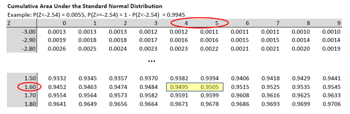

From here we can infer that 
	
\begin{eqnarray*}
	\frac{\bar{r}^{high}-10}{\sqrt{\frac{16}{100}}} &=& 1.645\\
	\bar{r}^{high}-10&=&1.645 \cdot \sqrt{\frac{16}{100}}=1.645 \cdot 0.4\\
	\bar{r}^{high}&=&10+1.645 \cdot 0.4=10.658
\end{eqnarray*}
	
Therefore, **if the sample mean turns out to be higher than 10.658, we shall reject $H_{0}:\mu \leq 10$ at a 5\% significance level**. This can be seen as a decision rule.
	
:::
	
This video applies the same thinking as that in the above example (YouTube, 10min).




We have used all the knowledge we accumulated previously to design a decision rule prior to actually observing the sample mean. We needed knowledge of the test statistic (the sample mean here) its sampling distribution, the sample size ($n$) and the significance level ($\alpha$).
 
With all that knowledge we were able to derive the following decision rule. 

* For testing $H_{0}:\mu \leq 10;	H_{A}:\mu >10$ the decision rule is  
  **Reject $H_0$, at a significance level $\alpha = 0.05$, if the sample mean exceeds 10.658.**  
  Which is equivalent to saying:  
  **Reject $H_0$, at a significance level $\alpha = 0.05$, if the test statistic $Z=\frac{\bar{r}-10}{\sqrt{\frac{16}{100}}}$ exceeds 1.645.**

It most common to see these decision rules formulated in terms of the $Z$ statistic rather than the sample mean. The values at which we would reject $H_0$ are also called **critical values**.
 
Graphically we can represent the situation as follows:

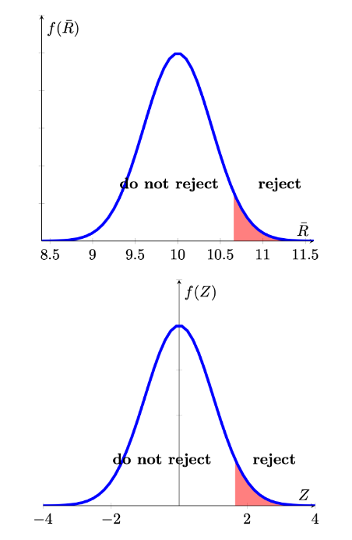
 
If we had wanted to to test a left-tailed hypothesis, the decision rule would have been

* For testing $H_{0}:\mu \geq 10;	H_{A}:\mu <10$ the decision rule is  
  **Reject $H_0$, at a significance level $\alpha = 0.05$, if the sample mean is smaller than 9.342 (=10-0.658).**  
  Which is equivalent to saying  
  **Reject $H_0$, at a significance level $\alpha = 0.05$, if the test statistic $Z=\frac{\bar{r}-10}{\sqrt{\frac{16}{100}}}$ is smaller than -1.645.**

And the graphical representation is as follows

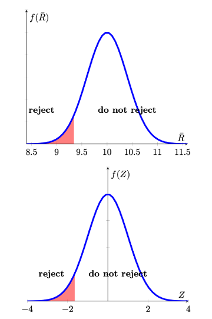

Lastly we have to establish how this type of decision rule would look if we were to test a two-sided hypothesis. Let is first state the hypothesis and the resulting decision rule in our example and then explain it graphically.

* For testing $H_{0}:\mu = 10;	H_{A}:\mu \neq 10$ the decision rule is  
  **Reject $H_0$, at a significance level $\alpha = 0.05$, if the sample mean exceeds 10.784 or is smaller than 9.216.**  
  Which is equivalent to saying  
  **Reject $H_0$, at a significance level $\alpha = 0.05$, if the test statistic $Z=\frac{\bar{r}-10}{\sqrt{\frac{16}{100}}}$ exceeds 1.96 or is smaller than -1.96.**

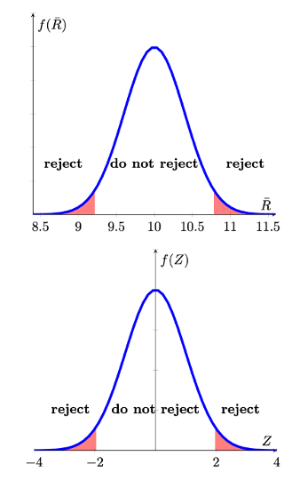


The 5\% probability ($\alpha$) is now divided into two 2.5\% regions in each tail (red areas). So where do the $Z$ values of -1.96 and 1.96 come from? They do come from the standard normal distribution table as the values which cut off 0.025 in the left and right tail respectively.

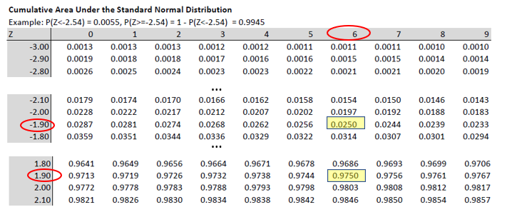

In this video we show how the application of different decision rules all lead to the same decision in a hypothesis test (YouTube, 15min).



Looking back at the previous calculations it should be obvious that the decision rules could be calculated/formulated before you observe the sample value. The decision rule was dependent on

* the hypothesised population value $\mu$,
* the sample size $n$,
* the sampling distribution, and
* the chosen significance level.

Once you have formulated the decision rule you merely need to observe the sample mean and calculate  $Z=\frac{\bar{r}-10}{0.4}$. Once you have done that you can easily see whether your calculated $Z$ value falls in the rejection region or not.
 
::: {.callout-note}

#### Why do we need Hypothesis tests?

After the previous discussion you may wonder why the discipline has developed the tradition of hypothesis testing. And in some sense you are right in that going from the continous p-value to the binary decision entails a loss of information.

One explanation is that it has been used as a decision tool. This means that the information coming from the hypothesis test has been used to decide whether a certain course of action should be followed or not.

Indeed, if the information from the hypothesis test is the only information used to decide on a course of action, then using a formal hypothesis testing framework (which means presenting a significance level $\alpha$, a pair of hypothesis and a resulting decision rule) will force you to consider the probabilities of committing a Type 1 and 2 error. The probability of making a Type 1 error is explicitly encoded as $Pr($Type 1 error$)=\alpha$. The probability of the Type 2 error is not explicit, but the applied researcher will be aware that its probability is inversely related to the probability of a Type 1 error. 

:::

In the following exercises we ask you to formulate decision rules.

::: {.callout-note icon=false}

#### Exercise

In all examples assume that the sampling distribution is a normal distribution. 

Formulate decision rules.
	
Random Variable: $X$: $\sigma_X = 4$  
Sample: $n=20$  
Hypothesis: $H_{0}:\mu \leq 25;	H_{A}:\mu > 25$  
Significance level: $\alpha = 0.05$
	
The three possible decision rules are:

* Reject $H_0$ if p-value is $< 0.05$.
* Reject $H_0$ if $Z$ is $>$ $1.645$.
* Reject $H_0$ if $\bar{x}$ is `r mcq(c("<","=",answer = ">"))` `r fitb(26.4713, tol = 0.001)`.
	
If the sample mean is 26.8. What is your decision? 

`r mcq(c(answer = "Reject H0", "Do not reject H0"))`

`r hide("Solution")`
The critical value is calculated as $25+1.645*(4/\sqrt{20})$. As the sample mean is larger than that critical value we reject $H_0$.
`r unhide()`
	
Random Variable: $Y$: $\sigma_Y = 6$  
Sample: $n=40$  
Hypothesis: $ H_{0}:\mu \geq 0;	H_{A}:\mu < 0$  
Significance level: $\alpha = 0.10$

The three possible decision rules are:

*	Reject $H_0$ if p-value is `r mcq(c(answer = "<","=",">"))` `r fitb(0.10)`.
*	Reject $H_0$ if $Z$ is  `r mcq(c(answer = "<","=",">"))` `r fitb(-1.28)`.
*	Reject $H_0$ if $\bar{y}$ is `r mcq(c(answer = "<","=",">"))` `r fitb(-1.2143, tol = 0.001)`.

If the sample mean is -0.8. What is your decision?

`r mcq(c("Reject H0", answer =  "Do not reject H0"))`

`r hide("Solution")`
The critical value is calculated as $0-1.28*(6/\sqrt{40})$. As the sample mean is not smaller than this critical value we do not reject $H_0$.
`r unhide()`

	
Random Variable: $Q$: $\sigma_Q = 7$  
Sample: $n=100$  
Hypothesis: $ H_{0}:\mu = 12;	H_{A}:\mu \neq 12 $  
Significance level: $\alpha = 0.01$

The three possible decision rules are:

*	Reject $H_0$ if p-value is `r mcq(c(answer = "<","=",">"))` `r fitb(0.10)`.
*	Reject $H_0$ if $Z$ is $<$ `r fitb(-2.575)` or $>$ `r fitb(2.575)`.
*	Reject $H_0$ if $\bar{q}$ is $<$ `r fitb(10.1975)` or $>$ `r fitb(13.8025)`.
	
If the sample mean is 13.5. What is your decision? 


`r mcq(c("Reject H0", answer =  "Do not reject H0"))`

`r hide("Solution")`
We get the Z value by looking at the normal table to see which value cuts of (0.01/2) of the probability in each tail. That is $\pm 2.575$. The critical values are calculated as $12 \pm 2.575*(7/\sqrt{100})$.
`r unhide()`

:::

As you can see from the prior examples, the sample size plays a crucial role in the calculation of the critical values in a hypothesis test. By increasing the sample size, you can actually decrease the probability of making a Type 2 error (not rejecting an incorrect $H_0$). The mechanism at work is that the standard error of your sample statistic (here mainly the sample mean but it could be any other sample statistic) is an inverse function to the sample size $n$:

\begin{equation*}
	\sigma_{\bar{X}} = \frac{\sigma}{\sqrt{n}}	
\end{equation*} 


::: {.callout-note}

#### Example

In an earlier example we worked with the following information: 

Random Variable: $Q$: $\sigma_Q = 7$  
Sample: $n=100$  
Hypothesis: $H_{0}:\mu = 12;	H_{A}:\mu \neq 12$  
Significance level: $\alpha = 0.01$
	
The resulting decision rule was:
	
Reject $H_0$ if $\bar{q}$ is $<$ $10.1975$ or $>13.8025$.
	
How large would the sample size have to be such that a sample mean of 13.5 will trigger a rejection of $H_0$?
	
The critical value, in this example is calculated according to 
	
\begin{equation*}
	13.8025=12+2.575 \cdot (7/\sqrt{100})
\end{equation*}
	
We now wonder what should be the $n$ in 
	
\begin{equation*}
	13.5=12+2.575 \cdot (7/\sqrt{n})
\end{equation*}
	
All we need to do is to solve the above equation for $n$ 
	
\begin{eqnarray*}
	13.5&=&12+2.575 \cdot (7/\sqrt{n})\\
	13.5-12&=&2.575 \cdot (7/\sqrt{n})\\
	\sqrt{n}&=&\frac{2.575 \cdot 7}{1.5}= 12.0167\\
	n&=&12.0167^2=144.4003
\end{eqnarray*}
	
This means that the sample size required is 144.4003, or in practice 145.
	
:::


::: {.callout-note icon=false}

#### Exercise

Consider the following knowledge  

Random Variable: $X$: $\sigma_X = 4$  
Hypothesis: $H_{0}:\mu \leq 25;	H_{A}:\mu > 25$  
Significance level: $\alpha = 0.05$

How large a sample would you need to make sure that you can reject the null hypothesis (at $\alpha=0.05$) if the sample mean is 0.01 larger than the hypothesised population mean?

`r fitb(4327)`

`r hide("Solution")`

Use the following argument:

\begin{eqnarray*}
	25.1&=&25+1.645 \cdot (4/\sqrt{n})\\
	25.1-25&=&1.645 \cdot (4/\sqrt{n})\\
	\sqrt{n}&=&\frac{1.645 \cdot 4}{0.1}= 65.8\\
	n&=&65.8^2=4,326.64
\end{eqnarray*}
`r unhide()`
	
:::


## Different Sampling Distributions for the sample mean

So far we only dealt with the situation in which the sampling distribution was a normal distribution;

\begin{equation*}
	\bar{X} \sim N(\mu,\sigma_{\bar{X}})
\end{equation*}

There are two situations in which we established that the sampling distribution of the sample mean is a normal distribution.

1. The population distribution is a normal distribution itself and we know the population variance, $\sigma_X$, $X \sim N(?,\sigma)$. The population is unknown (if it was known there was no need for hypothesis testing of the mean). In this situation $\bar{X} \sim N(\mu,\sigma_{\bar{X}})$ at any sample size.
2. We know the population variance, $\sigma_X$ but don't know the distribution the population random variable $X$ follows, but the sample size is sufficiently large for $\bar{X}$ to be normally distributed (by the power of the Central Limit Theorem). 

It is worth repeating the main conclusion of the CLT here:

::: {.callout-important}

#### The Central Limit Theorem

If $\bar{X}$ is obtained from a random sample of size $n$ from a population with mean $\mu $ and variance $\sigma ^{2}$, then, irrespective of the distribution sampled,
	
\begin{equation*}
		\dfrac{\bar{X}-\mu }{SE\left[ \bar{X}\right] }=\dfrac{\bar{X}-\mu}{ \sigma /\sqrt{n} }=\dfrac{\bar{X}-\mu}{\sigma_{\bar{X} }}\rightarrow N\left( 0,1\right) \;\;\;\text{as }n\rightarrow \infty .
\end{equation*}
	
That is, the probability distribution of $\dfrac{\bar{X}-\mu }{SE\left[ \bar{X}\right] }$ approaches the standard normal distribution as $n\rightarrow \infty $.
	
:::

So, both of the earlier results rely on us "knowing" the standard deviation $\sigma$ of the random variable $X$. This is the reason why, throughout this section, when we presented examples we always gave you information on this standard deviation. This created somewhat awkward situations where we said that the population mean $\mu$ was not known but the population standard deviation $\sigma$ was known. That is, of course, a situation which often is unrealistic.

We therefore need to consider the case where $\sigma$ is also unknown. When that is the case (almost always!) then we will replace the unknown $\sigma$ with a sample estimate $s$, which we learned how to calculate earlier. This means that we will be operating with the following term

\begin{equation*}
	t= \dfrac{\bar{X}-\mu }{S /\sqrt{n}  }
\end{equation*}

This term is commonly called a $t-$statistic for reasons that will soon become obvious. Fortunately, all the principles discussed previously continue to apply when we do so. Here we will point out what details will change. 

In what follows we will discuss four realistic cases (all of which assume that $\sigma$ is unknown and is estimated by $s$). For each of these four cases we will want to establish how $t$ is distributed. The complication that arises is that the $t$ statistic, now, incorporates two random variables, $\bar{X}$ the sample mean and $S$ the sample standard deviation (which is why it is written as a capitalised letter in the above t-statistic). This makes deriving the distribution of $t$ less straightforward.

If the result is that $t \sim N(0,1)$ then all the details discussed previously will apply, in particular how you can calculate p-values or critical values and therefore make decisions on hypotheses. If the answer is anything else but $t \sim N(0,1)$ we will have to discuss the changed procedures. The following table outlines the four cases (**all assuming that $\sigma$ needs to be estimated with $s$**):

|             | Sample Size ($n$) |            |
|-------------|-------------------|------------|
| Dist of $X$ | small             | large      |
| Normal      | $t \sim ?$        | $t \sim ?$ |
| not Normal  | $t \sim ?$        | $t \sim ?$ |

We shall briefly discuss these four cases in turn.

* $X\sim N$, $n$ small. In this case $t \sim t-distribution$ with $n-1$ degrees of freedom ($t_{n-1}$). (You will soon learn about this distribution).
* $X\sim N$, $n$ large. In this case $t \sim t-distribution$ with $n-1$ degrees of freedom ($t_{n-1}$) but you will soon learn that for large $n$ this implies $t \sim N(0,1)$. 
* $X\sim not~N$, $n$ small. In this case $t \sim ?$. In other words we cannot specify the type of distribution, as it is hugely data dependent. If you wanted to make inference in such a case you will have to apply data-driven methods which are beyond the scope of this course unit (like bootstrapping).
* $X\sim not~N$, $n$ large. In this case $t \sim N(0,1)$. This is thanks to (another) CLT (one which allows for unknown $\sigma$).
	
We can therefore complete the above table: 

|             | Sample Size ($n$) |                 |
|-------------|-------------------|-----------------|
| Dist of $X$ | small             | large           |
| Normal      | $t \sim t_{n-1}$  | $t \sim N(0,1)$ |
| not Normal  | $t \sim ?$        | $t \sim N(0,1)$ |


This implies that, whenever we have a large sample size the procedures detailed earlier apply exactly, just with the sample standard deviation, $s$, replacing the role of the known $\sigma$.


::: {.callout-note}

####  Why a t-Distribution

Details of why the $t$ statistic follows a $t$ distribution are not for this course unit. But it is worth noting that a $t$ distribution arises when you combine a normally distributed random variable, $\bar{X}$, with a $\chi^2$ distributed random variable, $S^2$. Details are not important other than to realise that $t$ combines two random variables. You will soon encounter the $\chi^2$ distribution in another context, which follows from a different combination of multiple random variables.

:::

Let us work through an example that represents a situation where we are confident that the CLT applies. As discussed previously, an often quoted "rule-of-thumb" is that $n>30$ generally allows you to make this judgement. I would certainly say that with $n>100$ you are pretty much on the safe site unless you have extremely skewed distributions. If you have any doubt, you should just state your doubt.
 
::: {.callout-note}

#### Example
	
We have the following information:  
Random Variable: $X$ distribution unknown, note that $\sigma$ is unknown  
Sample: $n=80$, $s = 4$, assume that CLT applies  
Hypothesis: $H_{0}:\mu \leq 25;	H_{A}:\mu > 25$  
Significance level: $\alpha = 0.05$

With that information we should be able to formulate decision rules. We will do that in three versions, in terms of the $p$-vale, the test statistic (here a $t$-test) and the sample statistic (here $\bar{x}$). In applications one is sufficient as they all give the same result.

The three equivalent decision rules are:

* Reject $H_0$ if p-value is $< 0.05$.  
  This is merely the statement of the general p-value decision rule using the chosen significance level.
* Reject $H_0$ if $t$ is $>$ $1.645$.  
  The value from 1.645 comes from the normal distribution table as in this situation $t \sim N(0,1)$.
*	Reject $H_0$ if $\bar{x}$ is $>$ $25.7357$.  
  The critical value is calculated as $25+1.645*(4/\sqrt{80})$.

Note that we could formulate these decision rules before we know the value of the sample mean. In fact the first two rules can be formulated without knowing anything about the sample other than the sample size, $n$. For the third we also needed to know the sample standard deviation, $s$. 
		
If the actual sample mean was 26.12, what would be your decision? 

From here it is easiest to apply the last decision rule. We would reject $H_0$ as $26.12>25.7357$. We could also calculate the $t$-statistic:
	
\begin{equation*}
	t= \dfrac{\bar{x}-\mu }{s /\sqrt{n}  } = \dfrac{26.12-25 }{4 /\sqrt{80}  } = 2.5044
\end{equation*} 

According to the 2nd decision rule we would also reject. And on the basis of this $t$-statistics we could also calculate the p-value, which is 0.0062 (which we get from the Normal distribution). This is smaller than the significance level of 0.05 and leads us (as it should) to the same rejection decision.
	
:::


::: {.callout-note icon=false}

#### Exercise

For both examples you can assume that the sample size is large enough for a CLT to be applicable.
	
Random Variable: $Y$ is normally distributed  
Sample: $n=40, s = 6$  
Hypothesis: $ H_{0}:\mu \geq 0;	H_{A}:\mu < 0$  
Significance level: $\alpha = 0.10$
	
The three possible decision rules are:

* Reject $H_0$ if p-value is `r mcq(c(answer ="<","=", ">"))` `r fitb(0.1)`.
* Reject $H_0$ if $Z$ is `r mcq(c(answer ="<","=", ">"))` `r fitb(-1.28)`.
* Reject $H_0$ if $\bar{y}$ is `r mcq(c(answer = "<","=",">"))` `r fitb(-1.5606, tol = 0.001)`.
	
If the sample mean is  -0.8. What is your decision? 

`r mcq(c("Reject H0", answer = "Do not reject H0"))`

`r hide("Solution")`
The critical value is calculated as $0-1.28*(6/\sqrt{40})$. The value from 1.28 comes from the normal distribution table as in this situation $t \sim N(0,1)$.
`r unhide()`
	
Random Variable: $Q$ distribution is unknown  
Sample: $n=100, s = 7$  
Hypothesis: $ H_{0}:\mu = 12;	H_{A}:\mu \neq 12 $  
Significance level: $\alpha = 0.01$

The three possible decision rules are:

* Reject $H_0$ if p-value is `r mcq(c(answer ="<","=", ">"))` `r fitb(0.01)`.
* Reject $H_0$ if $|Z|$ is `r mcq(c("<","=",answer = ">"))` `r fitb(2.575)`.
* Reject $H_0$ if $\bar{y}$ is $<$ `r fitb(10.1975, tol = 0.001)` or $>$ `r fitb(13.8025, tol = 0.001)`.

If the sample mean is 13.5. What is your decision? 

`r mcq(c("Reject H0", answer = "Do not reject H0"))`


`r hide("Solution")`
We get the Z value by looking at the normal table to see which value cuts of ($0.01/2=0.005$) of the probability in each tail (we half the significance level as this is a two-tailed test). That is $\pm 2.575$. The critical value is calculated as $12 \pm 2.575*(7/\sqrt{100})$. The value from 2.575 comes from the normal distribution table as in this situation, with a large sample size, $t \sim N(0,1)$.
`r unhide()`

:::


### Working with the t-distribution

This now leaves us to discuss how to work the case where we know that the random variable from which we sample is normally distributed, the population standard deviation is unknown and the sample size is small (such that we are not confident that the CLT applies). In the above table it was indicated that, in such a situation, 

\begin{equation*}
	t= \dfrac{\bar{X}-\mu }{S /\sqrt{n}  }\sim t_{n-1}
\end{equation*} 

We will have to work with a new statistical table. The Table for the t-distribution. You can get one version from  [here](data/tTable.pdf).

Let's say we want to perform a hypothesis test in such a setting. Let's work through an example.

::: {.callout-note}

#### Example

We have the following information:

Random Variable: $X$ distribution is normal with $\sigma$ unknown  
Sample: $n=20$, $s = 4$  
Hypothesis: $H_{0}:\mu \leq 25;	H_{A}:\mu > 25$  
Significance level: $\alpha = 0.05$
	
With that information we should be able to formulate decision rules. We will do that in three versions, in terms of the $p$-vale, the test statistic (here a $t$-test) and the sample statistic (here $\bar{x}$). In applications one is sufficient as they all give the same result.
	
* Reject $H_0$ if p-value is $< 0.05$.  
	This is merely the statement of the general p-value decision rule using the chosen significance level.
* Reject $H_0$ if $t$ is $>$ $1.729$.  
  The value from 1.725 comes from the $t$ distribution with 19 ($=n-1=20-1$) degrees of freedom as, in this situation, we know that $t \sim t_{n-1}$.
* Reject $H_0$ if $\bar{x}$ is $>$ $26.5465$.  
  The critical value is calculated as $25+1.729*(4/\sqrt{20})$.

`r hide("How can we get that critical t-value?")`

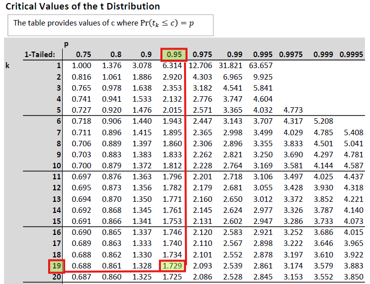

`r unhide()`

If the actual sample mean was 26.12, what would be your decision? From here it is easiest to apply the last decision rule. We would not reject $H_0$ as $26.12<26.5465$. We could also calculate the $t$-statistic:
	
\begin{equation*}
	t= \frac{\bar{x}-\mu }{s /\sqrt{n}  } = \frac{26.12-25 }{4 /\sqrt{20}  } = \frac{1.12}{0.8944}= 1.2522
\end{equation*} 
	
According to the 2nd decision rule we would also not reject as the $t$-statistic does not exceed its critical value of 1.729. And on the basis of this $t$-statistics we could also calculate the p-value. From the $t$-distribution table we know that the critical value for a one sided $t$ test at $\alpha=0.1$ and 19 degrees of freedom (dof) is 1.328. As the $t$-statistic is 1.2522, we can say that the p-value has to be larger than 0.10. We cannot give any more precise p-value using the table. You can use Excel to give you a more precise p-value. Use the formula "=1-T.DIST(1.2522,19,TRUE)" which delivers the precise p-value of 0.1128. In any case, as our significance level is 0.05 we fail to reject the null hypothesis. As it should be, all decision rules give the same result.
	
:::

This is a work through a t-test with a two-tailed $H_A$ (YouTube, 23min).




::: {.callout-note}

#### Example

The University's welfare manager is concerned about students spending too much on unhealthy food items every week (let $U$ be the weekly spend on unhealthy food measured in pounds). He asks a random sample of $n=$ 20 students to keep a weekly food shopping diary. From previous studies the manager is confident that $U$ is normally distributed. Five years ago the average spend ($\mu$) was 61 pounds and she is concerned that this value has increased since.

From the sample the welfare manager learns that $\bar{u} = 79$ and the sample standard deviation is $s=10$. Test the following hypotheses, using $\alpha = 0.05$:
	
* $H_0: \mu = 61$  
  $H_A: \mu > 61$
	
What is the distribution of the test-statistic $t = \frac{\bar{U}-\mu}{s/\sqrt{n}}$?
	
* (A) $N(0,1)$
* (B) $N(0,n)$
* (C) $t_{10}$
* (D) $t_{20}$
* (E) $t_{19}$

`r mcq(c("(A)","(B)","(C)","(D)",answer = "(E)"))`

`r hide("Hint")`
As we can assume that $U$ is normally distributed but we need to use the sample variance to approximate the variance, this test statistic is t-distributed with $n-1$ degrees of freedom. 
`r unhide()`

Decision Rule:

Reject $H_0$ if $t$ `r mcq(c("<","=", answer =">"))` `r fitb(1.729)`
	
What is the value of the test-statistic?
	
$t =$ `r fitb(8.0498,tol=0.001)`

What is the value of the test's p-value?

$p-value <$ `r fitb(0.0005)`

`r hide("Solution")`
	
You get the critical value exactly as in the above example from t-distribution table with 19 degrees of freedom and from the column with 0.95.

$t=\frac{\bar{U}-\mu}{s/\sqrt{n}}=\frac{79-61}{10/\sqrt{20}}=8.0498$
	
To get the p-value we only look at the values in the $k=19$ row. And then we place the obtained sample t-statistic amongst the values we can see there. The most extreme value here is 3.883 associated with the prob that $Pr(t\leq 3.883)=0.9995$. If our t-stat was 3.883 then the p-value would have been 0.0005. However, our test stat is even further in the tail of the distribution and therefore we know that the p-value is $<0.0005$. We cannot be more precise using the table.

`r unhide()`

What is the most accurate conclusion?
	
* (A) There is evidence that students spend more on unhealthy foods than 5 years ago.
* (B) There is insufficient to suggest that students spend more on unhealthy foods than 5 years ago.

`r mcq(c(answer = "(A)", "(B)"))`

After presenting these results to a colleague working in the economics department she recognises that she has to redo the test acknowledging that in general food prices were affected by inflation over the last five years. In fact food prices increased by 20% over that period. 
	
What should change in the test's setup to acknowledge that food prices increased? 
	
* (A) The significance level should be increased.
* (B) The significance level should be decreased.
* (C) The sample size should be increased by 20%.
* (D) The population mean in the hypotheses should change to $\mu = 73.2$.
* (E) The population mean in the hypotheses should change to $\mu = 50.84$.
* (F) The test should be changed to a left tailed test.

`r mcq(c( "(A)", "(B)","(C)",answer = "(D)","(E)", "(F)"))`

`r hide("Hint")`
Today the equivalent of 61 pounds five years ago is $61 \cdot 1.2$. 
`r unhide()`

What is the most accurate conclusion after re-doing the test with the appropriate adjustment?

* (A) There is insufficient evidence to suggest that students spend more on unhealthy foods than 5 years ago.
* (B) There is evidence that students spend more on unhealthy foods than 5 years ago.

`r mcq(c("(A)", answer = "(B)"))`

`r hide("Solution")`
After changing the hypotheses to 	$H_0: \mu = 73.2$ and $H_A: \mu > 73.2$ you should obtain a $t-$statistic of 2.5938. This delivers a p-value smaller than 0.01 and larger than 0.005. Therefore we still reject the null hypothesis and conclude that students spend more on unhealthy food than five years ago.
`r unhide()`

:::


### Intermediate Summary

The sections above introduced the concept of hypothesis testing. It used your knowledge of sampling distribution to allow you to make (probabilistic statements) about unknown population characteristics, based on just one sample. The example used here is that where we are interested in an unknown population mean.

In this video I walk through two examples and l explain in detail how you decide what distribution the test statistic follows (assuming the null hypothesis is true) (YouTube, 35min). 



The video uses [this scheme](data/HT_for_mean_Overview_YT.pdf) which can help you in deciding which distribution to use in your hypothesis test.


## Other hypothesis tests

In everything we discussed before we assumed that we were testing a hypothesis about an unknown population mean. We used that example to explain the principle of hypothesis testing. However, there are many different population parameters you may wish to test hypotheses about. You may wish to test hypotheses about the type of population distribution, about the population variance or about population correlations between two random variables. Later you will learn how we test hypothesis about regression coefficients. Here we will introduce you to three more hypothesis tests. Testing of a population proportion, testing for the equality of two population means and testing for independence of two categorical random variables.

This is a short intro to the common elements of hypothesis testing you should recognise as we introduce the next three hypothesis tests (YouTube, 2min)



### Testing for a population proportion

Proportions often describe features of a population we are very interested in. Here are some examples

* The proportion of local Manchester trains running on time.
* The proportion of students reading the course material.
* The proportion of students who replace studying with asking ChatGPT.
* The proportion of restaurant customers who are vegan.
* The proportion of adults likely to vote.
* The proportion of employees wishing to work from home.
* The proportion of visitors to a website that have a university degree.

You can see that many interesting characteristics of a population can be expressed as a proportion and a university, a teacher, a business, a political party, a government and any other institution may well be interested in estimating such a proportion in a population. We call such a population proportion $p$. Usually that population proportion $p$ is unknown and we have to rely on survey (sample) evidence. There is a host of companies which have made a business out of providing such evidence (e.g. [YouGov](https://yougov.co.uk/), [Pew Research Center](https://www.pewresearch.org/) and [GFK](https://nielseniq.com/global/en/). 

In the section on descriptive statistics you learned that proportions can be thought about as a mean of a binary variable. The example used was a small sample of survey respondents who were asked whether they have a University degree.

| Respondent | Uni Degree | u |
|------------|------------|---|
| 1          | No         | 0 |
| 2          | No         | 0 |
| 3          | Yes        | 1 |
| 4          | Yes        | 1 |
| 5          | Yes        | 1 |
| 6          | No         | 0 |
| 7          | Yes        | 1 |


In this sample 4 out of 7 indicated that they had a university degree. That is a percentage of 57.14\%. But you could also calculate the sample mean of a variable $U$ that takes the value of 1 if a respondent has a university degree and 0 if they have not:

\begin{equation*}
	\bar{u}=\frac{1}{7}\sum_{i=1}^{7} u_{i}=\frac{1}{7} \cdot 4 = \frac{4}{7} = 0.5714
\end{equation*}

This is the sample mean of the variable $U$. When thinking of proportions we will often call this the estimated sample proportion $\hat{p}$. When you understand that a sample proportion $\hat{p}$ can be thought of as a mean, then it will not be surprising that much of the details of a hypothesis test for a population proportion are similar to tests of a population mean. Recall that a sample mean $\bar{x}$ was a realisation of a random variable $\bar{X}$. Now, a particular sample proportion $\hat{p}$ is a realisation of a random variable $\hat{P}$.

In the case of testing for the population mean, at the core of the testing procedure was the knowledge of the sampling distribution of $\bar{X}$. In the case of testing for a population proportion we need to know what the sampling distribution of $\hat{P}$ is. Without any further detail we state here that (again using the power of a CLT) the sampling distribution of the $\hat{P}$ is:

\begin{equation*}
	\hat{P} \sim N(p,\sigma^2_{\hat{P}}).
\end{equation*}

As this result is due to a CLT  this is a large sample result. You need to know how to calculate the variance of the sample proportion:

\begin{equation*}
	\sigma^2_{\hat{P}} = \frac{p(1-p)}{n}.
\end{equation*}

The variance of the sample proportion is a function of the underlying population proportion. When we perform a hypothesis test we will assume a certain value for $p$, say $p_0$. We will therefore use that value in the calculation of the test statistic. Recall that all calculations of a hypothesis test are undertaken under the assumption that the null hypothesis is correct. Therefore we shall use the following test statistic

\begin{equation*}
	Z= \frac{\hat{p}-p_0}{\sqrt{\frac{p_0(1-p_0)}{n}}} \sim N(0,1)
\end{equation*} 

Let's work through an example.

::: {.callout-note}

#### Example

A university is interested in the proportion of students who think that they receive a good learning experience. A random sample of 1,021 students is asked whether they agree or not agree with the statement that they have received a good learning experience. Of those 841 agreed with the statement and 180 disagreed.
	
The University's target is to have 85\% of its students feel that they have a good learning experience and they therefore wish to test the following hypothesis (with an $\alpha = 0.01$):
	
\begin{equation*}
	H_0: p \geq 0.85;~H_A:p < 0.85 
\end{equation*}

This allows us to calculate  $\sigma^2_{\hat{P}}=\frac{0.85 \cdot (1-0.85)}{1021} = 0.0001249$ and therefore $\sigma_{\hat{P}}=\sqrt{\sigma^2_{\hat{P}}}= \sqrt{0.0001249}=0.0112$. 
	
Note, if you calculate the variance you will often get very small numbers. If you want to achieve 4dp precision for $s_{\hat{P}}$ you will have to keep more digits than 4 for $s^2_{\hat{P}}$. If you rounded  $s^2_{\hat{P}}$ to 0.0001 and then taken the square root you would have gotten 0.0100.
	
The decision rule is that $H_0$ should be rejected if the p-value is smaller than 0.01.
	
The sample proportion is $\hat{p}=\frac{841}{1021} = 0.8237$. 
	
This now allows us to calculate the test statistic:

\begin{equation*}
	Z= \frac{0.8237-0.85}{0.0112} = \frac{-0.0263}{0.0112} = -2.3482
\end{equation*} 
	
With this value we can go to the standard normal table and identify that $Pr(Z < -2.35) = 0.0094$ and therefore the p-value is 0.0094, which is smaller than 0.01 and hence we decide to reject $H_0$.
	
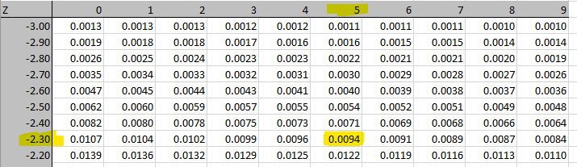
	
The University, on this instance, would have to concede that they have not reached their target.

:::


Hopefully you realise that the process of hypothesis testing for a proportion is very similar to testing a population mean. All you need to know is how to estimate $\sigma^2_{\hat{P}}$. That in combination with the knowledge that (for large samples) the test statistic is normally distributed delivers all the information you need.

::: {.callout-note icon=false}

#### Exercise

You are producer of iPhone covers. You have just \href{https://99designs.co.uk/blog/trends/color-trends/}{read} that the latest colour trend is to use a Tangerine Disco colour schemes (well that was trendy in the 2026 version, trends will have totally changed if you read this any later). You are sceptical and before investing into new designs you decide to ask a random sample of your customers whether they would be interested to buy such a phone cover for their next phone.
	
You decide that it will be worth investing into this new trend if more than 20% of your customers indicate that they would indeed consider buying such a phone cover.
	
What should be your set of hypotheses to test?
	
* (A) $H_0: p = 0.2;~H_A:p \neq 0.2$
* (B) $H_0: p \leq 0.2;~H_A:p > 0.2$
* (C) $H_0: p \geq 0.2;~H_A:p < 0.2$
* (D) $H_0: p \leq 0.19;~H_A:p > 0.19$
* (E) $H_0: p \geq 0.21;~H_A:p < 0.21$

`r mcq(c("A.",answer = "B.","C.","D.","E."))`

`r hide("Solution")`

$H_0: p \leq 0.2;~H_A:p > 0.2$ is the right hypothesis. You want to be confident that there are more than 20\% of customers interested. So you stick that into the alternative hypothesis and only reject $H_0$ (no investment) if there is sufficient evidence that it should be rejected.
`r unhide()`

In a sample of 367 randomly selected customers you find 92 customers that are interested in a 70s colour scheme phone cover. 

What is the sample proportion?

$\hat{p} =$ `r fitb(0.2507)`

What is the test statistic?

$z =$ `r fitb(2.4282, tol = 0.0001)`

What is the p-value?

$p-value = $ `r fitb(0.0075,tol = 0.001)`
	
`r hide("Solution")`
The sample proportion is:	$\hat{p} = \frac{92}{367}=0.2507$  
The test stat is:	$Z = \frac{\hat{p}-p_0}{\sqrt{\frac{p_0(1-p_0)}{n}}} = \frac{0.2507-0.2}{\sqrt{\frac{0.2 (1-0.2)}{367}}} = \frac{0.0507}{0.02088} = 2.4282$  
And the p-value is:	$p-value = 0.0075$ which comes from the standard normal table or from EXCEL.
`r unhide()`

At what level of significance would you reject $H_0$? (multiple correct answers are possible)
	
* $\alpha = 0.2$ `r mcq(c(answer = "Reject H0", "Do not reject H0"))`
* $\alpha = 0.1$ `r mcq(c(answer = "Reject H0", "Do not reject H0"))`
* $\alpha = 0.05$ `r mcq(c(answer = "Reject H0", "Do not reject H0"))`
* $\alpha = 0.01$ `r mcq(c(answer = "Reject H0", "Do not reject H0"))`
* $\alpha = 0.001$ `r mcq(c("Reject H0",answer =  "Do not reject H0"))`

:::


### Testing for the equality of means

Let us continue thinking about you as the potential producer of iPhone covers. In the previous section you have discovered that there is potentially enough interest from your customers to purchase new phone covers in a 70s colour scheme. In that same survey where you asked that question, you also asked whether customers may be interested in purchasing new phone covers in "walnut retro" (rated on place seven in the 2026 version of [this listing of trendy colour schemes](https://www.vistaprint.com/hub/color-trends). For that you equally had fairly strong interest. However, you only want to pay designers for one of these two schemes. It is your suspicion that there is no difference in the price you could charge for such a phone cover. However, your marketing department decides to run a survey in which they ask customers how much they would be willing to pay for the respective premium phone cover. 

The marketing team actually send out two different questionnaires such that you get the sample information on your customers' willingness to pay from two different samples.

Here is the information you get ($\bar{w}$ represents the average willingness to pay in the respective sample):

Sample "tangerine disco":
\begin{itemize}
	\item $n_1 = 187 $
	\item $\bar{w}_1 = 11.54 $
	\item $s_1 = 1.23$
\end{itemize}

Sample "walnut retro":
\begin{itemize}
	\item $n_2 = 132 $
	\item $\bar{w}_2 = 12.01 $
	\item $s_2 =  0.94$
\end{itemize}

Let $\mu_1$ and $\mu_2$ be the respective values for the unknown population willingness to pay. How would you use this information to test whether your suspicion that the willingness to pay is identical is correct?

If you look up any Business or Economics Statistics textbook you are likely to find a chapter on "Comparing two population means". From there you will find the information that the test statistic for testing $H_0: \mu_2 - \mu_1 = 0; ~H_A: \mu_2 - \mu_1 \neq 0$ is 

\begin{equation*}
	t = \frac{(\bar{w}_2-\bar{w}_1)-(\mu_2 - \mu_1)}{\sqrt{\frac{s^2_p}{n_1}+\frac{s^2_p}{n_2}}}
\end{equation*}

where $s^2_p$ is a pooled estimate of the variance

\begin{equation*}
	s^2_p = \frac{(n_1 - 1)s^2_1+(n_2-1)s^2_2}{n_1+n_2-2}
\end{equation*}

This follows a t-distribution with $n_1+n_2-2$ degrees of freedom if

1. the two samples are independent
2. the two populations are normally distributed
3. the two population variances are identical (although unknown), which is why we estimate one pooled variance from the two samples

Following our earlier discussion it is clear that these are quite restrictive assumptions, in particular that on the population normality and the equality of population variance. In our example above there is no a-priori reason to think that this should be the case.

As it turns out, the appropriate testing procedure, if any of these assumptions are breached, is the subject of substantial debate in the community of statisticians (For a good summary read the introduction and conclusion of Nguyen, D.T. et al. (2016) "Parametric Tests for Two Population Means under Normal and Non-Normal Distributions," Journal of Modern Applied Statistical Methods: Vol. 15 : Issue 1 , Article 9. DOI: 10.22237/jmasm/1462075680). 

In the case of unequal variances and/or non-normal distributions, the test statistic is the Satterthwaite t-test for the equality of means:

\begin{equation*}
	t = \frac{(\bar{w}_2-\bar{w}_1)-(\mu_2 - \mu_1)}{\sqrt{\frac{s^2_1}{n_1}+\frac{s^2_2}{n_2}}}
\end{equation*}

This is almost the same as the earlier one with the difference being that we do not first calculate a pooled variance estimate, but just use the variance estimates of the two samples ($s^1_1$ and $s^2_2$) directly. There is also an adjusting (downwards) of the degrees of freedom in the t-distribution used to calculate the p-value. For instance, in the above example the degrees of freedom, if the assumptions were met, would be $n_1+n_2-2= 187+132-2=317$. For the Satterthwaite t-test the degrees of freedom are adjusted downwards. The downwards adjustment is more severe if the sample variances are very unequal (no details of the Satterthwaite adjustment are needed). 

As we know that for large degrees of freedom the t-distribution converges to the $N(0,1)$ distribution, the correction in the degrees of freedom will only matter if the corrected degrees of freedom make a substantial difference in the distribution. A very conservative correction would be to use the smaller of $n_1-1$ and $n_2-1$ as the degrees of freedom instead. In this case this would be $132-1 = 131$ degrees of freedom. Even with these degrees of freedom the t-distribution is still well approximated by the $N(0,1)$ distribution. You can see in the table below that 120 is the largest degrees of freedom reported. If the degrees of freedom are larger than that we approximate the t-distribution with the $N(0,1)$.

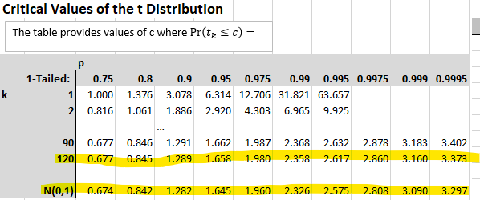

This means that we can continue our example without having to assume population normality and equal variances. Let us calculate the test-statistic;

\begin{eqnarray*}
	t &=& \frac{(\bar{w}_2-\bar{w}_1)-(\mu_2 - \mu_1)}{\sqrt{\frac{s^2_1}{n_1}+\frac{s^2_2}{n_2}}} \\
	 &=&\frac{(12.01-11.54)-0}{\sqrt{\frac{1.23^2}{187}+\frac{0.94^2}{132}}}\\
	 &=&\frac{0.47}{0.1216} = 3.8651
\end{eqnarray*}

What is the resulting p-value? We go to the t-distribution table and see that 3.8651 is to the right of 3.297 (using $N(0,1)$). That means that the tail probability $Pr(t>3.8651)$ has to be smaller than 0.0005 (which is the tail probability for 3.297). As we are performing a two-tailed test we have to double that tail probability to get the p-value. We therefore know that the p-value is smaller than $0.001~(=2 \cdot 0.0005)$. This implies that there is very little support from the data for $H_0: \mu_2 - \mu_1 = 0$. We would reject the null hypothesis that there is equal willingness to pay for the "tangerine disco" and the "walnut retro" themed phone covers at significance levels as low as 0.001. The data suggest that the company could charge more for "walnut retro" themed phone covers.

::: {.callout-note}

#### Testing for equality of means in EXCEL

In Excel's data analysis tool-pack you can chose three different options for testing for the equality of means, as shown in the image.

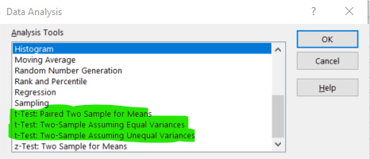

The option "Two-Sample Assuming Equal Variances" will apply the t-test using the pooled variance estimator and using $n_1+n_2-2$ degrees of freedom. The option "Two-Sample Assuming Unequal Variances" does calculate the Satterthwaite t-test with adjusted degrees of freedom.

The "Paired Two Sample for Means" is a test we did not discuss here. This is the version you want to use when you get two observations from each subject, e.g. the same person tells you what they are willing to pay for phone cases in the two different colour schemes.

:::

::: {.callout-note icon=false}

#### Exercise

You obtain the following two sets of sample information:
	
Sample A:
* $n_A = 58 $
* $\bar{x}_A = 4.85 $
* $s_A = 0.69$

Sample B:
* $n_B = 46 $
* $\bar{x}_B = 5.15 $
* $s_B =  0.54$

You wish to test the following hypotheses: $H_0: \mu_B - \mu_A = 0; ~H_A: \mu_B - \mu_A > 0$.
	
Calculate the test statistic:

$t=$ `r fitb(2.4872)`

If you were very concerned about unequal population variances and non-normal population distributions, what would be the degrees of freedom you would use? 

adjusted d.o.f = `r fitb(45)`


What is the test statistic's p-value in this scenario? 

`r fitb(0.001)` $< p-value <$ `r fitb(0.005)`

`r hide("Solution")`
\begin{equation*}
	t = \frac{(5.15-4.85)-0}{\sqrt{\frac{0.69^2}{58}+\frac{0.54^2}{46}}} = 2.4872
\end{equation*}

d.o.f.: The smaller of (58-1) and (46-1), hence 45.
	
p-value: $0.005<p-value<0.01$ (use the closest degrees of freedom available, here 40. The test statistic is between 2.423 and 2.704, which have tail probabilities 0.001 and 0.005. hence the p-value is between these two values.)

`r unhide()`

If you were confident that the population distributions were normally distributed and had equal population variances, what would be the degrees of freedom you would use? 

d.o.f = `r fitb(102)`

What is the test statistics p-value in this scenario? 

`r fitb(0.005)` $< p-value <$ `r fitb(0.01)`

`r hide("Solution")`

d.o.b: $n_A+n_B + 2 = 102$.

p-value: $0.005<p-value<0.01$ (use the closest degrees of freedom available, here 90. The test statistic is between 2.368 and 2.632, which have tail probabilities 0.001 and 0.005. hence the p-value is between these two values.)

`r unhide()`	

:::


### Testing for independence of two categorical random variables

[Here](data/titanic.xlsx) you can find a spreadsheet with information on (a subset of) the Passengers on the ill-fated 1912 voyage on the Titanic. This is an image of the first few entries on that spreadsheet.


Two of the pieces of information we have on each passenger is which class they were booked in and whether they survived (1=yes, 0=no). Both of these are categorical variables and a good way to display that information is in a contingency table.

| Obs ($O_{ij}$) | Class |     |     |       |
|----------------|-------|-----|-----|-------|
| Survived       | 1st   | 2nd | 3rd | Total |
| No = 0         | 129   | 161 | 573 | 863   |
| Yes = 1        | 193   | 119 | 138 | 450   |
| Total          | 322   | 280 | 711 | 1313  |

The next table shows the joint probabilities.

| Obs: $\Pr(C \cap S )$ | Class ($C$) | ~      | ~      | ~        |
|-----------------------|-------------|--------|--------|----------|
| Survived $S$          | 1st         | 2nd    | 3rd    | Marginal |
| No =0                 | 0.0982      | 0.1226 | 0.4364 | 0.6573   |
| Yes = 1               | 0.1470      | 0.0906 | 0.1051 | 0.3427   |
| Marginal              | 0.2452      | 0.2133 | 0.5415 | 1.0000   |


Recall that we see, in the center of the table, joint probabilities and $\Pr((C=c) \cap (S=s) )$, and in the margins of the table we see the marginal probabilities ($\Pr(S=s)$ and $\Pr(C=c)$).

We may now ask the question whether the two variables Passenger Class ($C$) and Survival ($S$) are dependent or independent. In other words, did your probability of survival depend on which class you were booked on. We will investigate this question with a hypothesis test. Let us spell out the hypotheses we would use in such a context.

\begin{eqnarray*}
	H_0&:& C ~ and ~ S ~ are~ independent\\
	H_A&:& C ~ and ~ S ~ are ~ dependent
\end{eqnarray*}

To continue with that question we, as usual when performing hypothesis tests, assume that the null hypothesis is true. If the null hypothesis was true, the two random variables are independent, then we should be able to reconstruct the joint probabilities from the marginal probabilities.

\begin{equation}
	\Pr((C=c) \cap (S=s) ) = \Pr(C=c) \cdot \Pr(S=s) 
\end{equation}

This equation is only correct if $S$ and $C$ are independent. In general $	\Pr((C=c) \cap (S=s) ) = \Pr(C=c) \cdot \Pr(S=s|C=c) $ which comes from Bayes Theorem. We now reconstruct all the joint probabilities assuming independence. For instance

\begin{equation}
	\Pr((C=2nd) \cap (S=1) ) = \Pr(C=2nd) \cdot \Pr(S=1) = 0.2133 \cdot 0.3427   = 0.0731
\end{equation}

We can do similar calculations for the other five joint probabilities and they are all shown in the Table below (note that the marginal probabilities remain unchanged).

| Indep: $\Pr(C) \Pr(S)$ | Class ($C$) | ~      | ~      | ~        |
|------------------------|-------------|--------|--------|----------|
| Survived $S$           | 1st         | 2nd    | 3rd    | Marginal |
| No =0                  | 0.1612      | 0.1402 | 0.3559 | 0.6573   |
| Yes = 1                | 0.0841      | 0.0731 | 0.1856 | 0.3427   |
| Marginal               | 0.2452      | 0.2133 | 0.5415 | 1.0000   |

These probabilities are different to those that we observed. We could now continue and ask, how many of our 1313 Titanic passengers on our database we would have expected to come from 2nd class and have survived if the two variables were independent. We know that this should be 7.31% of the total of 1313, that is 95.96.

We can perform a similar calculation for all the six combinations of outcomes for the variables $C$ and $S$. The folowing table shows both, the original number of observations ($O_{sc}$) and the expected number of observations ($E_{sc}$) if $C$ and $S$ were independent.

| $O_{sc}$ ($E_{sc}$) | Class        |              |              |       |
|---------------------|--------------|--------------|--------------|-------|
| Survived            | 1st          | 2nd          | 3rd          | Total |
| No = 0              | 129 (211.64) | 161 (184.04) | 573 (467.32) |       |
| Yes = 1             | 193 (110.35) | 119 (95.96)  | 138 (243.68) |       |
| Total               |              |              |              | 1313  |

You can already see from this table that, if the two variables were independent we should expect to see more survivors from the 3rd class passengers (243.68 compared to 138). In reverse, we do see more 1st class survivors than we would expect under independence (193 compared to 110.35). These differences seem suggestive of the two random variables not being independent, but, as we are trained as good statisticians, we know that, even if the null hypothesis of independence was correct, we would expect to see some sample variations.

The question is, however, how likely is it to see differences like the ones we can see in the last table (or more extreme) if the null hypothesis was true. In other words, we wish to calculate a p-value for the above hypothesis.   

As you know from previous applications for hypothesis testing, to calculate a p-value we need a test statistic and a distribution. The test statistic is defined as

\begin{equation*}
	C^2 = \Sigma_{all~S} \Sigma_{all~C}  \frac{(O_{cs} - E_{cs})^2}{E_{sc}}
\end{equation*}

The double sum merely achieves that we calculate this difference for all joint categories (here six) and the index $sc$ indexes the survival status ($S=s$) and the class ($C=c$) respectively. 

The test statistic $C^2$ increases as the differences ( $O_{cs} - E_{cs}$ ) increase. The question is when is it too big (or the probability of it occurring under the validity of the null hypothesis too small) to be consistent with the null hypothesis. This can be determined once you know the test statistic's distribution. 

\begin{equation*}
	C^2 \sim \chi^2_{(rows-1)(cols-1)}
\end{equation*}

The $\chi^2$ distribution, like the t-distribution has one degrees of freedom parameter. For this particular test, that degrees of freedom parameter is calculated as $(rows-1)(cols-1)$ where $rows$ is the number of row categories (here 2 as the survival variable has two categories) and $cols$ is the number of column categories (here 3, the number of classes on the Titanic). Therefore, in our example the degrees of freedom parameter take the value $1\cdot2=2$.

Depending on the degrees of freedom, $\chi^2$ distributions can take quite different shapes. The following image provides a few examples.

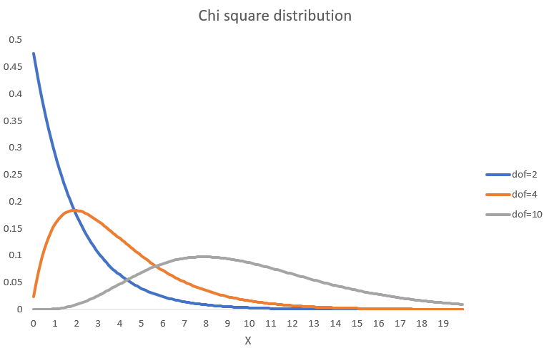

As for the t- and Normal distribution there are statistical tables. You could also use the Excel function "=CHISQ.DIST(X,dof,TRUE)" to get $\Pr(\chi^2_{dof}\leq X)$ to obtain probabilities from the cdf.
So, let's calculate that test statistic for our example

\begin{eqnarray*}
	C^2 &=& \frac{(129 - 211.64)^2}{211.64} + \frac{(161 - 184.04.64)^2}{184.04} + \frac{(573 - 467.32)^2}{467.32} +\\ &&\frac{(193 - 110.35)^2}{110.35} + \frac{(119 - 95.96)^2}{95.96} + \frac{(138 - 243.68)^2}{243.68}\\ 
	&=&  172.30  
\end{eqnarray*}

To calculate the p-value we now need to figure out $\Pr(\chi^2_{2}\geq 172.30)=1-\Pr(\chi^2_{2}< 172.30)$ recognising that we are looking at 2 degrees of freedom. By visually inspecting the $\chi^2$ cdf with two degrees of freedom you can already tell that virtually all density is to the left of 172.30 (with the largest X value being 20 on the graph). So in this example $\Pr(\chi^2_{2}\geq 172.30)=1-1=0$. So the p-value of our test is virtually 0 and hence we reject $H_0$. This means, for this example we reject the null hypothesis and we conclude that there is dependence between $S$ and $C$ and we confirm what we suspected after looking at the earlier table. As a first class passenger you had a higher probability of surviving the sinking of the Titanic.

For this test statistic to provide reliable results we need two things:

1. the data need to be a random sample from a population 
2. sufficient observations, such that in each of the categories we have $E_{sc} \geq 5$

In case you do have categories which are too small you can consider combining categories to greater larger categories.


::: {.callout-note}

#### Example

You are the manager of a record store ([For the younger of you a visit to Picadilly Records may be useful, like this one in Manchester, UK](https://www.piccadillyrecords.com/)). One of your unique selling points is that you have staff members who are very knowledgable in particular genres of music. You wonder whether on different days your customers' music taste is significantly different.
	
For one (typical) week you record the number of customers and ask them for their favourite music genres.
	
| Observed        | Music ($M$)   |      |       |     |       |
|-----------------|---------------|------|-------|-----|-------|
| Weekday ($W$)   | Hip Hop       | Rock | Metal | Pop | Total |
| Monday          | 40            | 60   | 92    | 98  | 290   |
| Tuesday         | 36            | 66   | 67    | 67  | 236   |
| Wednesday       | 29            | 69   | 54    | 58  | 210   |
| Thursday        | 43            | 90   | 98    | 78  | 309   |
| Friday          | 82            | 156  | 132   | 134 | 504   |
| Saturday        | 78            | 134  | 151   | 144 | 507   |
| Total           | 308           | 575  | 594   | 579 | 2056  |

	 
What is the test statistic? 

$\chi^2 =$ `r fitb(19.3011, tol =0.001)`

What are the d.o.f. for the distribution of the test statistic under the null hypothesis? 

d.o.f = `r fitb(15)`

What is the test's p-value? 

p-value = `r fitb(0.2004)`

What is your conclusion?

* A. There is very little evidence to support the null hypothesis that customer's music tastes differ by weekday.
* B. There is very little evidence to support the null hypothesis that customer's music tastes are the same on different weekday..
* C. There is not sufficient evidence to reject the null hypothesis that customer's music tastes differ by weekday.
* D. There is not sufficient evidence to reject the null hypothesis that customer's music tastes are the same on different weekday.

`r hide("Solution")`

Test stat: $\chi^2 = 19.3011$ (best to use EXCEL)  
$dof = (6-5)(4-1)=15$  
$p-val = 0.2004$

Here is a video walk-through for the above problem (YouTube, 27min)



`r unhide()`

:::

### Summary

The last three examples were examples of hypothesis tests that test for other things but for a value of the population mean. There are many other tests you could perform. Commonly you may want to perform a test on the variance (or equality of variances) in a population or on the type of distribution in the population.

If you are an applied economist you may frequently refer to textbooks or the internet to search for "Hypothesis test of XX". Here we cannot cover any of these details, but hopefully, by now, you realise that hypothesis tests have some common features:

* A set of hypotheses
* A test statistic
* A distribution for this test statistic (assuming $H_0$ is correct and potentially the validity of some further assumptions)
* Calculate a p-value to see how compatible the data are with the null hypothesis

If you look for these elements in any hypothesis test then you should be able to navigate new tests (YouTube, 2min).



::: {.callout-important}

### Statistical v. Economic significance

There is an additional aspect of hypothesis tests you should be aware of. You may well conclude, after performing a hypothesis test that there is sufficient statistical evidence to reject a null hypothesis. We sometimes call this a statistically significant test result. If this is formulated carefully it will not say just "siginificant test result", i.e. without the "statistically". Because, what is statistically significant is not necessarily substantially, or economically, significant. 

Especially in times where we can use large amounts of data, we may find statistically significant results which are not really substantially significant. A good example of such a case is described by [David Spiegelhalter in this blog post](https://understandinguncertainty.org/risks-big-data-%E2%80%93-or-why-i-am-not-worried-about-brain-tumours). Here he describes why the finding that people with university degrees are statistically more likely to have brain tumors should not keep you awake at night.

:::

## Extra reading

If you want to know more about the subtleties of p-values, then this is a good read: Lew, M.J. (2020) [A Reckless Guide to P-values: Local Evidence, Global Errors, Part of the Handbook of Experimental Pharmacology book series](https://link.springer.com/chapter/10.1007/164_2019_286) (HEP,volume 257).


