# Normally Distributed Random Variables

```{r setup, include = FALSE}
knitr::opts_chunk$set(echo = FALSE)

library(webexercises)
```

## Introduction

A short video introduction to why the normal distribution is so important (YouTube, 2min).



There are three reasons why the normal distribution, which is also a continuous distribution, deserves its own section and is not merely listed as yet another continuous distribution. Briefly the motivation for wishing to study the normal distribution in detail can be summarised in these three points:

* it provides a natural representation for many continuous random variables that arise in the social (and other) sciences.
* it can provide a good approximation to the binomial distribution.
* many functions of interest in statistics deliver random variables which have distributions closely approximated by the normal distribution.

Let's look at a particular natural process, the weight of babies at birth. This is a continuous random variable, but the following image shows a histogram of a discretised version. 

](images/birthweight.png)

The key features of this distribution are:


* It is has one bulk of probability in the centre, we sometimes call this unimodal.
* The more extreme the values, the less likely they are to occur.
* The distribution is approximately symmetric around the mean.

Other natural processes that have similar characteristics are; the height of males at a particular age, the height of females at a particular age and blood pressure. Some technical processes also deliver normal distributions. An example is the measurement errors of measurement instruments (like astronomical observations). If you are interested you can read about the history of the normal distribution in this article by [Saul Stahl](https://www.researchgate.net/publication/255668423_The_Evolution_of_the_Normal_Distribution). 

We shall see shortly that the normal distribution is defined by a particular probability density function it is therefore appropriate (in the strict sense) for modelling continuous random variables. Not withstanding this, it is often the case that it provides an adequate approximation to another distribution, even if the original distribution is discrete in nature, as we shall now see in the case of a binomial random variable.

Further, the normal distribution plays a unique role in the theory of statistics, in particular in statistical inference (which is discussed in a later section). It is without doubt the most important distribution you will learn about. We introduce it here, and study its characteristics, but you will encounter it many more times in this, and other, statistical or econometric courses. 


## The Normal distribution as an approximation to the Binomial distribution

Let us briefly explain what we mean by the ability of the normal distribution to approximate other distributions. The binomial probability distribution encountered previously, monitoring the total number of successes in $n$ independent and identical Bernoulli experiments, is a very important distribution. Indeed, this distribution was proposed as such by Jacob Bernoulli (1654-1705) in about 1700. However as $n$ becomes large, the Binomial distribution becomes difficult to work with and several mathematicians sought approximations to it using various limiting arguments. Following this line of enquiry two other important probability distributions emerged; one was the Poisson distribution, due to the French mathematician Poisson (1781-1840), and published in 1837. The other, is the normal distribution due to De Moivre (French, 1667-1754), but more commonly associated with the later German mathematician, Gauss (1777-1855), and French mathematician, Laplace (1749-1827). Physicists and engineers often refer to it as the Gaussian distribution. There a several pieces of evidence which suggest that the British mathematician/statistician, Karl Pearson (1857-1936) coined the phrase normal distribution.

For the purpose of illustration we shall use the example of flipping a coin a number of times ($n$). As we assume that our coin is fair this implies that the probability of success is 0.5, $\pi=0.5$. Let the random variable of interest be the proportion of times that a HEAD appears and let us consider how this distribution changes as $n$ increases:

* If $n=3$, the possible proportions could be $0,\,\,1/3,\,\,2/3\,\,\,or \,\,\,1$
* If $n=5$, the possible proportions could be $0,\,\,1/5,\,\,2/5,\,\,3/5,\,\,4/5\,\,\,or\,\,1$
* If $n=10$, the possible proportions could be $0,\,\,1/10,\,\,2/10,$ etc ...

The probability distributions, over such proportions (with $\pi=0.5$), for $n=3$, $5$, $10$ and $50$, are depicted in the following Figure.

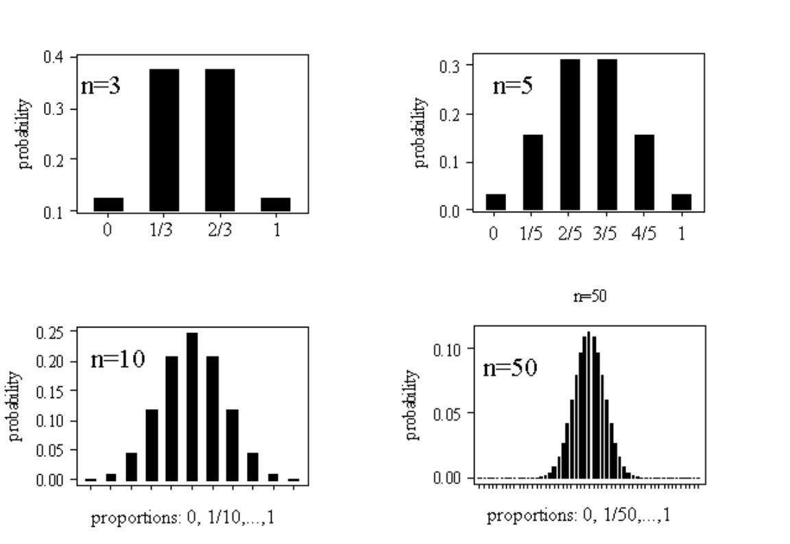

You can see that these distributions share all the properties listed above (unimodality or bell-shape, symmetry and decreasing probability in the extremes), especially as the sample size increases. At this stage it is not obvious why these proportions should be normally distributed and why increasing the sample size should lead to more normal looking distributions.

Having motivated the normal distribution via this special approximation argument, let us now investigate the fundamental mathematical properties of this bell-shape.

## The Normal distribution

The normal distribution is characterised by a particular probability density function $f(x)$, the precise definition of which we shall divulge later. For the moment the important things to know about this function are:

* it is bell-shaped
* it tails off to zero as $x\rightarrow \pm \infty $
* area under $f(x)$ gives probability; i.e., $\Pr \left( a<X\leq b\right) =\int_{a}^{b}f(x)dx$, as for all continuous distributions.

The Normal density function has the classic bell shape which is shown here

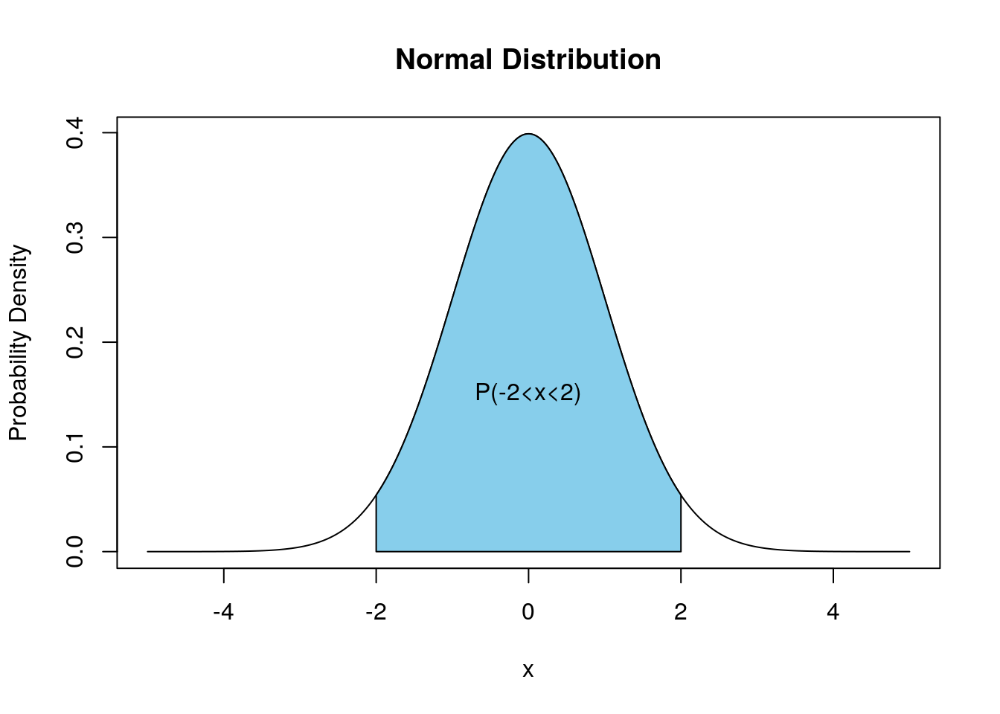

The specific location and scale of the bell depend upon two parameters (real numbers) denoted $\mu$ and $\sigma$ (with $\sigma >0$). $\mu $ is the Greek letter "mu" (with English equivalent m) and $\sigma$ is the Greek letter "sigma" with (English equivalent s). Changing $\mu$ relocates the density (shifting it to the left or right) but leaving it's scale and shape unaltered. Increasing $\sigma$ makes the density fatter with a lower peak but fatter tails; such changes are illustrated here

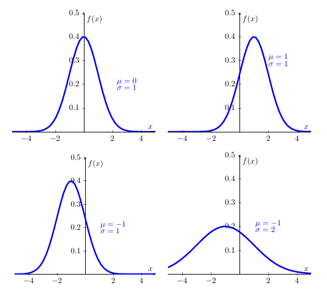


The normal distribution's pdf is defined by (you will not be expected to remember this formula ... unless you are planning to take econometrics classes):

\begin{equation*}
	f(x)=\frac{1}{\sigma \sqrt{2\pi }}\exp \left( -\frac{(x-\mu )^{2}}{2\sigma ^{2}}\right) ,\quad -\infty <x<\infty ;\quad -\infty <\mu <\infty ,\,\,\,\,\sigma >0,
\end{equation*}

and we say that a continuous random variable $X$ has a normal distribution if and only if it has pdf defined by $f(x)$, above. Here, $\pi$ is the number Pi $=3.14159..$. In shorthand, we write $X\sim N\left( \mu ,\sigma ^{2}\right)$, meaning "$X$ is normally distributed with location $\mu$ and standard deviation $\sigma $". However, a perfectly acceptable alternative is to say `$X$ is normally distributed with mean $\mu$
and variance $\sigma ^{2}$', for reasons which shall become clear in the next section.

Within these four normal distriutions above, the first one is an important special case of this distribution arises when $\mu =0$ and $\sigma =1$, yielding the standard normal density.


## The standard normal density

If $Z\sim N(0,1)$, then the pdf for $Z$ is written

\begin{equation*}
	\phi (z)=\frac{1}{\sqrt{2\pi }}exp(-z^{2}/2),\,\,\,-\infty <z<\infty ,
\end{equation*}

where $\phi$ is the Greek letter "phi", equivalent to the English \textit{f}. The pdf,$\phi \left( z\right)$, is given a special symbol because it is used so often and merits distinction. And we would usually call the random variable $Z$ if it is standard normally distributed. Indeed, the standard normal density is used to calculate probabilities associated with a normal distribution, even when $\mu \neq 0$ and/or $\sigma \neq 1$ (see below).

## The normal distribution as a model for data

Apart from its existence via various mathematical limiting arguments, the normal distribution offers a way of approximating the distribution of many variables of interest in the social (and other) sciences. For example consider the Survey of British Births which recorded the birth-weight of babies born to mothers who smoked and those who didn't. The following Figure, depicts the histogram of birth-weights for babies born to mothers who had never smoked. Superimposed on top of that is normal density curve with parameters set at $\mu =3353.8$ and $\sigma =572.6$.

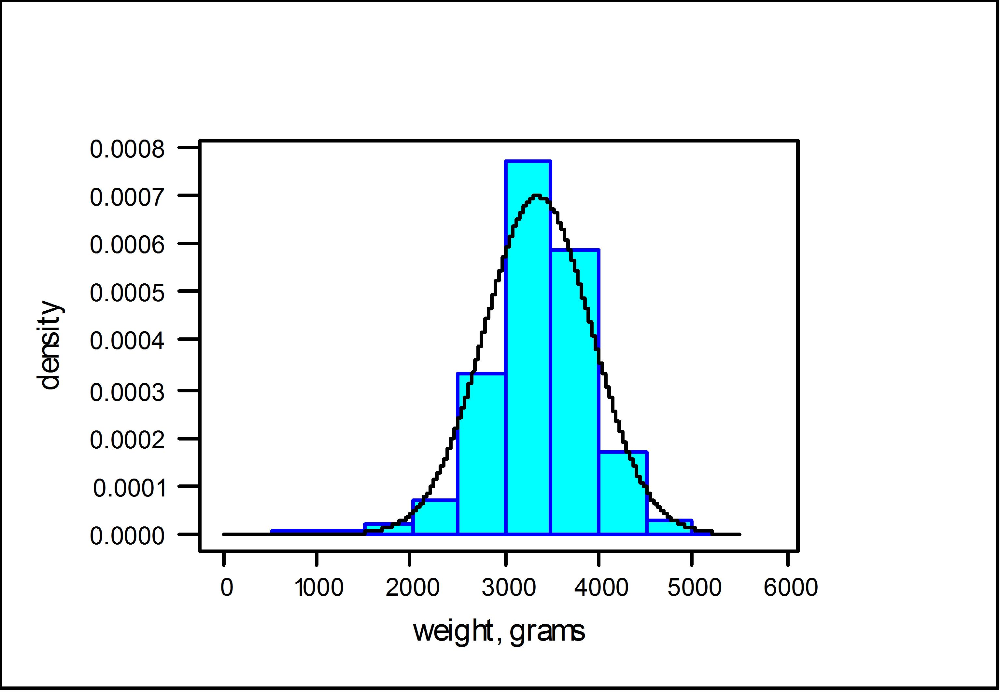

As can be seen, the fitted normal density does a reasonable job at tracing out the shape of the histogram, as constructed from the data. (I will leave it as a matter of conjecture as to whether the birth-weights of babies born to mothers who smoked are normal.) The nature of the approximation here is that areas under the histogram record the relative frequency, or proportion in the sample, of birth-weights lying in a given interval, whereas the area under the normal density, over the same interval, gives the probability.

Let us now turn the question of calculating such probabilities associated with a normal distribution.


## Calculating probabilities

Since $f(x)$ is a pdf, in order to obtain probabilities we need to think area underneath the pdf. Mathematically we will have to integrate to calculate probabilities. Unfortunately, there is no easy way to integrate $\phi (z)$, let alone $f(x)$. To help us, however, special (statistical) tables (or computer packages such as EXCEL) provide probabilities about the standard normal random variable $Z\sim N(0,1)$ and they can be used to obtain probability statements about $X\sim N(\mu ,\sigma ^{2})$.

To develop how this works in practice, we require some elementary properties of $Z\sim N(0,1)$.

### A few elementary properties $Z\sim N(0,1)$

Firstly, we introduce the cdf for $Z$, This functions is denoted $\Phi \left( z\right)$, where $\Phi$ is the upper case Greek $F$, and is defined as follows:

\begin{equation*}
	\Phi (z)=\Pr (Z\leq z)=\int_{-\infty }^{z}\phi (t)dt,
\end{equation*}

which is the area under $\phi (.)$ up to the point $z$, with $\phi (z)=d\Phi (z)/dz$. This is all as per the general recipe for continuous probability distributions. Graphically the cdf has the typical shape of a cdf.

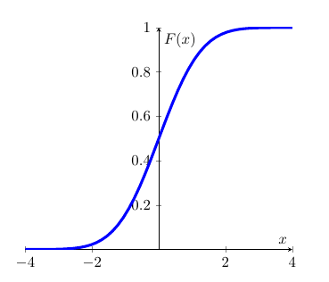

Due to the symmetry of $\phi (z)$ around the value $z=0$, it follows that:

\begin{equation*}
	\Phi (0)=\Pr (X\leq 0)=1/2
\end{equation*}

and, in general,

\begin{eqnarray*}
	\Phi (-z) &=&\Pr (Z\leq -z) \\
	&=&\Pr (Z>z) \\
	&=&1-\Pr (Z\leq z) \\
	&=&1-\Phi (z).
\end{eqnarray*}

The role of symmetry and calculation of probabilities as areas under $\phi (z)$ is illustrated in the following Figure. In the diagram on the left hand side, the area under $\phi (z)$ is divided up into two parts: the area to the left of $0$ which is $\Phi (0)$; and the area to the right of $0$ which is $1-\Phi (0)$. Both areas add up to 1.

On the right hand side you can see the two highlighted (in green) areas of the distribution's tails, $\Phi (-a)$ and $1-\Phi(a)$. You need to recall that $\Phi(a)=Pr(-\infty < Z \leq a)$ and that the highlighted area in the right hand tail represents $Pr(a < Z \leq \infty)$. As the entire area underneath the probability is 1, this implies that the area is equivalent to $1-\Phi(a)$. Due to symmetry, both highlighted areas have the same size, say $\Phi (-a)$ = $1-\Phi (a)$.

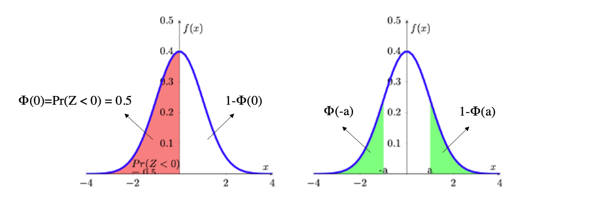


### Calculating probabilities when $Z\sim N(0,1)$

Armed with these properties we can now use the "standard normal" table of probabilities. You can download the table with values for $\phi(z)$ from [here](data/NormalTable.pdf). These are exactly the tables which you will be expected to use in any examinations. You will find such tables in any statistics textbook or you can look for them online.

The probabilities provided by this table are of the form $\Pr (Z\leq z)=\Phi (z)$, for values of $-\infty<z<\infty $. In practice the tables rarely go beyond $|z|=3$ as the probabilities in the tail get very small. Also, some tables will only show $0<z<\infty $ as all other probabilities can be deduced from the symmetry property. Therefore, you should be carefully check the value range of $z$ before you use the table.

For example, using the downloadable table above, you should understand $\Pr (Z\leq 0]=0.5000$.

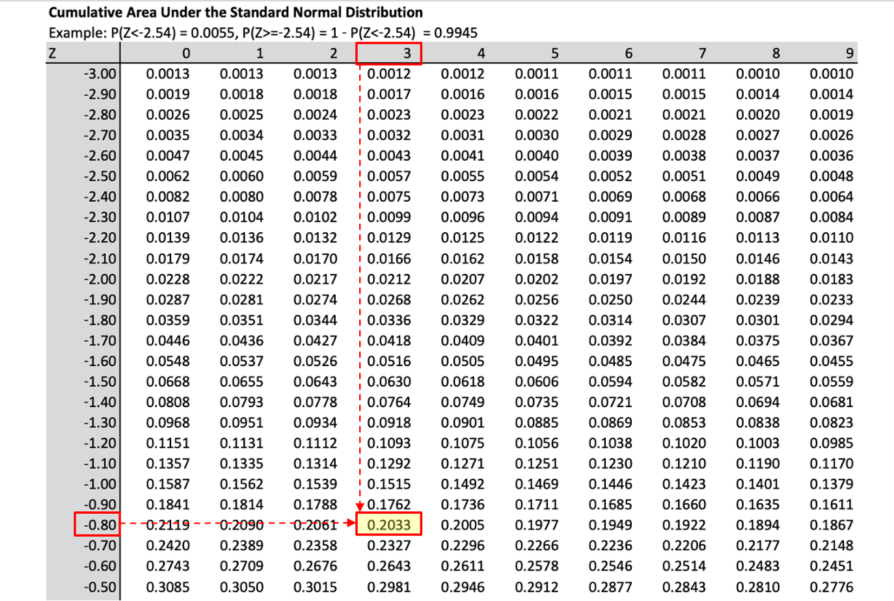

You should also satisfy yourself that you understand the use of the table by verifying that,

	\begin{array}{ccc}
		\Pr (Z\leq 0]=0.5000; &  & \Pr (Z\leq 0.5)=0.6915; \\
		\Pr (Z\leq 1.96)=0.9750; &  & \Pr (Z\geq 1)=\Pr (Z\leq -1)=0.1587,\text{ }etc.%
	\end{array}

The calculation of the probability

\begin{equation*}
	\Pr (-1.62 <Z\leq 2.2)=\Pr (Z\leq 2.2)-\Pr (Z\leq -1.62)
\end{equation*}

is illustrated in the following Figure.

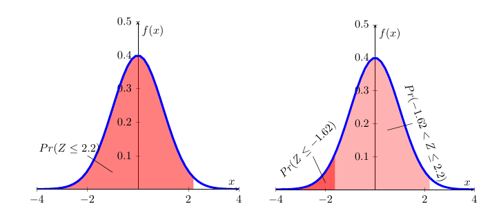


The left hand diagram merely illustrates $Pr(Z\leq2.2)$. In the right hand diagram this is combined with $Pr(Z\leq -1.62)$ such that the difference between the two areas delivers $Pr(-1.62 < Z\leq 2.2)$. From the picture you cannot get the actual numerical results, but that you can get from the table:

\begin{eqnarray*}
	\Pr (-1.62 &<&Z\leq 2.2)=\Pr (Z\leq 2.2)-\Pr (Z\leq -1.62) \\
	&=&0.9861-0.0526 \\
	&=&0.9335
\end{eqnarray*}

::: {.callout-tip}

#### Using EXCEL to calculate standard normal probabilities

In order to calculate probabilities in EXCEL from the standard normal distribution we use the following function call:

"=NORM.DIST(x,0,1,TRUE)"

This will calculate probabilities of the type $Pr(Z \leq x)$ from $N(0,1)$. The first input is the value $x$, the second and third indicate the mean and the standard deviation (0 and 1 here) and the value "TRUE" as the fourth parameter indicates that we wish to have a value from the cdf returned.

The values you get from EXCEL are more precise as the values from the table as the latter are only available for $Z$ values in 0.01 intervals the robabilities for which are then rounded to 4 decimal places. In the exercises below the tolerances are set such that either using EXCEL or the Table will give you correct results.

:::


::: {.callout-note icon=false}

#### Exercise

Match the following probabilities to the pictures

* $Pr(Z\leq -0.4)$ `r mcq(c("A","B",answer = "C","D"))`
* $Pr(Z\geq 0.67)$ `r mcq(c(answer = "A","B","C","D"))`
* $Pr(0.2 < Z\leq 1.85)$ `r mcq(c("A",answer = "B","C","D"))`
* $Pr( |Z|\geq 1.96)$ `r mcq(c("A","B","C",answer = "D"))`

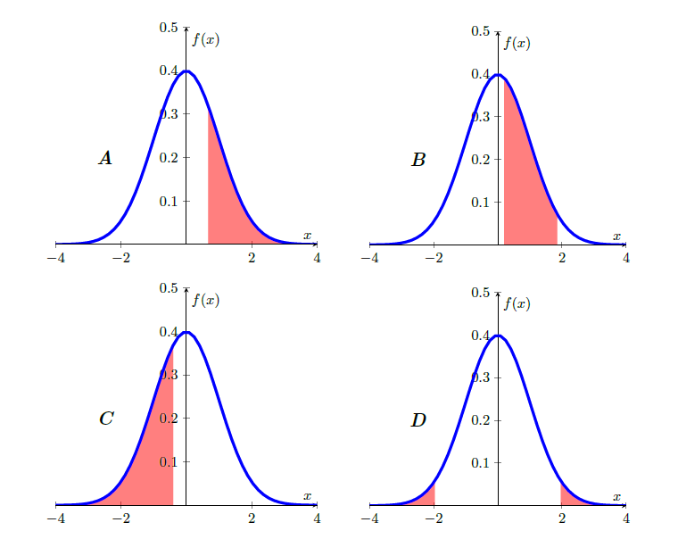

`r hide("Solutions")`

This clip goes through the calculations for the above examples (YouTube, 27min).



`r unhide()`

:::

::: {.callout-note icon=false}

#### Exercise

$Pr(Z \leq -0.71) =$ `r `fitb(0.2386, tol = 0.0005)` 

$Pr( Z \geq 0.72) = 1 - Pr(Z$ `r mcq(c(answer = "<", "=", ">"))` `r fitb(0.72)` $) =$ `r fitb(0.2358, tol = 0.0002)`  

$Pr(-1.46 \leq Z \leq 1.78) = Pr(Z$ `r mcq(c(answer = "<", "=", ">"))` $1.78) - Pr(Z < -1.46)=$ `r fitb(0.9625, tol = 0.0001)` $-$ `r fitb(0.0721, tol = 0.0001)` = `r fitb(0.8904, tol = 0.0005)`

$Pr( |Z|\geq 1.98) = 2 \cdot$ `r fitb(0.0239, tol = 0.0001)` $=$ `r fitb(0.0477, tol = 0.0003)`

`r hide("Hint")`

You can either use the above Table or EXCEL to solve these. It is helpful to draw little sketches as in the previous exercise before you solve the questions.

`r unhide()`
:::

When using tables you will sometimes have to use the Statistical Table in reverse order, meaning that you are given a probability but will then have to figure out what $Z$ value is associated with that probability.

For example you know that $Pr(Z \leq z) = 0.0129$. What is the associated value $z$? Go to the standard normal table and identify the probability value 0.0129 (or the closest) and then read off the value for $Z$:

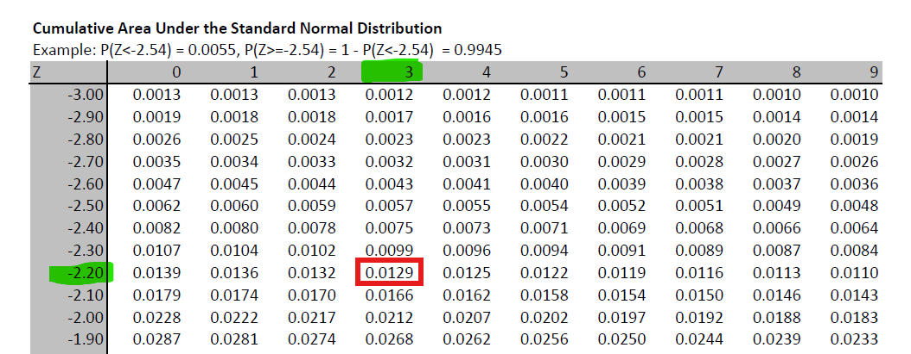

You can then see that the probability value is in the row for $-2.20$ and the column for $0.03$ which leads you to $z=-2.23$, such that $Pr(Z \leq -2.23) = 0.0129$.

::: {.callout-tip}

#### Using EXCEL to infer $Z$ values

To achieve the equivalent to a reverse reading of the probability table in EXCEL you use the following function 

"=NORM.INV(p,0,1)"

where the value "p" would be the probbaility you are looking for (in the above example 0.0129), and 0 and 1 stand for the mean and standard deviation of the $N(0,1)$ distributoin we are using here. If you enter "=NORM.INV(0.0129,0,1)" you will get a result of $-2.2291$ which, rounded to 2 decimal places is indeed $-2.23$ which we read off the table.

:::


::: {.callout-note icon=false}

#### Exercise

$Pr(Z \leq$ `r fitb(0.32)` $)=0.6255$

$Pr(Z \geq$ `r fitb(1.96)` $)=0.025$

:::


### Calculating probabilities when $X\sim N(\mu ,\sigma ^{2})$.

Normal distributions can have any mean ($\mu$) and standard deviation ($\sigma$). The case of $\mu=0$ and $\sigma=1$, the standard normal distribution (described in the previous section), is nothing but a special case. If there are random variables which can be represented or approximated by a normal distribution, then they are unlikely to be a standard normal distribution.

For instance, if you think about the height of adult males in the UK, then the average height is likely to be something around 178cm (see [Our World in Data](https://ourworldindata.org/human-height) for a discussion of Human height). This is very different from 0. In fact the value 0 makes no sense for such a random variable.

This means that you will have to learn how to calculate probabilities for a random variable $X$ where $X\sim N(\mu ,\sigma ^{2})$ and $\mu \neq0$ and $\sigma \neq 1$. Note that it is convention that we report $N$(mean, variance), and not $N$(mean, standard deviation). Fortunately it is possible to translate any probability problem for such a random variable $X$ into a problem for a standard normal random variable $Z$.

We can use the following results, which shall be stated without proof:

* If $Z\sim N(0,1)$, then $X=\sigma Z+\mu \,\,\,\sim \,\,\,N(\mu ,\sigma ^{2})$.
* If $X\sim N\left( \mu ,\sigma ^{2}\right)$, then $Z=\frac{X-\mu }{\sigma }\sim N\left( 0,1\right) $.

These two results allow us to translate any normally distributed random variable $X$ ($X\sim N(\mu ,\sigma ^{2})$) to a standard normally distributed random variable $Z$ ($X\sim N(0 ,1)$) and vice versa. 

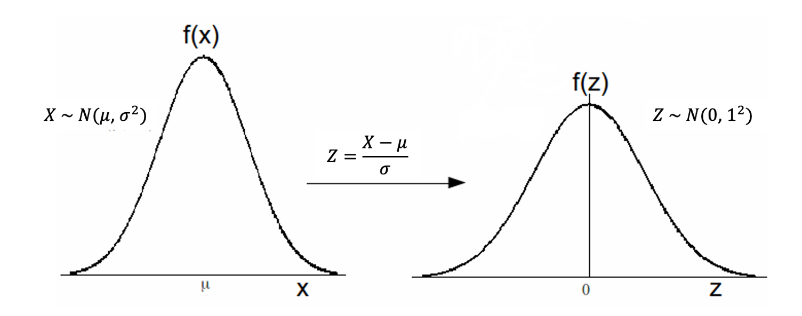

For example, if $Z\sim N\left( 0,1\right)$, then $X=3Z+6\sim N\left( 6,9\right)$; and, if $X\sim N\left( 4,25\right)$, then $Z=\frac{X-4}{5}\sim N\left( 0,1\right)$. 

These results allow us to translate a **non-standard** normal distribution to a **standard** normal distribution and hence will enable us to use the standard normal probability table to solve probability problems for all normal distributions. Let us illustrate how we translate problems in $X$ to problems in $Z$. Let's say we wish to calculate $\Pr (a<X\leq b)$ where $X\sim N(\mu ,\sigma ^{2})$.


\begin{eqnarray*}
	Pr(a<X\leq b) &=& Pr\left( a-\mu <X-\mu <b-\mu \right) \text{ subtract } \mu \text{ throughout}\\ 
	&=& \Pr \left( \frac{a-\mu }{\sigma }<\frac{X-\mu }{\sigma }\leq \frac{b-\mu }{\sigma }\right), \text{divide through by } \sigma \text{throughout}\\
	&=&  \Pr \left( \frac{a-\mu }{\sigma }<Z\leq \frac{b-\mu }{\sigma }\right), \text{ where } Z\sim N\left( 0,1\right)\\
	&=& \Pr \left( Z\leq \frac{b-\mu }{\sigma }\right) -\Pr \left( Z\leq\frac{a-\mu }{\sigma }\right)\\
	&=& \Phi \left( \frac{b-\mu }{\sigma }\right) -\Phi \left( \frac{a-\mu}{\sigma }\right)
\end{eqnarray*}

We thus find that $\Pr (a<X\leq b)=\Phi \left( \frac{b-\mu }{\sigma }\right) -\Phi \left( \frac{a-\mu }{\sigma }\right)$, and the probabilities on the right hand side are easily determined from Standard Normal Tables. The key of all these probability calculations is to translate the problem into such a form that you only need probabilities of the type $\Phi \left( z \right)$ which you can get from the standard normal table. The following example illustrates the procedure in practice:


::: {.callout-info}

#### Example

Let $X\sim N(10,16)$, what is $\Pr (0<X\leq 14)$. 

Here, $\mu =10,\sigma =4,a=0,b=14$; so, $\frac{a-\mu }{\sigma }=-2.5$ and $\frac{b-\mu }{\sigma }=1$.	Therefore, the required probability is:

\begin{eqnarray*}
	Pr(0<X\leq 14) &=& Pr\left( 0-10 <X-10 <14-10 \right) \text{ subtract } \mu=10 \text{ throughout}\\ 
	&=& \Pr \left( \frac{0-10}{4}<\frac{X-10}{4}\leq \frac{14-10}{4}\right), \text{divide through by } \sigma=4 \text{ throughout}\\
	&=&  \Pr \left( \frac{0-10}{4}<Z\leq \frac{14-10}{4}\right), \text{ where } Z\sim N\left( 0,1\right)\\
	&=& \Pr \left( Z\leq \frac{14-10}{4}\right) -\Pr \left( Z\leq\frac{0-10}{4}\right)\\
	&=& \Pr \left( Z\leq 1\right) -\Pr \left( Z\leq-2.5\right)\\
	&=& \Phi \left(1\right) -\Phi \left(-2.5\right) \\
	&=& 0.8413-0.0062=0.8351.
\end{eqnarray*}

The mechanics of this can perhaps be best illustrated using the following picture:

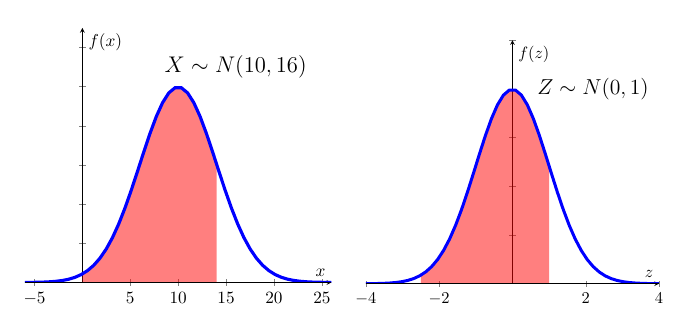

The two red shaded areas have the same size indicating that we can solve the problem posed in $X$ by using standard normal distribution tables for $Z$.

This video walks through this problem (YouTube, 13min).



:::

::: {.callout-note icon=false}

#### Exercise

Let $X\sim N(-5,9)$, what are

* $Pr (X\leq -1.27)=Pr(Z \leq $ `r fitb(1.2433)` $)=$ `r fitb(0.8931, tol = 0.001)`
* $Pr (X\geq 2) = Pr(Z \geq$ `r fitb(2.3333)` $)=$ `r fitb(0.0098,tol=0.0001)`
* $Pr (-3< X \leq 1) $`r fitb(0.2297, tol = 0.0012)`

:::

::: {.callout-note icon=false}

#### Exercise

A fuel is to contain $X\%$ of a particular compound. Specifications call for $X$ to be between 30 and 35. The manufacturer makes a profit of $Y$pence per liter where

\begin{equation*}
		Y=\left\{
		\begin{array}{l}
			10,\quad \text{if}\quad 30\leq x\leq 35 \\
			5,\quad \text{if}\quad 25\leq x<30\quad or\quad 35<x\leq 40 \\
			-10,\quad \text{otherwise}.%
		\end{array}
		\right.
\end{equation*}

If $X\sim N(33,9)$, evaluate $\Pr \left( Y=10\right)$, $\Pr \left(Y=-10\right)$ and, hence, $\Pr \left( Y=5\right)$.
	
Here, $X\sim N\left( 33,9\right)$; i.e., $\mu =33$ and $\sigma =3$. Now, since $\frac{X-33}{3}\sim N(0,1)$:

\begin{eqnarray*}
		\Pr \left( Y=10\right) &=&\Pr \left( 30\leq X\leq 35\right) \\
		&=&\Pr \left( \frac{30-33}{3}\leq \frac{X-33}{3}\leq \frac{35-33}{3}\right)\\
		&=&\Pr \left( Z\leq 2/3\right) -\Pr \left( Z\leq -1\right) ,\quad \quad \text{where }Z\sim N\left( 0,1\right) \\
		&=&\Phi \left( 2/3\right) -\Phi \left( -1\right) \\
		&=&\Phi \left( 0.67\right) -\Phi \left( -1\right) \\
		&=&0.7486-0.1587 \\
		&=&0.5899.
\end{eqnarray*}

Calculate:

$\Pr \left( Y=-10\right) =$ `r fitb(0.0137, tol = 0.005)`

$\Pr \left( Y=5\right) =$ `r fitb(0.3964, tol = 0.005)`


`r hide("Solution")`

Similar calculations show that

\begin{eqnarray*}
		\Pr \left( Y=-10\right) &=&\Pr \left( \left\{ X<25\right\} \cup \left\{X>40\right\} \right) \\
		&=&1-\Pr \left( 25\leq X\leq 40\right) \\
		&=&1-\Pr \left( \frac{25-33}{3}\leq \frac{X-33}{3}\leq \frac{40-33}{3}\right)\\
		&=&1-\left\{ \Phi \left( 7/3\right) -\Phi \left( -8/3\right) \right\} \\
		&=&1-\left\{ \Phi \left( 2.33\right) -\Phi \left( -2.67\right) \right\} \\
		&=&1-0.9901+0.0038 \\
		&=&0.0137.
\end{eqnarray*}

Thus, $\Pr \left( Y=5\right) =1-0.5899-0.0137=0.3964$.

`r unhide()`

:::


## Additional Resources

* Fairly formal information on the Normal distribution can be found on [Wolfram MathWorld](http://mathworld.wolfram.com/NormalDistribution.html) and on [Wikipedia](http://en.wikipedia.org/wiki/Normal_distribution).
* Khan Academy: There is a range of clips on Khan Academy which are useful. This is the [first one](https://www.khanacademy.org/math/probability/statistics-inferential/normal_distribution/v/introduction-to-the-normal-distribution).
* A clip which goes through a few examples of calculating normal probabilities using a Table can be found [here](http://www.youtube.com/watch?v=Ps15UaIKQpU&feature=share&list=PLW7MJJThJQQs3djo1EL6KCRFeCa6wpfYY).
* How to use EXCEL to calculate probabilities is demonstrated [here](http://www.youtube.com/watch?v=j27Dl-vV9do).
* You want to learn how to pronounce greek letters. This is a [useful guide](https://www.thoughtco.com/the-greek-alphabet-1705558)


