# Hypothesis Testing

```{r setup, include = FALSE}
knitr::opts_chunk$set(echo = FALSE)

library(webexercises)
```


## Recap: Simple Regression

In Correlation and Regression section (part of Descriptive Statistics), we saw how the relationship between two variables can be described by using scatter plots to provide a picture of the relationship and correlation coefficients to provide a numerical measure. In many economic and business problems, a specific functional relationship is needed. For instance,

* A manager would like to know what mean level of sales can be expected if the price is set at UKP 15 per unit.
* If 300 workers are employed in a factory, how many units can be produced during an average day?

In many cases, we can adequately approximate the desired functional relationships by a linear equation as explained in the following sections. There are three reasons why we may wish to formalise a (linear) relationship 

* We may want to quantify the relationship between variables.
* We may then want to use such relationships for predicting outcomes (see the above two examples).
* We may want use such models to decide whether there are causal relationships between variables.

The last of these is actually very difficult to achieve and we will not be able to touch on this in the context of this unit. Regression models are, in the first place, merely descriptive statistics much like the correlation coefficient. In fact correlation coefficients and regression relationships are closely related. Any correlation described in a regression model is, in the first place, just a descriptive relationship and **does not** automatically describe a causal relationships. 

::: {.callout-note}

#### Example

In the earlier section on correlation and regression we discussed the relationship between mathematics and statistics grades by students in subsequent semesters (mathematics in Semester 1 and statistics in semester 2). Here is a scatter plot of the data in "[Maths and Stats grades.xlsx](https://github.com/datasquad/StatisticsNotesBook/raw/refs/heads/master/data/Maths%20and%20Stats%20grades.xlsx)".

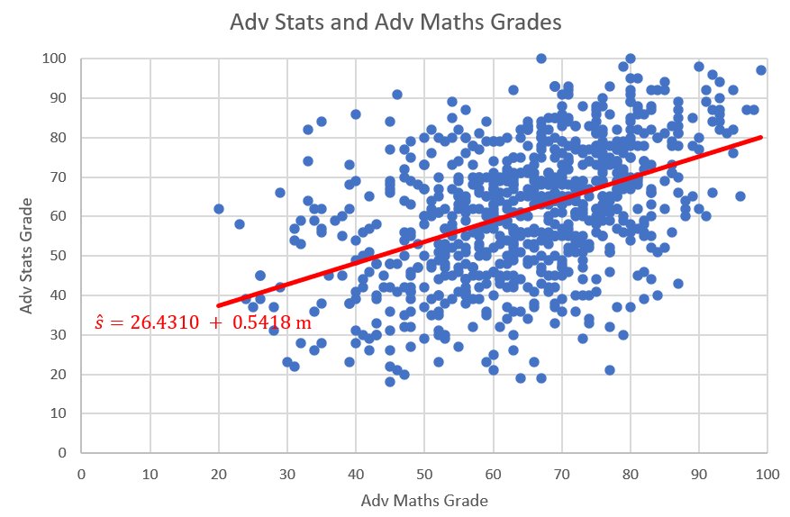

The plot and resulting regression line describes a positive relationship between mathematics and statistics grades.

:::

## Linear Regression Model

We first look at what we have studied before. the following linear sample regression relationship was proposed:

\begin{equation*}
	y_i = a + b x_i + res_i
\end{equation*}

In the above example the dependent variable $y_i$ was the statistics grade ($s_i$) and the explanatory variable $x_i$ was the maths grade ($m_i$).

The residual term ($res_i= y_i - a - bx_i$) was included to allow for the fact that the sample relationship between the variables $y_i$ and $x_i$ is typically not a perfect linear one, meaning that not all points will lie on a straight line. Here, $a$ and $b$ represented the intercept and slope coefficients for a particular line of best fit arising from a particular sample (which is why we call $a$ and $b$ sample estimates - but more on this below. 

If we want to write this relationship for the population, then we write:

\begin{equation*}
	y_i = \alpha + \beta x_i + \epsilon_i
\end{equation*}

Here we have replaced the $a$ and $b$ with $\alpha$ and $\beta$ and the residuals $res_i$ with $\epsilon_i$. $\alpha$ and $\beta$ represent the unknown values of the intercept and slope parameters that describe a liner relationship between $y_i$ and $x_i$ in the population. The error terms $\epsilon_i$ now represent error terms acknowledging that, even in the population, the linear relationship will not precisely represent the data.

Only once we have a sample of data we are able to find a line of best fit (described by $a$ and $b$). We should note that this line (and hence the $a$ and $b$ values) is unique to the particular sample. A slightly different sample would have delivered different values for $a$ and $b$. (Note: This is not unique to a regression relationship. Assume you have a population of values for some random variable $m_i$ with an unknown mean $\mu_m$. Then you take a sample of values from this population and obtain a sample mean, $\bar{m}$. Had you taken a different sample, this $\bar{m}$ would also be different.)

The variables on the left hand side and the right hand side have different functions and therefore we call them by different names, such as dependent variable (on the left) and explanatory variable (on the right).

\begin{equation*}
	\underset{\begin{array}{c}
			\textrm{dependent variable}\\
			\textrm{explained variable}\\
			\textrm{outcome variable}
		\end{array}}{y_i} = \alpha + \beta \underset{\begin{array}{c}
		\textrm{independent variable}\\
		\textrm{explanatory variable}
	\end{array}}{x_i} + \epsilon_i
\end{equation*}

We know that we should use our economic knowledge to decide which variable is dependent/explained and which is independent/explanatory. 

Let's continue thinking about the relationship between height and weight. This height-weight example is fairly obvious, the weight of a person, $Y$, can be modeled as a linear function of the height, $X$. Consider a person of specific height, $x_i$, then that person's weight $y_i$ can be seen as a function of that height as long as you recognise that there is an error term for individual variation. In fact, when thinking about regression it is more useful to think about groups of people rather than individuals. Consider all people with a specific height (e.g. $x=179cm$), then the average weight of these people can be seen as a function of that height. 

In the real world we know there are other factors that influence the weight. These include identifiable factors, such as the age, gender and weight of parents. There are also behavioural factors such as nutrition and exercise regime. In addition, there are other unknown factors that can influence the weight.

In a simple linear regression model the effects of all factors, other than the effect of the explanatory variable (here height), are assumed to be part of the random error term, labelled as $\epsilon_i$. You will learn later, in the multiple regression section, how to allow for more than one explanatory variable.

This random error term is a random variable we assume to have mean 0. This is a rather crucial assumption. The error terms are unobserved and hence this is an assumption! In further econometrics units you will talk a lot about this assumption and discuss the (many) reasons why this assumption may fail. 

In fact, for some of the statistical inference to work below we may have to make further assumptions regarding the error terms. For instance that they are normally distributed and have constant variance. These assumptions tend to be more benign and we can deal with situations in which they are not met. Again, details here are beyond this particular course. 

Thus, the model is as follows:

\begin{equation*}
	\underset{\begin{array}{c}
			\textrm{Weight}\\
        \end{array}}{y_i} = \alpha + \beta \underset{\begin{array}{c}
		\textrm{Height}\\
	    \end{array}}{x_i} + \underset{\begin{array}{c}
	\textrm{Other Factors}\\
	\end{array}}{\epsilon_i}
\end{equation*}


### Estimation

The population regression line is a theoretical construct and it is not observed. In applications we will typically aim to obtain an estimate for this regression line using sample data. Regression analysis is the statistical technique that finds the **optimal** values for $\alpha$ and $\beta$ given a particular sample. We return to the example of 12 observations with height (taking the role of $x$) and weight (in this example representing $y$) data. 

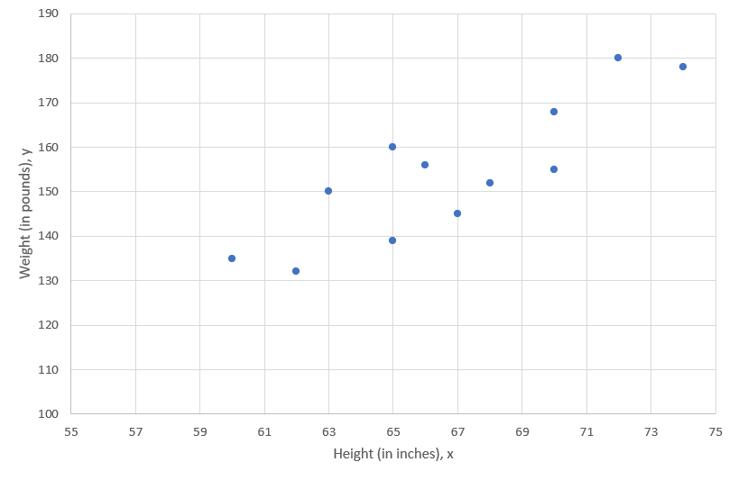

We would like to find the straight line that best fits these points, which is called the line of best fit. Let's now calculate the actual sample estimates $a$ and $b$. Do not forget these values will be specific to that particular sample of 12 observations. We will continue to not know what the true population values $\alpha$ and $\beta$ are. If we had a different sample we would get somewhat different values for $a$ and $b$.

Before we do so we want to point out what **optimal** means in this context. In fact it implies that we want to minimise (in a particular sense!) the values for $res_i$ for all $i=1,...,n$ observations in the sample. 

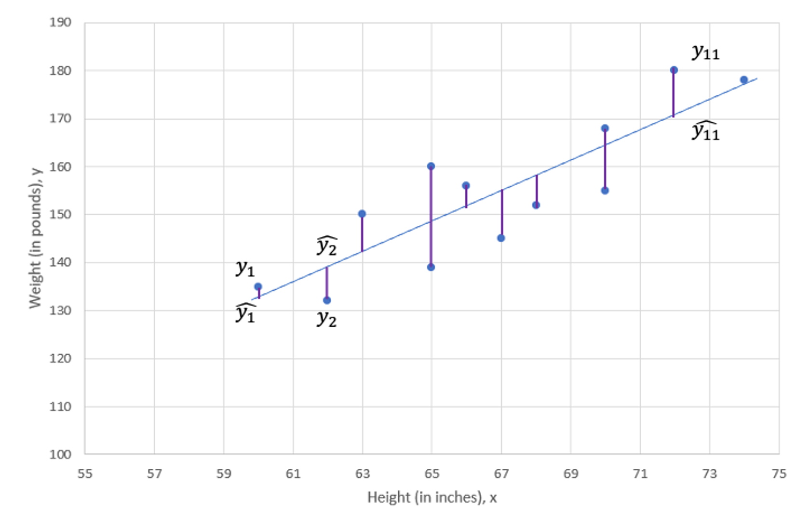

In fact what we want to minimise is the **sum of squared residuals** and this is called least squares procedure.

As shown in the above Figure, there is a deviation between the observed value, $y_i$, and the predicted value, $\widehat{y}_{i}$ (which is the value on the regression line), at every value of X. This difference is called the residual, $res_i=y_i-\widehat{y}_{i}$. The term we want to minimise is ($(y_i-\widehat{y}_{i})^2=res_i^2$). As we have $i=1,...,n$ of these terms, what we really wish to minimise is the sum of these squared terms:

\begin{equation*}
	SSE =(y_{1}-\widehat{y}_{1})^{2}+(y_{2}-\widehat{y}_{2})^{2}+...+(y_{12}-\widehat{y}_{12})^{2}=\sum_{i=1}^{n}res_i^{2}=\sum_{i=1}^{n}(y_{i}-\widehat{y}_{i})^{2}= \sum_{i=1}^{n}(y_{i}-a-bx_{i})^{2}
\end{equation*}

The estimates $a$ and $b$ are those values in the regression line

\begin{equation*}
	\widehat{y}_{i} = a + b x_i
\end{equation*}

that minimise the $SSE$. This is where the name least squares comes from. Often you will find the term Ordinary Least Squares (OLS) where the ordinary comes from the fact that we are fitting a linear model.

This is equivalent to saying that we want to minimise the variation of our sample observations around the regression line ($a+bx$). Or better, we want to place the line of best fit such that the resulting variation is minimised.

We use differential calculus to obtain the coefficient estimators that minimise SSE (you have a function, you have two coefficients which you can vary - $a$ and $b$ - you know how to do that). The resulting coefficient estimator is as follows:

\begin{eqnarray*}
	b &=& \frac{\sum_{i=1}^{n}(x_{i}-\bar{x})(y_{i}-\bar{y})}{\sum_{i=1}^{n}(x_{i}-\bar{x})^{2}}\\
	&=& \frac{Cov(x,y)}{Var(x)}\\
	&=& r\frac{s_y}{s_x}\\
\end{eqnarray*}

Note that the numerator of the estimator is the sample covariance of $X$ and $Y$ and the denominator is the sample variance of $X$. The constant or intercept estimator is as follows:

\begin{eqnarray*}
	\quad a &=& \bar{y}-b\bar{x}\\
\end{eqnarray*}

So far this was all a repetition of what was done in the descriptive statistics section.


::: {.callout-note}

#### Example

The Rising Hills Manufacturing Company in Redwood Falls regularly collects data to monitor its operations. These data are stored in the data file Rising Hills. The number of workers, $X$, and the number of tables, $Y$, produced per hour for a sample of 10 days is shown in Figure 3. If management decides to employ 25 workers, estimate the expected number of tables that are likely to be produced.

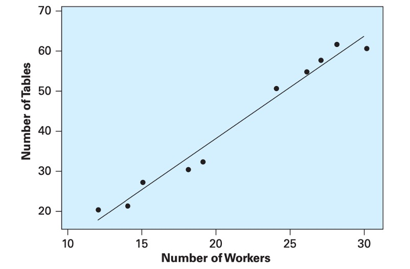

Using the data, we computed the descriptive statistics:  

$Cov(x,y)=106.9333$,  
${s_x}^{2}$=42.01,  
$\bar{y}$=41.2,  
$\bar{x}$=21.3  

The relationship is `r mcq(c(answer = "positive", "negative", "no relationship"))`

`r hide("Feedback")`
The direction of the assumed linear relationship is determined by the covariance. The sign of the covariance gives us the direction of the relationship, here positive.
`r unhide()`


Using the descriptive statistics, compute the sample regression coefficients:

$b =$ `r fitb(2.5454, tol = 0.0001)`  
$a =$ `r fitb(-130161, tol = 0.0001)`  

`r hide("Feedback")`

\begin{equation*}
  b =\frac{Cov(x,y)}{Var(x)}=\frac{106.9333}{42.0111}=2.5454
\end{equation*}

\begin{equation*}
  a =\bar{y}-b\bar{x}=41.2-2.5454\times 21.3=-13.0161
\end{equation*}

From this, the sample regression line is as follows:

\begin{equation*}
	\widehat{y} = a + bx=-13.0161+2.5454 ~ x
\end{equation*}

`r unhide()`

For 25 employees we would expect to produce $\widehat{y}=$ `r fitb(50.6178, tol = 0.01)` tables.

`r hide("Feedback")`

\begin{equation*}
	\widehat{y} =-13.0161+2.5454\times 25=50.6178
\end{equation*}
	
or approximately 51 tables.

`r unhide()`

Because the number of workers in the Rising Hill Manufacturing Plant ranged from 12 to 30, we cannot predict the number of tables produced if the number of workers falls outside that range. While you could do so algebraically, there is no guarantee that the relationship we estimated using data from that range is also valid outside that range.
	
:::

### Goodness of Fit

Now we are ready to develop measures that indicate how effectively variation in the variable $X$ explains the behaviour of $Y$. In our height-weight example Weight, $Y$, tends to increase with Height, $X$, and, thus, Height explains some of the variation in Weight. The points, however, are not all on the line, so the explanation is not perfect. Here, we develop measures based on the partitioning of variability that measure the capability of $X$ to explain $Y$ in a specific regression application.

The analysis of variance, ANOVA, for least squares regression is developed by partitioning the total variability of $Y$ into an explained component and an error component. In the Figure below we show that the deviation of an individual $Y$ value from its mean can be partitioned into the deviation of the predicted value from the mean and the deviation of the observed value from the predicted value:

\begin{equation*}
	y_{i}-\bar{y}=(\widehat{y_i}-\bar{y})+(y_{i}-\widehat{y_i})
\end{equation*}

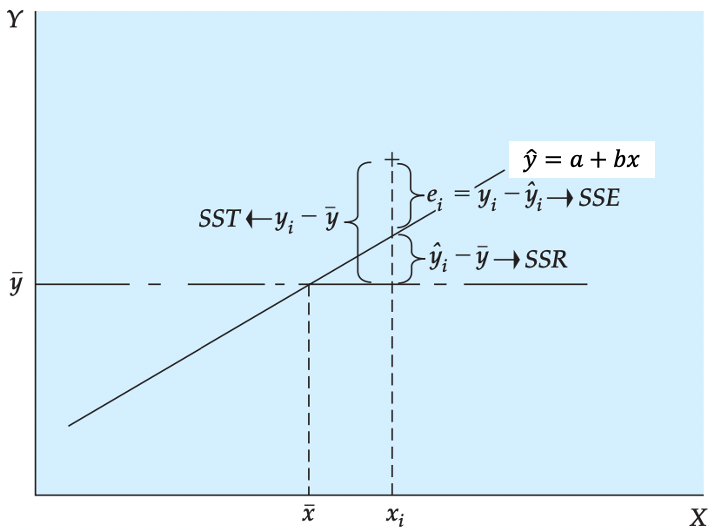

We square each side of the equation (because the sum of deviations about the mean is equal to 0) and sum the result over all n points:

\begin{equation*}
	\sum_{i=1}^{12}(y_{i}-\bar{y})^{2}=\sum_{i=1}^{12}(\widehat{y_i}-\bar{y})^{2}+\sum_{i=1}^{12}(y_{i}-\widehat{y_i})^{2}
\end{equation*}

Some of you may note the squaring of the right-hand side should include the cross product of the two terms in addition to their squared quantities. It can be shown that the cross- product term goes to 0. This equation is expressed as follows:

\begin{equation*}
	SST=SSR+SSE
\end{equation*}

Here, we see that the total variability $SST$ can be partitioned into a component $SSR$ that represents variability that is explained by the slope of the regression equation. (The expected value of $Y$ is different at different levels of $X$.) The second component $SSE$ results from the random or unexplained deviation of points from the regression line. This variability provides an indication of the uncertainty that is associated with the regression model. In short, the total variability in a regression analysis, $SST$, can be partitioned into a component explained by the regression, $SSR$, and a component due to unexplained error, $SSE$. The components are defined as follows:

\begin{eqnarray*}
	\textnormal{Sum of Squares Total:}\ SST&=&\sum_{i=1}^{12}(y_{i}-\bar{y})^{2}\\
	\textnormal{Sum of Squares Regression:}\ SSR&=&\sum_{i=1}^{12}(\widehat{y_i}-\bar{y})^{2}\\
	\textnormal{Sum of Squares Error:}\ SSE&=&\sum_{i=1}^{n}res_i^{2}=\sum_{i=1}^{n}(y_{i}-\widehat{y}_{i})^{2}= \sum_{i=1}^{n}(y_{i}-a-bx_{i})^{2}
\end{eqnarray*}

The ratio of the sum of squares regression, $SSR$, divided by the total sum of squares, $SST$, provides a descriptive measure of the proportion, or percent, of the total variability that is explained by the regression model. This measure is called the coefficient of determination or, more generally, $R^2$:

\begin{equation*}
	R^2=\frac{SSR}{SST}=1-\frac{SSE}{SST}
\end{equation*}

The coefficient of determination is often interpreted as the percent of variability in $Y$ that is explained by the regression equation. This quantity varies from 0 to 1, and higher values indicate that the variation in the explanatory variables explain a larger proportion of the variation in the explained variable. Caution should be used in making general interpretations of $R^2$ because a high value can result from either a small $SSE$, a large $SST$, or both.

The coefficient of determination, $R^2$, only for simple regression, is equal to the simple correlation squared:

\begin{equation*}
    R^2=r^2
\end{equation*} 

This provides an important link between correlation and $R^2$, the regression model.


::: {.callout-note}

#### Example

	If you obtained the following values from a regression
	
	SST= 6,000; SSR=1.250 and SSE=4.750
	
	what would be the $R^2$?
	
	$R^2 = \frac{1250}{6000}=0.2083$

:::


### Excel application

With this background let us return to our height-weight example with data and look at how we use ANOVA to determine how well our model explains the process being studied. In most situations we use a spreadsheet such as Excel to obtain the regression coefficients to reduce the work load and improve computational accuracy. 

This video is a walkthrough of how to perform a simple regression estimation in EXCEL.



The figure below shows the EXCEL output of the height-weight example.

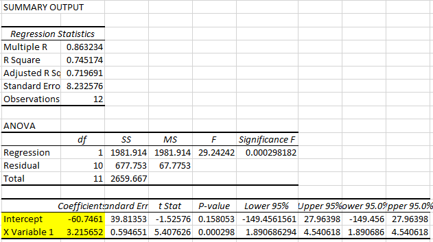

From this EXCEL regression output, we could get some key information:


* R square statistic is 0.745174 so $R^2=0.745174$, which we can see that here 74.5\% of the variation is explained by that linear relationship.
* The sample size (Observations) of 12. 
* Sum of Squared Regression ($SSR)$ is 1981.914, which is $\sum_{i=1}^{12}(\widehat{y_i}-\bar{y})^{2}$.  
It shows The amount of variability explained by the regression equation.
* Sum of Squared Residuals ($SSE)$ is 677.753, which is $\sum_{i=1}^{12}(y_{i}-\widehat{y_i})^{2}$.  
It indicates the smallest possible sum of squared residuals is 677.753.
* Sum of Squares Total ($SST)$ is 2659.667, which is $\sum_{i=1}^{12}(y_{i}-\bar{y})^{2}$.  
It measures the amount of variation we can see in the dependent variable. 
* Note that	$SST=SSR+SSE$
* The intercept estimator $a$ is -60.7461
* The coefficient estimator $b$ is 3.2157
* The regression line (line of best fit) is therefore defined as: $\hat{y}=-60.7461+3.2157 \cdot x$

:::
	

::: {.callout-note icon=false}

#### Exercise

Use the data in the Rising Hill example ("[RisingHills.xlsx](https://github.com/datasquad/StatisticsNotesBook/raw/refs/heads/master/data/RisingHills.xlsx)") for the following.

Recall that $b=2.5454$ and $a=-13.0161$ were the slope and intercept sample estimates.

The 5th observation has values $y_5=21$ and $x_5=14$. What is the value for the residual of that 5th observation?

$‌res_5=$ `r fitb(-1.6189, tol = 0.0001)`

Calculate the following in EXCEL:

$SST=$ `r fitb(2506.6, tol = 0.1)`

$SSR=$ `r fitb(2449.6529, tol = 0.1)`

$SSE=$ `r fitb(55.9471, tol = 0.1)`

$R2=$ `r fitb(0.9777, tol = 0.0001)`


`r hide("Feedback")`

$‌res_5= y_5- (a + b\cdot x_5) = 21 - (-13.0161 - 2.5454 \cdot 14) = -1.6189$  

Confirm the following through working in EXCEL?

$SST=2506.6$

$SSR= 2449.6529$

$SSE= 55.9471$

$R2=0.9777$

`r unhide()`
:::


### Interpretation of Simple Regression Equation

We return to the interpretations of simple regression equation with some key points. 

First, in most cases the data available to run a regression will be sample data. Therefore, the values of $a$ and $b$ that describe the line of best fit, are sample estimates of some unknown population parameters (usually labeled, $\alpha$ and $\beta$).

Second, note that $b$ is the slope of the fitted line, $\hat{y}=a+bx$; i.e., the derivative of $\hat{y}$ with respect to $x$:

\begin{equation*}
	b=d\hat{y}/dx
\end{equation*}

and measures the increase in $\hat{y}$ for a unit increase in $x$.

For the height-weight example, the regression line is defined as 

\begin{equation*}
	\hat{y}=-60.7461+3.2157 ~ x
\end{equation*}

We know that when we interpret regression results, we should be aware of the units in which the dependent and explanatory variables are measured. 

In the Height-Weight example, the explanatory variable (Height, $x$) is measured in inches (1 inch = 2.54 cm) and the dependent variable (Weight, $y$) is measured in pounds (1 pound = 1 lbs = 0.454 kg). 


\begin{equation*}
	\underset{\begin{array}{c}
			\textrm{Weight, in pounds}\\
        \end{array}}{\hat y} = -60.7461 + 3.2157 \underset{\begin{array}{c}
		\textrm{Height, in inches}\\
	    \end{array}}{x} 
\end{equation*}

With this knowledge, the interpretations of $b=3.2157$ are

* "The expected weight ($\hat{y}$) increases by 3.2157 pounds for every height increase of 1 inch."
* "On average weight ($y$) increases by 3.2157 pounds for every height increase of 1 inch." 

Interpreting the intercept only makes sense if the value of $x=0$ is a sensible value and inside the sample range of values of $x$. In this Height-Weight example, $a = -60.7491$ and it means that if someone has a height of 0 inches then we would expect the person to have a weight of -60.7491. This does not make any sense here as thinking of someone with height 0 is not a sensible consideration.

In addition, we know that transformations of data can affect the above summary measures. Originally, height is measured in inches (1 inch = 2.54 cm) and our original model is 

\begin{equation*}
	Weight[lbs]_i = \alpha + \beta~ Height[in]_i + \epsilon_i 
\end{equation*}

If the height is measured in centimeters then the centimeter model is   

\begin{eqnarray*}
	Weight[lbs]_i &=& \gamma + \delta Height[cm]_i + v_i	\\
	Weight[lbs]_i &=& \gamma + \delta \cdot 2.54 \cdot Height[in]_i + v_i	
\end{eqnarray*}

where $\beta =2.54 \cdot \delta$. And indeed, the original coefficient estimated (in the inches model) is 2.54 times larger than that estimated in the centimeter model.


## Statistical Inference: Hypothesis Tests and Confidence Intervals

Now that we have developed the coefficient estimators, we are ready to perform inference on the population model parameters. The basic approach follows that developed in hypothesis test and confidence interval. We use the estimated parameters to test hypotheses on the unknown population parameters or alternatively we calculate confidence intervals. We do that as we are typically interested in the unknown population parameters and not the particular sample parameter estimates. 

### Hypothesis Tests

The true population regression line is 

\begin{equation*}
	y_i = \alpha + \beta x_i + \epsilon_i
\end{equation*}

We obtain sample estimates for the unknown population parameters $\alpha$ and $\beta$. The sample estimates are $a$ and $b$ which then define the sample regression line 

\begin{equation*}
	\hat{y}_i = a + b x_i
\end{equation*}

As usual we recognise that a different sample would have given us different sample estimates. This is why we need to use statistical inference techniques.

In applied regression analysis, we often wish to know if there is a relationship. In the regression model we see that if $\beta$ is 0, then there is no linear relationship between $X$ and $Y$. To determine if there is a linear relationship, we can test the hypothesis

\begin{equation*}
	H_{0}:\beta = 0
\end{equation*}

versus

\begin{equation*}
	H_{0}:\beta \neq 0
\end{equation*}

It turns out that inference on regression coefficients works very much like inference on a population mean with unknown population variance. In that case we used a $t$-test

\begin{equation*}
	T=\frac{\bar{x} - \mu}{SE(\bar{x})} \sim t_{n-1}
\end{equation*}

this test statistic was $t$ distributed with $n-1$ degrees of freedom if the population distribution of the error terms was normal. If it was not normal then we could approximate the distribution of $T$ with a standard normal distribution if the sample size was big enough to invoke a CLT.

In the context of this simple regression the test statistic is defined as 

\begin{equation*}
	T= \dfrac{b-\beta_0}{SE\left(b\right)}\sim t_{n-2}
\end{equation*}

where $\beta_0$ is the hypothesised value and the test statistic is distributed according to a Student’s t distribution with $(n-2)$ degrees of freedom. This is a bit different from what you have studied in hypothesis test section. Degree of freedom is $(n-2)$ instead of $(n-1)$ because the simple regression model uses two estimated parameters, $a$ and $b$, instead of one ($\bar{x}$ when we are testing for $\mu$).

Above we state that the $t$ statistic is $t$ distributed. In the context of testing for population means that was conditional on the population of values ($X$ in the language of that section) being normally distributed. Here, in the context of hypothesis testing for regression coefficients, the $T$ statistic above is $t$ distributed if the regression model's error terms, $\epsilon_i$, are normally distributed. If they are not, then we have to rely on large enough samples and a CLT to allow the distribution of the $T$ statistic to be normally distributed. In the context of this course we will assume that the $\epsilon_i$ are normally distributed and hence that the test statistic is $t$ distributed.

$SE\left(b\right)$ in the above represents the standard error of slope coefficient $b$. Here we will not provide any detail on how to calculate this, we will rely on EXCEL (or any other software) to calculate this. In the image below you can see where to find the standard errors $SE(a)=39.8135$ and $SE(b)= 0.5947$.

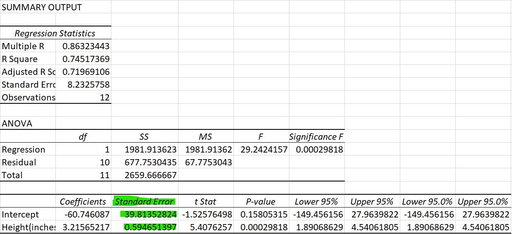

Above we indicated that we want to find if there is a linear relationship, say if $\beta$ is 0. In general, we can test for any specific values $\beta_0$. 

1. To test the null hypothesis $H_{0}:  \beta \leq \beta_0$ against the alternative $H_{A}:\beta > \beta_0$ the decision rule is as follows:  
Reject $H_{0}$ if $t= \dfrac{b-\beta_0}{SE\left(b\right)} > t_{n-2,\alpha}$

2. To test the null hypothesis $H_{0}:\beta \geq \beta_0$ against the alternative $H_{A}:\beta < \beta_0$ the decision rule is as follows:  
Reject $H_{0}$ if $t= \dfrac{b-\beta_0}{SE\left(b\right)} < t_{n-2,\alpha}$

3. To test the null hypothesis $H_{0}:\beta = \beta_0$ against the alternative $H_{A}:\beta \neq \beta_0$ the decision rule is as follows:  
Reject $H_{0}$ if $t= \dfrac{b-\beta_0}{SE\left[b\right]} \geq t_{n-2,\alpha/2}$ or $t= \dfrac{b-\beta_0}{SE\left[b\right]} \leq t_{n-2,\alpha/2}$

Note, we use $T$ if we refer to the test statistic and $t$ when we think about the realisation of the test statistic in a particular sample.

Hypothesis tests could also be performed on the equation constant, $\alpha$ follow the same logic and we would use the following t-test

\begin{equation*}
	t= \dfrac{a-\alpha_0}{SE\left(a\right)}\sim t_{n-2}
\end{equation*}


::: {.callout-note}

#### Example

To facilitate the application of inference to regression results, these are often presented as follows:
\begin{equation*}
	\hat{y}=\underset{(39.8135)}{-60.7461}+\underset{(0.5946)}{3.2157} \cdot x
\end{equation*} 

The standard errors of the coefficient estimates are shown in parenthesis underneath the respective sample estimate. Let's test the hypothesis that, on average, an additional inch of height increases weight by not more than 3 pounds at $\alpha = 0.05$.
	
\begin{eqnarray*}
  H_0&:& \beta \leq 3\\
	H_A&:& \beta > 3\\
\end{eqnarray*}

The test statistic is $T=\frac{b - \beta_0}{SE{b}} \sim t_{n-2}$. The decision rule is to reject $H_0$ if the sample test statistic is greater than 1.812 (from the t-table with 10 degrees of freedom).
	
\begin{equation*}
	t = \frac{3.2157-3}{0.5946}= 0.3627
\end{equation*}

As the test statistic is not larger than the critical value the null hypothesis is not rejected. The sample does not provide sufficient evidence to reject $H_0$.

:::


::: {.callout-note icon=false}

#### Exercise

Test the hypothesis that, on average, an additional inch of height increases weight by not more than 2 pounds at $\alpha = 0.01$.

\begin{eqnarray*}
	H_0&:& \beta \leq 2\\
	H_A&:& \beta > 2\\
\end{eqnarray*}
	
The test statistic is $T=\frac{b - \beta_0}{SE(b)} \sim t_{n-2}$. The decision rule is to reject $H_0$ if the sample test statistic is greater than `r fitb(2.764)`.

The sample t-test statistic is `r fitb(2.0443, tol = 0.0001)`.

The conclusion is to `r mcq(c("do not reject H0", answer = "reject H0"))`.

`r hide("Feedback")`

The critical value from the t-table with 10 degrees of freedom for a one sided test with $\alpha = 0.01$ is equal to 2.764.

\begin{equation*}
	t = \frac{3.2157-2}{0.5946}= 2.0443
\end{equation*}
	
As the test statistic is not larger than the critical value the null hypothesis is not rejected. The sample does not provide sufficient evidence to reject $H_0$ at $\alpha = 0.01$.

`r unhide()`

:::


### Confidence Interval

You may not be interested in actually testing a particular hypothesis but merely to communicate that your sample estimate will not tell you exactly what the unknown population parameter is. The tool of choice is to present a confidence interval, say, for the slope coefficient $\beta$ of the population regression line. A $100(1 - \alpha)\%$ confidence interval for the population regression slope $\beta$ is given by:

\begin{equation*}
	\left[ c_{L},c_{U}\right] =b\pm t_{n-2,\alpha /2}SE\left[b\right] 
\end{equation*}

where $t_{n-2,\alpha /2}$ is the number for which

\begin{equation*}
	P(t_{n-2}>t_{n-2,\alpha /2})= \alpha/2
\end{equation*}

and the random variable $t_{n-2}$ follows a Student’s t distribution with $(n-2)$ degrees of freedom. As in the case of the hypothesis test for a regression coefficient, the degrees of freedom is determined by the number of observations minus the number of estimated coefficients, here 2.

Excel's regression output for the Height-Weight example, is replicated below with annotations.

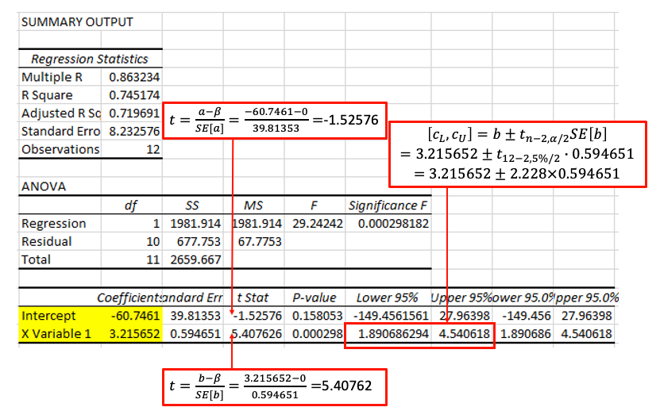

From that regression output you get all the ingredients you need to calculate hypothesis tests on and confidence intervals for the unknown population parameters. In fact, by default the output does provide a particular hypothesis test and a particular confidence interval. The hypothesis test provided is that of $H_0: \beta = 0$ against $H_A: \beta \neq 0$ (or the equivalent for $\alpha$) and a 95\% confidence interval. 

Note that the t-statistics and the p-values are specific to the $H_0: \beta = 0$ against $H_A: \beta \neq 0$ test, but you also have all the ingredients you would need to calculate a hypothesis test with a different null hypothesis or a different confidence interval.

::: {.callout-note}

#### Example

Let's calculate a 99% confidence interval for $\beta$.
	
\begin{eqnarray*}
	b &\pm& t_{n-2,\alpha /2}SE\left[b\right] \\
	3.2156 &\pm& 3.169 \cdot 0.5947  = 3.2156 \pm 1.8846\\
	&\Rightarrow&\left[ 1.3311,5.1003\right] 
\end{eqnarray*}
	
:::

::: {.callout-note icon=false}

#### Exercise

Calculate a 80% confidence interval for $\alpha$.

$[$ `r fitb(-11537.02,tol = 0.001)`, `r fitb(-6.1220,tol = 0.001)` $]$

`r hide("Feedback")`
\begin{eqnarray*}
	a &\pm& t_{n-2,\alpha /2}SE\left[a\right] \\
	-60.7461 &\pm& 1.372 \cdot 39.8135  = 3.2156 \pm 54.6241\\
	&\Rightarrow&\left[ -115.3702,-6.1220\right] 
\end{eqnarray*}
`r unhide()`

Note that the 80\% confidence interval does not contain 0. This is equivalent to the the p-value being smaller than 20\% and hence we would reject a two-sided hypothesis test with null hypothesis $H_0: \alpha = 0$ at $\alpha = 0.2$.

:::


## Multiple Regression

So far, we developed simple regression as a procedure for obtaining a linear equation that predicts a dependent or endogenous variable as a function of a single independent or exogenous variable for example, weight as a function of height. However, in many situations, you would want several explanatory variables to jointly influence a dependent variable. Multiple regression enables us to determine the simultaneous effect of several independent variables on a dependent variable using the least squares principle.

Many important applications of multiple regression occur in business and economics. These applications include the following:

* The quantity of goods sold is a function of price, income, advertising, price of substitute goods, and other variables.
* Salary is a function of experience, education, age, and job rank.
* Capital investment occurs when a business person believes that a profit can be made. Thus, capital investment is a function of variables related to the potential for profit, including interest rate, gross domestic product, consumer expectations, disposable income, and technological level.

Business and economic analysis has some unique characteristics compared to analysis in other disciplines. Some natural scientists work in a laboratory, where many—but not all—variables can be controlled. If you wanted to figure out what the impact of one variable is you could vary that one (and keep all others constant) and then observe the impact these changes have on an outcome variable. In contrast, the economist’s and manager’s laboratory is the world, and conditions cannot be controlled. Thus, we need tools such as multiple regression to estimate the simultaneous effect of several variables. Multiple regression as a “lab tool” is very important for the work of managers and economists.

The "miracle" of multiple regression is going to be that it will be able to "partial" out effects of individual explanatory variables, even though you do not have control over the experimental setup. However, while, if you can control the experimental setup, you can easily establish causal relationships, in the context where we merely used observed data (observational studies) we cannot easily claim to discover causal relationships.

### Model Specification

Model specification includes selection of the explanatory variables and the functional form of the model. We return to the Height-Weight example but we will discuss more than one factor this time. We previously specified:

\begin{equation*}
	\underset{\begin{array}{c}
			\textrm{Weight}\\
        \end{array}}{y_i} = \alpha + \beta \underset{\begin{array}{c}
		\textrm{Height}\\
	    \end{array}}{x_i} + \underset{\begin{array}{c}
	\textrm{Other Factors}\\
	\end{array}}{\epsilon_i}
\end{equation*}

In a simple linear equation we model the effect of all other factors to be part of the random error term, labeled as $\epsilon_i$. However, some factors in error term could be measured as well so we can move them out from the error term and include them as explanatory variables. As we have discussed, weight could be affected by gender. 

Linear regression assumes that the numerical amounts in all independent, or explanatory, variables are meaningful data points. However, sex is a binary categorical variable (this is mainly true, sex referring to biological attributes. Gender identification used to be modeled as a binary variable as well, but today there is a better understanding that the gender people identify as may be better represented more flexibly than only with two categories). Regression analysis requires numerical values to work with and therefore sex has to be coded. Categorical variables with two categories are coded as dummy variables. A dummy variable is a variable created to assign a numerical value to the levels of the categorical variable. Here we will define such a variable, called "male" which takes the value 1 if the individual is a male and 0 if it is not. 

Here we have a categorical variable which takes one of two categories and we needed one variable to code this up. In general, if you have a categorical variable with $k$ categories then you need $k-1$ categories to code these up. That would be done with $k-1$ dummy variables.

This would lead us to specify the following multiple regression model:

\begin{equation*}
	\underset{\begin{array}{c}
			\textrm{Weight}\\
        \end{array}}{y_i} = \alpha + \beta_1 \underset{\begin{array}{c}
		\textrm{Height}\\
	    \end{array}}{x_{1i}} + \beta_2 \underset{\begin{array}{c}
	\textrm{Male}\\
	    \end{array}}{x_{2i}} + \underset{\begin{array}{c}
	\textrm{Other Factors}\\
	\end{array}}{\epsilon_i}
\end{equation*}

Now we have an intercept coefficient ($\alpha$) and two slope coefficients, $\beta_1$ and $\beta_2$ which relate to the Height and Male variables respectively. These are all unknown population coefficients.

The following table shows the data with the sex and the derived male dummy variable.

| Weight(Y, pounds) | Height(inches) | Sex    | male |
|-------------------|----------------|--------|------|
| 155               | 70             | Female | 0    |
| 150               | 63             | Female | 0    |
| 180               | 72             | Male   | 1    |
| 135               | 60             | Female | 0    |
| 156               | 66             | Female | 0    |
| 168               | 70             | Male   | 1    |
| 178               | 74             | Male   | 1    |
| 160               | 65             | Female | 0    |
| 132               | 62             | Female | 0    |
| 145               | 67             | Female | 0    |
| 139               | 65             | Female | 0    |
| 152               | 68             | Female | 0    |


### Estimation

In general a researcher is interested in the unknown intercept coefficient ($\alpha$) and two the two slope coefficients, $\beta_1$ and $\beta_2$. We will use sample data to obtain sample estimates for these. Multiple regression coefficients are computed using estimators obtained by the least squares procedure. This least squares procedure is similar to that presented in simple regression. However, the estimators are complicated by the relationships between the explanatory $X_i$ variables.  

The least squares procedure for multiple regression computes the estimated coefficients so as to minimise the sum of the residuals squared. In this case, the sample estimated regression equation is

\begin{equation*}
	\widehat{y}_{i} = a + b_1 {x_{1i}}+b_2 {x_{2i}}
\end{equation*}

The residual is:

\begin{equation*}
	res_i=y_i-\widehat{y}_i =  y_i - (a + b_1 {x_{1i}}+b_2 {x_{2i}}) = y_i - a - b_1 {x_{1i}}-b_2 {x_{2i}}.
\end{equation*}

Formally, we minimise $SSE$:

\begin{equation*}
	SSE =(y_{1}-\widehat{y}_{1})^{2}+(y_{2}-\widehat{y}_{2})^{2}+...+(y_{12}-\widehat{y}_{12})^{2}=\sum_{i=1}^{n}res_i^{2}=\sum_{i=1}^{n}(y_{i}-\widehat{y}_{i})^{2}= \sum_{i=1}^{n}(y_{i}-a-b_1 {x_{1i}}-b_2 {x_{2i}})^{2}
\end{equation*}

To carry out the process formally, we use partial derivatives to develop a set of simultaneous equations that are then solved to obtain the coefficient estimators. Fortunately, the complex computations are always performed using a statistical software such as EXCEL. Our objective here is to understand how to interpret the regression results and use them to solve problems. You may learn more about the actual magic that is going on in later units.

### Goodness of Fit

Similar to the simple regression model, we can develop a measure of the proportion of the variability in the dependent variable that can be explained by the multiple regression model. The model variability can be partitioned into the components

\begin{equation*}
	SST=SSR+SSE
\end{equation*}

where these components are defined as follows:

Sum of Squares Total
\begin{equation*}
	SST=\sum_{i=1}^{12}(y_{i}-\bar{y})^{2}
\end{equation*}

Sum of Squares Regression
\begin{equation*}
	SSR=\sum_{i=1}^{12}(\widehat{y_i}-\bar{y})^{2}
\end{equation*}

Sum of Squares Error
\begin{equation*}
	SSE=\sum_{i=1}^{n}res_i^{2}=\sum_{i=1}^{n}(y_{i}-\widehat{y}_{i})^{2}= \sum_{i=1}^{n}(y_{i}-a-b_1 {x_{1i}}-b_2 {x_{2i}})^{2}
\end{equation*}

This decomposition can be interpreted as follows:

   total sample variability = explained variability + unexplained variability 
   
The coefficient of determination, $R^2$, of the fitted regression is defined as the proportion of the total sample variability explained by the regression


\begin{equation*}
	R^2=\frac{SSR}{SST}=1-\frac{SSE}{SST}
\end{equation*}

and it follows that

\begin{equation*}
	0 \le R^2 \le1
\end{equation*}


::: {.callout-note}

#### Example


In this video we you can follow all the steps required to estimate a multiple regression model in EXCEL (YouTube, 10min). 



The next figure is a screenprint of the regression output you obtain when estimating this regression.

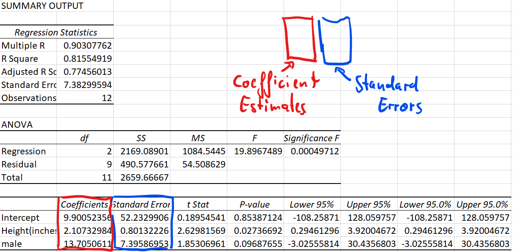

From this EXCEL regression output, we could get some key information:

* R square statistic is 0.815549 so $R^2=0.815549$, which we can see that here 81.6\% of the variation is explained by that linear relationship.
* The sample size (Observations) of 12. 
* Sum of Squared Regression ($SSR)$ is 2169.08901, which is $\sum_{i=1}^{12}(\widehat{y_i}-\bar{y})^{2}$.  
It shows The amount of variability explained by the regression equation.
* Sum of Squared Residuals ($SSE)$ is 490.577661, which is $\sum_{i=1}^{12}(y_{i}-\widehat{y_i})^{2}$.  
* Sum of Squares Total ($SST)$ is 2659.66667, which is $\sum_{i=1}^{12}(y_{i}-\bar{y})^{2}$.  
It measures the amount of variation we can see in the dependent variable. $SST=SSR+SSE$.
* The intercept estimator $a$ is 9.9005
* The coefficient estimates $b_1$ is 2.1073 and $b_2$ is 13.7051
* The standard errors of the coefficient estimates are $SE(b_1)=0.08013$ nd $SE(b_2)=7.3959$
* The regression line (line of best fit) is therefore defined as:  
$\hat{y}=9.9005+2.1073x_1+13.7051x_2$

:::

### Interpretation of Multiple Regression Equation

Note that the multiple regression coefficients typically change as you include additional explanatory variables. For instance, when we estimated the simple regression with only height as an explanatory variable, the estimated coefficient for the height variable was 3.2156. In the multiple regression model, after including the male dummy variable, the estimated coefficient came out as 2.1073, so a reduction of approximately 50% in this case. This will always happen if the two explanatory variables (as is the case here) are correlated. 

The sample estimated regression equation is

\begin{equation*}
	\widehat{y}_{i} = a + b_1 {x_{1i}}+b_2 {x_{2i}}
\end{equation*}

For multiple regression, we would interpret the coefficients as being the partial derivatives.

\begin{equation*}
 b_1=\partial{\hat{y}}/\partial{x_1}
\end{equation*}

This is consistent with our usual idea that, as we increase $x_1$ by one unit $\hat{y}$ changes by $b_1$. But importantly, now we also have to specify that this is true if we leave $x_2$ unchanged. 

\begin{equation*}
 b_2=\partial{\hat{y}}/\partial{x_2}
\end{equation*}

When we increase $x_2$ by one unit and leave $x_1$ unchanged, $\hat{y}$ changes by $b_2$. 

We return to the height-weight example, the estimated coefficients are identified in the EXCEL output. The regression line is defined as 

\begin{equation*}
	\hat{y}=9.9005+2.1073~x_1+13.7051~x_2
\end{equation*}

Make use of the information of the units in which the dependent and explanatory variables are measured. 
From above we know, Height ($x_1$) is measured in inches (1 inch = 2.54 cm) and the Weight ($y$) is measured in pounds (1 pound = 1 lbs = 0.454 kg). 


We know that when we interpret regression results, we should be aware of the units in which the dependent and explanatory variables are measured. With this knowledge, the interpretations of $b_1=2.1073$ are

* "The expected weight ($\hat{y}$) increases by 2.1073 pounds for every height increase of 1 inch, if the other variable does not change"
* "On average weight ($\hat{y}$) increases by 2.1073 pounds for every height increase of 1 inch, if the other variable does not change" 

You will note here we add the sentence "if the other variable does not change" for multiple regression. Sometimes you see the term ceteris paribus ("other things being equal") to express this. This can be abbreviated as "c.p.".

Again, note that the coefficient for height is 2.1073, which is clearly different from  from 3.2157 for the simple regression. This is because we added the male dummy variable into the model and as height and male are correlated (males tend to be taller) the inclusion of the male dummy variable will change the coefficient of height.

When interpreting the coefficients to dummy variables we need to be less mechanical. Before interpreting $b_2$, let's look at the following argument.

When ${x_{2i}=0}$ (Female respondents), the regression specification simplifies to 

\begin{equation*}
	\widehat{y}_{i}= a + b_1 {x_{1i}} 
\end{equation*}

but when ${x_{2i}=1}$ (Male respondents),

\begin{equation*}
	\widehat{y}_{i} = a + b_1 {x_{1i}} + b_2 \times1 = \underbrace{ a + b_2}_{\text{constant}} + b_1 {x_{1i}} 
\end{equation*}

the constant is $a+b_2$. We can illustrate the two regression lines in the following plot where the data are visually separated by sex (Green = males, black = females). The fact that the two lines are parallel is enforced by the specification as we are estimating the same slope coefficient (for height, $x_1$) for males and females.The vertical difference between the two lines is equivalent to $b_2$.

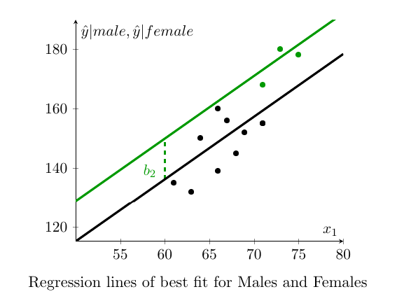

We see that the dummy variable shifts the linear relationship between ${y_i}$ and ${x_{1i}}$ by the value of the coefficient $b_2$. In this way we can represent the effect of shifts in our regression equation. With this knowledge, the interpretation of $b_2=13.7051$ is that male weights are, on average, 13.7051 pounds higher than female weights. When dealing with dummy variables this is the correct way to interpret regression coefficients. 

::: {.callout-note icon=false}

#### Exercise

Your colleague provides you with the following regression output which relates monthly wages (measured in UKPs) of individuals within a company to the employees age, sex and the years they spent in education (e.g. $educ_i = 13$ for someone who spend 13 years in education which is typical for someone whose highest education level is a High School degree). male is a dummy variable which takes the value 1 for male employees.
	
\begin{eqnarray*}
	\widehat{wage}&=&a+b_1~age+b_2~male+b_3~educ\\
	\widehat{wage}&=&505+58~age+312~male + 50~educ
\end{eqnarray*}
	
What is the predicted monthly wage for a female employee of age 27 and with 16 years of education?

$\widehat{wages} =$ `r fitb(2871)`

What is the predicted wage for a male employee with the same age and education?

$\widehat{wages} =$ `r fitb(3138)`


Which of the following are correct interpretations of the estimated regression?

```{r}
#| echo: FALSE

# What is a p-value?
opts <- c(
  paste("On average female employees earn UKP 312 more",
                 "than males, everything else being equal."),
  paste("On average an additional year of education is related",
                 "to an increased average income of UKP 58"),
  answer = paste("On average an additional year of education is related to an increased",
                 "average income of UKP 58, everything else being equal."),
  paste("As employees get older by a year, the expected income ",
                 "increases by UKP 312, c.p."),
   paste("We expect a 58 year old employee to earn UKP 1000 ",
                 "more per month than a 18 year old, c.p.")
)
```

`r longmcq(opts)`
	

`r hide("Feedback")`

Predicted monthly wage for a female employee of age 27 and with 16 years of education?

	\begin{eqnarray*}
		\widehat{wages}=505+58 \cdot 27+312 \cdot 0 + 50 \cdot 16 = 2871
	\end{eqnarray*}

Predicted wage for a male employee with the same age and education?
	
	\begin{eqnarray*}
		\widehat{wages}=505+58 \cdot 27+312 \cdot 1 + 50 \cdot 16 = 3138
	\end{eqnarray*}
	
Whenever we have a multiple regression you need to use the "everything else being equal (ceteris paribus, c.p.)" addition to make your interpretation correct. Having said that, as in this case the other variable is only the sex of a respondent and that would not change. Therefore, on this occasion, you could get away without the c.p. addition.
	
`r unhide()`

:::


	
## Statistical Inference: Hypothesis Tests and Confidence Intervals

We shall demonstrate how to use regression results to perform hypothesis tests and calculate confidence intervals. In the example above we extended the simple regression model to a model with two explanatory variables. Using generic variable names we could have represented this model as

\begin{equation*}
	y_i=\alpha + \beta_1 x_{1i} + \beta_2 x_{2i} + \epsilon_i
\end{equation*} 

However, everything discussed in this section generalises to regression models that contain $Q$ explanatory variables (as long as $Q<n$). A more generic representation of a multiple regression model is

\begin{equation*}
	y_i=\alpha + \beta_1 x_{1i} + \beta_2 x_{2i} + ... + \beta_Q x_{Qi} + \epsilon_i
\end{equation*} 

If you were to estimate such a model with sample data you would obtain the sample regression model: 

\begin{equation*}
	\hat{y}_i=a + b_1 x_{1i} + b_2 x_{2i} + ... + b_Q x_{Qi}
\end{equation*} 

where $a$ and $b_j$ for $j=1,...,Q$ are sample coefficient estimates.


### Hypothesis Tests

Once you estimated a multiple regression model and obtained its regression output, performing inference on regression coefficients is really not much different to performing inference on regression coefficients in a simple regression. Let's start by re-stating the population regression model for two explanatory variables

\begin{equation*}
	y_i = \alpha + \beta_1 x_{1i} + \beta_2 x_{2i}+ \epsilon_i
\end{equation*}

We obtain sample estimates for the unknown population parameters $\alpha$, $\beta_1$ and $\beta_2$. The sample estimates are $a$, $b_1$ and $b_2$ which then define the sample regression line (actually a 2D plane in a 3D space)

\begin{equation*}
	\hat{y}_i = a + b_1 x_{1i} + b_2 x_{2i} 
\end{equation*}

As usual we recognise that a different sample would have given us different sample estimates. This is why we need to use statistical inference techniques.

Let's say we wish to test whether the respondent's sex matters for explaining their weight. We would then want to test the hypothesis

\begin{equation*}
	H_{0}:\beta_2 = 0
\end{equation*}

versus

\begin{equation*}
	H_{0}:\beta_2 \neq 0
\end{equation*}

It turns out that inference on regression coefficients works very much like inference on a population mean with unknown population variance. We use a $T$ test

\begin{equation*}
	t= \dfrac{b_2-\beta_{20}}{SE\left(b_2\right)}\sim t_{n-3}
\end{equation*}

where $\beta_{20}$ is the hypothesised value for $\beta_{2}$ in the null hypothesis and the test statistic is distributed according to a Student’s t distribution with $(n-3)$ degrees of freedom. The degree of freedom parameter is $(n-3)$ as our regression model uses three estimated parameters, $a$, $b_1$ and $b_2$. $SE\left(b_2\right)$ represents the standard error of slope coefficient $b_2$. In general the degrees of freedom are calculated from $n-k$, where $k$ is the number of estimated coefficients. Recall that in this unit we do not cover how to calculate that standard error, we shall rely on EXCEL doing that work. Here we show again the EXCEL regression output.


::: {.callout-note}

#### Example


Let us test the hypothesis that sex does not matter when explaining weight. Use $\alpha = 0.1$.
	
\begin{eqnarray*}
	H_0&:& \beta_2 = 0\\
	H_A&:& \beta_2 \neq 0\\
\end{eqnarray*}
	
The test statistic is $T=\frac{b_2 - \beta_{20}}{SE{b_2}} \sim t_{n-3}$, where $\beta_{20}$ is the hypothesised value for $\beta_{2}$ in the null hypothesis. The decision rule is to reject $H_0$ if the absolute value of the sample test statistic is greater than 1.833 (from the t-table with 9 degrees of freedom, two tailed test!).
	
\begin{equation*}
	t = \frac{13.7051-0}{7.3959}= 1.8531
\end{equation*}
	
You can also find that test statistic from the regression output as EXCEL (t Stat column), by default does test exactly the hypothesis we are testing here). As the absolute value of the test statistic is larger than the critical value the null hypothesis is rejected at $\alpha = 0.1$. 
	
Let's also calculate the p-value by referring to the t-distribution Table:

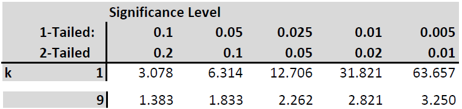
	
Our test statistic is between the values of 1.833 and 2.262 which relate to the (two tailed) p-values of 0.1 and 0.05. Therefore we conclude that the p-value is between 0.05 and 0.1. If you were to use EXCEL to calculate this p-value you would use the following formula "=2*(1-T.DIST(1.8531,9,TRUE))" which delivers a precise p-value of 0.0969.
	
At an $\alpha=0.1$ we conclude that the sample delivers evidence to reject the null hypothesis. Sex matters for explaining variation in weight.
	
:::

When comparing this procedure to the hypothesis test we performed for a simple regression you will realise that the only difference in procedure was the degrees of freedom for the t-distribution. Otherwise everything was identical. Also, to conclude this section recall that, as this example used a small sample, we have to assume that the error terms are normally distributed in order to be able to use the t-distribution. When you use large sample sizes (justifying the application of a CLT) then we do not require this assumption. 

Finally, in the discussion above, we discussed testing hypothesis on the coefficient $\beta_2$. The exactly same process applies to testing any of the coefficients in a multiple regression model.

\begin{equation*}
	y_i=\alpha + \beta_1 x_{1i} + \beta_2 x_{2i} + ... + \beta_Q x_{Qi} + \epsilon_i
\end{equation*} 

If you wanted to test a hypothesis on any of the $\beta_j$ coefficients (or indeed on $\alpha$) you would use the following test statistic

\begin{equation*}
	t = \frac{b_j-\beta_{j0}}{SE(b_j)} \sim t_{n-Q-1}
\end{equation*}

where $\beta_{j0}$ is the value being hypothesised. The degrees of freedom are $n-Q-1$ or $n-k$ where $k=Q+1$ is the number of estimated coefficients.


::: {.callout-note icon=false}

#### Exercise

Let us test the hypothesis that an additional inch of height, on average, adds two pounds of weight against the alternative that it adds more than two pounds. Use $\alpha = 0.01$.

\begin{eqnarray*}
	H_0&:& \beta_1 \leq 2\\
	H_A&:& \beta_1 > 2\\
\end{eqnarray*}

The test statistic is $T=\frac{b_1 - \beta_{10}}{SE{b_1}} \sim t_{n-3}$, where $\beta_{10}$ is the hypothesised value for $\beta_{1}$ in the null hypothesis. The decision rule is to reject $H_0$ if the value of the sample test statistic is greater than 2.821 (from the t-table with 9 degrees of freedom, one tailed test!).

\begin{equation*}
	t = \frac{2.1073-2}{0.8013}= 0.1339
\end{equation*}

The test statistic is not larger than the critical value of 2.821 and therefore we cannot reject the null hypothesis. Let us also calculate the p-value. We require $\Pr(T_9>0.1339)$. From the table all we can tell is that the p-value is larger than 0.1. To get a more precise p-value you will have to use EXCEL: "=1-T.DIST(0.1339,9,TRUE)" and as a result you get 0.4482.

:::


### Confidence Interval

If we want to present uncertainty about estimated coefficients we turn to confidence intervals. When we revisited hypothesis testing we realised that the only difference to hypothesis testing from a simple regression was the degrees of freedom. In fact the simple regression was just a special case of the multiple regression case. If you calculate  the degrees of freedom as $n$ minus the number of estimated coefficients you will get it right in any case.

The same applies to the calculation of confidence intervals. As long as you remember how to get the degrees of freedom this works exactly as in the case of simple regression. Let us calculate a 99% confidence interval for $\beta_2$ the coefficient for the male variable.

\begin{equation*}
	\left[ c_{L},c_{U}\right] =b_2\pm t_{n-3,\alpha /2}SE\left[b_2\right] 
\end{equation*}

Substituting what we get from the regression output we obtain 

\begin{equation*}
	13.7051\pm 3.250 \cdot 7.3959 = 13.7051\pm 24.0366 \Rightarrow \left[ -10.3315,37.7416\right] 
\end{equation*}

::: {.callout-note icon=false}

#### Exercise

Calculate a 95\% confidence interval for $\beta_1$ the coefficient for the height variable.

$[$ `r fitb(0.2947,tol = 0.001)`, `r fitb(3.9199,tol = 0.001)` $]$

`r hide("Feedback")`

\begin{equation*}
	\left[ c_{L},c_{U}\right] =b_1\pm t_{n-3,\alpha /2}SE\left[b_1\right] 
\end{equation*}
	
Substituting what we get from the regression output we obtain:	
	
\begin{equation*}
	2.1073\pm 2.262 \cdot 0.8013 = 2.1073\pm 1.8126 \Rightarrow \left[ 0.2947,3.9199\right] 
\end{equation*}

`r unhide()`

:::

## Worked Example and outlook

Regression analysis is the workhorse technique of empirical economics. It is the swiss-army knife of statistical techniques. While regression analysis, as it is presented here, is fairly straightforward, many more complicated statistical techniques are either variations on linear regression models or use linear regression as an ingredient. So knowing regression analysis will carry you far.

We conclude this with a worked example of multiple regression analysis. This video (YouTube,19min) provides a work-through a multiple regression analysis. It uses the "[CountryIndicators_2019.csv](https://github.com/datasquad/StatisticsNotesBook/raw/refs/heads/master/data/CountryIndicators_2019.csv)" dataset.




