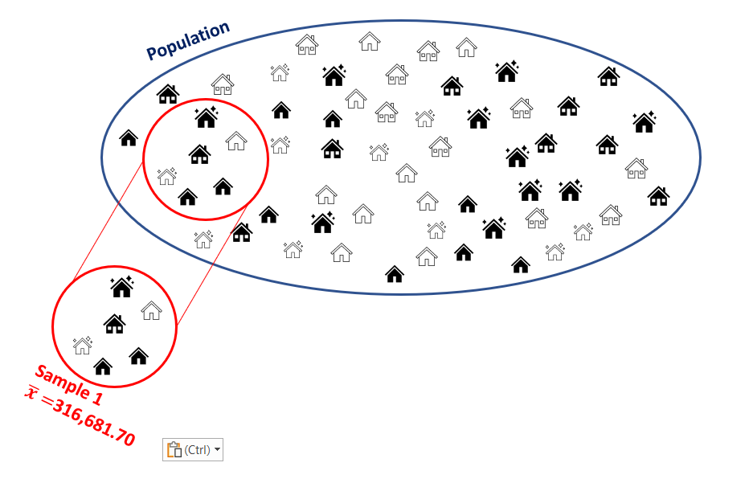
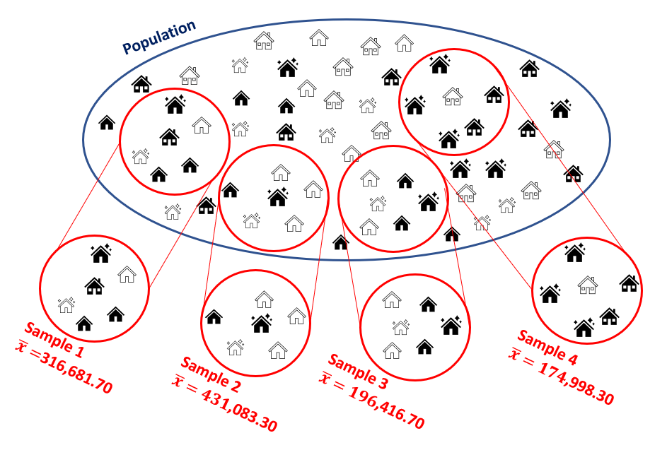
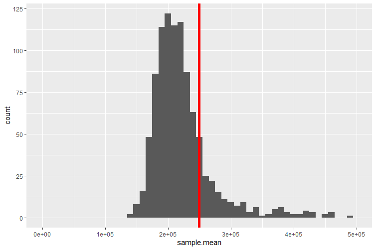
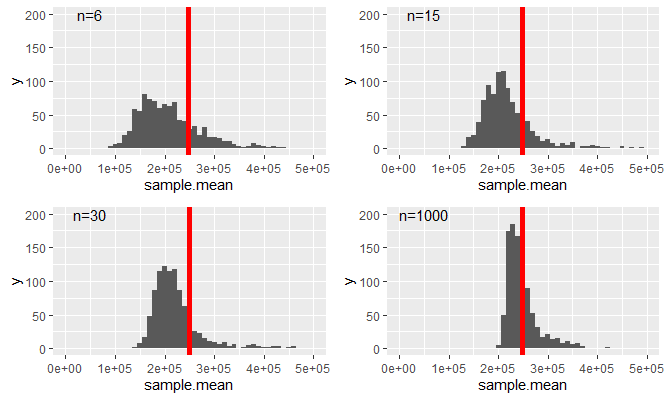
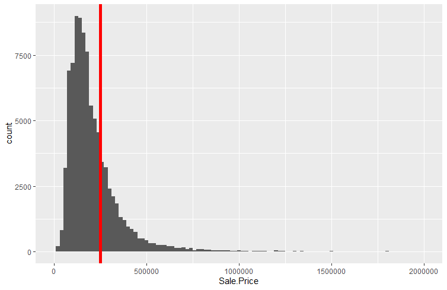
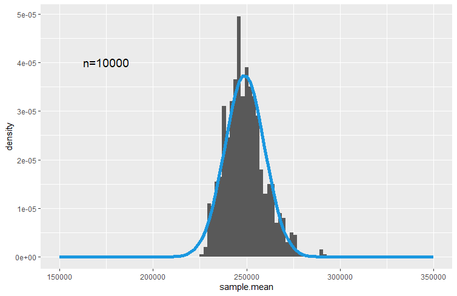

# Sampling Distributions

```{r setup, include = FALSE}
knitr::opts_chunk$set(echo = FALSE)

library(webexercises)
```


## Introduction

So far we learned about descriptive statistics, where we described samples or populations of data, either through statistics (like the sample or population mean, sample or population variance/standard deviation, etc.) or through graphical representations. We also learned what random variables were and that we characterise them using distributions.

A short introduction to sampling (YouTube, 2min).



The reality of life for an applied researcher is that you will rarely have access to population data. If you have, then you know everything there is to know about this data. More often you would have access to only a sample. 

::: {.callout-tip}

#### Commercial Data

As commercial operations are often continuously recorded it is actually increasingly plausible that you do have population data. For instance all transactions on Amazon will leave a digital record. However, even if you had access to all the data generated by a company (see for example an [overview of the data generated by Amazon](https://www.invisibly.com/learn-blog/how-amazon-uses-big-data/#:~:text=Loads%20of%20Data&text=All%20in%20all%2C%20Amazon%20collects,1.1%20million%20requests%20a%20second)) you would likely have to use a sample of these data for analysis as very few computers would have the storage and processing power to use all the data.

:::

So, let us assume that you are using a sample of data to analyse a question, yet you are actually interested in the characteristics of the population. To make this concrete. Let's consider the data we have on house price sales in Greater Manchester. We may be interested in the average price of a sold house in Manchester. Let's call that unknown population parameter, $\mu$. In the [Manchester House Price file](data/Manchester_House_Prices.csv) we have all 91,907 registered house sales in Greater Manchester in 2018 and 2021 (There is no substantial reason to not look at 2019 and 2020. These years were left out to reduce the size of the data file). This is the population of data we are interested in.

While this is a big dataset it is not that big that standard computers couldn't deal with this, but for arguments sake let's consider taking a sample from this population. For now we shall draw a sample with $n=6$ observations.



The sample contains house sales which occurred at the following prices: UKP140,140, UKP125,000, UKP99,950, UKP125,000, UKP160,000 and UKP1,250,000. The average in that sample is $\bar{x}=UKP316,681.70$.

What can we learn from this particular sample about the population mean, $\mu$? Is $\mu$ equal to $\bar{x}$? This answer is obviously "no". Yet, we can learn something from that sample. In order to understand how we can learn anything from such a sample about the population, such as the population mean $\mu$, we need to learn some statistical theory. In fact, in this section we will learn about one of the most important statistical results, the central limit theory (CLT).

The process of using sample information to learn something about the population is called statistical inference. In this process we will use and combine what we have learned about descriptive statistics and probability theory. When these techniques are combined with the insight of the CLT, we will be able to see how we can use sample information to learn something about a population.


## Repeated Sampling

In order to understand the insight of the central limit theorem we shall conduct an experiment. We will draw repeated samples from the population of house prices. This is best illustrated in the following image where we added three more samples of $n=6$ to the earlier sample. 



::: {.callout-tip}

#### Sampling

When we repeatedly sample, in this case, it is possible that we re-sample one of the observations which was drawn for the first sample. We call this sampling with re-placement. It is easiest to think about this case. You could think about sampling without re-placement. In that case all transactions that were chosen for Sample 1 would be "taken out" of the pot.

In essence, whenever we think about sampling we are thinking about the probability for each particular transaction to be drawn as being identical, here $1/91907$. Think about a huge pot with all of these transactions. You draw the first and write down the price. Then you return this transaction into the pot, give it a good mix and then draw the second observation. You repeat this prices six times to get a sample of size $n=6$. For obvious reasons we would also call this process random sampling.

You will realise that it is actually possible, under such a scheme, that the same transaction appears more than once in a particular sample. Given the size of the population, it is not very likely, but even if it happens it not an issue.

:::


In the image you can see that all these samples return different sample averages. This confirms our earlier conclusion that we cannot just assume that the population mean is the same as any particular sample mean. If we draw another sample the sample mean changes but the population mean remains unchanged. So by drawing repeated samples, all we have done so far is illustrated the size of our challenge.

It turns out that we can learn a little more if we repeat the above sampling process many more times, say 1,000 times, and we shall also increase the sample size to $n=30$ (we will later learn why we did that). This means that we end up with 1,000 sample means. We can now display these in a histogram/frequency plot.

This short video demonstrates how you could draw samples from a population using Excel (YouTube, 6 min).





The red line indicates the average value of the 1,000 sample means, which for this particular set of samples is equal to UKP249,705.73. This distribution is called a sampling distribution for the sample mean. We shall talk more about this below.

Some of the 1,000 samples of size $n=30$ actually have sample means which fall outside the range of the above figure (which displays only a range from UKP0 to UKP500,000 to better display the distributions properties). The reason for that is that some of the property sales recorded in our dataset have very high sale prices, some exceeding UKP100m. These are most likely commercial property sales. If any such sale is randomly picked to be included into a sample then the resulting sample average is extremely high. It is of course still a perfectly legitimate sample from our population.


::: {.callout-tip}

#### What is the right population?

You have just learned that our spreadsheet with property sales contains some very high sale prices for commercial properties. For instance the ITV Television Studios at Trafford Wharf were sold for UKP50m on 31 December 2018. 

You may question whether it is right to include sales of such property in the same population of data as the sales of standard family homes and flats. There is no one correct answer to this question. The answer depends on what you are investigating. Say you are ultimately interested in all property sales which generate tax revenue for Greater Manchester. Then you should indeed include all such sales. If, however, you are interested in investigating the average price of a family home in Greater Manchester (or any other feature of the distribution of family homes) then you should really exclude commercial property transactions.

In practical work you will have to put significant thinking into such questions. And if you decided that you wanted to exclude commercial property deals you would have to find a way of identifying which of the more than 91 thousand transactions were commercial. The spreadsheet you have been given does not contain a clear identifier of such transactions. 

:::

::: {.callout-note}

#### Example

Consider taking a sample of property transactions and calculate the sample mean of the sampled transaction prices. This is the definition of a 

`r mcq(c(answer="random variable","probability distribution","random outcome","sample variance"))`

`r hide("Hint")`
	
Recall the definition of a random variable: A random variable	assigns a number to the outcome of an experiment. 

`r unhide()`

Taking different samples will result in `r mcq(c("identical",answer ="different"))` sample means.

The above sampling distribution for the sample mean is the distribution of a `r mcq(c("Discrete random variable", answer = "Continuous random variable"))`.


`r hide("Hint")`
	
The sample mean could take any value on the real line (or positive real line given there are unlikely to be negative property prices).

`r unhide()`

The above sampling distribution for the sample mean is best approximated by which of the following distributions?


```{r}
#| echo: false

opts_p <- c(
   "Binomial distribution",
   "Uniform distribution",
   "Exponential distribution",
   answer = "Normal distribution",
   "Bernoulli distribution",
   "Geometric distribution")
```


`r longmcq(opts_p)`

`r hide("Hint")`
We need a continuous distribution and amongst those (Uniform, Normal and Exponential) the normal is the only one which has approximately these properties - high mass around the centre decreasing mass in the tails. Although it is not perfect as the sampling distribution shows some distinct skewness.
`r unhide()`

:::


The sample mean is a sample statistics (as are the sample variance or other sample statistics). After thinking about the above questions you should understand the following. This sample statistic (as a concept, rather than a mean in a particular sample) is indeed a random variable. When we introduced random variables we said that we would usually label these with capital letters. So let's label this $\bar{X}$, the sample mean. When we have a random variable then we know that we can get different outcomes when drawing from that random variable. We shall call these outcomes $\bar{x}$ (note the lower case). In the above example we calculated 1,000 such outcomes.

Eventually we will want to know how this random variable is distributed. In particular we will want to know what distribution this random variable will follow and what parameters describe that distribution. The Central Limit Theorem will give us exactly that knowledge.  But perhaps, after answering the above questions, you should not be surprised to hear that $\bar{X}$, under certain circumstances, is best approximated by a normal distribution. More details to follow later!

In the experiment above we drew 1,000 samples of size $n=30$. Remember that this is really a rather artificial experiment. In practice you will have one sample only from which you wish to make inference on the population. As it turns out, the number of samples we took (here 1,000) is not a critical number for what we want to find out. However, as we will see now, the size of a particular sample does matter. This will be illustrated in the following figure in which we replicate the above sampling distribution ($n=30$) but also similar ones for different sample sizes, $n=6,15,1000$.



As we increase the sample size two things happen

1. The variance of the resulting distribution decreases.
2. The distribution becomes less skewed. You can see that as the mean of the distribution indicated by the red vertical line moves more into the area of the distribution with the highest probability mass.

One thing that does not change is that the average of the respective samples (as indicated by the red vertical line) does not change. It does actually change slightly but stays (for the given samples) between UKP233,000 and UKP250,000.

Recall how we started this section. We wanted to understand how we can use the information from a random sample to learn something about the population. For instance, can we learn from the sample mean of property transactions anything about the population mean of property transactions. You would be forgiven to say, at this point, that you don't feel that much closer to that aim. And indeed we are not quite there yet, but we collected a number of nuggets of insight which we will need. 

* Sample means are approximately normally distributed 
* The mean of a sampling distribution appears to be roughly constant

Importantly, we established the above without ever looking at the distribution of property transactions itself, i.e. the distribution of the more than 90K transactions. You can imagine that this is a highly skewed distributions with many property sales below, say UKP500,000 and very few very high sale prices.
 
In what follows we shall learn the following things

* We will derive the sampling distribution of the sample mean for two special cases, when the original distribution from which we draw samples is a binomial distribution and where it is a normal distribution.
* We will introduce the Central Limit Theorem which will formalise the statistical theory required to link information from the sample to that from the population.  In particular it will establish the form of the sampling distribution of a sample mean **irrespective** of the distribution from which we are drawing samples.
* We will use a small number of examples to demonstrate this statistical underpinnings of the CLT.
* In future lessons we will apply the CLT to demonstrate how we link sample data to population information (confidence intervals and hypothesis tests).


## Sampling Distributions

In this section we will formally think about the sampling distribution for the sample mean statistic. You can also think about sampling distributions for other sample statistics, such as the sample variance, or the sample maximum, but we will only look at the most important one, the sample mean. 

We discussed previously that the sample mean is a random variable. Here we are after three things: how is that random variable distributed, what is its expected value and what is its variance?

Suppose that a random sample of size $n$ is drawn from a population with mean $\mu$ and variance $\sigma^{2}$, or equivalently, from the probability distribution of a random variable $X$ with $E\left[ X\right]=\mu$, $var\left[X\right] =\sigma^{2}$. 

Since

\begin{eqnarray*}
	\bar{X}&=&\dfrac{1}{n}\sum_{i=1}^{n}X_{i}\\
	&=&\sum_{i=1}^{n}\frac{1}{n}X_{i}
\end{eqnarray*}

$\bar{X}$ is a linear combination of the sample random variables $X_{1},...,X_{n}$, so that the results on the linear combination of random variables apply here and we can find $E\left[ \bar{X}\right]$ and $var\left[\bar{X}\right]$. 

As we draw random samples from $X$, we know that

\begin{eqnarray*}
	E\left[ X_{i}\right] &=&E\left[ X\right] =\mu , \\
	var\left[ X_{i}\right] &=&var\left[ X\right] =\sigma^{2}.
\end{eqnarray*}

We now have all the information to derive the expected value of $\bar{X}$, the expected value or expectation of the sampling distribution of the sample mean.

\begin{eqnarray*}
	E\left[ \bar{X}\right] &=&E\left[ \dfrac{1}{n}\sum_{i=1}^{n}X_{i}\right] \\
	&=&\dfrac{1}{n}\sum_{i=1}^{n}E\left[ X_{i}\right] \\
	&=&\dfrac{1}{n}\sum_{i=1}^{n}\mu = \dfrac{1}{n}(n\mu)\\
	&=&\mu .
\end{eqnarray*}

We have only re-applied what we learned in the section on linear combinations of random variables.

Turning our attention to the calculation of the variance of the sample mean random variable we should notice that random sampling makes the sample random variables $X_{1},...,X_{n}$ independent and therefore uncorrelated. This is nice as it simplifies the job of obtaining the variance of $\bar{X}$. In the case of independence the variance of a weighted sum is a weighted sum of variances (this is as discussed in the lesson on linear combinations of random variables). 

\begin{eqnarray*}
	var\left[ \bar{X}\right] &=&var\left[ \dfrac{1}{n}\sum_{i=1}^{n}X_{i}\right] \\
	&=&\sum_{i=1}^{n}var\left[ \dfrac{1}{n}X_{i}\right] \\
	&=&\sum_{i=1}^{n}\left( \dfrac{1}{n}\right) ^{2}var\left[ X_{i}\right] \\
	&=&\sum_{i=1}^{n}\left( \dfrac{1}{n}\right) ^{2}\sigma ^{2} \\
	&=&\dfrac{n\sigma ^{2}}{n^{2}} \\
	&=&\dfrac{\sigma ^{2}}{n}.
\end{eqnarray*}

The square root of $var\left[ \bar{X}\right]$ is the **standard deviation** of $\bar{X}$, and this is usually given the specific name of **standard error**. So far, we have identified population parameters with the parameters of the distribution of the corresponding random variable $X$. We can extend this to cover characteristics or parameters of the probability distributions of sample statistics like $\bar{X}$. So, $var\left[ \bar{X}\right]$ is a **parameter** of the probability distribution of $\bar{X}$, and so is the standard error,

\begin{equation*}
	SE\left[ \bar{X}\right] =\dfrac{\sigma }{\sqrt{n}} = \sigma_{\bar{X}}.
\end{equation*}

So far none of the results dependent on us making any assumption about the distribution of $X$. We only assumed that the expected value and variance were $\mu$ and $\sigma^2$ respectively. Also the rules for linear combinations of random variables we used so far were not reliant on any distributional assumption for $X$. Hence, even without that knowledge we could establish two of the three things we wanted, the expected value and the variance of the sample mean. What we do not know yet is the type of distribution of $\bar{X}$.

This video walks you through the above arguments (YouTube, 12min)



::: {.callout-note}

#### Example

You have a random variable $Z$ with $E[Z] = 1.3$ and $Var[Z] = 0.61$. You draw a sample of size $n=5$. What are the expected value, variance and standard error for the sample mean $\bar{Z}$?

$E[\bar{Z}] =$ `r fitb(1.3)`

$Var[\bar{Z}]  =$ `r fitb(0.3483)` (to 4 dp)

`r hide("Solution")`
	
\begin{eqnarray*}
	E[\bar{Z}] &=& 1.3\\
	Var[\bar{Z}] &=& \frac{Var[Z]}{n}= \frac{0.61}{5} = 0.122\\
	\sigma_{\bar{Z}}&=& \sqrt{\frac{Var[Z]}{n}} = \sqrt{0.122} = 0.3483
\end{eqnarray*}

`r unhide()`

What is the smallest sample size, $n^*$, that would deliver a standard error smaller than 0.1?

$n^* =$ `r fitb(62)`

`r hide("Solution")`

Set $\sigma_{\bar{Z}}= \sqrt{\frac{Var[Z]}{n^*}} < 0.1$. You know $Var[Z]$ such that you can solve the resulting inequality for $n^*$: $n^* > 10^2 Var[Z] > 61$ hence $n^*=62$. 

`r unhide()`


:::


### Special Case: Samples from a normal distribution

Even without making a distributional assumption about the random variable $X$ from which we considered drawing a sample of size $n$ we were able to derive the expected value and variance of the sample mean random variable, $\bar{X}$. What would happen if we knew that $X$ is actually normally distributed, $X \sim N(\mu,\sigma^2)$.
 
As we are drawing random samples we know that $X_i \sim N(\mu,\sigma^2)$ and the sample mean is still calculated according to:

\begin{eqnarray*}
	\bar{X}&=&\dfrac{1}{n}\sum_{i=1}^{n}X_{i}\\
	&=&\sum_{i=1}^{n}\frac{1}{n}X_{i}
\end{eqnarray*}

This is a linear combination of $n$ normally distributed random variables. The earlier results still apply as they were universally valid, $E[\bar{X}]=\mu$ and $Var[\bar{X}]= \frac{\sigma^2}{n}$. But in the section on the combinations of random variables we also learned that a linear combination of normally distributed random variables is also normally distributed. The result that

\begin{equation*}
	\bar{X} \sim N(\mu, \frac{\sigma^2}{n})
\end{equation*}

follows directly. This is a very important result. The sample mean is a random variable which is normally distributed if the random variable we draw from is normally distributed itself.

### The General Case: The Central Limit Theorem

Let us now consider the case where the distribution of $X$ is not normal. We are now back in the case of the data on property transactions in Manchester in 2018 and 2021. We did note that this is an extremely skewed distribution and therefore a non-normal distribution (as normal distributions are symmetric distributions).

In fact, let us now look at the actual distribution of prices for property transactions.



The mean and the population standard deviations for the entire dataset are $\mu = UKP248,934.33$ and $\sigma=1,068,362$ respectively. The distribution is highly skewed to the right, meaning that there are sales which attract prices which are much much higher than the mean of prices. This is illustrated by the right tail of the distribution which stretches much further to the right than the left hand tail stretches to the left.

Although we have now recognised that this distribution is highly non-normal we can recognise some of the same patterns as those in the previous chapter. The sampling distributions we created by sampling from these property prices looked fairly close to normally distributed. The average of the sample means was also fairly close to the average house price. However, even then, all four sampling distributions still showed a noticeable skew to the right.

However, if we imagine that the sample size $n$ is allowed to increase without bound, so that $n\rightarrow \infty$, we can appeal to a famous theorem (more accurately, a collection of theorems) in probability theory called the **Central Limit Theorem**, often abbreviated as **CLT**. This states that

::: {.callout-tip}

## The Central Limit Theorem (CLT)

If $\bar{X}$ is obtained from a random sample of size $n$ from a population with mean $\mu$ and variance $\sigma ^{2}$, then, irrespective of the distribution sampled,
	
\begin{equation*}
	\bar{X}\rightarrow N\left( \mu,SE\left[ \bar{X}\right]^2\right) \;\;\;\text{as }n\rightarrow \infty .
\end{equation*}	
	
or, applying rules for transformations of random variables
	
\begin{equation*}
		\dfrac{\bar{X}-\mu }{SE\left[ \bar{X}\right] }=\dfrac{\bar{X}-\mu}{ \sigma /\sqrt{n} }=\dfrac{\bar{X}-\mu}{\sigma_{\bar{X} }}\rightarrow N\left( 0,1\right) \;\;\;\text{as }n\rightarrow \infty .
\end{equation*}
	
That is, the probability distribution of $\dfrac{\bar{X}-\mu }{SE\left[ \bar{X}\right] }$ approaches the standard normal distribution as $n\rightarrow \infty $.


:::


This is an incredibly strong result! Whatever the distribution of the random variable $X$ from which you randomly sample, the sampling distribution of the sample mean is a normal distribution if we just use the sample size $n$ big enough.

We **interpret** this as saying that

\begin{equation*}
	\dfrac{\bar{X}-\mu }{SE\left[ \bar{X}\right] }=\dfrac{\bar{X}-\mu}{\left( \sigma /\sqrt{n}\right) }\sim N\left( 0,1\right) ,\;\;\;approximately
\end{equation*}

for finite $n$. Or alternatively is to say that
	
\begin{equation*}
		\bar{X}\sim N\left( \mu ,\dfrac{\sigma ^{2}}{n}\right) \;\;\;approximately
\end{equation*}
	
for finite $n$.

A brief discussion of this result (YouTube, 5 min).



In our example above we could see that even for a large sample size of $n=1000$ the distribution had distinct non-normal features, in particular the skew to the right. You may then wonder how large a sample size one would have to use in the property transaction example to find the sampling distribution to be well approximated by a normal distribution. 

It turns out that in this case you need a really large sample. When producing 1,000 samples each of sample size $n=10,000$ you get the following sampling distribution



In this picture we overlayed the sampling distribution which is implied by the CLT, namely

\begin{equation*}
	\bar{X}\sim N\left( \mu ,\dfrac{\sigma ^{2}}{n}\right)
\end{equation*}

or using $\mu = UKP248,934.33$ and $\sigma=1,068,362$

\begin{equation*}
	\bar{X}\sim N\left( 248,934.33 ,10,683^2\right).
\end{equation*}

You may quibble about whether there aren't still systematic deviations from a normal distribution, but the point to take away here is that the sampling distribution of $\bar{X}$ is approximated by the normal distribution and increasing the sample size improves this approximation.

Textbooks often claim that the approximation is good enough if $n \geq 20 $ or $30$. As you have seen above this can be over-optimistic if the original distribution is extremely skewed as is the distribution of prices for properties we used here. However, for many practical examples the above advice is not far off the mark.
 
::: {.callout-note}

#### Example

Consider a random variable $M$ which is known to be normally distributed $M \sim N(3,25)$. 

What is the probability that an individual draw of $M$ delivers a value which is smaller than 0?

$Pr(M<0) = Pr\left(Z<\frac{0-3}{5}\right) = Pr\left(Z<-0.6\right)=0.2743$

What is the distribution of $\bar{M}$ if $\bar{M}$ is the sample average calculated for a sample of size $n=16$?

$\bar{M} \sim N\left(3,\frac{25}{16}\right)$

Calculate the probability that a particular sample mean (of a sample of size $n=16$) is smaller than 0.

$Pr(\bar{M}<0) = Pr\left(Z<\frac{0-3}{\sqrt{25/16}}\right) = Pr\left(Z<-2.4\right)=0.0082$

Note the difference in the two probabilities.

:::

::: {.callout-note icon=false}

#### Exercise

Consider a random variable $Q$ which is known to have expected value of $E[Q]=1$ and variance of $Var[Q]=16$. You do not know the distribution of $Q$. 
	
What is the probability that an individual draw of $Q$ delivers a value which is smaller than 0?

```{r}
#| echo: false

opts_p <- c(
   "the same as if $Q$ was normally distributed",
   "50%",
   "40.13%",
   answer = "cannot be calculated")
```

`r longmcq(opts_p)`

`r hide("Solution")`

Without knowing the distribution, we cannot calculate this.

`r unhide()`
	
What is the distribution of $\bar{Q}$ if $\bar{Q}$ is the sample average calculated for a sample of size $n=16$ which you know to be big enough for the CLT to apply?

```{r}
#| echo: false

opts_p <- c(
   "N(1,0.25)",
   "N(0,1)",
   "N(1,4)",
   answer = "N(1,1)",
   "N(1,1/16)")
```

`r longmcq(opts_p)`

`r hide("Solution")`

Use the general CLT result that $\bar{Q}\sim N\left( \mu_Q ,\dfrac{\sigma_Q ^{2}}{n}\right)$

$\bar{Q} \sim N\left(1,\frac{16}{16}\right)$

`r unhide()`

Calculate the probability that a particular sample mean (of a sample of size $n=16$) is smaller than 0.

$Pr(\bar{Q}<0) =$ `r fitb(0.1587)`

`r hide("Solution")`
	
$Pr(\bar{Q}<0) = Pr\left(Z<\frac{0-1}{\sqrt{1}}\right) = Pr\left(Z<-1\right)=0.1587$
	
`r unhide()`

:::


## Visualisation of Sampling Distributions

There are some excellent websites that visualise sampling distributions and how they arise from sampling from a population distribution. Here is a selection. It will certainly help your understanding if you go to one of these and experiment

* [Onlinestatbook.com](https://onlinestatbook.com/stat_sim/sampling_dist/index.html)
* [Statcrunch.com](https://www.statcrunch.com/applets/type3&samplingdist)
* [University of Albany](https://shiny.rit.albany.edu/stat/sampdist/)


## Summary and Outlook

In this section we engaged in a thought experiment, an experiment that does not reflect the realities of an applied researcher. We thought about the situation in which we can draw repeated samples from a known population. We then used that thought experiment to understand that sample statistics are random variables and to derive how these sample statistics are distributed.

The reality of an applied researcher is that she will not know the properties of the population and she has one (not repeated!) samples available for analysis. The task is then to show how the information from that one sample can be used to learn anything about the population as that is usually what the researcher is interested in.

The next sections on confidence intervals and hypothesis testing will help you learn what and how we can draw inference from a sample on the population. But you should note that this section has prepared the ground for that. The Central Limit Theorem shows how sample statistics, like $\bar{X}$ are linked to population parameters ($\mu$ and $\sigma$). It is that link, which will allow us to draw inference on population parameters.

